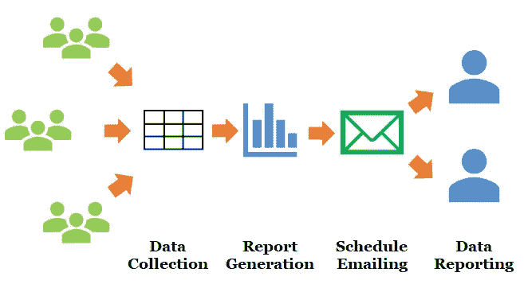
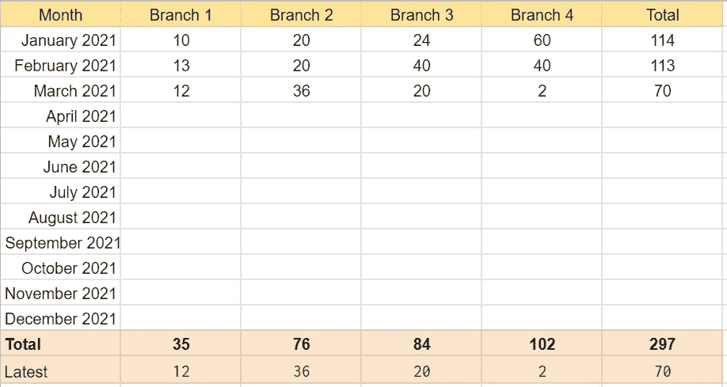
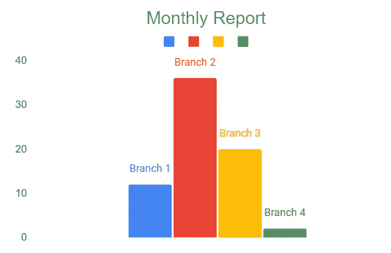
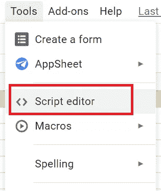
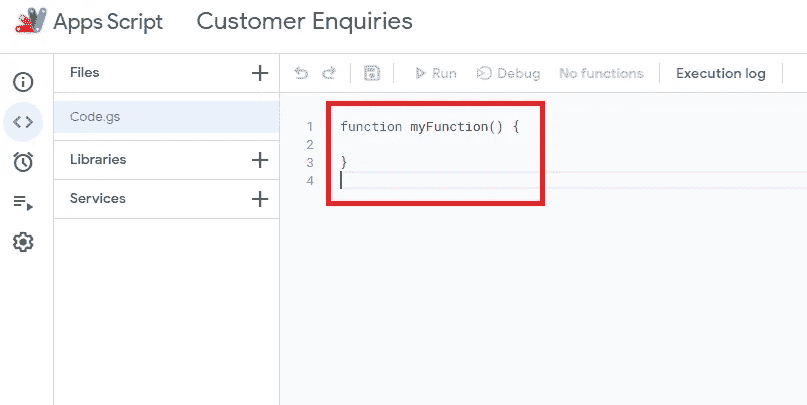
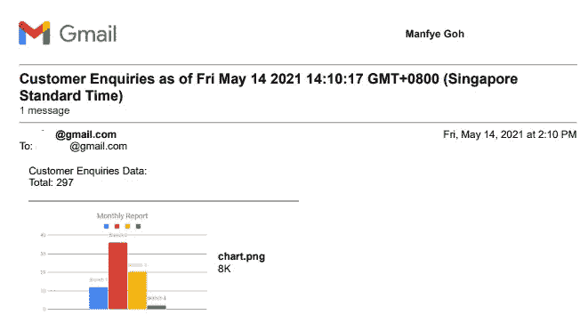
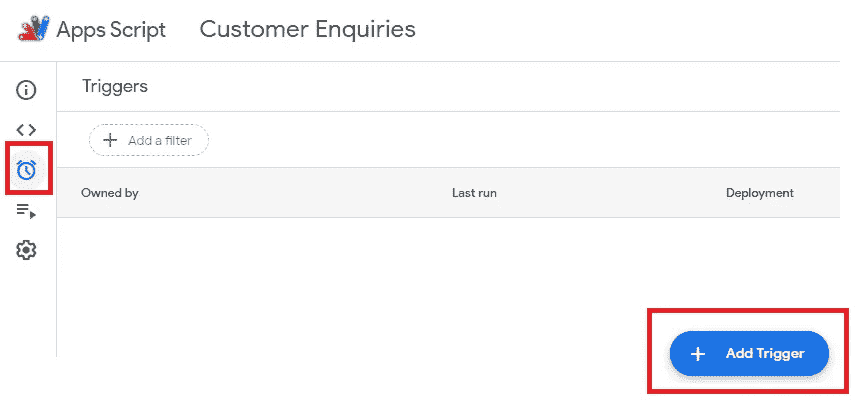
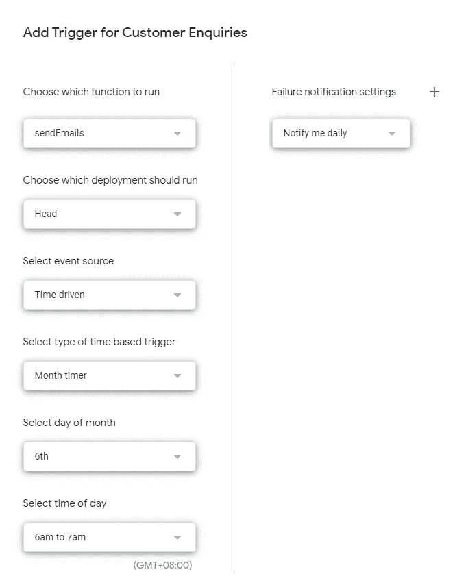

# 5 分钟内自动完成谷歌表单报告

> 原文：<https://towardsdatascience.com/automate-google-sheet-reporting-in-5-minutes-8bbdc1f8e293?source=collection_archive---------6----------------------->

## 每月自动将报告发送给你的老板，无需担心


照片由来自[佩克斯](https://www.pexels.com/photo/macbook-pro-beside-wine-glass-on-brown-wooden-table-4099298/?utm_content=attributionCopyText&utm_medium=referral&utm_source=pexels)的[塔林·埃利奥特](https://www.pexels.com/@taryn-elliott?utm_content=attributionCopyText&utm_medium=referral&utm_source=pexels)拍摄

您是否曾经使用 google sheets 收集数据，与您组织中的每个人共享这些数据，以便输入他们的每周、每月数据，如绩效报告、库存报告或 KPI 数据报告？之后，你将不得不每月提取数据来进行编译。

如果这些重复的行为可以自动化，并且最终报告可以每月通过电子邮件发送给相关人员(比如你的老板)，那该有多好？是的，这篇文章可以帮助你实现这个目标！



自动化流程的图示。作者图片

***场景:贵公司希望每月有一定数量的客户在贵公司的 40 多家零售店中查询特定产品的信息。***

# 1.数据收集和报告生成

根据您的偏好设置您的数据收集表，例如，下图:



数据收集电子表格。作者图片

注意，最后一行是用户输入的最新数据，它是使用 google sheet 公式捕获的，如下所示:

```
=INDEX(B1:B13,Max(MATCH("zzz",B1:B13),Match(143^143,B1:B13)))
```

此公式自动捕获用户在特定区域(在本例中为列)的最新输入，公式中的数据用于绘制下图:



报告中所需的图表。作者图片

在这一步结束时，您已经有了最新的报告和每月报告的图表。

# 2.设置 Google 应用程序脚本



设置 Google 企业应用套件脚本。作者图片

进入*工具* → *脚本编辑器*打开并授权 Google Apps 脚本，你会注意到一个名为 Code.gs 的文件在你屏幕的左侧，代码区在你屏幕的右侧。



Google Apps 脚本的接口。作者图片

将以下代码粘贴到内部:

```
function sendEmails() {// Get the sheet where the data is, in sheet 'system'
var sheet = SpreadsheetApp.getActiveSpreadsheet().getSheetByName("Sheet1")// Get the data of particular cell, in this case, i need only the total cell (F14)
var data = sheet.getRange('F14').getValues();// Get all the chart in the sheets
const chartBlobs = new Array();
const emailImages = {};
const charts = sheet.getCharts();
charts.forEach(function(chart, i){
chartBlobs[i] = chart.getAs("image/png");
emailImages["chart"+i] = chartBlobs[i];
});// Send email
MailApp.sendEmail({
to: "you@gmail.com,"yourboss@gmail.com"",
subject: "Customer Enquiries as of " + new Date(),
htmlBody: "Customer Enquiries Data: <br>" +
"Total: " + data + "<br>",
inlineImages:emailImages
});
}
```

通过保存并单击顶部的 Run 按钮来测试代码。您将收到一封电子邮件，如下所示:



电子邮件报告。作者图片

根据您的偏好定制您的报告，并使其符合您组织的格式。

# 3.安排每月电子邮件

太好了，现在你有一个很好的报告生成功能，可以在你按下时触发。接下来，我们将设置爆破功能的触发器。Google App Script 根据用户需求提供了几种类型的触发器，分别是:

*   事件驱动，如表单被编辑、打开或表单提交
*   时间驱动、每小时、每周或每月
*   按日期排列的日历



功能触发。作者图片

在我的情况下，我希望有一个每月计时器，它将在每月 6 日自动触发该功能(如下图)，因为我已经告诉所有分行经理在每月 4 日前更新信息。



设置我的每月功能触发器。作者图片

最后，保存触发器，你就有了你的自动邮件报告系统，它将在 5 分钟内每月发送给你的老板，而不需要任何额外的步骤！

[https://medium . com/geek culture/never-miss-your-customers-birthday-email-with Google-sheets-d64e 75372341](https://medium.com/geekculture/never-miss-your-customers-birthday-email-with-google-sheets-d64e75372341)

# 最后的话:

我经常发现，由于缺乏知识，在大多数组织中，资源被花费在可以自动化的任务上。因此，我决定在接下来的文章中写更多对组织有益的生产力技巧，这将包括使用多种编码语言，如 pythons 和 Google Apps 脚本。

我的其他生产力文章:

[](https://medium.com/geekculture/never-miss-your-customers-birthday-email-with-google-sheets-d64e75372341) [## 使用 Google Sheets 在 5 分钟内自动向客户发送生日电子邮件

### 一个简单的 5 分钟设置，自动向您的客户发送生日祝福电子邮件，每年都不会错过

medium.com](https://medium.com/geekculture/never-miss-your-customers-birthday-email-with-google-sheets-d64e75372341) 

最后，感谢您花时间阅读我的文章！

# 参考资料:

[](/automate-excel-with-python-7c0e8c7c6256) [## 使用 Python 自动化 Excel

towardsdatascience.com](/automate-excel-with-python-7c0e8c7c6256) [](https://aryanirani123.medium.com/send-charts-in-email-using-google-apps-script-d652dc752468) [## 使用 Google Apps 脚本通过电子邮件发送图表

### 欢迎，在这篇博客中，我将向你展示如何使用谷歌应用程序脚本在电子邮件中发送图表。在…上发送图表

aryanirani123.medium.com](https://aryanirani123.medium.com/send-charts-in-email-using-google-apps-script-d652dc752468) [](https://www.benlcollins.com/apps-script/google-apps-script-beginner-guide/) [## 谷歌应用程序脚本:学习应用程序脚本的初学者指南

### Google Apps Script 是一种基于云的脚本语言，用于扩展 Google Apps 的功能和构建…

www.benlcollins.com](https://www.benlcollins.com/apps-script/google-apps-script-beginner-guide/)