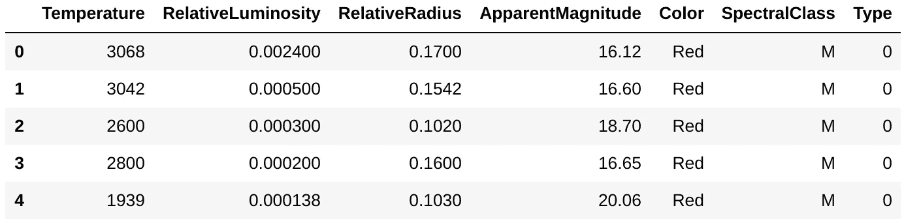

# 针对具有远视的多个模型的自动超参数调整

> 原文：<https://towardsdatascience.com/automate-hyperparameter-tuning-with-hyperopts-for-multiple-models-22b499298a8a?source=collection_archive---------18----------------------->

## 犯错是人之常情，随机犯错在统计学上是神圣的


由 [Unsplash](https://unsplash.com?utm_source=medium&utm_medium=referral) 上的 [Katarzyna Pe](https://unsplash.com/@kasiape?utm_source=medium&utm_medium=referral) 拍摄

在我以前的博客中，我讨论了如何创建一个定制的 sklearn 转换器来自动化数据处理。如果你还没看过那篇文章，你可以在这里看看[。让我们向前行驶吧！](/pipelines-automated-machine-learning-with-hyperparameter-tuning-part-1-b9c06a99d3c3)

本文将创建一个自动化的超参数调优模块，它与 sklearn 的 transformer 管道协同工作。我将在这个过程中使用[远视](https://github.com/hyperopt/hyperopt)。

> Hyperopt 被设计为适应基于高斯过程和回归树的贝叶斯优化算法。

总之是一定要比 Sklearn 的原生版 GridSearchCV 快。

# 资料组

如果我的第一篇文章是 TL；博士，我找到你了！



数据帧头

我实现的转换后的管道会处理丢失的值、异常值整理任务和规范化。简而言之，一旦您 *fit_transform* ，您的数据就为模型训练做好了准备！

# 定义搜索空间

现在，你知道超参数(你当然知道！这就是你在这里的原因！).任何最大似然优化函数将试图最小化在某些模型参数上定义的损失函数。但是，这并没有改变算法本身的框架。我们在超参数的帮助下实现了这一点！简单。

第一步是定义一个 [*搜索空间*](https://machinelearningmastery.com/hyperparameter-optimization-with-random-search-and-grid-search/) 。简单地说，列出你的模型应该迭代的所有可能的超参数范围。例如，我已经为我将要考虑的 6 种不同算法定义了搜索空间。它们是:

*   KNearestNeighbors 基于实例
*   逻辑回归—线性算法
*   SVC —基于内核
*   XGBClassifier —增强集成
*   QDA:基于歧视

同样，你可以插入任何与 sklearn API :p 兼容的型号

搜索空间定义

我选择了这些算法来涵盖主要类型。他们不打算赢得卡格尔比赛！

## 如何选择包含哪个参数？

答案是，这完全取决于您和您的用例。所以，我建议你了解这些算法是如何工作的，以及它们重要的可控参数。

注意:有一个特定的符号来定义搜索空间。它应该解决管道中步骤的顺序问题。例如，我们的模型管道(见下文)被标记为'*模型*，'制作我们的符号'*模型 _ _ 参数名称*。'同样，如果您将管道命名为'*clf*，'它将是'*clf _ _ param _ name*'

# 远视者的骨骼

远视有两个基本组成部分:

1.  我们有一个试图优化的 optimize()函数:P

定义目标函数

2.我们有 *fmin* 函数，它将使用搜索空间中定义的一组超参数迭代调用优化函数。

定义控制器功能

这是仅有的两个基本步骤。如果你想了解更多关于远视，请随时查看他们的网页。(或者，谷歌一下)

# 就差一句台词了！

我们通过这个简单的访问从我们的小实验中获得了最好的模型:

```
best_params['model']SVC(C=0.15499999999999997, degree=2, gamma=391.91004869541047)
```

最后，我们检查我们的分类报告。

模型验证

就是这样！！现在，为您的用例即插即用您的模型。建议广泛研究你的超参数！！

# 结论

本文粗略浏览了使用超点为多个模型创建自动化超参数调优。我们已经使用 Sklearn 的 transformer 管道在一个步骤中预处理数据。由于 hyperopts 是模型不可知的，我们可以通过定义目标函数和控制器 fmin 函数来即插即用任何具有交叉验证和参数装饰的模型。很简单！

点击 可以访问 [*的完整代码。*](https://github.com/harshalsonioo1/EndToEndBlog/blob/main/CompletePipeline.ipynb)


布雷特·乔丹在 [Unsplash](https://unsplash.com?utm_source=medium&utm_medium=referral) 上拍摄的照片

作者不是蝙蝠侠！

感谢您的支持！希望有帮助:)

如果你想得到一些想法，你可以通过 [*Linkedin*](https://www.linkedin.com/in/soni0909/) 联系我！