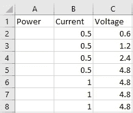
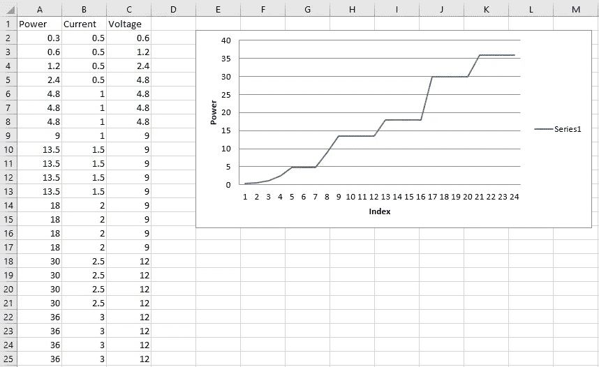
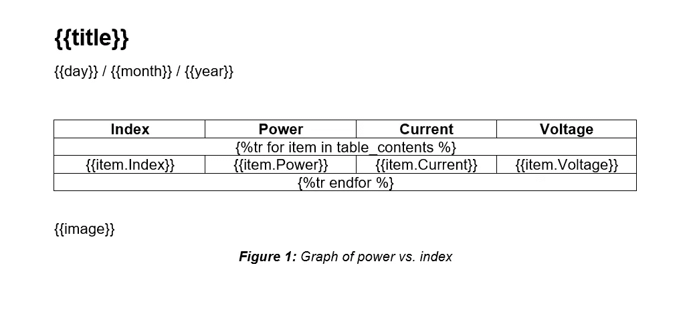
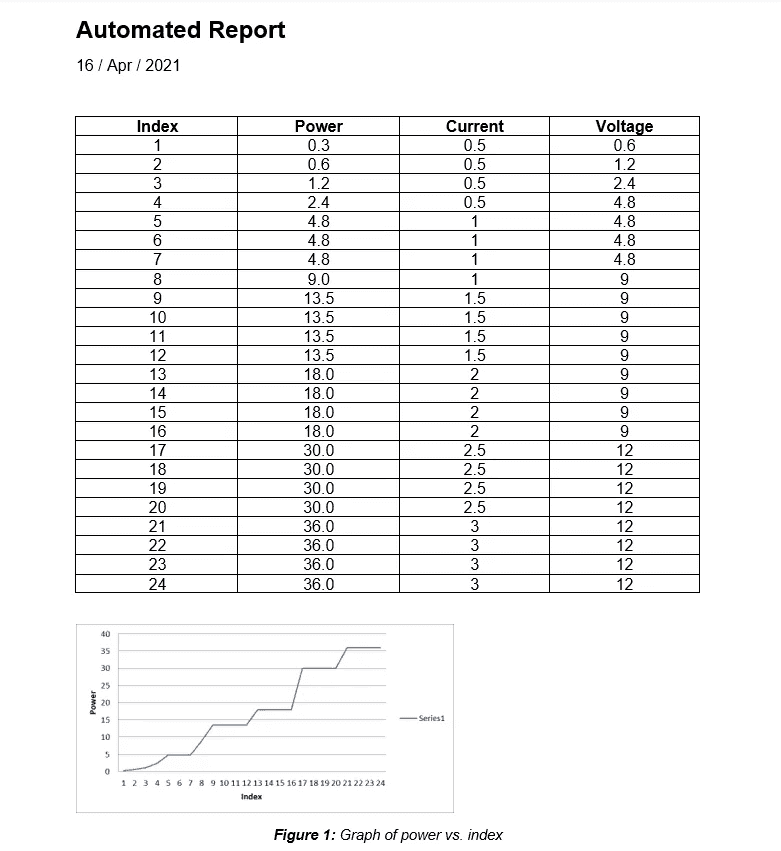

# 使用 Python 自动化 Microsoft Excel 和 Word

> 原文：<https://towardsdatascience.com/automate-microsoft-excel-and-word-using-python-4244c613f818?source=collection_archive---------1----------------------->

## 将 Excel 与 Word 集成，无缝生成自动化报告


艾萨克·史密斯在 [Unsplash](https://unsplash.com?utm_source=medium&utm_medium=referral) 上拍摄的照片

毫无疑问，微软的 Excel 和 Word 是公司和非公司领域使用最广泛的两个软件。它们实际上是“工作”这个术语本身的同义词。通常，没有一个星期我们不把这两者结合起来，并以这样或那样的方式利用它们的优点。虽然对于一般的日常目的来说，不会要求自动化，但有时自动化是必要的。也就是说，当您有大量的图表、数字、表格和报告要生成时，如果您选择手动方式，这可能会成为一项非常乏味的工作。嗯，不一定非要那样。事实上，有一种方法可以在 Python 中创建一个管道，您可以无缝地将两者集成在一起，在 Excel 中生成电子表格，然后将结果传输到 Word 中，几乎即时生成报告。

## Openpyxl

认识一下 Openpyxl，它可以说是 Python 中最通用的绑定之一，它使得与 Excel 的交互简直就像在公园里散步。有了它，您可以读写所有当前和传统的 excel 格式，即 xlsx 和 xls。Openpyxl 允许你填充行和列，执行公式，创建 2D 和 3D 图表，标记轴和标题，以及大量其他可以派上用场的[功能](https://openpyxl.readthedocs.io/en/stable/index.html)。然而，最重要的是，这个包使您能够在 Excel 中迭代无数的行和列，从而将您从以前必须做的所有讨厌的数字计算和绘图中解救出来。

## Python-docx

然后出现了 Python-docx——这个包对于 Word 就像 Openpyxl 对于 Excel 一样。如果你还没有研究过他们的[文档](https://python-docx.readthedocs.io/en/latest/)，那么你或许应该看一看。毫不夸张地说，自从我开始使用 Python 以来，Python-docx 是我使用过的最简单、最容易理解的工具包之一。它允许您通过自动插入文本、填写表格和将图像渲染到您的报告中来自动生成文档，而没有任何开销。

事不宜迟，让我们创建自己的自动化管道。继续启动 Anaconda(或您选择的任何其他 IDE)并安装以下软件包:

```
pip install openpyxlpip install python-docx
```

## Microsoft Excel 自动化

首先，我们将加载一个已经创建的 Excel 工作簿(如下所示):

```
workbook = xl.load_workbook('Book1.xlsx')
sheet_1 = workbook['Sheet1']
```



图片由作者提供。

随后，我们将迭代电子表格中的所有行，通过将电流乘以电压来计算并插入功率值:

```
for row in range(2, sheet_1.max_row + 1):
    current = sheet_1.cell(row, 2)
    voltage = sheet_1.cell(row, 3)
    power = float(current.value) * float(voltage.value)
    power_cell = sheet_1.cell(row, 1)
    power_cell.value = power
```

完成后，我们将使用功率的计算值来生成一个折线图，该折线图将插入到指定的单元格中，如下所示:

```
values = Reference(sheet_1, min_row = 2, max_row = sheet_1.max_row, min_col = 1, max_col = 1)
chart = LineChart()
chart.y_axis.title = 'Power'
chart.x_axis.title = 'Index'
chart.add_data(values)
sheet_1.add_chart(chart, 'e2') 
workbook.save('Book1.xlsx')
```



自动生成的 Excel 电子表格。图片由作者提供。

## 提取图表

现在我们已经生成了图表，我们需要将其提取为图像，以便在 Word 报告中使用。首先，我们将声明 Excel 文件的确切位置，以及输出图表图像应该保存的位置:

```
input_file = "C:/Users/.../Book1.xlsx"
output_image = "C:/Users/.../chart.png"
```

然后使用以下方法访问电子表格:

```
operation = win32com.client.Dispatch("Excel.Application")
operation.Visible = 0
operation.DisplayAlerts = 0
workbook_2 = operation.Workbooks.Open(input_file)
sheet_2 = operation.Sheets(1)
```

随后，您可以迭代电子表格中的所有图表对象(如果有多个图表对象),并将它们保存在指定位置，如下所示:

```
for x, chart in enumerate(sheet_2.Shapes):
    chart.Copy()
    image = ImageGrab.grabclipboard()
    image.save(output_image, 'png')
    passworkbook_2.Close(True)
operation.Quit()
```

## Microsoft Word 自动化

现在我们已经生成了图表图像，我们必须创建一个模板文档，它基本上是一个普通的 Microsoft Word 文档。docx)完全按照我们希望的方式来制定我们的报告，包括字体、字体大小、格式和页面结构。然后，我们需要做的就是为我们的自动化内容创建占位符，即表格值和图像，并用变量名声明它们，如下所示。



Microsoft Word 文档模板。图片由作者提供。

任何自动化内容都可以在一对双花括号{{ *variable_name* }}中声明，包括文本和图像。对于表，您需要创建一个包含所有列的带有模板行的表，然后您需要用下面的符号在上面和下面各添加一行:

**第一排:**

```

```

**最后一排:**

```

```

在上图中，变量名为

*   *table_contents* 用于存储表格数据的 Python 字典
*   *字典关键字的索引*(第一列)
*   *字典值的功率、电流和电压*(第二、第三和第四列)

然后，我们将模板文档导入 Python，并创建一个存储表值的字典:

```
template = DocxTemplate('template.docx')
table_contents = []for i in range(2, sheet_1.max_row + 1):
    table_contents.append({
        'Index': i-1,
        'Power': sheet_1.cell(i, 1).value,
        'Current': sheet_1.cell(i, 2).value,
        'Voltage': sheet_1.cell(i, 3).value
        })
```

接下来，我们将导入之前由 Excel 生成的图表图像，并创建另一个字典来实例化模板文档中声明的所有占位符变量:

```
image = InlineImage(template,'chart.png',Cm(10))context = {
    'title': 'Automated Report',
    'day': datetime.datetime.now().strftime('%d'),
    'month': datetime.datetime.now().strftime('%b'),
    'year': datetime.datetime.now().strftime('%Y'),
    'table_contents': table_contents,
    'image': image
    }
```

最后，我们将呈现带有值表和图表图像的报告:

```
template.render(context)
template.save('Automated_report.docx')
```

## 结果

这就是自动生成的 Microsoft Word 报表，其中包含在 Microsoft Excel 中创建的数字和图表。这样，您就有了一个完全自动化的管道，可以根据您的需要创建尽可能多的表格、图表和文档。



自动生成的报告。图片由作者提供。

## 源代码

如果您想了解更多关于数据可视化和 Python 的知识，请随时查看以下(附属链接)课程:

## 使用 Streamlit 开发 Web 应用程序:

[](https://www.amazon.com/Web-Application-Development-Streamlit-Applications/dp/1484281101?&linkCode=ll1&tag=mkhorasani09-20&linkId=a0cb2bc17df598006fd9029c58792a6b&language=en_US&ref_=as_li_ss_tl) [## 使用 Streamlit 开发 Web 应用程序:开发和部署安全且可伸缩的 Web 应用程序…

### 使用 Streamlit 开发 Web 应用程序:使用……开发安全且可扩展的 Web 应用程序并将其部署到云中

www.amazon.com](https://www.amazon.com/Web-Application-Development-Streamlit-Applications/dp/1484281101?&linkCode=ll1&tag=mkhorasani09-20&linkId=a0cb2bc17df598006fd9029c58792a6b&language=en_US&ref_=as_li_ss_tl) 

## 使用 Python 实现数据可视化:

[](https://www.coursera.org/learn/python-for-data-visualization?irclickid=xgMQ4KWb%3AxyIWO7Uo7Vva0OcUkGQgW2aEwvr1c0&irgwc=1&utm_medium=partners&utm_source=impact&utm_campaign=3308031&utm_content=b2c) [## 用 Python 实现数据可视化

### “一图胜千言”。我们都熟悉这个表达。它尤其适用于试图…

www.coursera.org](https://www.coursera.org/learn/python-for-data-visualization?irclickid=xgMQ4KWb%3AxyIWO7Uo7Vva0OcUkGQgW2aEwvr1c0&irgwc=1&utm_medium=partners&utm_source=impact&utm_campaign=3308031&utm_content=b2c) 

## 面向所有人的 Python 专业化:

[](https://www.coursera.org/specializations/python?irclickid=xgMQ4KWb%3AxyIWO7Uo7Vva0OcUkGQgW16Ewvr1c0&irgwc=1&utm_medium=partners&utm_source=impact&utm_campaign=3308031&utm_content=b2c) [## 面向所有人的 Python

### 学习用 Python 编程和分析数据。开发收集、清理、分析和可视化数据的程序…

www.coursera.org](https://www.coursera.org/specializations/python?irclickid=xgMQ4KWb%3AxyIWO7Uo7Vva0OcUkGQgW16Ewvr1c0&irgwc=1&utm_medium=partners&utm_source=impact&utm_campaign=3308031&utm_content=b2c) 

## GitHub 资源库:

[](https://github.com/mkhorasani/excel_word_automation) [## mkhorasani/excel _ word _ automation

### 集成 Microsoft Excel 和 Word，无缝生成自动化报告

github.com](https://github.com/mkhorasani/excel_word_automation) 

# ☕喜欢这个教程？在这里随意给我捐一杯咖啡[。](https://www.paypal.com/paypalme/dummylearn)

# 新到中？您可以在此订阅并解锁无限文章[。](https://khorasani.medium.com/membership)