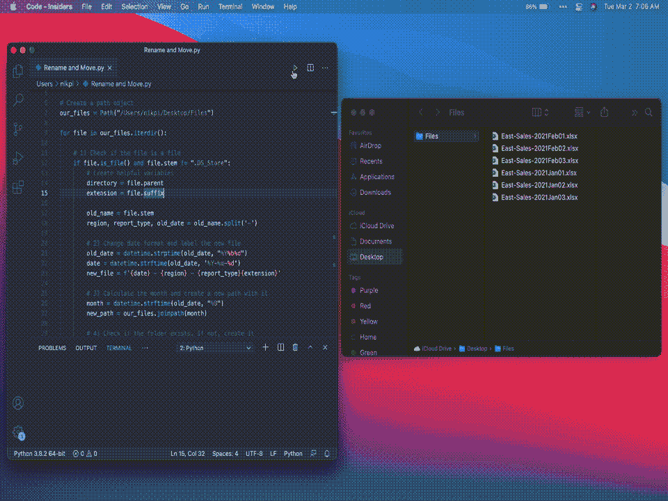

# 使用 Python 自动重命名和组织文件

> 原文：<https://towardsdatascience.com/automate-renaming-and-organizing-files-with-python-89da6560fe42?source=collection_archive---------6----------------------->

## 学习使用 Python 重命名和自动化您的文件组织！

使用 Python 自动重命名和组织文件！(来源:Nik Piepenbreier)

你知道你每天收到的那些销售报告吗？标有`East-Sales-01Jan2021.xlsx`、`East-Sales-01Jan2021.xlsx`等的？说你希望他们被称为`2021–01–01 — East Sales`。

您可以手动逐个重命名它们。**或者您可以使用 Python 的魔力！**

在本文中，您将学习如何使用`pathlib`库来:

1.  根据模式重命名文件，以及
2.  将文件组织到逻辑文件夹中

如果你想跟随视频教程，请点击这里查看我的视频:

# 我们开始吧！

要加载我将在本教程中使用的示例文件，您可以从这个链接下载它们[。只要解压它们，把文件夹放在你喜欢的任何地方。](https://github.com/datagy/mediumdata/raw/master/Rename%20Files%20Tutorial.zip)

现在，让我们加载我们将使用的两个库:

我们将使用`datetime`来捕获和转换文件名中的日期。我们还将使用`pathlib`来重命名文件并将其移动到逻辑文件夹中。

# Python 的 pathlib 是如何工作的？

Python 的`pathlib`是一个面向对象的框架，用于处理和操作文件路径。它是在 Python 3.4 中引入的，因此任何 3.4 或更高版本都可以使用本教程。

Pathlib 允许我们创建具有许多不同属性和方法的 path 对象，我们可以使用它们来深入了解我们的文件或操纵它们。

让我们创建一个 path 对象，并检查该路径的一些属性。将你保存文件夹的目录加载到`our_files`变量中。(注意:如果你正在使用 Windows，通过在你的字符串前面放置一个`r`，把你的字符串变成一个原始字符串以防止转义反斜杠。)

我们在上面的代码中所做的是创建一个`Path`对象，并将其赋给一个名为`our_files`的变量。这样做的好处是，我们现在可以访问这两个属性，并对该对象应用方法。

例如，我们已经检查了路径代表的是文件(False)还是目录(True)。我们还打印出了父路径、路径的词干和后缀(在本例中是空白的)。

# 用 Pathlib 重命名文件

使用 Pathlib 提供的面向对象的方法，我们可以轻松地访问路径的元素并进行修改。

`.iterdir()`方法返回存储在该目录中的所有项目的生成器对象。让我们打印出这些项目，以确保它正确地捕获了我们的文件:

这样做的好处是，我们现在可以对目录中的每个文件进行迭代和操作！解决了这个问题，让我们开始修改文件名结构。

这里还有一点要解开，让我们一步步来看:

*   我们使用`.iterdir()`方法遍历目录中的每个文件
*   然后，我们创建两个有用的变量来存储每个文件的目录和扩展名
*   我们将旧文件名(使用`.stem`属性创建的)解包成有意义的名称(区域、报告类型和旧日期)
*   因为我们想要更改日期格式，所以我们将日期字符串转换成 datetime 对象，然后再转换回具有我们想要的输出格式的字符串。(注:我们先用`.strptime()`，再用`.strftime()`。
*   最后，我们创建一个 new_name 变量，它使用 f 字符串将其他字符串连接成一个文件名。(如果您要打印出一个新的 _name，它会是这样的:`/Users/nikpi/Desktop/Files/2021–01–01 — East — Sales.xlsx`)
*   要重命名文件，我们调用文件本身的`.rename()`方法，传入目录和新名称的连接。

唷！好的，太棒了！你已经走到这一步了。如果您满足于仅仅重命名文件，现在可以自由运行您的代码了。它会立即做出改变(Mac OS 和 Windows 不允许你点击“撤销”——所以要小心！).

如果你也想把每个月的文件组织到文件夹中，请继续阅读。

# 用 Pathlib 移动文件

因为我们可以访问 Pathlib 对象的许多不同元素，所以我们可以使用这些元素将我们的文件组织到有意义的文件夹中。

自动移动文件到不同的文件夹！资料来源:Nik Piepenbreier

例如，如果您想将您的文件组织到它们所属的每个月的文件夹中，我们可以使用 Pathlib 来自动完成这项工作。

我将在这里重复一些早期的代码，以便当您想要立即运行它时，它们都在那里:

让我们一点一点地分解我们在这里所做的事情。我为您提供了步骤编号，以便于您更容易地理解，因为一些代码已经更改:

1.  我们添加了一个条件来检查文件是否实际上是一个文件(而不是一个目录)。(提示:如果你运行的是 Mac，有时讨厌的文件叫做“.DS_Store”获得添加。条件的第二部分针对这些进行检查)
2.  我们创造了和以前一样有用的变量。
3.  我们将日期转换成更有用和可排序的格式。
4.  我们将月份以字符串格式存储在`month`变量中。然后我们使用`.joinpath()`方法通过插入一个字符串作为参数来创建一个新路径。
5.  然后我们使用`.exists()`方法检查文件夹是否存在，该方法返回一个布尔值。如果文件夹不存在，那么我们创建文件夹。
6.  这里，我们创建了一个新的 path 对象，它将新文件名加入到新文件夹中。
7.  最后，我们使用`.replace()`方法，将文件移动到那个路径。需要注意的是，如果该文件已经存在，它将被覆盖。为了避免这种情况，您可以编写一个条件来首先检查这一点。

现在剩下的就是点击运行！这将更改所有文件名，并将它们移动到新创建的文件夹中。

# 结论—自动化很有趣！

感谢阅读本教程！我希望你发现它在管理你的文件方面是有用的，并且看看你如何能更进一步。

例如，您可以添加条件以仅修改某些文件类型，并且您可以设置自动清理混乱的下载文件夹的方式。

想要更多这样的教程，可以考虑订阅我的 YouTube 频道，我经常在那里发布像这样的教程。点击下面的按钮订阅！

点击此处订阅。图片由 stickpng.com 提供)