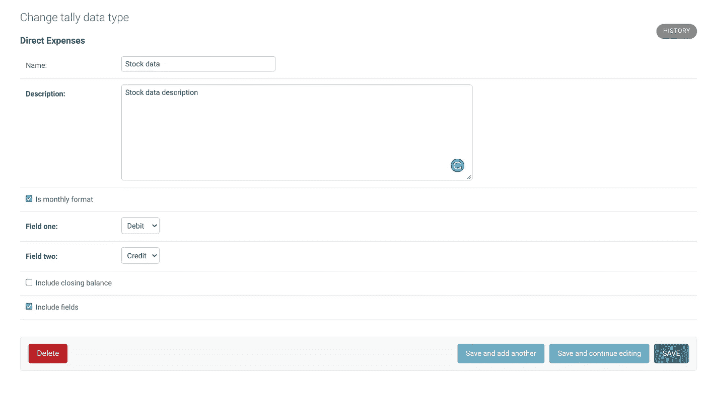
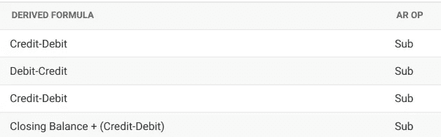
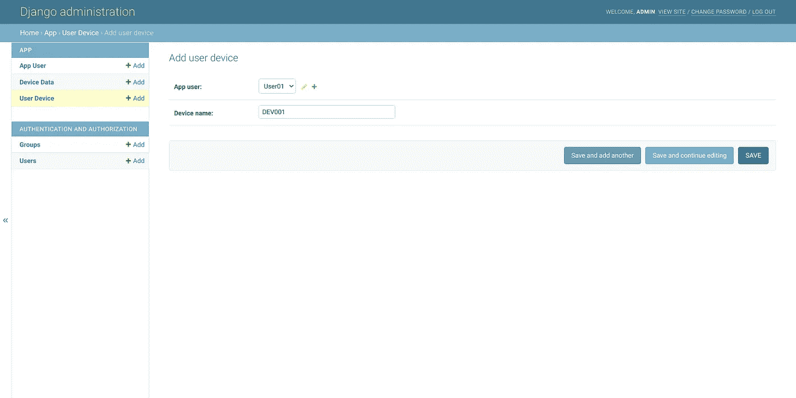
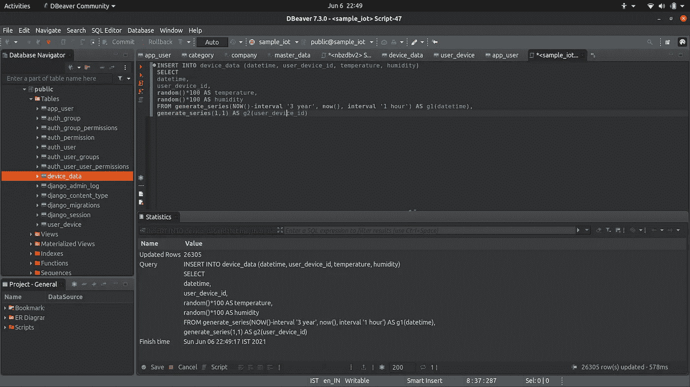
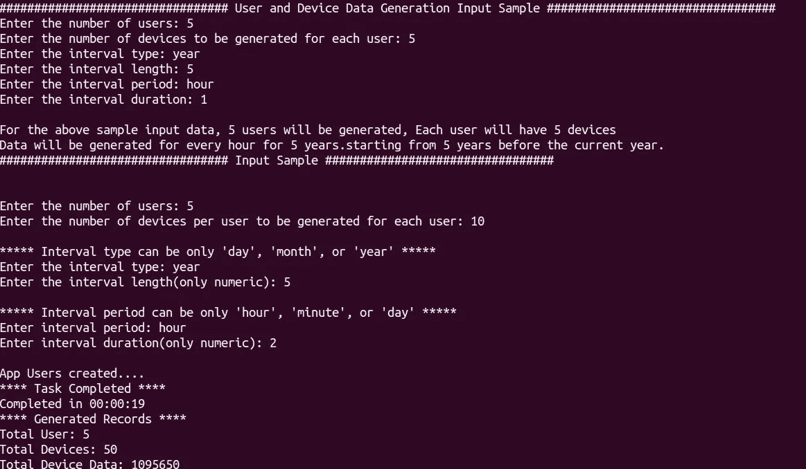
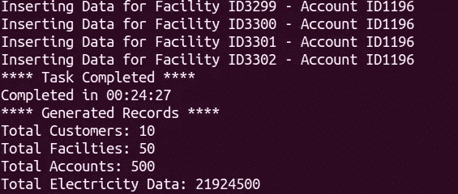

# 使用 Faker 和 PostgreSQL 为 Django 项目自动生成样本大数据

> 原文：<https://towardsdatascience.com/automate-sample-big-data-generation-with-faker-and-postgresql-for-django-projects-e95343ae93e?source=collection_archive---------20----------------------->

## 为您的数据密集型项目在几秒钟内生成可重复使用的大型模拟数据集

[unsplash.com](https://unsplash.com/photos/1K6IQsQbizI?utm_source=unsplash&utm_medium=referral&utm_content=creditShareLink)

在处理数据密集型应用程序时，总是需要生成大量模拟数据，以便在多种场景中进行测试。在大多数情况下，我们需要在几分钟内(如果不是几秒钟)生成大型数据集的方法。在我的例子中，我们需要一个模拟数据集用于我们的 UAT 环境 IoT，并验证 API 和查询的性能。我曾经在 CSV 中生成数据，并将数据移动到数据库中。但这似乎效率低下。如果数据集尚未保存，则必须生成，然后我们需要维护、集成和运行一个独立的 python 脚本。

我以前在一些情况下使用过 Django 管理命令。由于我们当前的一些后端运行在 Django 中，并且是用 ORM 管理的，我认为有一个生成模拟数据集的管理命令会很好。事实证明，这不仅对我，而且对整个团队和管理人员都非常有益。

如果你没有编写过定制管理命令，或者需要一份编写定制管理命令的参考资料，试试[这个](https://simpleisbetterthancomplex.com/tutorial/2018/08/27/how-to-create-custom-django-management-commands.html)。尽可能地使用它。它不仅可以与您的 Django 应用程序很好地集成，而且您还可以充分利用 Django 的 ORM，从使用对象到运行聚合策略。

我非常依赖的一个软件包是 [Faker](https://pypi.org/project/Faker/) ，用于生成虚假数据集，如用户名、电子邮件、公司名称。但是还有最后一个缺失的部分——时间序列数据的生成。这就是 PostgreSQL [生成系列](https://www.postgresql.org/docs/9.1/functions-srf.html)的用武之地。它提供了创建时间序列等系列数据的有效方法。

我为一个物联网应用程序创建了一个包含三个模型的 Django 项目样本，安装了 Faker 库，并将其连接到本地 Postgres 数据库。

*   应用程序用户注册用户数据
*   用户设备为用户添加传感器设备
*   设备数据按时间顺序捕获新增用户设备的温度和湿度。

**数据库模式和模型:**

现在将模型映射到相应的 admin.py。我喜欢 Django 的一点是管理页面。

我通常设计模式，并用 [Django-admin](https://docs.djangoproject.com/en/3.2/ref/contrib/admin/) 创建数据层的快速模型，包括过滤器、搜索、数据导出、只读字段。

在我的组织中有一个需求，我们需要从 excel(一个计数表)中提取数据。有多个表，每个表都有很多信息，有些单元格有基于月份的财务数据，如 account_no、credit、debit、closing-balance 和 opening-balance，有些表有非每月的非结构化数据。所有这些数据集都按类别存储。我想到了一个关于表单类型的可配置模型层的小点子。

根据类别数据类型的配置，在理货数据页面上输入的数据将应用该公式并计算最终金额。

不仅如此，它的编码方式是，当计数表被上传到一个类别时，提取和计算也会基于配置发生。这是在很短的时间内完成的，结果证明它非常有活力，非常有用。

如果您是 Pythonista，只要知道如何将设计好的模式转换成模型并创建管理页面映射，就可以为您节省大量创建数据层的时间。它还会为您的数据层提供一个漂亮、时尚的 UI。

是的，我明白了，这和这篇文章没有关系。但是如果你是 python 开发人员、数据分析师或科学家，Django 管理层会给你很多支持和帮助。我总是用 Django admin 来原型化我的数据层。

关于 Django admin 已经说得够多了。现在你可以在 Django-admin 中创建一个用户和一些与用户相关的设备。我已经创建了一个用户和一个设备。现在让我们使用原始 SQL 为设备生成数据。

PostgreSQL generate-series 是一个非常强大的系列数据生成函数，可以在几分钟内创建数百万条记录。

让我们为我们创建的 ID 尝试一个示例生成系列函数

> 插入到设备数据(日期时间，用户设备 id，温度，湿度)
> 选择
> 日期时间，
> 用户设备 id，
> random()*100 作为温度，
> random()*100 作为湿度
> 从 generate_series(now() —间隔' 3 年'，now()，间隔' 1 小时')作为 g1(日期时间)，
> generate_series(1，1)作为 g2(用户设备 id)

我们正在为我们创建的设备插入 3 年的每小时数据

你可以看到快速的数据生成与 Postgres 生成系列。现在将它与 Faker 和 Django ORM 结合起来，您就可以将任何 Django 应用程序的样本数据生成脚本集成到您的代码库中。

这些是我遵循的步骤:

1.  从用户处获取总用户和相关设备的数量作为输入。
2.  User Faker(faker.name())来创建模拟用户名。
3.  然后用 Django [bulk_create](https://docs.djangoproject.com/en/3.2/ref/models/querysets/) 批量插入那些用户数据和设备数据
4.  然后用上面的原始 SQL 传递必要的参数，迭代地为设备生成数据。

通过这种方式，我们现在可以将样本数据集生成作为代码与 Django 中的 MVT 一起维护。

以下是输出:

或者，您仍然可以在 psycopg2 中使用等效的 SQLAlchemy ORM 或纯 python 本身。随意发挥你的想法。我之前用过 python，CSV，还有 [pandas_to_sql](https://pandas.pydata.org/pandas-docs/stable/reference/api/pandas.DataFrame.to_sql.html) 。虽然这很快，但与生成系列相比，它差远了。在我的一个示例项目中，我能够在 20 分钟内生成 2100 万条包含相关数据的记录。但要警惕的是，随着数据的增加，插入速度往往会变得缓慢。

完整的代码在 [GitHub](https://github.com/pravinmj-cs/mock-data-iot) 中。

模拟数据——一种生成可预测数据并测试不可测试数据的方法

开心嘲讽和数据叠加！！