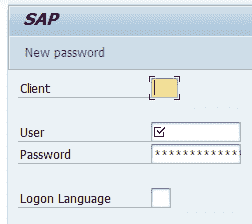
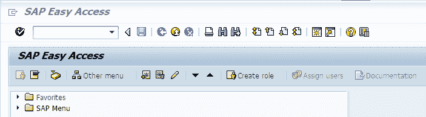

# 使用 Pyautogui 自动提取 SAP 报告

> 原文：<https://towardsdatascience.com/automate-sap-report-extraction-with-pyautogui-f115ae19b653?source=collection_archive---------11----------------------->

## 从世界上最乏味的任务中节省时间的指南。


[温德米亚酒庄](https://unsplash.com/@vindemia?utm_source=medium&utm_medium=referral)在 [Unsplash](https://unsplash.com?utm_source=medium&utm_medium=referral) 拍摄的照片

# 介绍

报告是任何业务的基础。在日常生活中，你必须以某种方式从报告中吸收新数据，以决定每天的下一步。该报告可以采用各种格式，如 Microsoft Excel、Web 应用程序或从企业资源规划系统(ERP)导出。

我最近收到一个请求，要求我构建一个仪表板，在精心制作的报告中复制业务编号。财务团队每月手动创建此报告。最繁琐的过程是从 SAP 系统中导出源文件，并手动将其放入 excel 中。之后，他们必须调整一些数字，因为这是用户定义的公式无法计算的边缘情况。

在我看来，如果我们以相同的逻辑从 SAP 表的源表开始，我们可以不用做很多手工任务就可以导出报表。我第一次也是这么想的。

复制这些数字将是一项简单的任务。逻辑似乎很简单。但是，当我深入研究细节时，我发现所有这些数字都经过了许多底层 SAP 业务规则的处理。此外，业务规则是如此的动态，对于一个不完全理解整个流程的人来说，很难复制它。

经过一段时间的反复试验，我决定不再继续复制过程。我要花一个多月的时间才能理解所有内容，并将 SAP ABAP 语言转换成另一种我可以使用的语言。有时候，我们需要让一些事情保持原样。不要碰它，即使你认为它会是一个伟大的方式在未来这样做。

# 然后，我该怎么办？


照片由[哈德逊·辛慈](https://unsplash.com/@hudsonhintze?utm_source=medium&utm_medium=referral)在 [Unsplash](https://unsplash.com?utm_source=medium&utm_medium=referral) 上拍摄

下面我们来看今天的主要话题。我没有接受源数据并自己计算数字，而是跳过了所有的过程，接受了最终的报告结果。我该怎么做？答案是用一个`pyautogui`模块。你可以在这个 [Github](https://github.com/asweigart/pyautogui) 里找到。

简而言之，`pyautogui`帮助你完成基本的自动化任务，例如移动鼠标，点击按钮，键入一些单词。通过引用鼠标要移动到的像素，你可以在桌面上做任何你想做的事情。此外，它还附加了计算机视觉功能，可以根据提供的图片识别屏幕上的位置。太棒了。

今天，我将引导您浏览这个库，并添加一些其他有用的功能来帮助您自动化桌面上的任何事情。今天，我不会为一个`pyautogui`能做什么写一个教程，因为无论如何你能在文档中找到它。我会向你展示这个过程，以及你可以在哪里应用这个东西。

# 这是我们今天要讲的步骤。


由 [Roman Synkevych](https://unsplash.com/@synkevych?utm_source=medium&utm_medium=referral) 在 [Unsplash](https://unsplash.com?utm_source=medium&utm_medium=referral) 上拍摄的照片

1.  打开 SAP GUI 并登录到服务器。
2.  输入用于提取报告的 SAP 程序名称和参数。
3.  执行报告并将其导出到 Microsoft Excel 电子表格。
4.  将其上传到 AWS S3，以进行进一步的 ETL 流程。

因此，让我们打开 SAP，以便从中提取报告。这是你怎么做的。

```
import subprocesssap_gui = subprocess.Popen("path/to/saplogon.exe")
```

首先，我们用`subprocess`模块打开程序。你打开任何`exe`文件都很方便。你用参数`sap_gui`存储`program`对象。在脚本的最后，您可以像这样终止 SAP。

```
sap_gui.terminate()
```

当 SAP 登录打开时。您将看到这样的屏幕。



作者的 SAP 登录屏幕截图

使用`pyautogui`时要小心的一件事是，如果桌面处理不正确。我的意思是，假设你在屏幕上选择了某个选项，程序需要一些时间来处理它。如果您不在脚本中添加任何等待时间，所有后续步骤都可能出错。

为了让上面的例子更好。

```
import pyautogui
import subprocess
import timesap_gui = subprocess.Popen("path/to/saplogon.exe")# wait 3 seconds for the program to load
time.sleep(3)# assume that we move to input username fieldsusername_field_location = pyautogui.locateOnScreen('username_field.png')
pyautogui.moveTo(username_field_location) 
pyautogui.click()# type the username in the field that we just clicked
pyautogui.typewrite(username)# move (relative from the current cursor position) to below 50 pixel
pyautogui.moveRel(0, 50)
pyautogui.click()# type the password
pyautogui.typewrite(password)
pyautogui.press('enter')
```

通过下面的代码，我们向您展示如何使用`pyautogui`函数登录到 SAP 系统。上面的代码片段包含了我在摄取脚本中使用的几乎所有函数。我们同时使用参考运动和计算机视觉运动。现在你会在这里如下图。



作者的 SAP 主页截图

此时，您将输入报告所需的所有参数，然后执行它。我们可以使用上述所有功能来完成这项任务。让我只指出我先前没有提到的功能。

```
# Other functions that I used to assign the value to get the report# double click
pyautogui.doubleClick()# right click
pyautogui.click(button='right')# hot key with ctrl + f9 (shortcut for SAP command)
pyautogui.hotkey('ctrl', 'f9')# press tab to shift to the next input field
pyautogui.press('tab')
```

单击 SAP 导出过程的导出按钮后，它会自动为您打开 excel 文件。这种行为有时很烦人，因为在关闭 excel 文件之前，您不能对结果文件做任何事情。

这就是另一个有用的功能出现的地方。我们可以检查该进程(MS Excel)是否正在运行。之后，我们可以将它们作为一个触发点，进入下一步。如果 SAP 系统能够正确保存 excel，我们可以毫不犹豫地关闭 excel 结果文件。我们将使用下面的函数来做到这一点。

```
import osdef process_exists(process_name): # Thanks to [ewerybody](https://stackoverflow.com/users/469322/ewerybody) for providing this useful snippet code [https://stackoverflow.com/questions/7787120/check-if-a-process-is-running-or-not-on-windows-with-python](https://stackoverflow.com/questions/7787120/check-if-a-process-is-running-or-not-on-windows-with-python) # This function will return true if the process is running.
      It's compatible only in MS Window. try:
        call = 'TASKLIST', '/FI', 'imagename eq %s' % process_name        # use buildin check_output right away    
        output =  subprocess.check_output(call).decode()    

        # check in last line for process name    
        last_line = output.strip().split('\r\n')[-1]            # because Fail message could be translated    
       return last_line.lower().startswith(process_name.lower()) except Exception as e:
        print(e)def close_process(process_name): # This function will return true if the process is running.
      It's compatible only in MS Window. try:
        os.system('TASKKILL /F /IM {}'.format(process_name))
    except Exception as e:
        print(e)
```

这里我们检查微软是否存在。如果存在，我们就关闭它们。

```
# Let's wait untill the program is exists and close it.retry = 0
while not is_process_exists('path/to/excel.exe'):time.sleep(10) # may be we need more time for saving
    retry += 1
    if retry > threshold:
        raise ValueError("Excel cannot be saved")close_process('path/to/excel.exe')
```

我们将对导出的文件进行后处理，将其放在应该放的地方。

```
local_file = path/to/export.xlsx
target_dir = path/to/{load_date}
file_name = {business_key_parameter}.xlsx
absolute_file_name = os.path.join(target_dir, file_name)if os.path.exist(target_dir): # if the target dir doesn't exist, create one.
    os.mkdir(target_dir)if os.path.isfile(absolute_file_name): # if there is a file in the target folder, replace with new one.
    os.remove(absolute_file_name)# rename and move export file to the target dir
os.rename(local_file, absolute_file_name)
```

现在我们想要的报告已经放在目标目录中。我们将循环访问所有业务部门以获取所有报告。

## 要小心的事情`pyautogui`

`pyautogui`模块的一个缺点是，如果前一条指令的输出结果不符合预期(网页无法加载)，那么这个错误将导致后面的所有步骤彻底失败。要解决这个问题，我能想到两个选择

1.  为每个`pyautogui`阶段找一个可靠的参照物。如果那个可靠的引用不存在，我们将等待它被加载。请注意，如果您使用`while`循环而不重试，可能会导致无限循环。
2.  引发错误并跳过当前错误。之后，您可以稍后重试。这假设问题是由于暂时不可靠的参考而发生的。我们可以创建一个函数来检查导出文件的数量。然后，对于丢失的文件，我们再次重新运行脚本。

在你得到你想要的所有报告后，让我们把目标文件上传到 AWS S3 公司做进一步的处理。

```
**import** **logging**
**from** **botocore.config** **import** Config

*# Intial S3 client* s3_config = Config(region_name = <<YOUR AWS REGION NAME>>)
s3_client = boto3.client(
    "s3", config=s3_config,
    aws_access_key_id = config["CREDENTIALS"]["AWS_ACCESS_ID"],
    aws_secret_access_key = config["CREDENTIALS"]["AWS_SECRET_KEY"]
            )
**try**:
    response = s3_client.upload_file(
               file_name, bucket, object_name
               )
**except** Exception **as** e:
    print(e)
```

瞧啊。我们已经自动提取了报告，并将其上传到 S3 自动气象站，无需人工协助。剩下的就是安排这个任务每天运行。

# 该休息了


照片由[德鲁·科夫曼](https://unsplash.com/@drewcoffman?utm_source=medium&utm_medium=referral)在 [Unsplash](https://unsplash.com?utm_source=medium&utm_medium=referral) 拍摄

我们今天浏览了几个有用的图书馆。如你所见，我们可以用 python 自动完成所有繁琐的任务。

我花了大约半天的时间来编写这个任务的动作代码。但是我能节省的时间更多。

假设您必须每天导出一次，提取时间为 1 小时，并每天输入相同的参数。这将是世界上最无聊的任务。现在我有一个脚本来处理所有这些事情。

起初，我认为自动化会有一些成本。在网上看到一些很优雅的 RPA 应用。如果我必须花钱购买这些应用程序，那么通过概念验证和采购流程将会花费大量时间。有了它，我们可以在一天之内在当地完成所有事情。

然而，正如我前面提到的，您必须自己处理边缘案例。如果它是一个简单的应用程序，我鼓励你自己尝试自动化它。但是对于复杂的流程，您可以选择获得完整的优雅 RPA 应用程序。这可能是一个更好的选择。

不要让你自己在单调乏味的任务中毫无收获。让我们实现自动化吧！

## 帕泰鲁什·西达

***如果你喜欢这篇文章，并希望看到更多这样的东西。***

*   跟着我上[媒](http://padpathairush.medium.com)
*   其他渠道？ [LinkedIn](https://www.linkedin.com/in/pathairush-seeda-b7a62ab6/) ， [Twitter](https://twitter.com/data_products) ，以及[脸书](https://www.facebook.com/DataProds-106431271287292/)