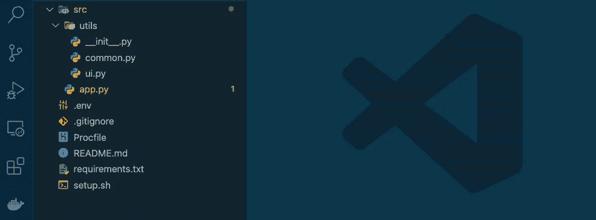
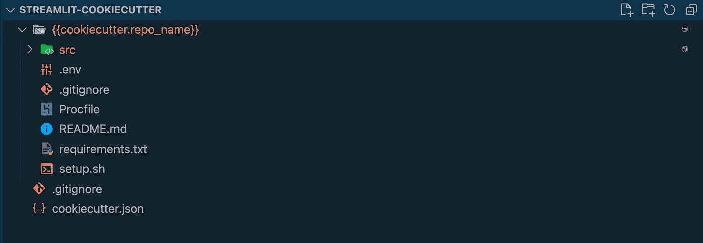
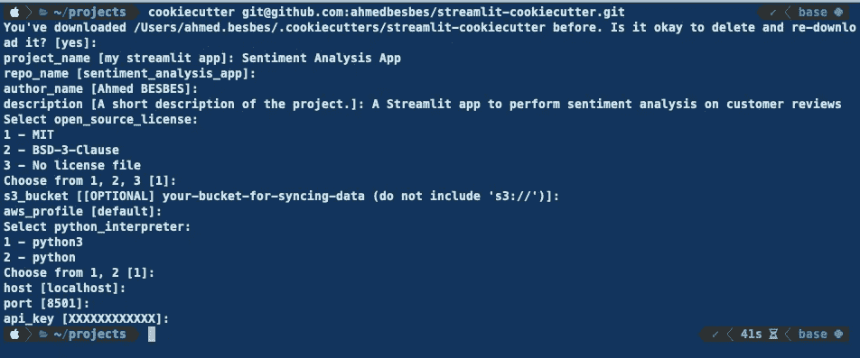
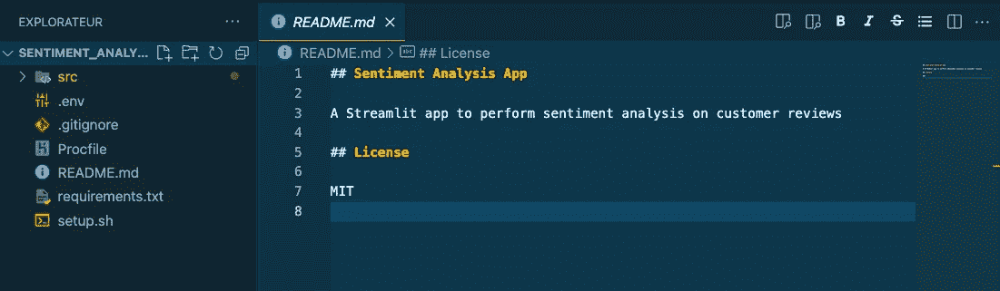
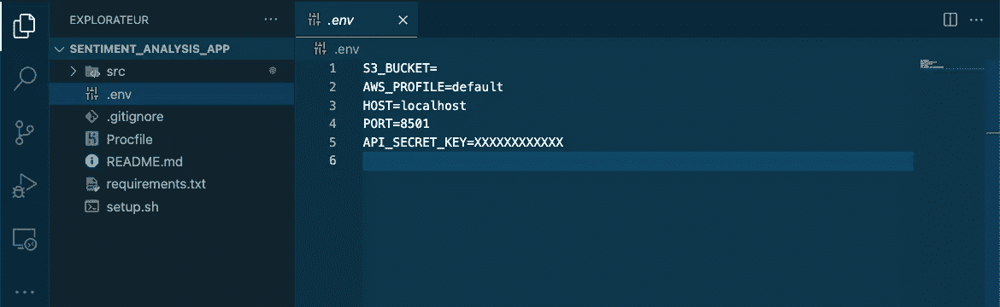
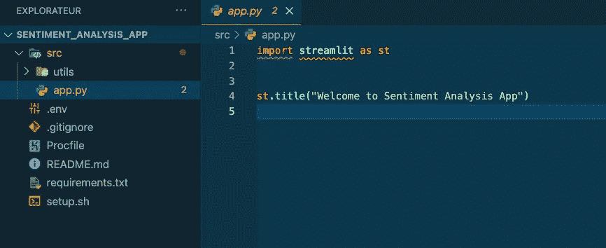
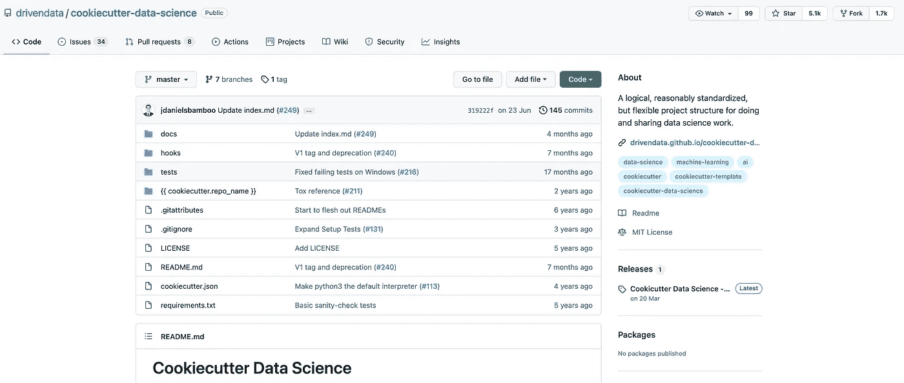
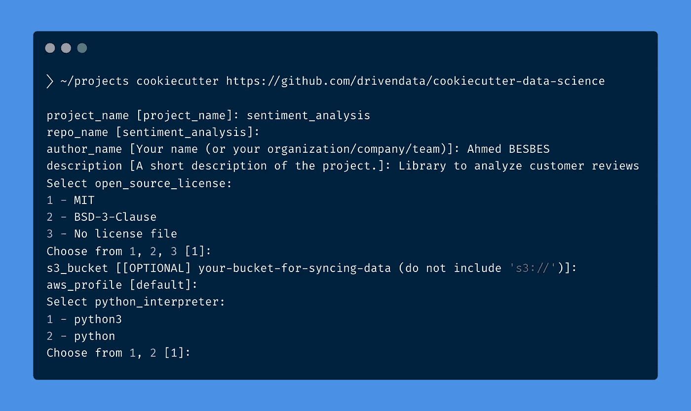

# 使用 Cookiecutter 自动化数据科学项目的结构

> 原文：<https://towardsdatascience.com/automate-the-structure-of-your-data-science-projects-with-cookiecutter-937b244114d8?source=collection_archive---------13----------------------->

## 停止手工操作，重新使用项目模板


列宁·艾斯特拉达在 [Unsplash](https://unsplash.com?utm_source=medium&utm_medium=referral) 上的照片

这是很多数据科学家都熟悉的情况。

每当您开始一个新项目时，您都要重用旧项目的结构。您浏览它们的文件夹并复制粘贴它们，删除不必要的文件，用新项目的细节重命名剩余的文件，进入每个配置文件并替换旧的环境变量(URL、API 键、主机、端口等)。)与新的。

也许，谁知道呢，在这个过程中，您会创建新的配置和新的文件夹。

❌:我们都同意这是一项相当乏味和重复的任务。更不用说它很容易出错。

✅从一个主模板开始每个新项目不是更方便吗？你可以从终端克隆并填充特定的信息？让这个模板自动为您构建一个完整的文件夹结构，并用您定义的正确名称和变量填充文件，这不是很好吗？

[**Cookiecutter**](https://github.com/cookiecutter/cookiecutter) 才是解决这个问题的正确方法。

> ***在本帖中，我们来看看 cookiecutter。
> 我们将了解它是如何工作的，以及您如何使用它来为您的项目构建定制的和可重用的模板。
> 然后，我们将介绍***[***Cookiecutter 数据科学***](https://drivendata.github.io/cookiecutter-data-science/) ***开源模板，以启动遵循行业最佳标准的数据科学项目。***

事不宜迟，我们来看看🔍

# 什么是 cookiecutter？

> " Cookiecutter 从项目模板创建项目."—官方[文件](https://cookiecutter.readthedocs.io/en/1.7.2/README.html#available-cookiecutters)

*   项目可以是 python 包、web 应用程序、具有复杂工作流的机器学习应用程序或任何你能想到的东西
*   模板是 cookiecutter 用来创建项目的。他们依赖于 Jinja2 的语法

cookiecutter 做的事情非常简单:它克隆一个目录并将其放入新项目中。然后，它用在`cookiecutter.json`文件中找到的名字替换在`{{`和`}}` (Jinja2 语法)之间的所有名字。(我们将在下一节看到如何构建 cookiecutter 模板的示例)

要开始使用 cookiecutter，您可以使用 pip 安装它:

```
**pip install cookiecutter**
```

或康达:

```
**conda install -c conda-forge cookiecutter**
```

👉你可以在所有平台上使用 cookiecutter:Windows、Mac 和 Linux
👉它适用于 Python 2.7+和 3.5+(尽管更喜欢 Python 3.5+，因为 Python 2.7 不再[维护](https://www.python.org/doc/sunset-python-2/) )
👉您可以使用 Cookiecutter 创建一种或多种语言的模板

# 如何为您的 Streamlit 项目创建自定义 cookiecutter 模板？

在这一节中，我将向您展示如何为 kickstart Streamlit 项目创建一个 cookiecutter 模板。

如果你不熟悉 [Streamlit](https://streamlit.io/) ，它是一个用于构建 web 应用程序的 Python 库。它使用起来非常简单，并且提供了很多功能。我每天都用它来与我的团队分享实验和结果，并制作机器学习应用的原型。

## 目标结构

我的基于 Streamlit 的项目往往具有以下结构:



作者截图

*   一个包含应用程序(`app.py`)主脚本的`src`文件夹，以及一个包含两个脚本的`utils`模块:`ui.py`用于放置布局函数，而`common.py`用于保存其他用于数据处理或远程数据库连接的实用函数
*   一个`.gitignore`文件，用于防止 git 对不必要的文件(例如 env 文件，或。pyc 文件)
*   `Procfile`和`setup.sh`:处理 [Heroku](https://www.heroku.com/) 上的部署
*   `requirements.txt`:列出项目依赖关系
*   一个`.env`文件，用于存储项目的环境变量
*   A `README.md`分享项目详情

## 创建一个 cookiecutter 模板以匹配目标结构

要创建一个生成这个结构的 cookiecutter 模板，让我们首先为这个模板创建一个文件夹。

```
**mkdir streamlit-cookiecutter
cd streamlit-cookiecutter**
```

在这个文件夹中，创建`cookiecutter.json`文件:

关于这个文件的一些事情:

*   当 cookiecutter 从模板中启动一个项目时，每个键都是它需要的一个项目
*   每个值对应于每个项目的默认值
*   项目的值按顺序设置。例如，`repo_name`设置在`project_name`之后(因为它的值取决于`project_name`的值)

当您使用 cookiecutter 克隆模板时，会设置这些项的值:我们将在下一步中看到这是如何完成的。

现在创建文件夹，并将所需的目标结构放入其中。我们将根据`repo_name`项来命名该文件夹。
在 cookiecutter 语法中:`{{cookiecutter.repo_name}}`。

在`{{cookiecutter.repo_name}}`文件夹中，将您想要的结构放到您的项目中:



这些文件中的每一个都可以访问您传递给 cookie-cutter 的项目的值:您所要做的就是使用`{{`和`}}`。

让我们看看如何利用这一点。

**👉生成 README.md** 我们可以通过在其中插入`project_name`、`description`、`open_source_license`项来自动生成 README.md。

**👉设置环境变量** 我们可以自动填写`s3_bucket`、`aws_profile`、`port`、`host`和`api_key`在。环境文件。

**👉重复数据删除代码** 如果您的 Streamlit 应用程序遵循相同的结构，并且都以项目名称作为标题，则没有必要每次都重复此代码。

一旦你完成了你的模板代码，把它推给 Github。我已经做了，你可以在这里查看。

## 测试模板！🚀

现在模板已经在 Github 上了，让我们用它来开始一个项目。

假设我想在 Streamlit 中创建一个**情绪分析 app** 。

我需要做的就是用模板的 URL 调用 cookiecutter。

```
**cookiecutter** [**git@github.com**](mailto:git@github.com)**:ahmedbesbes/streamlit-cookiecutter.git**
```

一旦执行该命令，Cookiecutter 将要求您设置您在`cookiecutter.json`文件中定义的项目的值(注意，每个项目的默认值都放在括号中)。



为每个项目输入特定值后，项目就创建好了。

让我们检查一下它的`README.md` ✅



作者截图

其`.env`文件✅



作者截图

其`app.py`文件✅



作者截图

一切都好。项目具有所需的结构，文件中填充了正确的数据。

现在我们可以开始开发这个应用程序了。

# 库克数据科学

cookiecutter 的一大优点是充满活力的社区。现在有很多不同风格的开源模板(Django、Flask、FastAPI，随便你怎么说)。你可以很容易地在 Github 上找到它们并开始使用它们。

一个引起我注意的模板是 [Cookiecutter 数据科学](http://drivendata.github.io/cookiecutter-data-science/)。



作者截图

正如作者所说，这个模板是:

> 一个逻辑合理、标准化但灵活的项目结构，用于进行和共享数据科学工作。

实际上，这个模板提供了一组目录来更好地组织您的工作。这有点固执己见，但它遵循了该领域公认的良好实践。

在我看来，它有助于:

*   按职责组织模块:数据集创建、特征工程、建模、可视化
*   按流水线阶段组织数据
*   强制单元测试
*   创建文档

您可以开始使用此模板，如下所示:



作者在碳上制作的图像。嘘

一旦您完成了对每一项的值的设置，您将得到以下结构:

来源:http://drivendata.github.io/cookiecutter-data-science/

您不必坚持这种结构:如果您对它不满意，您可以派生模板并修改它以满足您的需要。

# 资源

Cookiecutter 是一个神奇的图书馆。它有助于自动创建项目，并防止您重复自己。作为一名数据科学家，它必须是你工具箱的一部分。

为了了解更多关于 Cookiecutter 的信息，我挑选了一些你可以轻松浏览的好资源:

*   [https://github.com/cookiecutter/cookiecutter](https://github.com/cookiecutter/cookiecutter)
*   [https://drivendata.github.io/cookiecutter-data-science/](https://drivendata.github.io/cookiecutter-data-science/)
*   [https://dev . to/azure/10-top-tips-for-reproducible-machine-learning-36g 0](https://dev.to/azure/10-top-tips-for-reproducible-machine-learning-36g0)
*   [https://towards data science . com/template-your-data-science-projects-with-cookiecutter-754 d3c 584d 13](/template-your-data-science-projects-with-cookiecutter-754d3c584d13)
*   [https://youtu.be/nExL0SgKsDY](https://youtu.be/nExL0SgKsDY)(一段优秀的 Youtube 视频)

# 感谢阅读🙏

如果你坚持到最后，我真的感谢你的时间，并希望你学到了一些关于 cookiecutter 和项目模板。

今天就这些了。直到下一次更多的编程技巧和教程。👋


由[卡斯滕·怀恩格特](https://unsplash.com/@karsten116?utm_source=unsplash&utm_medium=referral&utm_content=creditCopyText)在 [Unsplash](https://unsplash.com/@karsten116?utm_source=unsplash&utm_medium=referral&utm_content=creditCopyText) 上拍摄的照片

# 新到中？您可以每月订阅 5 美元，并解锁无限的文章— [单击此处。](https://ahmedbesbes.medium.com/membership)