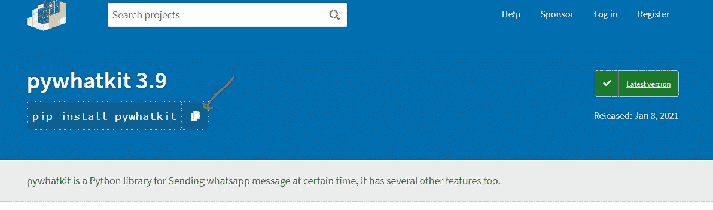

# 用 Python 自动化 WhatsApp 消息

> 原文：<https://towardsdatascience.com/automate-whatsapp-messages-with-python-6c1d71444ffa?source=collection_archive---------0----------------------->

## 只用了两行代码

[附身摄影](https://unsplash.com/@possessedphotography?utm_source=medium&utm_medium=referral)在 [Unsplash](https://unsplash.com?utm_source=medium&utm_medium=referral) 上拍照

用 Python 自动化 WhatsApp 消息？

Python 是一门令人惊叹的语言。你不一定要成为专业人士才能用它做令人兴奋的事情。

这种语言非常适合自动化。我尝试的第一个自动化是电子邮件自动化。然后是[网页抓取](https://www.amazon.com/Learn-Python-Basics-Android-Phone-ebook/dp/B089NKKVDS)，现在是 WhatsApp 消息。

也许你想让 WhatsApp 在某个特定的时间发送消息，但那个时候你可能很忙，甚至在睡觉。或者你可能想知道如何自动化 WhatsApp 信息，只是为了好玩。

在本文中，您将学习如何用两行 Python 代码自动处理 WhatsApp 消息。

安装 [Python](https://www.python.org/downloads/) 、 [Pycharm](https://www.jetbrains.com/help/pycharm/installation-guide.html) 和 [Pywhatkit](https://pypi.org/project/pywhatkit/) 如果你还没有的话。

# 如何用 Python 自动化 WhatsApp 消息

在编写代码的过程中，您可能会遇到错误，但不要担心。我将在下面介绍如何解决可能出现的 bug。如果你看到的 bug 这里没有提到，在 Google 上搜索解决方案。

bug 是编程的一部分。我无法克服在尝试自动化我的 WhatsApp 信息时遇到的一个错误。在我能解决它之前，我不得不考虑它。睡在虫子旁边总是好的。第二天早上你精神焕发，准备解决那些该死的 bug。

现在让我们开始吧。

*   打开 Pycharm 并创建一个新项目。给新项目起一个名字——Whatsautomation 或任何您喜欢的名字。然后选择 python 文件。此外，给 python 文件取一个您想要的名称。
*   谷歌 Pywhatkit 或者去网站[这里](https://pypi.org/project/pywhatkit/)。复制 Pywhatkit 安装链接。您将看到下图中红色箭头所指的链接。点击它，链接将被复制。

*   回到皮查姆。记住你已经打开了 Pycharm。点击 Pycharm 左下角的终端。将您复制的 Pywhatkit 安装链接粘贴到终端中，然后按 enter 键。安装 Pywhatkit 需要几分钟时间。
*   现在，在 Pycharm IDE(终端上方的大空间)中编写以下代码。

注:在括号内，写下您要发送自动消息的国家的国际代码(+……)。然后，写下你的信息。现在写下你希望信息传递的时间。这里的时间使用 24 小时制。因此，不是写 1，00 表示下午 1 点，而是写 13，00。另外，请注意引号。

*   运行代码。代码成功运行后，您将收到以下类型的消息:

> 110 秒后，web.WhatsApp.com 将打开，20 秒后，一条信息将被传递。

在你设定的时间，WhatsApp 会自动在你用来访问 WhatsApp 的浏览器中打开。你写的信息会出现在文本框中，并在 20 秒后自动发送。如果您的互联网连接速度很慢，您的邮件将无法发送。它将保留在文本框内。

# 您可能会遇到的错误消息

在尝试自动处理 WhatsApp 信息时，你可能会看到我在下面列出的错误信息。我已经包括了你如何解决每个错误。

*   安装 Pywhatkit 时，您可能会看到以下错误消息:

> 找不到 zlib 的头文件或库文件，这是从源代码编译 Pillow 时所需的依赖项。

## **解决方案**

升级 pip 和枕头。分别运行以下代码:

*   从 0 开始计时。例如，9，06。您将得到语法错误:

语法错误:十进制整数文本中不允许前导零；对八进制整数使用 0o 前缀。

## **解决方案**

用 0 以外的数字开始计时。

*   如果您要发送消息的电话号码没有国家代码。您将得到以下错误:

> 引发 CountryCodeException("电话号码中缺少国家代码")
> 
> pywhatkit . main functions . Country code exception:电话号码中缺少国家代码

## **解决方案**

包括每个电话号码的国家代码。例如+234、+44、+1。

*   当您的网络速度慢时，您的信息将不会被发送。您将收到以下错误消息:

> 发出警告(“互联网速度慢，提取信息可能需要更长时间”)
> 
> 警告:互联网速度较慢，提取信息可能需要较长时间

## **解决方案**

使用强大的互联网连接。

# **结论**

你可以用两行 python 代码实现 WhatsApp 消息的自动化。使用 Pycharm 或任何你觉得舒服的 IDE。安装 Pywhatkit。导入 Pywhatkit。写下你的信息，包括你想发送自动信息的电话号码和你想发送信息的时间。

唷，消息是这样的。

自动化 WhatsApp 信息快乐。

> “Python 就像许多优秀的技术一样，很快就像病毒一样在你的开发团队中传播开来，并找到了进入各种应用程序和工具的途径……”——Mustafa Thamer

**P.S** *作家面临的挑战可能会阻止他们终身写作……久坐导致的慢性背痛、长时间盯着屏幕导致的眼睛问题、写作时手指窒息等等。如果你想继续得到这种类型的文章，你可以通过成为* [*媒体订户来支持我。每月花费 5 美元。你的一部分订阅费归我*](https://sabitololade.medium.com/subscribe) *。*