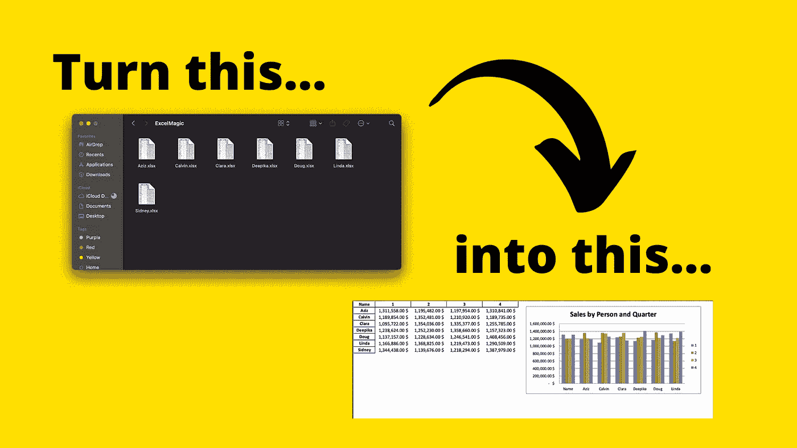

# 使用 Python 自动生成枯燥的 Excel 报表！

> 原文：<https://towardsdatascience.com/automate-your-boring-excel-reporting-with-python-cb18d1ecce14?source=collection_archive---------21----------------------->

## 将多个 Excel 文件合并成一个可操作的报告，而无需接触 Excel！

学会自动化你重复、枯燥的 Excel 工作。图片作者:Nik Piepenbreier

**Excel 是我们又爱又恨的工具。它擅长做的事情很棒，但不擅长它不该做的事情。在这个数据越来越重要的时代，你经常会收到来自不同来源的工作簿，并被要求用它们创造奇迹。**

在这篇文章中，你将确切地了解到这一点——如何用简单的 Python 脚本的力量来施展 Excel 的魔法。

# 你会学到什么！

假设您收到一堆 Excel 文件，其中包含不同销售人员的销售数据。问题是这些文件除了文件名之外，没有告诉你谁是谁。你被要求找出一些关于销售的高级统计数据！

**你将学习如何:**

1.  将多个工作簿合并成一个数据帧，
2.  创建一个数据透视表，
3.  用您的所有工作生成最终的 Excel 工作簿。

您将无需实际接触 Excel 就能完成所有工作。

将一堆松散的文件转换成可操作的报告，准备好 Excel 图表！图片作者:Nik Piepenbreier

# 更喜欢看教程？

我把整篇文章放在一个简单易懂的 YouTube 视频中:

在 YouTube 上看看这个教程吧！资料来源:Nik Piepenbreier

# 我们开始吧！

让我们从加载我们需要的库开始。在本教程中，您将使用`pandas`、`openpyxl`和`glob`。Pandas 是 Python 的精华数据分析库；openpyxl 让我们做一些有趣的 Excel 工作来保存我们的数据(比如创建图表)；glob 允许您仔细阅读目录中的不同文件。

如果你想跟着做，可以从这里的[我的 GitHub 下载文件。](https://github.com/datagy/mediumdata/blob/master/ExcelMagic.zip)

让我们看看如何使用 glob 来解析不同的文件。出于本教程的目的，我将文件保存在下面的目录中:`/Users/nik/Desktop/ExcelMagic`。让我们将修改后的文件路径保存到一个变量中。

Glob 允许您查找找到某个模式的文件路径。因为我们在 ExcelMagic 文件夹中寻找 Excel 文件，所以我们可以简单地使用通配符。因此，我们可以使用 glob 来查找所有匹配模式的文件路径:

最棒的是，我们现在有了一个我们想要迭代的所有文件的列表。

***提示！*** 如果你使用的是 Windows，你可能需要通过在你的左引号前加上`r`来将你的路径字符串转换成原始字符串。

# 合并我们的文件

## 获取文件名

当我们查看这些文件时，我们会发现除了文件名之外，没有其他方法可以区分它们。我们要做的是获取文件名

要合并所有这些文件，让我们:

1.  创建一个空的数据帧，
2.  遍历列表并创建一个临时数据帧，
3.  将临时数据帧添加到更大的数据帧中。

我们现在有了一个数据框架，其中添加了一个新列，其中包含雇员的姓名！

## 汇总数据

现在我们已经在一个数据框架中获得了数据，让我们按销售人员和季度汇总数据，看看谁的销售额最高。

让我们通过编写以下代码来创建一个熊猫数据透视表:

要了解更多关于熊猫的数据透视表，请查看[我在这里的帖子](https://datagy.io/python-pivot-tables/)。简而言之，以下是主要观点的概述:

*   **数据**:您要透视的数据
*   **索引**:数据透视表的“行”
*   **列**:数据透视表的“列”
*   **值**:您要使用哪一列进行汇总
*   **aggfunc** :您希望如何聚合您的数据

当我们使用`print(pivot)`打印数据透视表时，我们返回以下内容:

最后，让我们将数据保存到 Excel 工作簿中:

我们在这里创建了一个新的变量`save_file_path`,这样我们以后可以更容易地加载工作簿来格式化数据和添加 Excel 图表。

## 让我们创建一个 Excel 图表

现在我们有了数据摘要，我们可以使用这个数据框架直接在 Excel 文件中创建一个图表。

为此，我们将使用 openpyxl。让我们开始吧！

让我们看看我们在这里做了什么:

*   我们已经将工作簿和工作表作为 openpyxl 对象加载，
*   我们循环了包含我们的值的数据，并将它们格式化为货币，
*   然后，我们创建了一个条形图对象并插入了数据，并指示 openpyxl 在一个特定的位置(G2)用一个标题保存它
*   最后，我们将文件保存在同一个位置。

# 结论

我们在本教程中已经做了很多！我们遍历了许多不同的 Excel 工作簿来合并数据，生成了一个数据透视表和一个 Excel 图表— *所有这些都没有用到 Excel* ！

有问题就留言评论，我会尽力解答。

点击此处订阅(图片由 stickpng.com 提供)

如果你想订阅[我的 YouTube 频道](https://www.youtube.com/channel/UCm7fT9_IdCDbeBXjAwL9IIg)，可以看看这里，我经常在这里发布 Python 和熊猫教程。