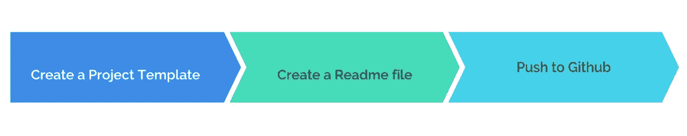
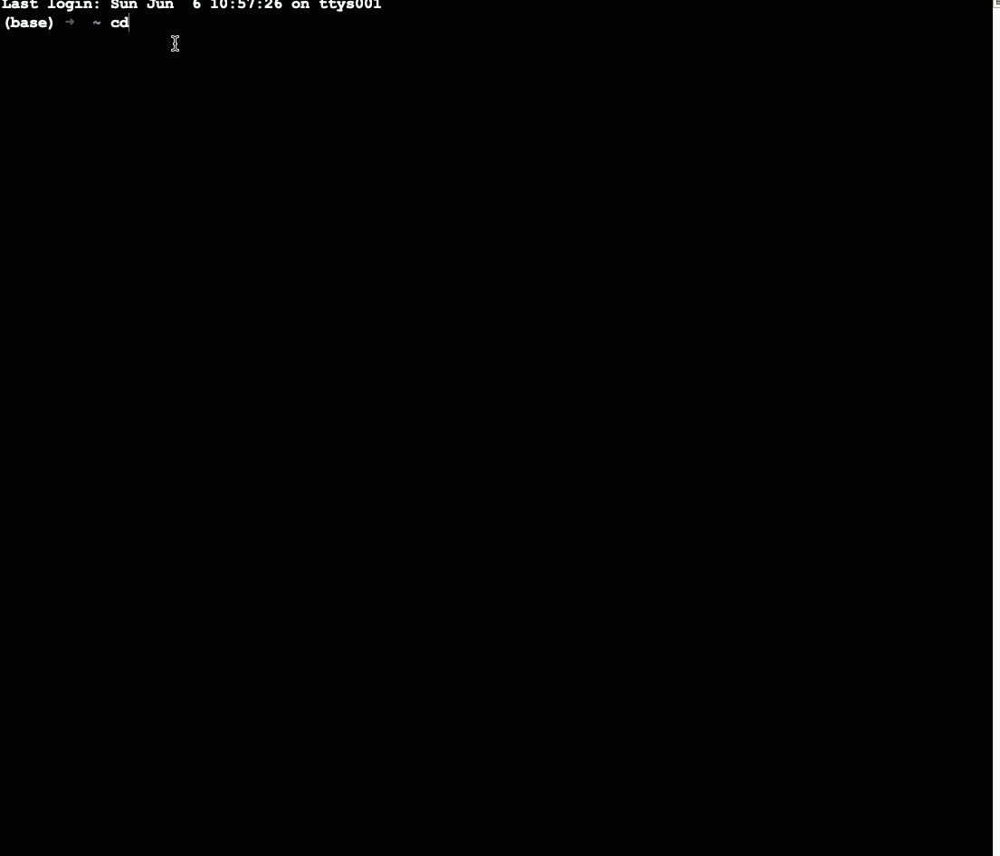
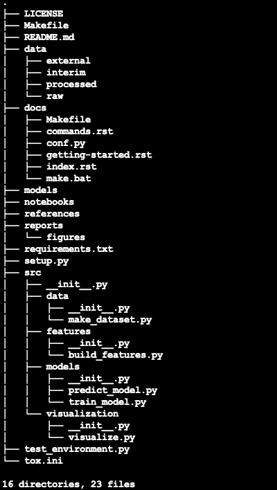
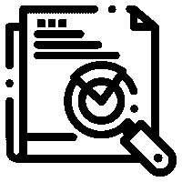
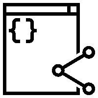
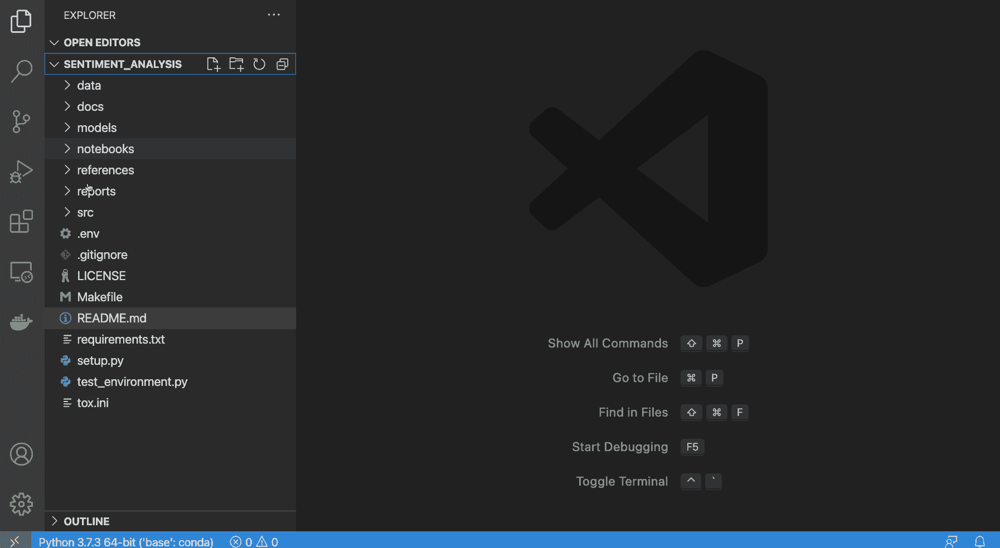

# 通过三个简单的步骤自动化您的数据科学项目结构

> 原文：<https://towardsdatascience.com/automate-your-data-science-project-structure-in-three-easy-steps-277c92328d24?source=collection_archive---------13----------------------->

## [实践教程](https://towardsdatascience.com/tagged/hands-on-tutorials)

## 快速高效地简化您的数据科学代码库和工具


免费矢量插图来自[比例尺](https://2.flexiple.com/scale/all-illustrations?search=code&gender-option-field=Female%7CMale%7CBoth)

> 好的代码是它自己最好的文档

[Rachael tat man](https://twitter.com/rctatman?ref_src=twsrc%5Egoogle%7Ctwcamp%5Eserp%7Ctwgr%5Eauthor)博士在她的[演讲](http://www.rctatman.com/files/Tatman_2018_ReproducibleML.pdf)中，以一种非常微妙的方式强调了代码可再现性的重要性:

> “你为什么要关心再现性呢？因为最有可能需要复制你作品的人……就是你。”

在很多层面上都是如此。你有没有发现自己处于一种很难破译你的代码库的情况？你是否经常以类似于`untitled1.py`或`untitled2.ipynb`的多个文件结束？好吧，如果不是所有人，我们中的一些人无疑在一些场合面临过糟糕的编码实践的冲击。这种情况在数据科学中更为常见。通常，我们限制了对分析和最终产品的关注，而忽略了负责分析的代码的质量。

为什么再现性是数据科学管道中的重要组成部分？我在[的另一篇博文](/getting-more-out-of-your-kaggle-notebooks-fb2530ece942?sk=99d718e3b75d8de58e4c1fb23cdc09c4)中提到了这个话题，我将从那里借用几行文字。一个可重复的例子允许其他人使用相同的数据重新创建您的分析。这很有意义，因为你把你的作品公之于众，让他们使用。如果别人不能复制你的作品，这个目的就失败了。在本文中，让我们看看三个有用的工具，它们可以简化并帮助您创建结构化的、可重复的项目。

# 创建良好的项目结构

假设您想要创建一个包含代码的项目来分析电影评论的观点。创建良好的项目结构有三个基本步骤:



作者创建项目模板|图像的管道

## 1.使用 [Cookiecutter 数据科学](https://github.com/drivendata/cookiecutter-data-science)自动创建项目模板


@NounProject 的图标| CC: Creative Commons

在组织机器学习项目的最佳实践方面，社区中没有明确的共识。这就是为什么他们有太多的选择，而这种不明确会导致混乱。幸运的是，有一个变通办法，这要感谢 DrivenData 的人们。他们创建了一个名为 **Cookiecutter 数据科学**的工具，这是一个[标准化但灵活的项目结构，用于进行和共享数据科学工作](https://github.com/drivendata/cookiecutter-data-science)。几行代码就建立了一系列子目录，使得启动、构建和共享分析变得更加容易。你可以在他们的[项目主页](http://drivendata.github.io/cookiecutter-data-science/)上阅读关于该工具的更多信息。让我们进入有趣的部分，看看它是如何工作的。

## 装置

```
pip install cookiecutterorconda config --add channels conda-forge
conda install cookiecutter
```

## 开始一个新项目

在您的终端上运行以下命令。它会自动用所需的文件填充一个目录。

```
cookiecutter [https://github.com/drivendata/cookiecutter-data-science](https://github.com/drivendata/cookiecutter-data-science)
```



使用 Cookiecutter 数据科学|作者图片

在指定的路径上创建一个情感分析项目目录，在上面的例子中是桌面。



新创建项目的目录结构|作者图片

> **注意** : Cookiecutter data science 将很快迁移到版本 2，因此该命令在未来的使用方式上会有细微的变化。这意味着你必须在上面的命令中使用`*ccds ...*`而不是`*cookiecutter ...*` 。根据 Github 库，这个版本的模板仍然可用，但是你必须显式地使用`*-c v1*`来选择它。当变更发生时，请留意[文档](https://github.com/drivendata/cookiecutter-data-science#new-version-of-cookiecutter-data-science)。

# 用 [readme.so](https://readme.so/) 创建一个好的 Readme



@NounProject 的图标| CC: Creative Commons

接下来创建项目的框架后，您需要填充它。但在此之前，有一个重要的文件需要更新——README[。自述文件是一个减价文件，传达有关项目的基本信息。它告诉其他人项目是关于什么的，项目的许可，其他人如何为项目做贡献，等等。我见过许多人在他们的项目上投入了巨大的努力，但却没能创造出像样的读物。如果你是其中之一，有一些好消息以一个项目的形式出现，这个项目叫做](https://docs.github.com/en/github/creating-cloning-and-archiving-repositories/creating-a-repository-on-github/about-readmes) [**readme.so**](https://readme.so/) **。**

一个善良的人刚刚结束了手动写阅读材料的时代。Katherine Peterson 最近创建了一个简单的编辑器，允许您快速创建和定制项目的自述文件。

Github 甚至转发了凯瑟琳的推文。

编辑器非常直观。您只需单击一个部分来编辑内容，该部分就会添加到您的自述文件中。从大量的收藏品中选择你喜欢的。您也可以根据您希望它们在页面上的位置来移动这些部分。一旦一切就绪，继续复制内容或下载文件并将其添加到现有项目中。


使用 readme.so |图像按作者生成自动阅读材料

# 将您的代码推送到 Github



@NounProject 的图标| CC: Creative Commons

我们差不多完成了。剩下唯一的事情就是把代码推送到 Github(或者你选择的任何版本控制平台)。您可以通过 Git 轻松做到这一点。这里有一个方便的备忘单，包含了最重要和最常用的 Git 命令，便于参考。

资料来源:https://education.github.com/git-cheat-sheet-education.pdf

或者，如果你用的是 [Visual Studio 代码](https://code.visualstudio.com/) (VS 代码)，像我一样，就已经搞定了。VS 代码使得直接向 GitHub 发布任何项目成为可能，而不必先创建一个存储库。VS 代码将为您创建存储库，并控制它是公共的还是私有的。您唯一需要做的就是通过 VS 代码向 GitHub 提供认证。



通过 Visual Studio 代码将代码推送到 Github 作者图片

这就是建立一个健壮的结构化的项目库所需要的一切。如果您想同步查看所有步骤，下面的视频总结了上述所有步骤。

展示文章中使用的工具的端到端视频

# 结论

创建结构化的和可重复的项目在开始时可能看起来很困难，但从长远来看却有好处。在本文中，我们看了三个有用的工具，它们可以帮助我们完成这项任务。虽然 **cookiecutter data science** 给出了一个干净的项目模板， **readme.so** 会自动填充一个 readme 文件。最后，VS 代码可以帮助我们将项目推到 web 上进行源代码控制和协作。这为一个好的数据科学项目创造了必要的基础。现在，您可以开始处理您的数据，并从中获得见解，与各种利益相关者共享。

*👉有兴趣看我写的其他文章。这个* [*repo*](https://github.com/parulnith/Data-Science-Articles/blob/main/README.md) *包含了我分类写的所有文章。*