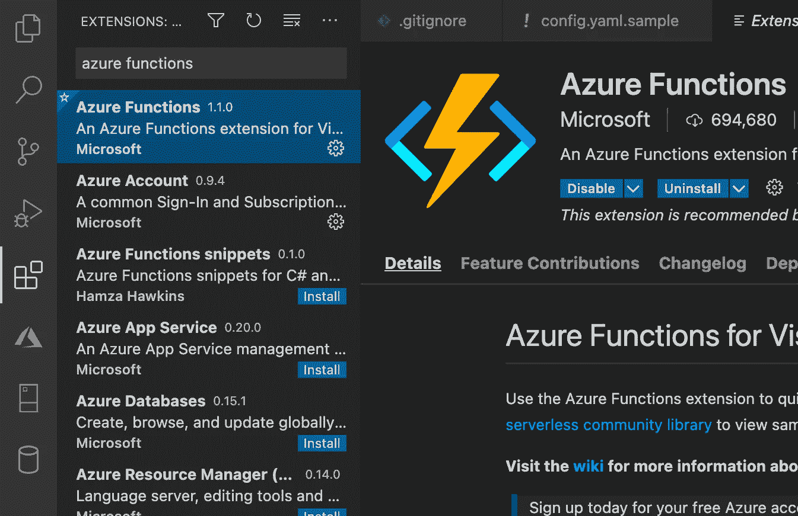
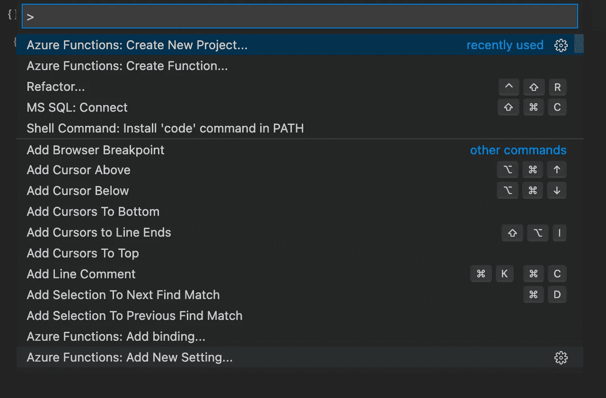
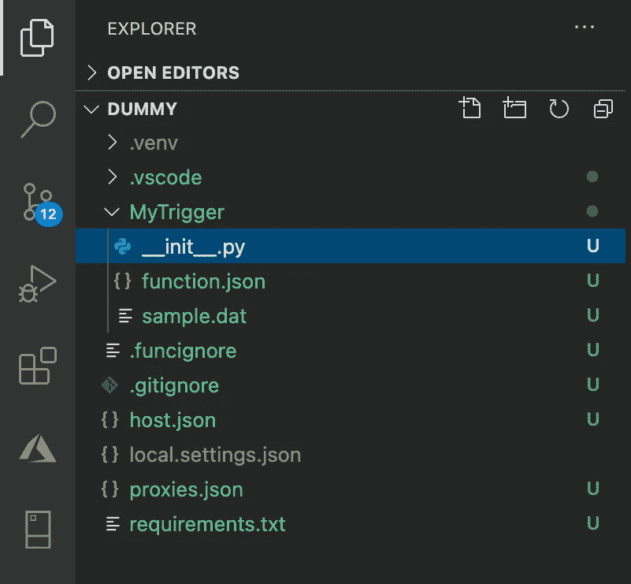
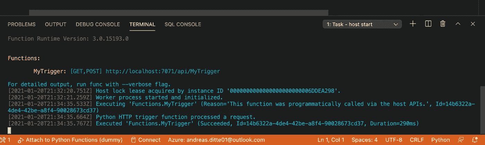
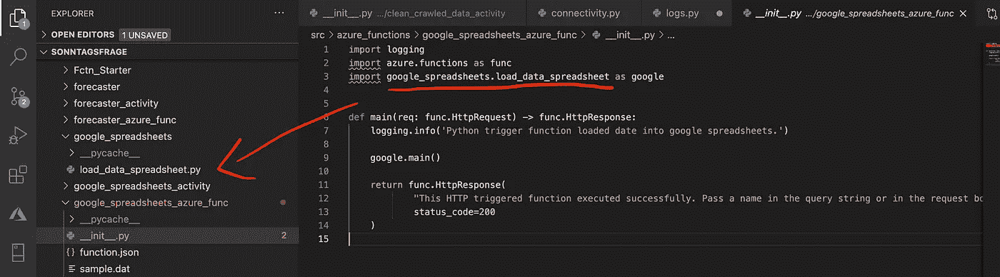
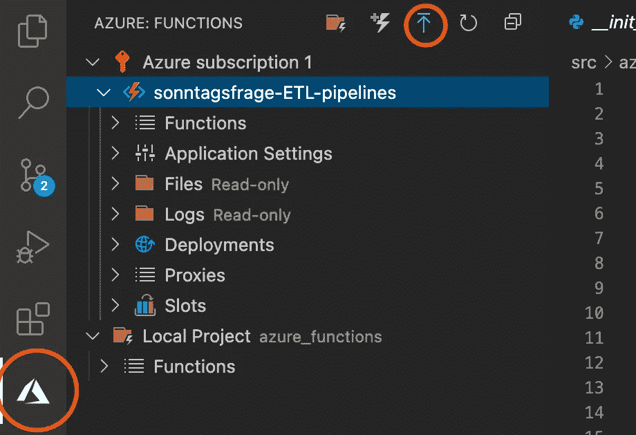
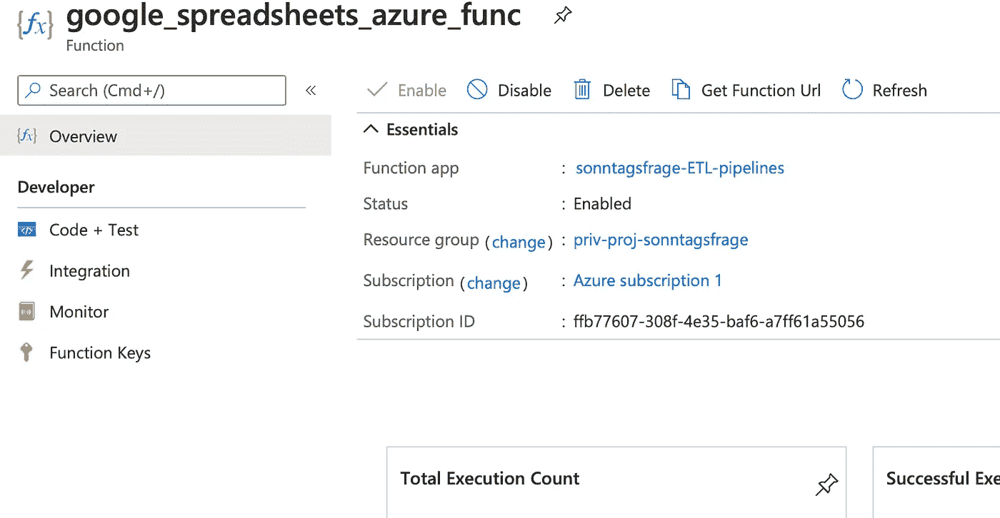

# 在云中自动化您的数据科学项目—第 1 部分，共 2 部分

> 原文：<https://towardsdatascience.com/automate-your-data-science-projects-in-the-cloud-884120a97718?source=collection_archive---------40----------------------->

## 使用 Azure 功能在云中实现无服务器代码自动化

有一个工作笔记本，里面有一个有趣的案例，理想情况下有一些有意义的结果，这对一个人来说是非常好的。但是，当涉及到向他人展示你的作品时，无论是同事、未来可能的雇主还是仅仅是互联网，一个全自动运行的展示台比通过邮件给某人发送笔记本要“性感”得多。

除了额外的外在好处(更容易的反馈、与结果的交互性、留下印象)之外，在将您的概念证明级别的项目提升为完全可操作的产品时，还会有惊人的内在满足感。

本文包含这个自动化系列的第 1 部分，并阐述了 Azure 函数的概念。


云有时也是美丽的东西，图片来自 [pexels](http://www.pexels.com)

# Azure 函数

Azure Functions 是来自微软 Azure 的[低成本服务](https://azure.microsoft.com/en-us/pricing/details/functions/)，它可以用来在云中无服务器地执行你的代码——每次执行不到一美分。您可以将这些函数视为一个框架，让您的代码在云中运行。可以通过在浏览器中输入 HTTP 地址或计时器来触发执行。更多关于 Azure 功能的详细信息可以在[这里](https://azure.microsoft.com/en-us/blog/introducing-azure-functions/)找到。

为了使这个概念更加具体，请查看下面的用例。你拥有一个网站，有人在那里注册。这会向您的 Azure 函数发送一个 HTTP 请求，其中包含人员别名、电子邮件和其他有趣的参数。您的函数从这个请求开始，用这些参数做一些有趣的分类，查询一些信息，生成一封个性化的欢迎邮件并发送给这个人。所有这些都发生在你的网站之外。

低价格是有代价的:在最便宜的级别[运行时间被限制在最长 10 分钟，默认设置为大约 5 分钟。为了获得更高的 60 分钟最大运行时间，必须额外付费购买高级计划。在设计管道时，请记住这一点。](https://docs.microsoft.com/en-us/azure/azure-functions/functions-host-json#functiontimeout)

这当然使得 Azure 函数很难适合处理大数据或企业级案例，但 Azure 为这些提供了自己的工具套件:Databricks、Synapse、Azure Data Factory 等等。

持久函数的概念是对函数框架的扩展。单个函数可以被自动发布和执行，但是为了创建一个管道，其中一个函数开始一个函数，然后开始第三个函数，发明了持久函数来编排这个过程。

# 设置您的环境

由于我们将使用 Azure Cloud，我强烈推荐使用微软的 Visual Studio 代码。有了原生 Azure 集成和许多模板，这个编辑器是这项任务的最佳选择。当然，您可以使用您选择的编辑器将您的模型开发成一个整洁的 python 包，然后只使用 VS 代码进行云编排。你可以在这里免费得到编辑器。



VS 代码扩展经理，*作者图片*

安装后，你有一个有点裸露的编辑器，左边有一个块状图标，让你安装扩展。用它来安装 **Azure 功能，**这个助手将大大减少我们要做的手工工作量。在编辑器的这个部分，你可以找到各种有用的扩展。去狂野和个性化吧——毕竟，是你要和它一起工作。此外，确保从[这里](https://docs.microsoft.com/en-us/azure/azure-functions/functions-run-local?tabs=windows%2Ccsharp%2Cbash)安装 Azure 核心工具。

# Azure 函数入门

## 创建新项目

使用命令面板⇧⌘P (Windows: Ctrl+Alt+P)在你喜欢的地方创建一个项目:输入“azure functions:create new project”并点击 enter。这是编辑器所有功能的主要枢纽。从设置、代码模板到 GitHub 版本控制，一切都可以在这里完成。



你可以从命令面板执行几乎每一个动作

选择一个路径(稍后会详细介绍)，选择 python 作为一种语言，选择一个 Python 解释器，选择 HTTP Trigger 作为模板，给你的函数起一个名字(我把它命名为 MyTrigger)并选择 anonymous。您为新项目选择的文件夹必须是包含所有应该在云中运行的代码的路径。我找不到从高于 Azure Function Projects 基本路径的文件夹级别导入代码的方法。

## 文件结构

从这些模板创建项目和函数也创建了大量新文件。乍一看，这似乎让人不知所措，但是下面的列表包含了对重要文件的解释以及您可以用它们做什么。



创建项目和 Azure 函数后的文件结构，*作者图片*

*   host.json
    这个文件包含了一些关于项目的元信息，尤其是扩展包的版本号。这意味着我们用于数据科学项目自动化的 Azure 核心工具的版本。您可以将 Azure 函数与默认版本[1]一起使用。*，2.0.0)，但是因为我们想在以后使用持久函数来实现自动化，所以将版本设置为[2。*，3.0.0)并重新启动编辑器。
*   requirements.txt
    这听起来应该很熟悉。无论您使用 Conda、pip 还是任何其他适合您的解决方案，在某种程度上，您都创建了一个包含所有使用过的包的 Python 环境。Azure 函数不使用这些环境。相反，在部署到云的过程中，环境是根据给定的 requirements.txt 创建的。
    幸运的是，有一些方法可以自动生成这个文件，
    `pip freeze > requirements.txt`
    就是这样一个解决方案。随着代码的增长，记得在这个文件中添加新的包。
    还要确保`azure-functions`和`azure-functions-durable>=1.0.0b12`已列出。
*   。这个文件夹包含调试 Azure 函数时使用的 Python 环境。
*   MyTrigger/function.json
    这个文件包含了关于你的函数的元信息，它是什么类型，它是如何被触发的等等。它还可以用来设置可以从代码中读取的全局参数。
*   My_Trigger/__init__。py
    这个文件现在包含了主函数中的实际代码。这是你可以剪切掉中间部分，导入你的包并在主区域执行它的地方。但稍后会详细介绍。预先配置的功能。HttpResponse 由 main 函数返回，这是您的函数完成后将显示的消息。

## 排除故障

设置完成后，我们现在可以开始执行新创建的函数 MyTrigger。首先，打开命令面板(⇧⌘P)，输入“查看:切换集成终端命令”。在编辑器的底部，应该会打开一个外壳。执行以下语句来更新中的 python 环境。venv 文件夹:

```
source .venv/bin/activate (Windows: .venv\scripts\activate)
python -m pip install -r requirements.txt
```

现在按 F5 键或打开 Run 并选择 Start Debugging 来启动主机。请注意，一旦设置好主机并且准备好执行您的函数，编辑器底部的蓝色条就会变成橙色。



这是你的函数准备好启动时的样子，*作者图片*

你的函数是用黄色和绿色写的，一个触发它的链接。按住 Command 键并单击链接，会打开一个浏览器窗口，执行您的功能。注意，在成功执行代码后，返回的 func。HttpResponse(来自 __init__。py 文件)。在编辑器的底部，错误消息或日志以蓝色显示。

有时你必须忽略编辑器突出显示的一些错误，因为它并不总是完全理解 Azure 函数的架构，并且可能对导入的处理方式很不满意。

另一方面，注意:我强烈推荐使用“logging.info”进行日志记录，就像模板中一样。这些消息在调试过程的执行过程中显示，并且一旦部署了该过程，也可以在云中轻松地免费阅读。如果您的代码中有一些自定义日志记录，将它切换到这种日志记录风格或者添加一个参数并使它自己相应地切换是一个好主意。

# 在代码中使用 azure 函数

在一些前期工作之后，我们来到了有趣的部分:添加你的定制代码，你的酷模型，你的价值生成脚本。



现有代码的示例导入，*作者的图片*

确保您的自定义代码在上面创建的项目文件夹中，并测试它以确保它可以顺利运行。现在剩下的就是导入代码并调用函数了。如果您已经将所有代码合并到一个 main 函数中，事情就变得简单了，因为现在您只需在 __init__ 中调用它。py 和你玩完了。

就这么简单。

使用 F5 键调试您的代码，并使其在 Azure Functions 框架内运行。如果你想要一个例子作为参考，你可以从我的 repo 中[这个文件](https://github.com/AndreasDit/Sonntagsfrage/tree/master/src/azure_functions/google_spreadsheets_azure_func)，在那里我自动将数据从 Azure SQL DB 加载到 tableau 仪表板的 google sheets 文档。如果你想了解更多细节，你可以访问我关于这个话题的文章[这里](https://andreas-ditte.medium.com/google-spreadsheets-5643952fe2be)，在我的主页[这里](https://ai-for-everyone.org/?page_id=32)查看结果。

# 部署和无服务器执行

既然你的 Azure 功能已经完全开发好了，剩下的最后一步就是让奇迹发生:部署。

为了部署到 Azure，您必须已经创建了一个 Azure 帐户(显然)。点击左侧的 Azure 图标并连接到您的帐户。一旦建立了连接，你必须点击向上的蓝色小箭头。这将启动 Azure 功能的部署过程。



VS Studio 代码中的 Azure 窗口，圈起来的是部署按钮，*作者图片*

首先，它要求你创建一个新的“功能应用”或部署到一个已经存在的应用。据我所知，创建和拥有这样的 anApp 是完全免费的，所以继续创建一个新的吧。它基本上是你各种功能的管理工具:你可以查看日志，检查性能，并在一些语言中直接在你的 Azure 门户中从功能应用程序中编辑功能 coce(Python 不是这些语言中的一种)。

部署完成后，打开 [azure 门户](http://portal.azure.com)并检查你的功能应用。通过点击功能菜单，你可以访问所有已部署的功能，当你点击一个功能时，还可以看到一些不错的元信息。



对示例性 Azure 功能的概述，*作者的图片*

在功能概述中，实际的 URL 可以在“获取功能 URL”按钮下获取。复制 URL 并将其粘贴到您的浏览器中—您的功能将被执行。延迟一段时间后，您可以进入 Monitor 选项卡并检查执行情况:您可以查看函数执行的时间，它是否成功执行，并检查每次执行的日志(只需单击蓝色时间戳)。有关日志的更详细分析，请单击“在应用洞察中运行查询”按钮。但是我不会在我的文章中对此进行更详细的描述。

现在，您可以随时随地在云中执行您的代码。哦，我提到过你可以在 URL 中添加参数并在你的代码中读出它们吗？来自任何进程的完全参数化的函数调用。粘贴 URL，从您最喜欢的管道中呼叫。看看这提供的所有可能性。

发挥创意，尽情奔跑！

# 摘要

放弃控制并开始依赖一些模糊的框架让人感到不安。开发人员尤其习惯于对他们的代码拥有最终的控制权，可能会感到不止一盎司的怀疑。但是在前置设置之后，Azure 函数变得非常容易操作，并开启了一系列全新的可能性。

随着经验的积累，你将开始理解这个 Azure Functions 框架的内部运作，从而使它不再模糊不清，而是成为你不断发展的数据科学工具箱中一个新的强大的前沿工具。

将您的数据科学工作从笔记本电脑中的概念验证提升到完全可用的微型产品。超越你的竞争对手。带着对云的一点信任。

有时候真的就是这么简单。

# 下一篇文章:构建管道

请继续关注我的自动化系列的第 2 部分，在那里我将解释我们如何使用持久函数将 Azure 函数链接在一起，并从一个简单的触发器协调整个执行管道。

# **无耻的自我推销**

在此之前，请阅读我的其他文章，访问我的[投资组合网站](http://ai-for-everyone.org)，并在 Twitter 上关注我，关注@88Andreasd。