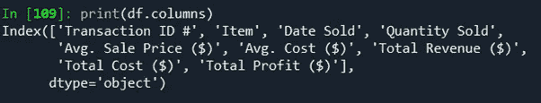
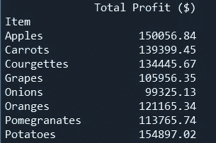
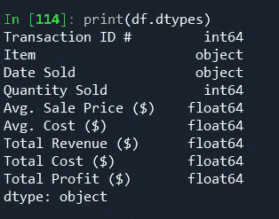
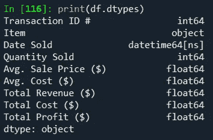
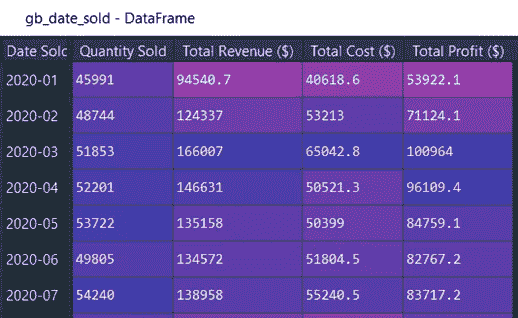
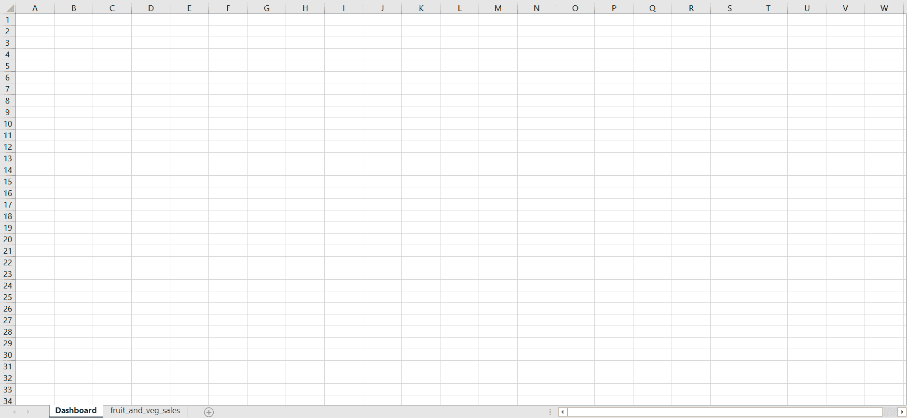

# 通过使用 Python 创建摘要表来自动化您的 Excel 报表

> 原文：<https://towardsdatascience.com/automate-your-excel-report-by-creating-a-summary-sheet-using-python-6fdb26480c3b?source=collection_archive---------2----------------------->

## Python + Excel

## 如何协调 Python 和 Excel，用一种像样的、专业的格式来总结你的数据？改进 Excel 报表的一种方法。


卢卡·布拉沃在 [Unsplash](https://unsplash.com?utm_source=medium&utm_medium=referral) 上的照片

# **简介**

创建一个独特的和可展示的摘要页面是任何基于 Excel 的报告工作的最后一步。没有这些，你只能得到一张张的数字和公式，很难从你的基础数据中得出结论。通过创建摘要表，工作簿的查看者将能够立即以美观的格式理解数据。

在这个 Python + Excel 系列的前面，您学习了如何使用 Python 格式化 Excel 电子表格。这次我们将看看如何使用格式化代码在 Excel 中制作一个汇总表/仪表板。

在我的上一篇文章中，我写了一些推理，解释了为什么你想将 Excel 与 python 一起使用，python 与 pandas 和 xlwings 如何能极大地改善你的 Excel 繁重的工作流程，并包括一个简短的教程，其中有一些例子，让你开始对你的 Excel 电子表格进行样式化。

您可以在下面的链接中找到所有这些信息；这可能是一个很好的起点，因为本文不会详细讨论相同的主题。

</stylize-and-automate-your-excel-files-with-python-cab49b57b25a>  

我这篇文章的目标是帮助你在使用我上一篇文章中学到的 Excel/python 格式化技巧的同时总结你的数据。我们将对数据进行旋转、分组和排序。然后制作图表、设计风格并向摘要页面添加徽标。这些技能相结合将使您能够在一个简单的 python 脚本中对数据进行汇总和格式化。希望这篇文章和上一篇一样有用！

# **汇总数据**

如果您的工作流程是 Excel 繁重的，我敢肯定您有跨越多个选项卡的工作簿、许多数据透视表和更多交叉引用每张工作表的公式。这很好…如果你的目标是迷惑所有试图理解你的电子表格的人。

使用 Python 汇总数据的一个好处是能够将数据透视表和其他数据存储为单个变量中的数据帧。以这种方式引用更容易调试，而不是试图通过电子表格中的多个选项卡来跟踪数字。

**pandas** —本模块对于成功总结您的数据至关重要。

根据熊猫网站:

pandas 是一个快速、强大、灵活且易于使用的开源数据分析和处理工具

简而言之，pandas 包含的功能可以完成你通常在 Excel 中所做的所有数据分析。以下是一些您会对基于 Excel 的背景感兴趣的函数，如果您想了解更多信息，每个函数的文档都有超链接:

*   [value_counts()](https://pandas.pydata.org/pandas-docs/stable/reference/api/pandas.DataFrame.value_counts.html?highlight=value_counts#pandas.DataFrame.value_counts)
*   [drop_duplicates()](https://pandas.pydata.org/pandas-docs/stable/reference/api/pandas.DataFrame.drop_duplicates.html)
*   [groupby()](https://pandas.pydata.org/pandas-docs/stable/reference/api/pandas.DataFrame.groupby.html#pandas.DataFrame.groupby)
*   [形容()](https://pandas.pydata.org/docs/reference/api/pandas.DataFrame.describe.html)
*   [**【pivot _ table()**](https://pandas.pydata.org/pandas-docs/stable/reference/api/pandas.DataFrame.pivot_table.html)**(每个 Excel 用户的最爱)**
*   **[剧情()](https://pandas.pydata.org/pandas-docs/stable/reference/api/pandas.DataFrame.plot.html)**
*   **[数据类型](https://pandas.pydata.org/pandas-docs/stable/reference/api/pandas.DataFrame.dtypes.html)**
*   **[loc](https://pandas.pydata.org/pandas-docs/stable/reference/api/pandas.DataFrame.loc.html)**
*   **国际劳工组织理事会**

**这些是 pandas 众多功能中的几个例子，可以用来操作或快速总结你的数据。**

# ****创建汇总表的步骤****

**如前所述，本教程中格式化电子表格的代码已经在我的上一篇文章“[用 Python](/stylize-and-automate-your-excel-files-with-python-cab49b57b25a) 格式化和自动化 Excel 文件”中详细解释过了。本教程将在前面的基础上增加一些新的功能来创建一个快速、美观和全面的汇总表。**

**我创建了一个 csv 格式的水果和蔬菜销售测试数据集，用于本教程和上一教程。**

**可以从 Github 下载数据:[链接](https://github.com/Nishan-Pradhan/xlwings_dashboard)**

1.  **第一步是导入我们将使用的模块。几乎所有的教程都将使用熊猫和 xlwings 来完成。**

```
import pandas as pd
import numpy as np
import xlwings as xw
import matplotlib.pyplot as plt
```

**2.使用 Pandas 将 csv 数据导入数据框架。有两种方法可以做到这一点，直接从 Github 读取或下载到您的本地驱动器并引用。两者在完整的剧本中都有提及。下面的片段将直接从 Github 中读取。**

```
df = pd.read_csv(r”[https://raw.githubusercontent.com/Nishan-Pradhan/xlwings_dashboard/master/fruit_and_veg_sales.csv](https://raw.githubusercontent.com/Nishan-Pradhan/xlwings_dashboard/master/fruit_and_veg_sales.csv)")
```

**3.下面的步骤初始化一个 Excel 工作簿，重命名 Sheet1 并将我们的 DataFrame 复制到 Excel。**

```
wb = xw.Book()
sht = wb.sheets["Sheet1"]
sht.name = "fruit_and_veg_sales"
sht.range("A1").options(index=False).value = df
```

**4.接下来，我们想创建一个名为“Dashboard”的新工作表，并引用该工作表。**

```
wb.sheets.add('Dashboard')
sht_dashboard = wb.sheets('Dashboard')
```

**我们现在有一个包含两张工作表的 Excel 工作簿。“水果蔬菜销售”有我们的数据，而“仪表板”是空白的。**

**5.我们现在将开始使用 pandas 来处理我们的数据，并生成我们的数据摘要，以包括在我们的空白表上。第一步是检查数据集中的列名。在 Python 中查看所有列名的快捷方式是运行下面一行:`print(df.columns)`**

****

**df.columns |作者图片**

**从这里我们可以看到，许多列名包含空格、括号、美元符号、大写字母和括号，很不方便。**

**为了防止我们犯小错误并节省大量调试时间，在用 pandas 引用这些列名时，复制并粘贴它们是明智的。(在较大规模的项目中，重命名列可能更好)**

**6.我们将为仪表板表创建的第一个摘要将是显示每件售出商品的总利润的数据的枢纽。为此，我们将利用 pandas 的`pd.pivot_table()`功能。**

```
pv_total_profit = pd.pivot_table(df, index='Item', values='Total Profit ($)', aggfunc='sum')
```

**这里我们创建了一个新的数据帧，名为`pv_total_profit`。这个数据帧有一个索引，包含我们的 Item 列中的每个值。显示的值来自我们数据中的“总利润($)”列，我们指定的函数的最终输入是`aggfunc='sum'`，这告诉 Pandas 我们希望通过对`values`列求和来汇总我们的数据，在本例中是“总利润($)”。**

****

**pv_total_profit 数据框架透视|作者图片**

**7.我们现在再次执行相同的步骤，只是这一次我们希望透视我们的数据，以显示每件售出商品的数量。**

```
pv_quantity_sold = pd.pivot_table(df,index='Item',values='Quantity Sold',aggfunc='sum')
```

**8.你可以制作一个简单枢纽的整个仪表板或报告，这将看起来很棒，然而，为了使本教程更有趣，我们将使用一个分组函数:`df.groupby()`将你的数据按你指定的方式分组。**

**由于我们的数据与过去一年的销售数字有关，因此查看按月而不是按天分组的**数据可能会有用。我们会做到这一点，但首先我们需要确保我们的“售出日期”栏确实被熊猫作为日期读取。****

**检查该运行`print(df.dtypes)`**

**您应该能够从这里看到，我们的“售出日期”列被作为一个对象读取，而不是日期时间格式。这意味着我们还不能很容易地按月对数据帧进行分组。**

**我们可以将该列的数据类型更改为 datetime，如下所示:**

```
df[“Date Sold”] = pd.to_datetime(df[“Date Sold”], format=’%d/%m/%Y’)
```

**这里，`pd.to_datetime()`格式化我们的列，我们指定原始数据的格式，以确保它被正确地从对象转换成日期时间。如果你再次运行`df.dtypes`，你会看到“销售日期”是`datetime64[ns]`的格式，这是我们分组工作所需要的。**

******

数据类型:转换前(左)、转换后(右)|按作者分类的图像** 

**9.现在我们的数据有了正确的格式，我们可以使用下面的代码行来合计和聚合我们的数据，并显示相关的列。**

```
gb_date_sold = df.groupby(df["Date Sold"].dt.to_period('m')).sum()[["Quantity Sold",'Total Revenue ($)',  'Total Cost ($)',"Total Profit ($)"]]
```

**我们按月分组的数据现在看起来像这样:**

****

**gb_date_sold |作者图片**

**10.最后一个 groupby 将为我们的仪表板提供第四个数据集。**

```
gb_top_revenue = (df.groupby(df["Date Sold"]).sum().sort_values('Total Revenue ($)',ascending=False).head(8))[["Quantity Sold",'Total Revenue ($)','Total Cost ($)',"Total Profit ($)"]]
```

**这个 groupby 向我们展示了总收入排名前 8 位的**。我们通过按“总收入”降序(最高收入在顶部)对数据框架进行排序来实现这一点，然后我们使用`head(8)`给出排序后数据的前 8 行。****

****11.现在我们已经有了 4 个数据摘要，我们可以继续创建报告了。首先，我们从一些静态格式开始。****

```
**# Background
sht_dashboard.range('A1:Z1000').color = (198,224,180)# A:B column width
sht_dashboard.range('A:B').column_width = 2.22# Title
sht_dashboard.range('B2').value = 'Sales Dashboard'
sht_dashboard.range('B2').api.Font.Name = 'Arial'
sht_dashboard.range('B2').api.Font.Size = 48
sht_dashboard.range('B2').api.Font.Bold = True
sht_dashboard.range('B2').api.Font.Color = 0x000000
sht_dashboard.range('B2').row_height = 61.2# Underline Title
sht_dashboard.range('B2:W2').api.Borders(9).Weight = 4
sht_dashboard.range('B2:W2').api.Borders(9).Color = 0x00B050# Subtitle
sht_dashboard.range('M2').value = 'Total Profit Per Item Chart'
sht_dashboard.range('M2').api.Font.Name = 'Arial'
sht_dashboard.range('M2').api.Font.Size = 20
sht_dashboard.range('M2').api.Font.Bold = True
sht_dashboard.range('M2').api.Font.Color = 0x000000# Line dividing Title and Subtitle
sht_dashboard.range('L2').api.Borders(7).Weight = 3
sht_dashboard.range('L2').api.Borders(7).Color = 0x00B050
sht_dashboard.range('L2').api.Borders(7).LineStyle = -4115**
```

****上面代码片段中的副标题应该解释代码的每一部分是做什么的。****

****12.我创建了以下函数来手动创建特定的表格格式。这是相当长的，所以我将打破它在这一步做什么。****

****上面的函数有 4 个输入，`header_cell, title, df_summary, color`。****

*   ****header_cell 是一个字符串，表示您要放置数据帧摘要的右上角单元格(例如“B5”)。****
*   ****标题是您希望为摘要命名的字符串(例如，“前 8 天的收入”)。****
*   ****df_summary 是您希望格式化并放在 Excel 仪表板页面上的 Pandas 数据框架。****
*   ****color 是引用函数中预定义颜色的字符串(例如“蓝色”)。****

****在函数中，我们首先定义一个颜色字典。****

```
**colors = {“purple”:[(112,48,160),(161,98,208)],
“blue”:[(0,112,192),(155,194,230)],
“green”:[(0,176,80),(169,208,142)],
“yellow”:[(255,192,0),(255,217,102)]}**
```

****这里我们命名了 4 种颜色，紫色、蓝色、绿色和黄色。对于每种颜色，在元组中有两种色调，一种较暗的色调和一种较亮的色调，两者都是 RGB 格式。任何颜色都可以添加到这里，如果你想扩大这个范围！****

****其余的格式化是动态引用我们在函数输入中指定的 header_cell，并自动为您格式化表格的其余部分。****

****13.接下来，我们调用该函数 4 次，为我们创建的每个数据帧摘要调用一次。****

```
**create_formatted_summary('B5','Total Profit per Item', pv_total_profit, 'green')create_formatted_summary('B17','Total Iteams Sold', pv_quantity_sold, 'purple')create_formatted_summary('F17','Sales by Month', gb_date_sold, 'blue')create_formatted_summary('F5','Top 5 Days by Revenue ', gb_top_revenue, 'yellow')**
```

****14.最后，我们使用 Matplotlib 和 pandas `.plot()`函数(调用 Matplotlib)制作一个图表****

```
**# Makes a chart using Matplotlib
fig, ax = plt.subplots(figsize=(6,3))
pv_total_profit.plot(color='g',kind='bar',ax=ax)# Add Chart to Dashboard Sheet
sht_dashboard.pictures.add(fig,name='ItemsChart',
    left=sht_dashboard.range("M5").left,
    top=sht_dashboard.range("M5").top,
    update = True)**
```

****上面的第一部分创建了一个条形图，带有绿色的条形颜色。****

****然后`sht_dashboard.pictures.add()` xlwings 函数允许我们在 Excel 仪表板上放置该图表的图像。我们用`left`和`top`参数指定我们想把它放在哪里。`name`也会在 Excel 中给我们的形象起一个名字。****

## ******奖金******

****为了让你的 Excel 仪表盘看起来更专业，我们甚至可以**添加一个 logo** 。下面的代码将从 Github 资源库下载一个 png 格式的小示例徽标，保存它，将其添加到我们的 Excel 仪表板，然后调整其大小。**确保你已经在** `FOLDER_PATH` **变量中指定了保存 png 图像的位置。**(Github 上的脚本顶部)****

```
**import requestsFOLDER_PATH = r"path_to_save_folder" # r"C:\Users\Name\Downloads"image_url = r”[https://github.com/Nishan-Pradhan/xlwings_dashboard/blob/master/pie_logo.png?raw=true](https://github.com/Nishan-Pradhan/xlwings_dashboard/blob/master/pie_logo.png?raw=true)”r = requests.get(image_url, stream = True)
image_path = rf"{FOLDER_PATH}\logo.png"# Saves image to image_path above
file = open(image_path, "wb")
file.write(r.content)
file.close()# Adds image to Excel Dashboard
logo = sht_dashboard.pictures.add(image=image_path,
    name='PC_3',
    left=sht_dashboard.range("J2").left,
    top=sht_dashboard.range("J2").top+5,
    update=True)# Resizes image
logo.width = 54
logo.height = 54**
```

****我们现在已经为数据集创建了仪表板摘要！不要忘记通过运行以下命令来保存它:****

```
**wb.save(rf”{FOLDER_PATH}\fruit_and_veg_dashboard.xlsx”)**
```

********

****作者使用 xlwings | GIF 格式的摘要表****

# ******结论******

****用不多的代码，我们创建了一个美观的仪表板，可以快速汇总我们的数据。用 Python 来做这件事的优点是易于阅读的语法、相对较少的代码行和使用第三方模块的组合，这可以节省我们总结数据的大量时间。****

****使用 Python 格式化 Excel 报表可以是手动创建 Excel 报表(或使用 VBA)和用替代报表软件完全替换 Excel 之间的中间步骤。能够以这种粒度级别与 Excel 进行交互使您能够加快工作流程、自动化报告并提高 Python 编码技能，同时为最终用户提供熟悉的输出。****

****这段代码应该足以让您入门；你可以随意定制。尝试改变颜色，边框，标题，背景色，标志，这里提到的几乎任何东西都可以改变，以符合你想要的风格。****

****任何创建函数以编程方式排列这些格式化摘要的人都会得到加分！****

****本教程中使用的代码可从 Github [*这里*](https://github.com/Nishan-Pradhan/xlwings_dashboard) 获得****

****如果你被卡住了，检查 xlwings 文档 [*这里*](https://www.xlwings.org/)****

****如果你还有任何问题，请在下面的评论区留言。****

*****注:本文仅代表个人观点和经验。*****

****</one-useful-way-to-track-the-end-of-lockdown-using-python-936809116a0a> ****