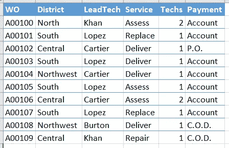
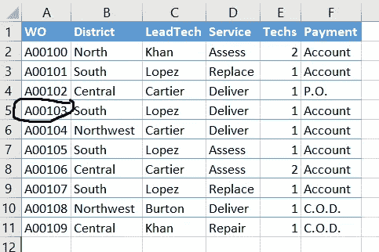
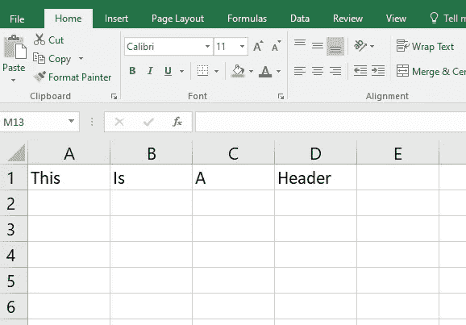
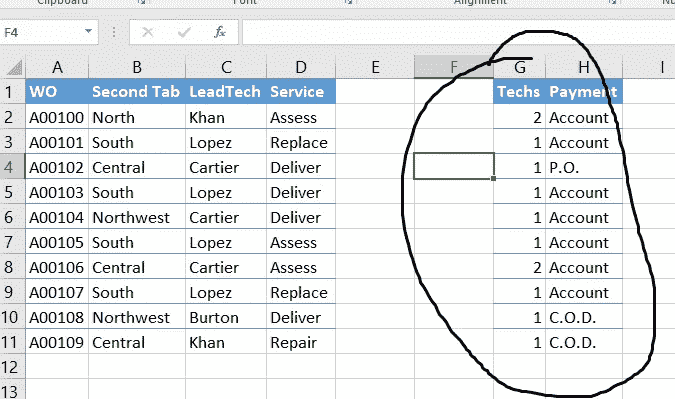

# 使用 Python 自动化您的 Excel

> 原文：<https://towardsdatascience.com/automate-your-excel-using-python-91a7217e7e44?source=collection_archive---------25----------------------->

## 从手动到自动化的方法


图片由 [**Alexas Fotos**](https://www.pexels.com/@alexasfotos?utm_content=attributionCopyText&utm_medium=referral&utm_source=pexels) 来自 [**Pexels**](https://www.pexels.com/photo/time-for-change-sign-with-led-light-2277784/?utm_content=attributionCopyText&utm_medium=referral&utm_source=pexels)

Python 是一种令人惊叹的编程语言。更容易学习和适应。python 中的错误消息是不言自明的。我们不需要花时间去寻找错误信息的解决方案。这就是我喜欢这种编程语言的原因。

我觉得这应该是最理想的编程语言。编程语言的目标应该是帮助我们构建令人兴奋的产品，而不是浪费时间解决错误。

最近，我学习了使用 python 自动化 excel 任务。我想与更多的观众分享这些惊人的技巧。这种自动化策略使用 python 编程。好的一面是 python 代码的每一行都是自我解释的，你不需要谷歌任何东西。

您可以使用自己选择的代码编辑器。在本文中，我将使用 Jupyter 笔记本进行演示。

# 安装所需的库

我们需要安装一个 python 库，`openpyxl`。在命令提示符下键入以下命令。

```
pip install openpyxl
```

# 加载现有工作簿

如果您有一个现有的 excel 工作簿，并且您想从特定的工作表中读取数据或修改任何工作表中的数据,`openpyxl`提供了一个名为`load_workbook()`的函数，可以如下使用。

```
from openpyxl import Workbook, load_workbookwb = load_workbook('my_demo_sheet.xlsx')
```



演示工作表

# 访问工作表

如果要访问活动工作表中的内容。那么 workbook 有一个名为`active`的属性，它可以帮助我们指向活动工作表。

```
ws = wb.active
print(ws)
```

但是，如果你想指向任何其他工作表，那么我们可以这样做。在这里，我从我的 excel 表中访问`sheet2`。

```
ws = wb["Sheet2"]
```

# 访问单元格值

一旦我们定义了工作表，我们就可以引用工作表中的任何单元格。

```
cell_to_access= ws['A5']
```

为了获得单元格的值，我们必须使用`value` 属性。

```
cell_value = ws['A5']
```



# 更改单元格的值

我们可以使用下面一行代码来更改 excel 表格中的任何值。

```
ws['B1'].value="Second Tab"
```


我们还需要保存更改，如下所示。

```
wb.save("my_demo_sheet.xlsx")
```

# 获取工作表名称

如果您想知道工作簿中可用工作表的名称，您可以使用下面的 python 代码行来获取列表形式的工作表名称。

```
print(wb.sheetnames)
```


# 访问其他工作表

使用`.active`属性，我们可以访问默认的活动工作表。如果您想访问另一个表，即摘要，我们可以如下操作。

```
ws = wb["summary"]
```

# 创建新工作表

要在同一个 excel 工作簿中创建一个新的工作表，我们可以使用如下所示的`create_sheet()`。当我们修改工作表时，我们需要保存工作簿以将更改应用到 excel 工作簿。

```
wb.create_sheet("Index_sheet")
wb.save("test1.xlsx")
```


# 创建新工作簿

创建新的 Excel 工作簿非常简单。我们需要调用函数`Workbook()`。由于这是一个新工作簿，我们需要将该工作表设置为默认工作表。我们还可以使用`title`属性更改工作表的名称。

```
wb = Workbook()
```

定义默认工作表。

```
ws = wb.active
ws.title = "Demo_data"
```

# 向工作表添加数据

一旦我们定义了工作表，我们就可以使用`append`函数添加数据。这将按行添加数据。

```
ws.append(["This","Is", "A", "Header"])
ws.save("New_WB.xlsx")
```



# 添加新行

我们可以使用`insert_rows()`来添加任意数量的行。该函数将 row_number 作为输入。

```
for i in range(2):
    ws.insert_rows(row_num)
```

# 删除行

我们可以使用`delete_rows()`功能删除任何一行。该函数将 column_number 作为输入。

```
for i in range(3):
   ws.delete_rows(col_num)
```

# 添加新列

如果你想插入任何列，那么`insert_cols()`功能可以使用循环添加任何列。该函数将 column_number 作为输入。

```
ws.insert_cols(column_number)
```

# 删除列

要删除任何列，可以使用以列号为输入的`delete_cols()`函数。

```
ws.delete_cols(column_number)
```

# 在 excel 表中移动数据

假设您有一个包含数据的 excel 表，并且您想要将行或列的任何部分移动到另一个位置。


移动前

我们可以使用`move_range()`来移动我们的数据。该函数有三个参数—选定的数据、要移动的行数(+N，-N)和要移动的列数(+N，-N)。

```
ws.move_range("B2:D9", rows=0, cols=2 )
```



# 结论

本文到此为止。我们已经介绍了自动化 excel 任务的不同场景。这些任务也可以在 excel 中手动完成。但是，如果有一些重复的场景，您可以根据您的要求在这个自动化策略上投入一些时间，以节省您的日常时间。

我希望你喜欢这篇文章。谢谢你的阅读！

以下是我的一些最佳选择:

[](https://levelup.gitconnected.com/six-ultimate-daily-hacks-for-every-programmer-60f5f10feae) [## 每个程序员的 15 个终极日常技巧

### 打印“hello world”不需要导入 TensorFlow

levelup.gitconnected.com](https://levelup.gitconnected.com/six-ultimate-daily-hacks-for-every-programmer-60f5f10feae) [](https://betterprogramming.pub/how-a-single-mistake-wasted-3-years-of-my-data-science-journey-b7ca1e962085) [## 一个错误如何浪费了我 3 年的数据科学之旅

### 自定进度的课程只是安眠药；行业专家是正确的选择

better 编程. pub](https://betterprogramming.pub/how-a-single-mistake-wasted-3-years-of-my-data-science-journey-b7ca1e962085) 

> *走之前……*

如果你喜欢这篇文章，并且想继续关注更多关于 **Python &数据科学**的**精彩文章**——请点击这里[https://pranjalai.medium.com/membership](https://pranjalai.medium.com/membership)考虑成为一名中级会员。

请考虑使用[我的推荐链接](https://pranjalai.medium.com/membership)注册。通过这种方式，会员费的一部分归我，这激励我写更多关于 Python 和数据科学的令人兴奋的东西。

还有，可以随时订阅我的免费简讯: [**普朗加尔的简讯**](https://pranjalai.medium.com/subscribe) 。