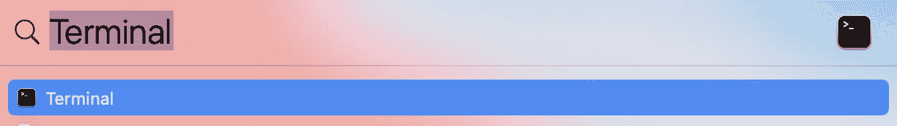
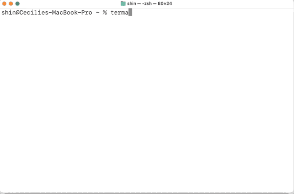
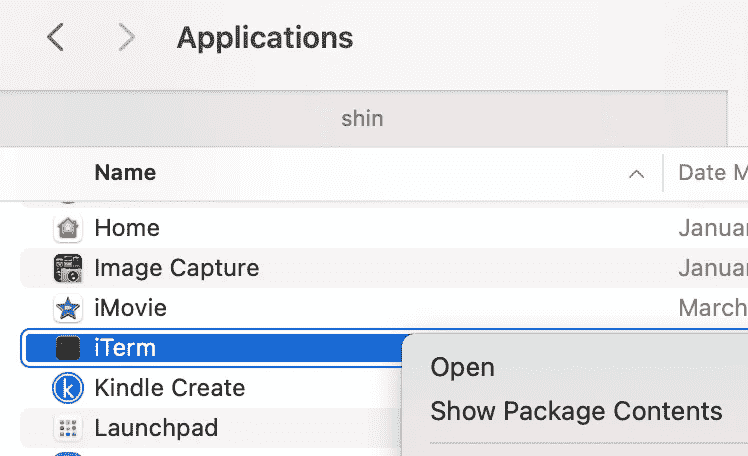
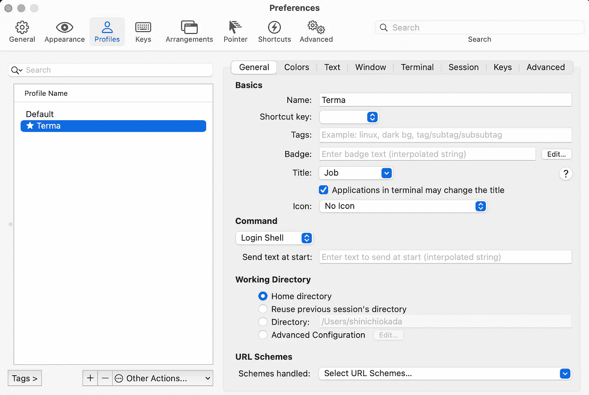
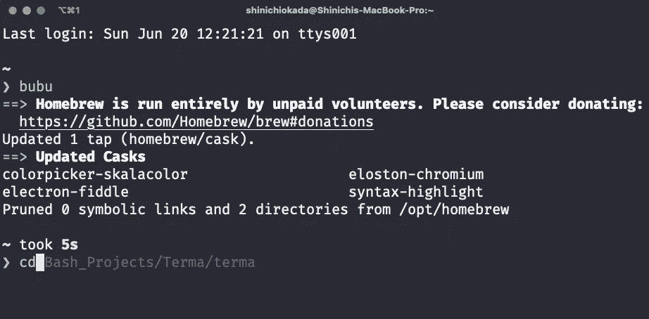
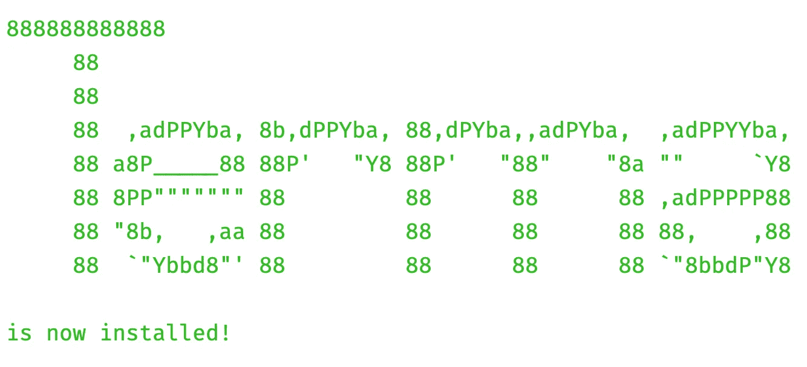

# 自动化您的终端改造

> 原文：<https://towardsdatascience.com/automate-your-terminal-makeover-f3c152958d85?source=collection_archive---------25----------------------->

## 安装终端是你用新电脑做的第一件事吗？如果是，那么这是给你的。


在 [Unsplash](https://unsplash.com/s/photos/universe?utm_source=unsplash&utm_medium=referral&utm_content=creditCopyText) 上由 [Haseeb Jamil](https://unsplash.com/@haseebjkhan?utm_source=unsplash&utm_medium=referral&utm_content=creditCopyText) 拍照。作者 Gif。

**【更新:2021–12–18，font-fira-code-nerd-font 新增。]**

《走向数据科学》在 2020 年 4 月发表了我的文章[终端改造的终极指南](/the-ultimate-guide-to-your-terminal-makeover-e11f9b87ac99)。这是我最受欢迎的文章之一。自发布以来，它已经有超过 12 万的浏览量，每天大约 300 次。

[](/the-ultimate-guide-to-your-terminal-makeover-e11f9b87ac99) [## 2021 年终端改造终极指南

### 今天你将度过的最好的 11 分钟:程序员的终端提示

towardsdatascience.com](/the-ultimate-guide-to-your-terminal-makeover-e11f9b87ac99) 

这个月我不得不在我的新笔记本电脑上安装终端。按照我自己文章中的步骤，我想“嗯，我可以自动化所有这些安装。”

随后，我创建了[**Ter**minal**M**ake over**A**automated(Terma)](https://github.com/shinokada/ati)。它会自动在新 Mac 上安装以下软件包:

*   [自制](https://brew.sh/)
*   [iTerm2](https://iterm2.com/downloads.html)
*   [ZSH](https://www.zsh.org/)
*   [哦-我的-Zsh](https://ohmyz.sh/)
*   [星际飞船](https://starship.rs/)
*   时髦的主题
*   [书呆子字体](https://github.com/ryanoasis/nerd-fonts)
*   iTerm2 首选项列表
*   插件:[自动跳转](https://github.com/ohmyzsh/ohmyzsh/tree/master/plugins/autojump)， [brew](https://github.com/ohmyzsh/ohmyzsh/tree/master/plugins/brew) ， [git](https://github.com/ohmyzsh/ohmyzsh/tree/master/plugins/git) ，[zsh-语法-高亮](https://github.com/zsh-users/zsh-syntax-highlighting/blob/master/INSTALL.md)，以及[zsh-自动建议](https://github.com/zsh-users/zsh-autosuggestions)。

# 警告

我为一台新的 Mac 电脑创造了 Terma。如果你已经安装了 iTerm2 和插件，我建议保存`~/.oh-my-zsh`目录、`~/.zshrc`文件和`~/Library/Preferences/com.googlecode.iterm2.plist`。

我建议首先使用 [Automate Brew Installer](https://betterprogramming.pub/how-to-automate-homebrew-installs-on-your-new-mac-or-linux-51e06881c5b7) 来保存您的 Brew 列表，然后在 Terma 安装完成后重新安装。

[](https://betterprogramming.pub/how-to-automate-homebrew-installs-on-your-new-mac-or-linux-51e06881c5b7) [## 如何在新的 Mac 或 Linux 上自动安装自制软件

### 你不需要一个接一个地安装自制软件包

better 编程. pub](https://betterprogramming.pub/how-to-automate-homebrew-installs-on-your-new-mac-or-linux-51e06881c5b7) 

我推荐使用 [Dotties](/dotfiles-could-be-the-most-important-files-on-your-computer-are-you-backing-them-up-99f8f8d99e68) 来保存你的`.zshrc`和其他点文件。

[](/dotfiles-could-be-the-most-important-files-on-your-computer-are-you-backing-them-up-99f8f8d99e68) [## 点文件可能是你电脑上最重要的文件。你支持他们吗？

### Dotties 是一个 Bash 脚本，它使用 Gist 管理你的点文件

towardsdatascience.com](/dotfiles-could-be-the-most-important-files-on-your-computer-are-you-backing-them-up-99f8f8d99e68) 

然后安装 Terma 并运行几次`terma uninstall`，从终端而不是 iTerm 卸载上面的包。然后运行`terma`两次。

# 安装 Terma



在查找器上查找终端。作者截图。

打开一个终端，安装[牛逼包管理器](https://medium.com/mkdir-awesome/a-new-simple-package-manager-for-script-languages-a1228fd0972a)。

[](https://medium.com/mkdir-awesome/a-new-simple-package-manager-for-script-languages-a1228fd0972a) [## 一个新的简单的脚本语言包管理器

### 管理安装和卸载的简单工具

medium.com](https://medium.com/mkdir-awesome/a-new-simple-package-manager-for-script-languages-a1228fd0972a) 

安装令人敬畏的软件包管理器很容易。在您的终端上运行以下命令:

```
curl -s https://raw.githubusercontent.com/shinokada/awesome/main/install | bash -s install
```

一旦你安装了 Awesome 软件包管理器，安装 Terma。

```
awesome install shinokada/terma
```

# 入门:运行 terma 两次！

要在终端上运行 terma，请执行以下操作:

```
terma
```

安装家酿软件时，你会被要求输入密码。

Oh-My-Zsh 安装退出脚本，所以需要再次运行`terma`**。**

```
terma
```

****

**安装 Terma。图片作者。**

# **iTerm2 准备好摇滚了！**

**当您打开新安装的 iTerm 时，按 Ctrl+右键并选择 open。**

****

**iTerm 首选项配置文件设置为名称“Terma”，颜色预设为时髦，字体为 Fira 代码。**

****

**可以使用 brew 别名，比如`bubu`，自动建议，自动跳转，以上所有插件。**

****

**运行中的插件。图片作者。**

# **打印帮助**

```
terma -h
```

# **卸载 Terma**

**您可以删除所有已安装的项目，包括 Homebrew。我建议先用[自动 brew 安装](https://betterprogramming.pub/how-to-automate-homebrew-installs-on-your-new-mac-or-linux-51e06881c5b7)保存你的 Brew 列表。**

```
terma uninstall
```

# **我从写 Terma 中学到了什么**

**起初，我在 Bash 中编写脚本，然后运行`source $HOME/.zshrc`需要一个 ZSH 脚本。我把剧本改成了 ZSH。我需要改变的只是`read`命令。**

```
# Bash
read -rp "Do you want to uninstall? yes/y or no/n   " PANS# ZSH
read "PANS?Do you want to uninstall Y/y or N/n?   "
```

**该脚本使用自制软件安装除 Oh-My-Zsh 之外的软件包。为了避免不必要的错误消息，脚本提供了适当的`.zshrc`文件。对于 iTerm2 配置文件，它将一个预制的`com.googlecode.iterm2.plist`文件复制到`~/Library/Preferences`目录。**

**该脚本使用 heredoc 来显示最终消息。 [Figlet](/the-ultimate-guide-to-your-terminal-makeover-e11f9b87ac99#0918) 程序可以创建大字母。**

****

**结尾的留言是菲戈莱特和赫雷多克做的。图片作者。**

# **结论**

**由于您将使用 Terma 安装许多程序，因此需要一些时间来完成。我在我的 2015 Mac (x86_64)和 2021 Mac (ARM 64，M1 芯片)上测试了`terma`，它运行得完美无缺。**

**如果您有自己喜欢的 iTerm2 设置，请用`~/Library/Preferences/com.googlecode.iterm2.plist`目录中的 plist 文件替换 Terma 的`com.googlecode.iterm2.plist`。**

**编码快乐！**

****通过** [**成为**](https://blog.codewithshin.com/membership) **会员，可以完全访问媒体上的每个故事。****

****

**【https://blog.codewithshin.com/subscribe】**