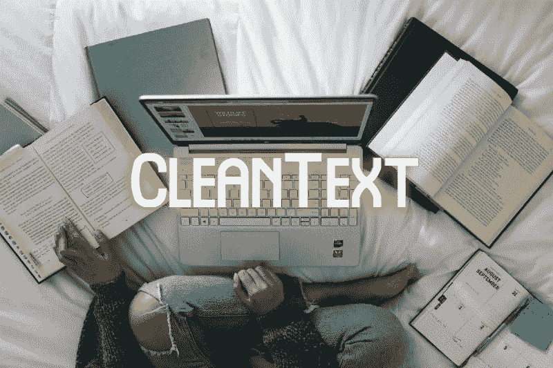

# 在一行 Python 代码中自动化您的文本处理工作流程

> 原文：<https://towardsdatascience.com/automate-your-text-processing-workflow-in-a-single-line-of-python-code-e276755e45de?source=collection_archive---------7----------------------->

## 使用 CleanText 库处理 NLP 任务的文本数据



由 [Unsplash](https://unsplash.com?utm_source=medium&utm_medium=referral) 上的[窗口](https://unsplash.com/@windows?utm_source=medium&utm_medium=referral)拍摄

自然语言处理(NLP)是人工智能的一个子领域，涉及计算机和自然语言之间的交互。它围绕着如何训练一个可以理解和实现自然语言任务用法的数据科学模型。典型的 NLP 项目遵循流水线的各个方面来训练模型。流水线中的各个步骤包括文本清理、记号化、词干化、编码成数字向量等，然后是模型训练。

为 NLP 任务导出的数据集是文本数据，主要来自互联网。大多数时候，用于 NLP 建模的文本数据是脏的，需要在数据处理的早期进行清理。数据科学家将大部分时间花在数据预处理上，包括清理文本数据。

在本文中，我们将讨论一个有趣的库 CleanText，它简化了清理文本数据的过程，并加快了数据预处理管道。

# 什么是 CleanText？


图片由[米哈尔·贾莫鲁克](https://pixabay.com/users/jarmoluk-143740/?utm_source=link-attribution&amp;utm_medium=referral&amp;utm_campaign=image&amp;utm_content=268179)拍摄，来自[皮克斯拜](https://pixabay.com/?utm_source=link-attribution&amp;utm_medium=referral&amp;utm_campaign=image&amp;utm_content=268179)

CleanText 是一个开源的 Python 库，它能够清除从 web 或社交媒体上搜集的文本数据。CleanText 使开发人员能够创建规范化的文本表示。CleanText 使用 [ftfy](https://github.com/LuminosoInsight/python-ftfy) 、 [unidecode](https://github.com/takluyver/Unidecode) 和各种其他硬编码规则(包括 RegEx)将损坏或不干净的输入文本转换为干净的文本，可以进一步处理这些文本以训练 NLP 模型。

## 安装:

可以使用以下命令从 PyPl 安装 CleanText 库:

```
**pip install clean-text**
```

安装后，您可以使用以下命令导入库:

```
**from cleantext import clean**
```

# 用法:

库 CleanText 只提供了一个函数“Clean ”,它采用各种参数来执行文本清理。清洗功能可以执行 11 种清洗，包括:

## Unicode:

它修复了各种 Unicode 错误。

```
**s1 = 'Zürich'
clean(s1, fix_unicode=True)**# Output: zurich
```

## ASCII:

它将文本翻译成最接近的 ASCII 表示。

```
**s2 = "ko\u017eu\u0161\u010dek"
clean(s2, to_ascii=True)**# Output: kozuscek
```

## 下限:

将文本数据转换成小写。

```
**s3 = "My Name is SATYAM"
clean(s3, lower=True)**# Output: my name is satyam
```

## 替换网址/电子邮件/电话号码:

用一个特殊的令牌替换文本数据中出现的所有 URL、电子邮件或电话号码。

```
**s4 = "https://www.Google.com and https://www.Bing.com are popular seach engines. You can mail me at satkr7@gmail.com. If not replied call me at 9876543210"****clean(s4, no_urls=True, replace_with_url="URL",
no_emails=True, replace_with_email="EMAIL"
no_phone_numbers=True, replace_with_email="PHONE")**# Output: url and url are popular search engines. You can mail me at EMAIL. If not replied call me at PHONE
```

## 替换货币:

用特殊标记替换文本数据中出现的所有货币。

```
**s5 = "I want ₹ 40"
clean(s5, no_currency_symbols = True)
clean(s5, no_currency_symbols = True, replace_with_currency_symbol="Rupees")**# Output: i want <cur> 40
# Output: i want rupees 40
```

## 删除号码:

用特殊符号替换或删除所有数字。

```
**s7 = 'abc123def456ghi789zero0'****clean(s7, no_digits = True)
clean(s7, no_digits = True, replace_with_digit="")**# Output: abc000def000ghi000zero0
# Output: abcdefghizero
```

## 替换标点符号:

用特殊符号删除或替换文本数据中的所有标点符号。

```
**s6 = "40,000 is greater than 30,000."
clean(s6, no_punct = True)**# Output: 40000 is greater than 30000
```

## 结合所有参数:

我们已经在上面单独讨论了所有的参数。现在让我们在 Clean 函数中组合它们，为一个脏的样本文本调用它，并观察干净文本的结果。

(作者代码)，CleanText

因此，只需编写一行 Python 代码，就可以清除不干净的文本数据，并对其进行进一步的预处理。

# 结论:

CleanText 是一个高效的库，它可以处理或清理您收集的脏数据，只需一行代码就可以获得规范化的干净文本输出。开发者只需要根据他/她的需要调整参数。它简化了数据科学家的工作，因为现在他/她不必编写许多行复杂的正则表达式代码来清理文本。CleanText 不仅可以处理英语语言的输入文本，还可以处理德语，只需设置`**lang=’de’**` **。**

CleanText library 只涵盖了一些文本清理参数，还有改进的空间。尽管如此，开发人员可以使用它来完成一些清理任务，然后继续手工编码来完成剩余的工作。

> 阅读下面提到的文章来了解 AutoNLP——一个自动化的 NLP 库。

[](https://medium.com/swlh/autonlp-sentiment-analysis-in-5-lines-of-python-code-7b2cd2c1e8ab) [## AutoNLP:用 5 行 Python 代码进行情感分析

### AutoNLP —自然语言处理的自动化

medium.com](https://medium.com/swlh/autonlp-sentiment-analysis-in-5-lines-of-python-code-7b2cd2c1e8ab) 

# 参考资料:

[1]明文知识库:[https://github.com/jfilter/clean-text](https://github.com/jfilter/clean-text)

> 感谢您的阅读