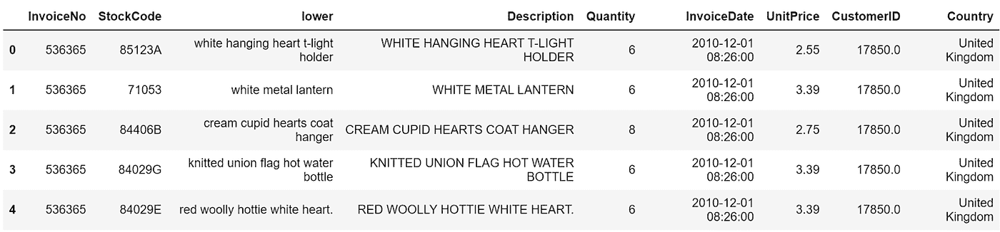
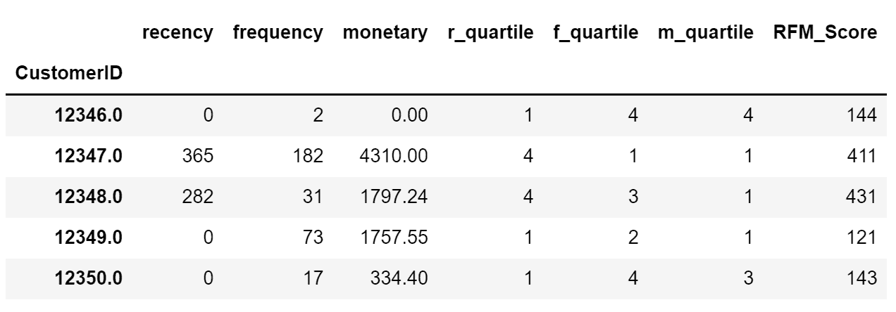
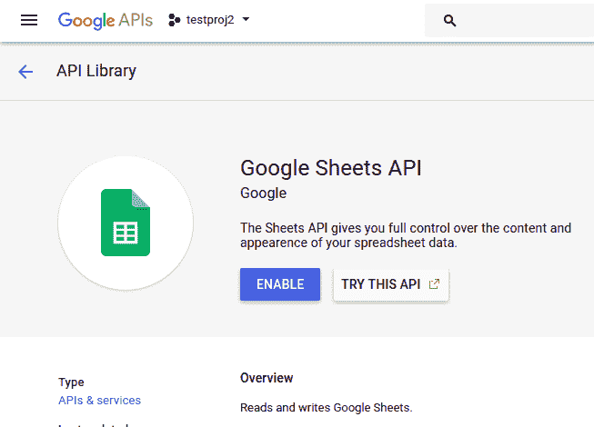
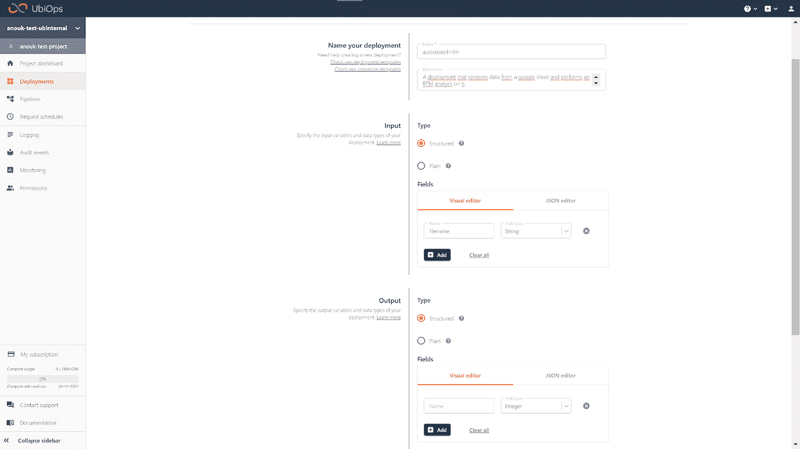
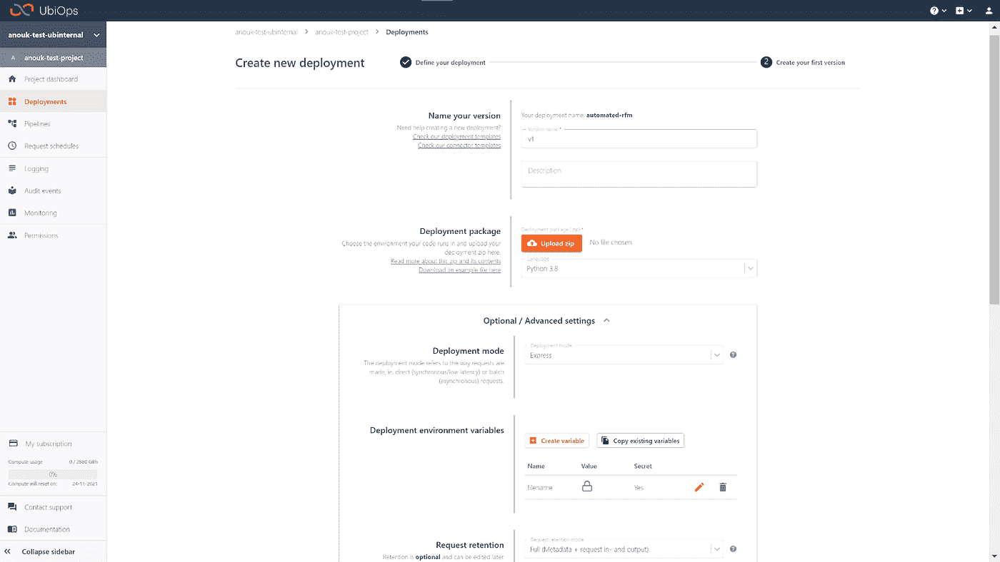

# 自动化客户细分

> 原文：<https://towardsdatascience.com/automated-customer-segmentation-2f9cec9df4df?source=collection_archive---------18----------------------->

## 使用 Python 和 UbiOps


图片由[Firmbee.com](https://firmbee.com/)

# 介绍

客户细分是增进你对客户了解的好方法，这样你就能更好地对他们的需求做出反应。要真正从客户细分中获得最大收益，最好是将其自动化，这样可以最大限度地减少手动工作和花费的时间。在这篇文章中，我将向你展示如何使用 Python 和 [UbiOps](https://ubiops.com/product/) 来自动化你的客户细分。我将对存储在谷歌表单中的交易数据进行 RFM 分析。

*你可以在这里找到本教程* [*的结果代码。*](https://github.com/UbiOps/tutorials/tree/master/ready-deployments/customer-segmentation/segmentation_deployment_package_advanced)

# 什么是 RFM 分析？

**RFM 分析**是一种基本的客户细分算法。代表近期、频率、货币分析。这种特定的分析基于三个因素将每个客户分配到一个组:

*   客户最近购买了什么东西？
*   他们多久买一次东西？
*   当他们买东西的时候，他们会花多少钱？

使用这三个因素，该算法将通过以下方式为每个客户分配一个 RFM 分数:

1.  根据**最近**将客户分成四分之一
2.  根据**频率**将客户划分为四分位数
3.  根据**支出**将客户分为四分之一
4.  将客户所在的每个四分位数的数字串联起来，以获得一个分数

如果我们以客户 Annie 为例，她可能处于最近消费的第一个四分位数，第二个四分位数，第三个四分位数。她的 RFM 分数将会是 **123** 。111 分是最高分，444 分是最差分。

想深入了解 RFM 吗？我推荐叶小开·阿恩·贝克的这篇文章。

# 如何对您的数据进行 RFM 分析

RFM 分析需要交易数据。我将用这个 Kaggle 数据集作为一个例子来展示如何进行 RFM 分析。首先，我们需要导入熊猫并读入数据。

```
import pandas as pd
data_df = pd.read_excel(‘Online_Retail.xlsx’)`
```

如果你想看一眼数据，你可以使用`data_df.head()`，你应该会看到这样的内容:



现在我们有了数据，我们可以开始我们的 RFM 分析。在这篇博文中，为了保持简洁，我不会涉及数据清理，但是要注意，当您想要将下面的代码应用到您自己的数据集时，您需要确保您的数据是干净的。

我们需要做的第一件事是计算每笔交易的总价。为此，我们可以简单地将**单价**列乘以**数量**列，并将结果保存在一个新列中，我们称之为**总价。**您可以通过下面一行代码实现这一点:

```
data_df[‘TotalPrice’] = data_df[‘Quantity’].astype(int) * data_df[‘UnitPrice’].astype(float)
```

现在我们已经准备好了必要的列，我们可以对我们的近期、频率和货币值执行以下计算:

1.  **Recency** :计算每个客户最近一次购买日期和最后一次购买日期之间的天数。
2.  **频率**:计算每个客户的订单数量。
3.  **货币**:计算每个客户所花的所有钱的总和。

我们可以使用 lambda 函数快速进行计算:

```
data_df[‘InvoiceDate’] = pd.to_datetime(data_df[‘InvoiceDate’])
rfm= data_df.groupby(‘CustomerID’).agg({‘InvoiceDate’: lambda date: (date.max() — date.min()).days,
‘InvoiceNo’: lambda num: len(num),
‘TotalPrice’: lambda price: price.sum()})
```

完美！现在我们已经有了我们的值，我们需要做的最后一件事是完成这个分析，根据最近、频率和货币将客户分成不同的四分之一，并将每个四分之一的数字连接起来。

```
# Change the name of columns
rfm.columns=[‘recency’,’frequency’,’monetary’]# Computing Quantile of RFM values
rfm[‘recency’] = rfm[‘recency’].astype(int)
rfm[‘r_quartile’] = pd.qcut(rfm[‘recency’].rank(method=’first’), 4, [‘1’,’2',’3',’4']).astype(int)
rfm[‘f_quartile’] = pd.qcut(rfm[‘frequency’], 4, [‘4’,’3',’2',’1']).astype(int)
rfm[‘m_quartile’] = pd.qcut(rfm[‘monetary’], 4, [‘4’,’3',’2',’1']).astype(int)# Concatenating the quantile numbers to get the RFM score
rfm[‘RFM_Score’] = rfm.r_quartile.astype(str)+ rfm.f_quartile.astype(str) + rfm.m_quartile.astype(str)
```

在运行了这段代码并使用`rfm.head()`检查了“rfm”之后，得到的数据帧应该是这样的:



现在，每个客户都有一个 RFM 分数，以表明他们是什么类型的客户。您可以利用这些信息来制定营销和销售策略。

# 自动化您的 RFM 分析

为了最大限度地利用 RFM 分析，应该对您的数据定期执行自动化分析。要开始自动化，首先需要在分析和数据存储位置之间建立一个连接。现在，我们使用本地 excel 表，但更有可能的是，您将这些数据存储在某种共享位置，可以是数据库，也可以是更简单的共享驱动器。在本文中，我将向您展示如果您的交易数据存储在 Google Sheet 中，如何自动进行这种分析。当然，你的情况可能会非常不同，但我将向你展示的相同原则仍然适用。

# 为您的 Google Sheet 设置服务帐户

为了建立到您的 Google 表单的连接，我们需要一个能够访问表单的*服务帐户*。您可以创建一个，如下所示:

1.  前往[谷歌开发者控制台](https://console.developers.google.com/)并创建一个新项目(或选择一个现有项目)
2.  您将被重定向到项目仪表板，在那里点击**“启用 API 和服务”**，搜索“Sheets API”。
3.  在 API 界面点击**“启用”**启用该 API



1.  同样启用**“驱动 API”**。
2.  转到**“凭证”**选项卡，选择**“创建凭证>服务帐户”**创建一个新的服务帐户。
3.  给服务帐户一个名称和描述
4.  将服务帐户权限设置为**“计算引擎服务代理”**，跳过表单中的第三步，点击**创建**。
5.  导航到新创建的服务帐户，并转到“Keys”选项卡。点击**“添加密钥>创建新密钥”**。
6.  将类型设置为 **JSON** 并点击**创建**。这将提示下载一个 json 文件，该文件包含帐户授权所需的私钥。将它存储在运行代码的同一文件夹中。

好了，我们现在有了一个具有正确权限的服务帐户。我们只需要让服务帐户访问仍然有数据的表。要做到这一点，带着你的数据去谷歌表单，点击“分享”。与您在前面步骤中创建的服务帐户的电子邮件地址**共享 google 表单。服务帐户将需要编辑权限，因为它将执行读取和写入操作。**

# 从 Google 工作表中检索数据

使用您之前创建的服务帐户，我们现在可以建立从您的 Python 代码到 Google Sheet 的连接。我正在使用图书馆[的图片来帮助解决这个问题。](https://pygsheets.readthedocs.io/en/stable/)

```
SCOPES = (‘https://www.googleapis.com/auth/spreadsheets', ‘[https://www.googleapis.com/auth/drive](https://www.googleapis.com/auth/drive)')# Change the json filename to your json file in the line below
service_account_info = json.loads(“your_json_file.json”)
my_credentials = service_account.Credentials.from_service_account_info(service_account_info, scopes=SCOPES)
gc = pygsheets.authorize(custom_credentials=my_credentials)
```

现在已经建立了一个连接，我们可以继续从 Google Sheet 中读取数据:

```
spreadsheet = gc.open(“Online_Retail”)
sheet_data = spreadsheet[0]# Transforming data into a Pandas DataFrame
data_df = sheet_data.get_as_df()
```

现在我们有了一个基于 Google 工作表中的数据的数据框架，我们可以用它来分析前面的部分。把`data_df = pd.read_excel(“Online_Retail.xlsx”)`线拿出来就行了。

# 将结果写入 Google 工作表

既然我们可以检索数据来执行分析，我们还应该确保我们可以将分析结果写到人们可以访问的地方。在这种情况下，我们将把结果写到同一个 Google Sheet 的一个单独的选项卡中。您可以通过在为 RFM 分析编码后添加以下代码行来实现这一点:

```
sheet_title = “RFM results”try:
   sh = spreadsheet.worksheet_by_title(sheet_title)
except:
   print('Worksheet does not exist, adding new sheet')
   spreadsheet.add_worksheet(sheet_title)
   sh = spreadsheet.worksheet_by_title(sheet_title)
finally:
   sh.set_dataframe(sorted_customers, 'A1', copy_index = True)
   sh.update_value('A1', 'CustomerID')
   print('Data inserted successfully')
```

从上到下运行结果代码后，首先读入数据，然后执行分析，然后写下结果，您应该能够在 Google Sheets 中看到您的结果！

# 将您的分析迁移到云中

所以我们现在有了一段 Python 代码，它从 Google 工作表中检索数据，对其执行分析，并将结果写入同一个工作表。在目前的情况下，每当您需要最新的客户细分结果时，代码都需要从笔记本电脑本地运行。如果我们将整个代码转移到云中，我们可以定期进行分析*和*我们可以向公司内更多的人开放。为了实现这一点，我将使用 [UbiOps](https://ubiops.com/product/) ，这是一个允许你在 API 背后以可扩展的方式提供 Python 或 R 代码的平台。我会告诉你我如何使用它。

# 为 UbiOps 准备代码

在我将代码放入 UbiOps 的[部署](https://ubiops.com/docs/deployments/)之前，我需要将代码放入所谓的[部署包](https://ubiops.com/docs/deployments/deployment-package/deployment-structure/)。这意味着我将代码放在部署类中。这只是为了确保 UbiOps 知道什么时候运行什么。我们用例的 deployment.py 文件如下所示:

在部署文件的旁边，我们需要创建一个 requirements.txt 文件来通知 UbiOps 我们代码的依赖关系。以下`requirements.txt`应该足够了:

```
google-api-core==1.28.0
google-api-python-client==2.5.0
google-auth==1.30.0
google-auth-httplib2==0.1.0
google-auth-oauthlib==0.4.4
googleapis-common-protos==1.53.0
numpy==1.20.3
oauthlib==3.1.0
pygsheets==2.0.5
pandas==1.2.4
```

一旦你有了这两个文件，把它们放在一个单独的文件夹中，然后压缩整个文件夹。这个 zip 文件是您的部署包。您也可以在这里找到完整的部署文件夹[。](https://github.com/UbiOps/tutorials/tree/master/ready-deployments/customer-segmentation/segmentation_deployment_package_advanced)

# 在 UbiOps 中创建部署

您可以通过 Python、CLI 或 WebApp 创建部署，这取决于您的偏好。我会使用 WebApp。

1.  前往[https://app.ubiops.com](https://app.ubiops.com)并使用您的帐户登录，如果您没有帐户，请创建一个免费帐户。
2.  转到您的项目并导航到“部署”部分，单击**创建**。
3.  为您的部署命名，例如“automated-rfm”
4.  在**输入**下定义一个名为**“文件名”**的输入字段，类型为**字符串**



5.保留其他设置，点击**下一步:创建版本**

现在您已经有了一个部署，我们可以创建版本:

1.  在部署**包中，**点击**上传 zip 文件**，上传您之前创建的部署包 zip 文件。
2.  展开**可选/高级设置**，向下滚动到**部署** **环境变量**。
3.  点击**创建变量**，填写“credentials”作为名称，并复制粘贴您的 google 服务帐户的 JSON 密钥作为值。将环境变量标记为 secret 并点击复选标记按钮。



4.您可以再次保留所有其他设置的默认值，然后单击**创建**

您的部署现在将开始构建。在后台，UbiOps 会为你的代码制作一个 Docker 镜像，并在它周围封装一个 API。完成后，您会看到状态将变为**可用**。

一旦您的部署可用，您可以通过单击右上角的**创建请求**按钮来测试一切是否正常。使用 Google 工作表的名称作为请求的输入。

# 安排您的分析

自动化分析的最后一步是让它定期运行，以保持所有 RFM 分数是最新的。您可以通过在 UbiOps 中创建一个定期触发您的部署的[请求调度](https://ubiops.com/docs/data-connections/request-schedules/)来做到这一点。

转到 WebApp 中的“请求时间表”并点击**创建。**为您的计划命名，如“monthly-rfm ”,并从下拉菜单中选择您的部署。点击**下一步**进入创建表单的下一部分。在输入数据下，填写您的谷歌表单的名称，然后点击**下一步**。现在将提示您定义一个时间表。假设您需要在每月第一天的 8:00 进行分析，那么您可以设置以下 cron 作业:0 8 1 * *

设置好 cron 作业表达式后，单击 **Create** ，您的时间表将被打开！

# 结论

如果你一直跟着做，你现在已经有了一个 RFM 分析，它会在每个月的第一天自动执行。这样你就有了一个自动更新的客户细分，你的团队可以用它来指导他们的决策。我在本文中给出的例子可能是专门针对 RFM 分析的，但是我向您展示的原则也适用于其他类型的客户细分。

您需要自动化您的分析吗？欢迎在评论中告诉我！

# 更多信息

想了解更多关于本文中使用的库和工具的信息吗？看看其他媒体文章:

**图片:**

[如何用 Python 自动化 Google Sheets](https://medium.com/game-of-data/play-with-google-spreadsheets-with-python-301dd4ee36eb)——[Dayal Chand Aichara](https://medium.com/u/c6c6dcd9f4ff?source=post_page-----2f9cec9df4df--------------------------------)

**RFM:**

[与 RFM 一起了解你的客户](/know-your-customers-with-rfm-9f88f09433bc)——[叶小开·阿恩·贝克](https://medium.com/u/619a5a7c0c22?source=post_page-----2f9cec9df4df--------------------------------)

**UbiOps:**

[如何从头开始构建和实现推荐系统(Python 语言)](https://medium.com/ubiops-tech/how-to-build-and-implement-a-recommendation-system-from-scratch-in-python-b5a04d9e8331)