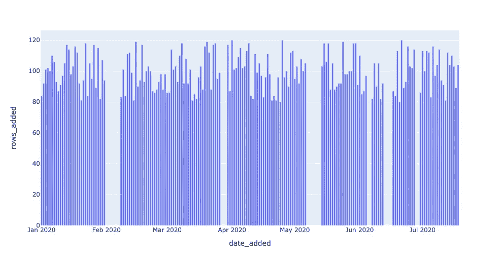
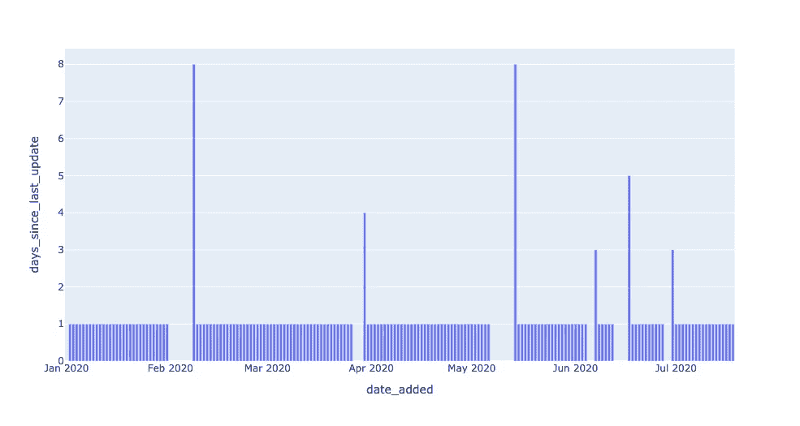
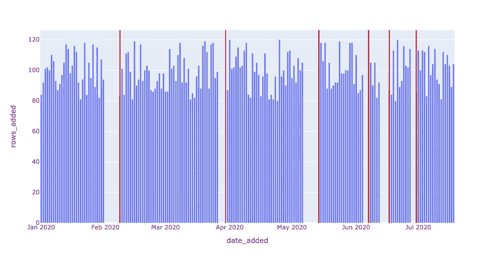
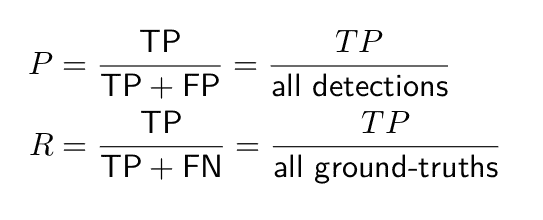
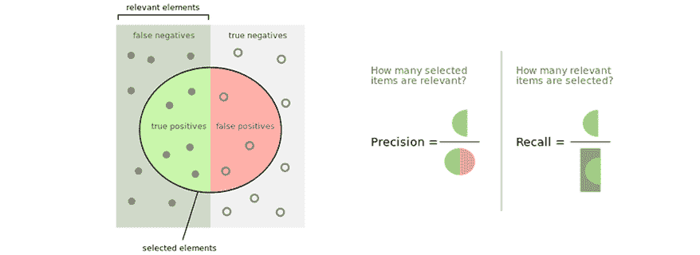
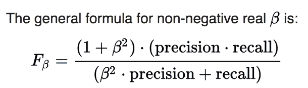
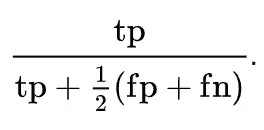
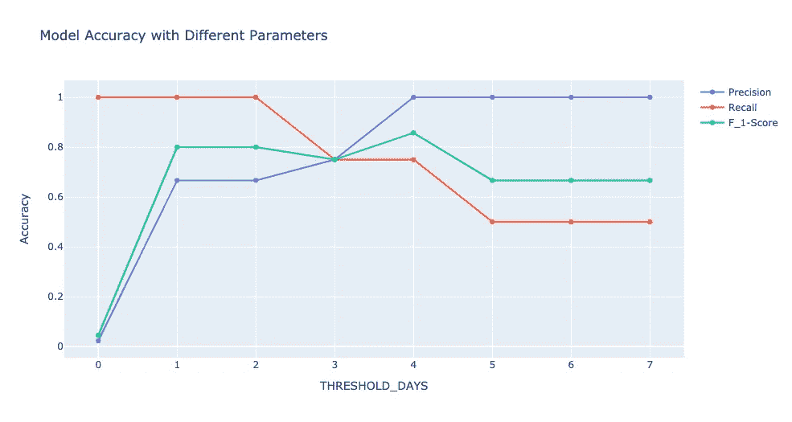
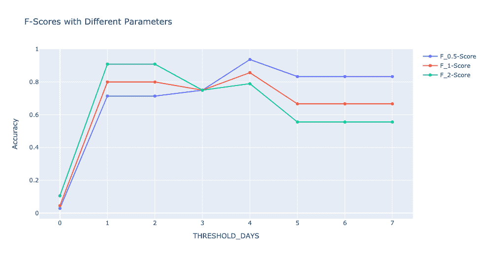

# 利用 SQL 和机器学习进行大规模数据质量监控

> 原文：<https://towardsdatascience.com/automated-data-quality-testing-at-scale-with-sql-and-machine-learning-f3a68e79d8a8?source=collection_archive---------19----------------------->

## *如何让您的数据管道更加可靠，具有可观察性*

图片由 [Pexels](https://www.pexels.com/photo/space-shuttle-launch-during-nighttime-796206/) 上的 Edvin Richardson 提供

*数据管道可能因为一百万种不同的原因而中断，但我们如何确保数据质量问题得到实时识别和解决—* 大规模解决*？有时候，所需要的只是一点 SQL，一些精度和召回，以及一个整体的方法来**[***数据可观察性***](https://www.montecarlodata.com/the-26-things-your-data-observability-platform-must-do/) *。**

*在本文中，我们将介绍如何从头开始创建自己的数据可观测性监视器，并利用机器学习的基本原理在数据管道中大规模应用它们。*

*随着公司依赖越来越多的数据来驱动日益复杂的管道，这些数据必须可靠、准确和值得信赖。当数据损坏时——无论是由于模式更改、空值、重复还是其他原因——我们需要知道，而且要快。陈旧的表或错误的指标，如果不加以检查，可能会对您的业务产生负面影响。*

*如果您是数据专业人员，您可能会发现自己在试图了解数据的健康状况时会一次又一次地问以下问题:*

*   *数据是最新的吗？*
*   *数据是否完整？*
*   *字段是否在预期范围内？*
*   *零利率是高于还是低于它应有的水平？*
*   *模式改变了吗？*

*要回答这些问题，我们可以从软件工程师的剧本中抽出一页:[数据可观测性](https://observability.workshop.aws/en/anomalydetection.html)。数据工程师将[数据可观察性](/what-is-data-observability-40b337971e3e)定义为组织回答这些问题和评估其数据生态系统健康状况的能力。反映数据健康的关键变量，数据可观察性的五个支柱是:*

*   *我的数据是最新的吗？我的数据是否有未更新的时间间隔？*
*   ***分布**:我的现场数据有多健康？我的数据是否在预期范围内？*
*   ***卷**:我的数据接收量是否达到预期的阈值？*
*   ***模式**:我的数据管理系统的正式结构改变了吗？*
*   ***血统**:如果我的部分数据宕机，对上下游有什么影响？我的数据源如何相互依赖？*

*在本系列文章的[中，我们拉开帷幕，研究代码中的*是什么样的数据可观察性，在这最后一期文章中，我们将后退一步，思考一般来说什么是好的数据质量监控器*。也许你已经阅读了第一部分**](https://www.montecarlodata.com/data-observability-in-practice-using-sql-1/)*和第二部分[并在想，“这些都是有趣的练习，但是我们如何在我的*真实生产环境*中应用这些概念呢？”](https://www.montecarlodata.com/data-observability-in-practice-using-sql-part-ii-schema-lineage/)**

> **在高层次上，机器学习有助于大规模的数据可观测性。配备了机器学习的检测器可以更灵活地应用于大量的表，随着数据仓库的增长，不再需要手动检查和规则(如第一部分和第二部分所讨论的)。此外，机器学习检测器可以实时学习和适应数据，并捕捉复杂的季节模式，否则人眼将无法看到。**

**让我们开始吧——不需要预先的机器学习经验。**

# **我们的数据环境**

***本教程基于奥莱利课程* [*练习 4*](https://github.com/monte-carlo-data/data-downtime-challenge/blob/master/exercise_text/ex4.md) *，* [*管理数据停机*](https://www.oreilly.com/live-training/courses/managing-data-downtime/0636920508717/) *。欢迎您使用 Jupyter 笔记本和 SQL 自行尝试这些练习。***

**你可能还记得第一和第二部分，我们正在研究关于可居住外行星的模拟天文数据。不幸的是，这些数据并不真实——它是为了教学目的而捏造的——但是如果你愿意，你可以假装它是直接来自于毅力。:)**

**我们使用 Python 生成数据集，对我们在生产环境中遇到的真实事件的数据和异常进行建模。(这个数据集完全免费使用，存储库中的 [utils 文件夹](https://github.com/monte-carlo-data/data-downtime-challenge/tree/master/data/utils)包含生成数据的代码。)**

**在本练习中，我们使用 SQLite 3.32.3，它应该可以通过命令提示符或 SQL 文件以最少的设置访问数据库。这些概念实际上可以扩展到任何查询语言，并且[这些实现](https://github.com/monte-carlo-data/data-observability-in-practice/tree/main/queries)可以扩展到 MySQL、Snowflake 和其他数据库环境，只需很少的改动。**

**在本文中，我们将把注意力限制在系外行星表:**

**请注意，系外行星被配置为手动跟踪一条重要的元数据 date _ added 列——它记录了我们的系统发现该行星的日期，并将其自动添加到我们的数据库中。在第一部分中，我们使用一个简单的 SQL 查询来可视化每天添加的新条目的数量:**

**该查询生成如下所示的数据:**

****

**换句话说，系外行星表每天都会更新大约 100 个条目，但在没有数据输入的日子里会“离线”。我们引入了一个名为 DAYS_SINCE_LAST_UPDATE 的指标来跟踪表的这一方面:**

**结果看起来像这样:**

****

**图表由作者提供。**

**通过一个小的修改，我们在查询中引入了一个阈值参数来创建一个*新鲜度检测器*。我们的探测器返回了所有系外行星最新数据超过 1 天的日期。**

****

**图表由作者提供。**

**图中的尖峰代表了系外行星表处理旧数据或“陈旧”数据的情况。在某些情况下，这种中断可能是标准的操作程序——也许我们的望远镜应该进行维护，所以一个周末都没有记录数据。然而，在其他情况下，中断可能代表数据收集或转换的真正问题——可能我们将日期更改为 ISO 格式，传统上推送新数据的工作现在失败了。我们可能有这样的启发:停机时间越长越糟糕，但除此之外，我们如何保证只检测数据中真正的问题呢？**

> **简单的回答是:你不能。**

**建立一个完美的预测器是不可能的(无论如何，对于任何有趣的预测问题)。但是，我们可以使用机器学习中的一些概念，以更结构化的方式来构建问题，结果是，提供大规模的数据可观察性和信任。**

# **通过机器学习改进警报**

**每当我们就数据管道中断发出警报时，我们不得不质疑警报是否准确。警报是否指示真正的问题？我们可能会担心两种情况:**

1.  **发出了警报，但没有真正的问题。我们浪费了用户的时间来响应警告。**
2.  **有一个真正的问题，但没有发出警报。我们忽略了一个真正的问题。**

**这两种情况被描述为假阳性(预测异常，实际上没问题)和假阴性(预测正常，实际上异常)，我们希望避免它们。发布假阳性就像在喊狼来了——我们拉响了警报，但一切正常。同样，发布假阴性就像在站岗时睡觉——出了问题，但我们什么也没做。**

**我们的目标是尽可能避免这些情况，并专注于最大化真阳性(预测异常，实际上是一个问题)和真阴性(预测正常，实际上正常)。**

# **精确度和召回率**

**因此，我们需要一个好的检测方案来减少误报和漏报。在机器学习实践中，更常见的是考虑相关但更有见地的术语，精确度和召回率:**

********

**图片由作者提供。**

**一般来说，精确度告诉我们，当我们发出警报时，我们的正确率是多少。具有良好精度的模型输出*可信的警报*，因为它们的高精度保证了它们很少谎报。**

**一般来说，回忆告诉我们实际上有多少问题需要警惕。记忆力好的模特是*可靠的*，因为他们的高记忆力保证了他们很少在工作时睡觉。**

**延伸我们的比喻，*精度好*的模型是很少喊狼来了的模型——当它发出警报时，你最好相信它。同样，一个具有*良好回忆*的模型就像一只优秀的看门狗——你可以放心，这个模型会捕捉到所有真正的问题。**

## **平衡精确度和召回率**

**问题当然是，你不可能两全其美。请注意，这两者之间存在明显的权衡。我们如何获得完美的精度？简单:对*没事* —值班时一直睡觉*—迫使我们有 0%的误报率。问题？召回将是可怕的，因为我们的假阴性率将是巨大的。***

***同样，我们如何获得完美的回忆？也很简单:警惕一切——抓住一切机会喊狼来了——迫使假阴性率为 0%。不出所料，问题是我们的假阳性率会受到影响，从而影响精确度。***

## ***解决方案:单一目标***

***我们的数据世界是由可量化的目标运行的，在大多数情况下，我们希望优化单个目标，而不是两个。我们可以将精确度和召回率结合成一个称为 *F* 的指标——分数:***

****

**F_beta 被称为加权的*F*-分数，因为不同的 beta 值在计算中对精确度和召回率的权重不同。一般来说，F_beta 分数表示，“我认为回忆是 beta 倍，与精确度一样重要。”**

**当β= 1 时，等式中的值相等。设置 beta > 1，回忆对于更高的分数会更重要。换句话说，beta > 1 表示，“我更关心捕捉所有异常，而不是偶尔引起一次错误警报。”同样，set beta < 1, and precision will be more important. beta < 1 says, “I care more about my alarms being genuine than about catching every real issue.”**

## **Detecting freshness incidents**

**With our new vocabulary in hand, let’s return to the task of detecting freshness incidents in the EXOPLANETS table. We’re using a simple prediction algorithm, since we turned our query into a detector by setting one model parameter X. Our algorithm says, “Any outage longer than X days is an anomaly, and we will issue an alert for it.” Even in a case as simple as this, precision, recall, and F-scores can help us!**

**To showcase, we took the freshness outages in EXOPLANETS and assigned ground truth labels encoding whether each outage is a genuine incident or not. *没有某种基本事实*就不可能计算模型的准确性，所以考虑如何为用例生成这些总是有帮助的。回想一下，在系外行星表中总共有 6 次持续时间超过 1 天的中断:**

**让我们武断地说，2020 年 2 月 8 日和 2020 年 5 月 14 日的事件是真实的。每一个都是 8 天长，所以有问题是有道理的。另一方面，假设 2020 年 3 月 30 日和 2020 年 6 月 7 日的断电不是实际事故。这些停机时间分别为 4 天和 3 天，因此这并不奇怪。最后，让 2020 年 6 月 17 日和 2020 年 6 月 30 日分别在 5 天和 3 天发生的中断，*也*成为真实事件。**

**以这种方式选择了我们的基本事实后，我们看到更长时间的停机更有可能是实际问题，但没有保证。这种弱相关性将使一个好的模型有效，但不完美，就像在更复杂的真实用例中一样。**

**现在，假设我们将阈值设置为 3 天，换句话说，“每次超过 3 天的停机都是异常的。”这意味着我们正确地检测到了 2020 年 2 月 8 日、2020 年 5 月 14 日和 2020 年 6 月 17 日的异常，因此我们有 3 个真阳性。但是，不幸的是，我们将 2020–03–30 检测为一个事件，而它并不是一个事件，因此我们有 1 个误报。3 个真阳性/ (3 个真阳性+ 1 个假阳性)意味着我们的精度是 0.75。此外，我们未能将 2020–06–30 检测为事故，这意味着我们有 1 个假阴性。3 真阳性/ (3 真阳性+ 1 假阴性)意味着我们的召回率也是 0.75。f1-分数，由公式给出**

****

**意味着我们的 f1 分数也是 0.75。还不错！**

**现在，假设我们将阈值设置得更高，为 5 天。现在，我们只检测到 2020 年 2 月 8 日和 2020 年 5 月 14 日这两个最长的停机时间。这些都是真实的事件，所以我们没有误报，这意味着我们的精度是 1-完美！但是请注意，我们没有检测到其他真正的异常，2020 年 6 月 17 日和 2020 年 6 月 30 日，这意味着我们有两个假阴性。2 真阳性/ (2 真阳性+ 2 假阴性)意味着我们的召回率是 0.5，比以前更差。我们的回忆受到影响是有道理的，因为我们选择了一个更保守、阈值更高的分类器。我们的 f1 分数可以用上面的公式再次计算，结果是 0.667。**

**如果我们根据我们设置的阈值来绘制我们的精度、召回率和 f1，我们会看到一些重要的模式。首先，具有低阈值的积极检测器具有最好的回忆，因为它们更快地发出警报，从而捕捉到更多真正的问题。另一方面，更多的被动探测器具有更高的精度，因为它们只对更有可能是真实的最糟糕的异常发出警报。f1 分数在这两个极端之间的某个地方达到峰值——在这种情况下，在 4 天的阈值处。找到最佳点是关键！**

****

**图表由作者提供。**

**最后，我们来看最后一个对比。请注意，我们只查看了 f1 分数，它同等地衡量了精确度和召回率。当我们看β的其他值时会发生什么？**

****

**图表由作者提供。**

**回想一下，一个通用的 F_beta 说“召回是 beta 倍，和精度一样重要。”因此，当回忆被优先化时，我们应该预期 F2 高于 f1——这正是我们在阈值小于 4 时看到的。同时，对于更大的阈值，F_0.5 分数更高，显示出对于具有更高精度的保守分类器的更多容许量。**

# **机器学习的大规模数据可观测性**

**我们已经对机器学习概念进行了一次快速的探索。现在，这些概念如何帮助我们将检测器应用到生产环境中？关键在于理解对于任何异常检测问题都没有完美的分类器。**

**假阳性和假阴性，或者同样的精确度和召回率之间总有一个折衷。你必须问自己，“我如何权衡这两者之间的取舍？什么决定了我的模型参数的‘最佳点’？”选择一个 F_beta 分数来优化将隐含地决定你如何权衡这些事件，从而决定在你的分类问题中什么是最重要的。**

> **此外，请记住，如果没有某种基础事实与模型的预测进行比较，任何关于模型准确性的讨论都是不完整的。在你知道你有一个好的分类之前，你需要知道什么是好的分类。**

**这里祝你没有数据停机！**

*****有兴趣了解如何解决大规模数据质量问题吗？伸出手去*** [***巴尔***](https://www.linkedin.com/in/barrmoses)*[***瑞安***](https://www.linkedin.com/in/ryan-kearns-203686a9) ***，以及其余的*** [***蒙特卡洛***](http://www.montecarlodata.com/) ***团队以及*** [***注册为我们的数据观测***](https://bit.ly/spotlightresident)***

***本教程的关联练习可用，此处*<https://github.com/monte-carlo-data/data-downtime-challenge>**，本文所示改编代码可用，此处*<https://github.com/monte-carlo-data/data-observability-in-practice>**。*****