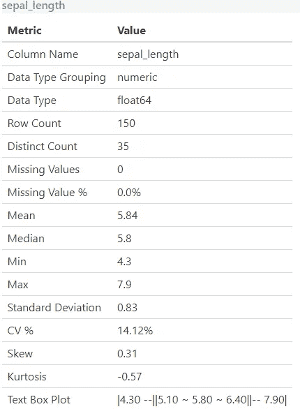
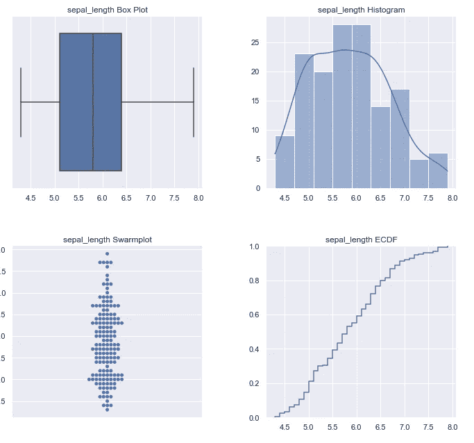
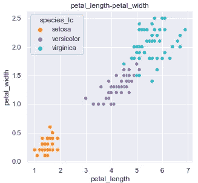
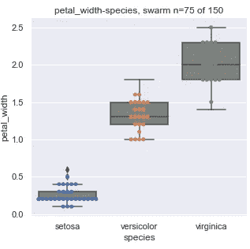

# 自动化探索性数据分析

> 原文：<https://towardsdatascience.com/automated-exploratory-data-analysis-da9fc5928e0d?source=collection_archive---------32----------------------->

## 使用 python edatk 库在数据中寻找见解

[附身摄影](https://unsplash.com/@possessedphotography?utm_source=medium&utm_medium=referral)在 [Unsplash](https://unsplash.com?utm_source=medium&utm_medium=referral) 上拍照

探索性数据分析是构建机器学习模型的关键初始步骤。更好地理解您的数据可以使发现异常值、特征工程和最终建模更加有效。

探索性数据分析的某些部分，如生成特征直方图和缺失值计数，大部分可以自动化。本文介绍了我创建的一个开源库，它运行一些基本的自动化 EDA 过程。

# EDATK:自动化 EDA 工具箱

为了帮助加快探索性数据分析，我创建了 [edatk](https://github.com/edatk/edatk/) 并开源了代码。这允许您通过 pip 安装，并使用几行代码运行自动化 eda。它仍处于 alpha 阶段，所以将其视为现有 eda 工作流的补充。

edatk 的主要特点是:

1.  易用性:在 pandas 数据框架上运行自动化探索性数据分析只需要一行代码。
2.  **HTML 报告输出**:通过提供一个文件夹位置，edatk 将构建一个 HTML 报告，以一种简洁的方式呈现视觉效果和表格。
3.  **目标列探索**:这是 edatk 的关键特性之一。传入可选的 **target_column** 参数指定在可能的情况下添加可视层和线索，帮助您发现输入特征和您在受监督的机器学习设置中预测的列之间的趋势。如果你的问题不符合监督机器学习模式，你可以简单地忽略这个参数。
4.  **推断的图表类型**:基于数据框架中的列类型，edatk 将推断要计算的指标和要显示的图表类型。

在本次演示中，我们将使用常见的[虹膜数据集](https://archive-beta.ics.uci.edu/ml/datasets/iris)。数据集具有鸢尾植物的各种特征，任务是预测物种。

在本文中，我们不会构建机器学习模型，但会运行自动化 eda 来发现可能有助于选择或构建新功能以纳入模型训练的趋势。

# 运行自动化 EDA

运行 edatk 的主要方法如下，包括几个关键步骤:

1.  导入库并加载数据集。在这个演示中，我们使用 seaborn 将 iris 数据集加载到 pandas 数据帧中。
2.  运行 **auto_eda** 方法，传入您的数据帧、保存(输出)位置和目标列。输出位置和目标列是可选的，但如果您可以提供这些值，则推荐使用。

**就这么简单！** Edatk 根据列类型和每列的基数运行各种例程。可视化是自动生成的，并且用输出构建一个 html 报告。下面代码生成的完整 html 报告可以在[这里](https://htmlpreview.github.io/?https://github.com/bstuddard/python-examples/blob/master/edatk/report.html)查看。

# 分析结果

## 单列统计

报告的第一部分遍历所有列，并计算基本的描述性统计数据。这采用初始表的形式，其中包含最小值、最大值、缺失值行的百分比等。下一部分显示了一些基本的描述性图表，如箱线图和直方图。

下面的屏幕截图显示了每列生成的内容，以萼片长度(用于预测物种的数据集特征之一)为例。

单列表格，按作者排序的图像

单列视觉效果，图片由作者提供

## 多列统计

探索数据最有用的事情之一是绘制要素对并针对目标进行分析。这可以给你一些如何设计新功能的想法。如果您在调用 **auto_eda** 时传入一个 ***target_column*** ，这些特征对可视化中的许多将包括根据该目标变量的颜色编码。这使得发现潜在趋势变得快速而容易。

例如，生成的图之一是散点图，x 轴上有 ***花瓣 _ 长度*** ，y 轴上有 ***花瓣 _ 宽度*** 。我们希望训练模型预测的三种不同类型的物种是用颜色编码的。人们可以很快发现一些分离。仅仅包括这两个特性就应该为一个模型提供一个不错的起点。你也可以结合到一个新设计的功能中来捕捉这种关系。

成对的柱形图散点图，作者图片

生成的视觉效果并不总是散点图。该库查看列类型以确定应该生成的可视化类型。例如，使用方框图，根据 ***花瓣 _ 宽度*** 绘制分类列(如下例)。

成对的柱形视觉效果方框图，作者提供的图像

# 警告

Edatk 可以处理一些较大的数据集(就行数而言),因为对于已知的性能密集型绘图，确实会进行一些采样。但是，由于生成了成对图组合，包含大量列的极宽数据集可能会导致问题。在这种情况下， **auto_eda** 方法提供了一个 ***column_list*** 参数来传入一个较小的列名列表。

最后，edatk 仍然处于 alpha 阶段——所以把它作为现有 eda 工作流的补充。

# 贡献的

该库仍在开发中，但对所有希望做出贡献的人开放源代码以使其变得更好！

计划中的功能可以在 github repo 上的这里查看[，以及一些](https://github.com/edatk/edatk#feature-overview)[基本指令和 git 命令](https://github.com/edatk/edatk/blob/main/docs/developer/CONTRIBUTING.md)，供那些希望提出第一个拉请求的人使用。

# 摘要

自动化的探索性数据分析可以帮助您更好地理解数据并发现初始趋势。

Edatk 就是这样一个库，它试图自动完成这些工作。看看吧，让我知道你的想法！

*在*[*Github*](https://github.com/bstuddard/python-examples/tree/master/edatk)*上可以找到所有的例子和文件。*

*原载于*[*https://data stud . dev*](https://datastud.dev/posts/automated-eda)*。*