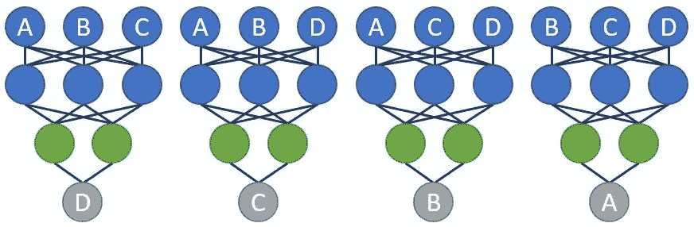
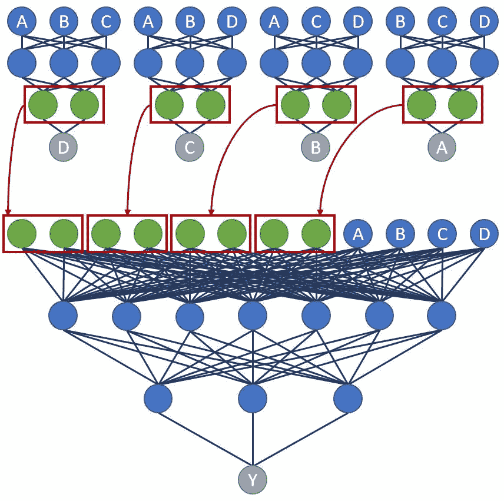
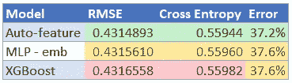

# 使用神经网络的自动特征工程

> 原文：<https://towardsdatascience.com/automated-feature-engineering-using-neural-networks-5310d6d4280a?source=collection_archive---------7----------------------->


数据艺术家温迪·安格斯，经许可使用

## 如何自动化并大大改进数据建模中最繁琐的步骤之一

很少有人会否认特征工程是生产精确模型的最重要的步骤之一。有些人喜欢，但我绝对不是其中之一。我发现这一步非常繁琐，我坚信任何繁琐的事情都可以自动化。虽然我的解决方案没有完全消除手工工作的需要，但它确实大大减少了手工工作并产生了更好的结果。它还产生了一个在结构化数据集上持续击败梯度增强方法的模型。

本文将回答以下问题:

*   到底什么是自动化？
*   它是如何工作的？
*   你如何建造它？
*   它与其他型号相比如何？

# 特征工程

> “正确完成这一步可能需要做几周的 EDA。幸运的是，寻找互动是神经网络擅长的！”

当一个模型被输入一组特征时，它必须学习哪些特征相互作用，以及它们如何相互作用。对于大型数据集，可能有无数的组合需要测试，这些模型往往侧重于能够快速成功的交互。使用特征工程，您可以手动创建或组合特征，以确保模型给予它们适当的关注。

根据数据和问题，有许多不同类型的特征工程方法。大多数分为以下几类:

*   数据清理:有些人认为这是一项功能工程，但这确实是它自己的一步。简而言之，在特性工程成为可能之前，您需要确保数据是可用的。它涉及修复数据中的错误、处理缺失值、处理异常值、一次性编码、扩展特性以及无数其他事情。在我看来，数据清理是唯一比特征工程更糟糕的一步，所以任何找到自动化这一步的人都将是我的新英雄。
*   均值编码:这一步包括将邮政编码等分类特征转换成模型可用的信息。例如，您可以创建一个显示邮政编码的平均销售收入的列。在[我之前关于特性嵌入的文章](/why-you-should-always-use-feature-embeddings-with-structured-datasets-7f280b40e716)中，我已经在很大程度上删除了这个步骤。
*   滞后变量:向数据中添加时间序列元素通常会有所帮助。通过添加以前期间的值，模型可以计算出事物随时间的变化趋势(例如，上个月的销售额、上个月的销售额等)。这个过程并不太复杂，可以通过简单的循环实现自动化。
*   交互:这一步包括以不同的方式组合特性。例如，您可以通过用广告驱动的客户购买量除以广告被点击的总次数来衡量在线广告的转化率。但是，如果转化率因产品价格的不同而有很大差异，该怎么办呢？现在，您可以根据价格阈值创建单独的列。也很难发现和知道如何处理三阶(或更高阶)互动(例如，价格和类别不同的广告转换)。到目前为止，这是特征工程中最微妙、最耗时的步骤。正确完成这一步可能需要做几周的 EDA。幸运的是，寻找互动是神经网络擅长的！诀窍是确保模型实际上寻找它们，这将是以后的重点。

# 这个概念

神经网络获取一组输入特征，并在它们之间创建有助于最佳预测输出的交互。如上所述，我们可以通过设计它们来迫使模型考虑某些组合。但是如果我们可以强迫神经网络考虑它们呢？如果我们能够确保神经网络以一种对目标输出产生最佳精度的方式来设计这些特征，会怎么样？关键是训练模型先关注特征。

假设我们有目标输出为 y 的特性 A、B、C 和 D。这个问题的第一步是创建一个模型，**预测每个特性**。为什么我们关心预测特征？因为我们希望神经网络学习特定于每个特征的交互。



作者提供的要素网络图示例

关于这一步有趣的事情是，我们不关心模型输出。最后一个隐藏层(图中的绿色节点)包含我们新设计的特征，这是我们将要提取的。这些可以馈入我们的最终模型(连同原始特征)来预测我们的目标输出 y。



作者提供的全功能网络图示例

诀窍是确保特征网络训练 ***和*** 最终模型，而不是一个单独的过程。Trickier 还在训练一个嵌入层，嵌入到每个特征层中(见[我的文章](/why-you-should-always-use-feature-embeddings-with-structured-datasets-7f280b40e716)为什么这很重要)。对你来说，好消息是:经过几个月的努力，我终于找到了一个解决方案，并且超出了我的预期。

# 代码

为了演示这些方法，我们将试图预测一个新冠肺炎患者出现严重反应的概率。可以在这里找到“Cleaned-Data.csv”数据集:[https://www . ka ggle . com/iamhungundji/covid 19-symptoms-checker？select=Cleaned-Data.csv](https://www.kaggle.com/iamhungundji/covid19-symptoms-checker?select=Cleaned-Data.csv)

让我们引入数据并创建培训、验证和测试数据集:

```
import pandas as pd
import tensorflow as tffrom sklearn.model_selection import train_test_split
from tensorflow import feature_column
from tensorflow.keras import layers
from tensorflow.keras.callbacks import ModelCheckpoint
from sklearn.metrics import log_lossX_train = pd.read_csv('covid_data.csv')
y_train = X_train.pop('Severity_Severe').to_frame()
X_train = X_train.iloc[:,:23]X_train, X_val, y_train, y_val = train_test_split(
    X_train, y_train,test_size=0.2,random_state=42)X_val, X_test, y_val, y_test = train_test_split(
    X_val, y_val,test_size=0.5,random_state=42)
```

现在，我们将需要定义要为哪些特征创建特征模型。由于我们没有太多的特征，我们不妨全部使用(除了*国家*将用于嵌入)。当模型包含数百个特性时，最好只显式定义顶部的特性，如下所示:

```
model_cols = ['Fever','Tiredness','Dry-Cough',
              'Difficulty-in-Breathing',
              'Sore-Throat','None_Sympton',
              'Pains','Nasal-Congestion',
              'Runny-Nose','Diarrhea',
              'None_Experiencing','Age_0-9',
              'Age_10-19','Age_20-24','Age_25-59',
              'Age_60_','Gender_Female','Gender_Male',
              'Gender_Transgender','Contact_Dont-Know',
              'Contact_No','Contact_Yes']
```

这些特征中的每一个都将是我们整体模型的不同辅助输出，以及我们试图预测的目标特征( *Severity_Severe* )。在创建张量流数据集时，我们还必须将它们定义为输出要素。请注意，我们通过在末尾添加'*_ out '【T7]来重命名这些特性，以便 TensorFlow 不会因重复的名称而混淆。注意，我们还为目标输出添加了一个额外的' *_aux_out* '列。这样我们就可以围绕目标特征训练一个独立的特征模型，这个模型也将输入到最终的模型中。这是一个被称为跳过连接的过程，它允许模型学习围绕相同特征集的深度和浅层交互。*

```
Y_train_df = X_train[model_cols].copy()
Y_train_df.columns = Y_train_df.columns + "_out"
Y_train_df['Severity_Severe_out'] = y_train['Severity_Severe']
Y_train_df['Severity_Severe_aux_out'] = y_train['Severity_Severe']
trainset = tf.data.Dataset.from_tensor_slices((
    dict(X_train),dict(Y_train_df))).batch(256)Y_val_df = X_val[model_cols].copy()
Y_val_df.columns = Y_val_df.columns + "_out"
Y_val_df['Severity_Severe_out'] = y_val['Severity_Severe']
Y_val_df['Severity_Severe_aux_out'] = y_val['Severity_Severe']
valset = tf.data.Dataset.from_tensor_slices((
    dict(X_val),dict(Y_val_df))).batch(256)Y_test_df = X_test[model_cols].copy()
Y_test_df.columns = Y_test_df.columns + "_out"
Y_test_df['Severity_Severe_out'] = y_test['Severity_Severe']
Y_val_df['Severity_Severe_aux_out'] = y_val['Severity_Severe']
testset = tf.data.Dataset.from_tensor_slices((
    dict(X_test),dict(Y_test_df))).batch(256)
```

我们要创建的第一个函数是 *add_model* 。我们将为这个函数提供我们的特征名称，定义层数和大小，表明我们是否想要使用批量标准化，定义模型的名称，并选择输出激活。hidden_layers 变量将为每个层提供一个单独的列表，第一个数字是神经元的数量，第二个是辍学率。此功能的输出将是输出层和最终隐藏层(工程特征)，它们将反馈到最终模型。当使用像 hyperopt 这样的工具时，这个函数允许简单的超参数调整。

```
def add_model(
    feature_outputs=None,hidden_layers=[[512,0],[64,0]],
    batch_norm=False,model_name=None,activation='sigmoid'):

    if batch_norm == True:
        layer = layers.BatchNormalization()(feature_outputs)
    else:
        layer = feature_outputs

    for i in range(len(hidden_layers)):
        layer = layers.Dense(hidden_layers[i][0], activation='relu',
                             name=model_name+'_L'+str(i))(layer)
        last_layer = layer

        if batch_norm == True:
            layer = layers.BatchNormalization()(layer)
        if hidden_layers[i][1] > 0:
            layer = layers.Dropout(hidden_layers[i][1])(layer)

    output_layer = layers.Dense(1, activation=activation,
                                name=model_name+'_out')(layer)

    return last_layer, output_layer
```

下一个功能是创建一个嵌入层。这将很有帮助，因为*国家*是一个稀疏分类特征。该函数将获取我们将转换为嵌入的特征的字典，以及此处定义的该特征的唯一可能值的列表:

```
emb_layers = {'Country':list(X_train['Country'].unique())}
```

我们还提供模型输入，这将在后面定义。对于尺寸参数，我选择遵循默认的经验法则，即使用唯一特征长度的 4 次方根。

```
def add_emb(emb_layers={},model_inputs={}):
    emb_inputs = {}
    emb_features = []

    for key,value in emb_layers.items():
        emb_inputs[key] = model_inputs[key]
        catg_col = feature_column
            .categorical_column_with_vocabulary_list(key, value)
        emb_col = feature_column.embedding_column(
            catg_col,dimension=int(len(value)**0.25))
        emb_features.append(emb_col)

    emb_layer = layers.DenseFeatures(emb_features)
    emb_outputs = emb_layer(emb_inputs)

    return emb_outputs
```

在我们进入下一个功能之前，我们需要定义需要从不同的特征模型中排除哪些特征。在基本层面上，我们想要排除被预测的特征(数据泄漏)，以及用于嵌入的特征。还应小心移除可直接用于计算输出要素的要素。例如，一个模型将很快发现，对于像 *Gender_Female* 这样的特征，只需查看其他性别列的值并忽略所有其他特征，它就可以获得 100%的准确性。这不是一个非常有用的模型！为了解决这个问题，我们将从相应的特征模型中排除其他性别、年龄和接触特征。

```
feature_layers = {col:[col,'Country'] for col in model_cols}feature_layers['Gender_Female'] += ['Gender_Male',
                                    'Gender_Transgender']
feature_layers['Gender_Male'] += ['Gender_Female',
                                  'Gender_Transgender']
feature_layers['Gender_Transgender'] += ['Gender_Female',
                                         'Gender_Male']feature_layers['Age_0-9'] += ['Age_10-19','Age_20-24',
                              'Age_25-59','Age_60_']
feature_layers['Age_10-19'] += ['Age_0-9','Age_20-24',
                                'Age_25-59','Age_60_']
feature_layers['Age_20-24'] += ['Age_0-9','Age_10-19',
                                'Age_25-59','Age_60_']
feature_layers['Age_25-59'] += ['Age_0-9','Age_10-19',
                                'Age_20-24','Age_60_']
feature_layers['Age_60_'] += ['Age_0-9','Age_10-19',
                              'Age_20-24','Age_25-59']feature_layers['Contact_Dont-Know'] += ['Contact_No','Contact_Yes']
feature_layers['Contact_No'] += ['Contact_Dont-Know','Contact_Yes']
feature_layers['Contact_Yes'] += ['Contact_Dont-Know','Contact_No']
```

我们还打算为我们的辅助跳过连接模型添加一个*特征层*:

```
feature_layers['Severity_Severe_aux'] = ['Country']
```

现在我们有了构建特征模型所需的东西。该函数将使用所有输入特征的列表、上述定义的特征排除和嵌入字典、在 *add_model* 函数中描述的 *hidden_layer* 结构以及是否应使用批量标准化的指示器。

首先，该函数将以 TensorFlow 喜欢的方式定义输入要素。使用 TensorFlow 输入的一个主要优点是，我们只需要定义一次特征，它们可以在每个特征模型中反复使用。接下来，我们将确定是否定义了任何嵌入列，并创建一个嵌入层(可选)。对于每个特征模型，我们将创建 *DenseFeatures* 输入层(不包括上面定义的特征),并使用 *add_model* 函数创建一个单独的模型。就在返回之前，我们检查循环是否在跳过连接模型上运行。如果是这样，我们添加输入特征，以便最终模型也可以使用原始特征进行训练。最后，该函数将返回模型输入的字典、每个特征模型输出层的列表以及每个最终隐藏层的列表(即新工程特征)。

```
def feature_models(
    output_feature=None,all_features=[],feature_layers={},
    emb_layers={},hidden_layers=[],batch_norm=False):

    model_inputs = {}
    for feature in all_features:
        if feature in [k for k,v in emb_layers.items()]:
            model_inputs[feature] = tf.keras.Input(shape=(1,),
                                                   name=feature,
                                                   dtype='string')
        else:
            model_inputs[feature] = tf.keras.Input(shape=(1,),
                                                   name=feature)

    if len(emb_layers) > 0:
        emb_outputs = add_emb(emb_layers,model_inputs)

    output_layers = []
    eng_layers = []
    for key,value in feature_layers.items():
        feature_columns = [feature_column.numeric_column(f)
                           for f in all_features if f not in value]

        feature_layer = layers.DenseFeatures(feature_columns)
        feature_outputs = feature_layer({k:v for k,v in
                                         model_inputs.items()
                                         if k not in value})

        if len(emb_layers) > 0:
            feature_outputs = layers.concatenate([feature_outputs,
                                                  emb_outputs])

        last_layer, output_layer = add_model(
            feature_outputs=feature_outputs,
            hidden_layers=hidden_layers,
            batch_norm=batch_norm,
            model_name=key)

        output_layers.append(output_layer)
        eng_layers.append(last_layer)

        if key == output_feature + '_aux':
            eng_layers.append(feature_outputs)

    return model_inputs, output_layers, eng_layers
```

请注意，如果使用嵌入层，它将与这些模型的每个输入连接在一起。这意味着这些嵌入不仅将训练以最大化整体模型准确性，而且还将训练这些特征模型中的每一个。这导致了非常健壮的嵌入，并且是对我的前一篇文章中描述的过程的重大升级。

在我们进入最后一个函数之前，让我们定义我们将要输入的每个参数。其中大部分已经在上面描述过，或者对所有张量流模型是典型的。如果您不熟悉*耐心*参数，它用于在指定的时期数内验证精度没有提高时停止训练模型。

```
params = {'all_features': list(X_train.columns),
          'output_feature':y_train.columns[0],
          'emb_layers':emb_layers,
          'feature_layers':feature_layers,
          'hidden_layers':[[256,0],[128,0.1],[64,0.2]],
          'batch_norm': True,
          'learning_rate':0.001,
          'patience':3,
          'epochs':20
        }
```

对于最终模型，我们将通过运行前面的函数来生成输入、输出和工程特征。然后，我们连接这些层/特征中的每一个，并将它们输入到最终模型中。最后，我们构建、编译、训练和测试模型。

```
def final_model(params,test=True):

    print(params['batch_norm'],params['hidden_layers'])

    model_inputs, output_layers, eng_layers = feature_models(
        all_features=params['all_features'],
        feature_layers=params['feature_layers'],
        emb_layers=params['emb_layers'],
        hidden_layers=params['hidden_layers'],
        batch_norm=params['batch_norm'],
        output_feature=params['output_feature'])

    concat_layer = layers.concatenate(eng_layers)
    last_layer, output_layer = add_model(
        feature_outputs=concat_layer,
        hidden_layers=params['hidden_layers'],
        batch_norm=params['batch_norm'],
        model_name=params['output_feature'])

    output_layers.append(output_layer)

    model = tf.keras.Model(
        inputs=[model_inputs],
        outputs=output_layers)

    aux_loss_wgt = 0.5 / len(params['feature_layers'])
    loss_wgts = [aux_loss_wgt for i in 
                 range(len(params['feature_layers']))
    loss_wgts.append(0.5)

    model.compile(loss='binary_crossentropy',
                  optimizer=tf.keras.optimizers.Adam(
                      lr=params["learning_rate"]),
                  loss_weights=loss_wgts,
                  metrics=['accuracy'])

    es = tf.keras.callbacks.EarlyStopping(
        monitor='val_loss',mode='min',verbose=1,
        patience=params['patience'],restore_best_weights=True)

    history = model.fit(
        trainset,validation_data=valset,
        epochs=params['epochs'], verbose=0, callbacks=[es])

    yhat = model.predict(testset)
    loss = log_loss(
        np.array(y_test[params['output_feature']]),
        yhat[-1])**.5

    print('Binary Crossentropy:',loss)

    if test==True:
        sys.stdout.flush()
        return {'loss': loss, 'status': STATUS_OK}
    else:
        return history, model
```

注意，这个函数的输入之一叫做*测试*。该输入允许您在使用 hyperopt 求解最佳参数( *test=True* )或训练并返回您的最终模型( *test=False* )之间切换。在编译模型时，您可能还不熟悉 *loss_weights* 参数。因为我们有几个辅助输出，所以我们需要告诉 TensorFlow 在确定如何调整模型以提高准确性时给每个输出多少权重。我个人喜欢给辅助预测(总预测)50%的权重，给目标预测 50%的权重。有些人可能会觉得赋予辅助预测任何权重很奇怪，因为它们在*损失*计算步骤中被丢弃。问题是，如果我们不给它们任何权重，模型通常会忽略它们，阻止它学习有用的特征。

现在我们只需要使用上面定义的参数运行 *final_model* :

```
history, model = final_model(params,test=False)
```

现在我们已经有了一个训练好的模型，我们可以使用 keras *get_layer()* 函数有选择地提取新的特征用于其他模型。如果这能引起足够的兴趣，我将把这一步留到以后的文章中。

# 结果呢

> “它一贯击败 XGBoost **，**与传统智慧相反，梯度增强模型对于结构化数据集来说更优越。”

可以想象，这是一个计算量很大的训练模型。好消息是，与典型的 MLP 相比，它通常会在更少的试验中收敛到更准确的答案。如果你把省下的时间包括在内，那就更快了。此外，预测延迟足够小，足以使其成为生产模型(与典型的 Kaggle 50+元模型相反)。如果你提取特征并用它们重新训练神经网络，那么它会变得更快。

问题依然存在，**准确吗？在我应用这个模型的每一个案例中，它都是最准确的。**它持续击败 XGBoost，**与梯度增强模型对于结构化数据集更优越的传统智慧相反。让我们看看它是如何解决这个问题的！**

## 方法和准确性

我测试了三种不同的模型:

*   XGBoost
*   嵌入的标准 MLP
*   上面训练的自动特征模型

对于自动特征模型，我使用 hyperopt 运行了 20 次试验，对不同的网络规模进行实验。对于这两个竞争模型，我进行了 40 次试验，因为它们的训练时间更快。结果如下:



各型号的准确度得分

正如所料，我们的自动特征模型表现最好。要记住的一点是，这个简单的数据集没有足够的有用信息来允许任何比边际收益更好的模型。当我处理利用数百个特征的大规模数据集时，自动特征模型比 XGBoost 高出 5–10%的情况并不少见。

当最高精度非常重要时，这已经成为我的首选生产模式。它在我的职业生涯中为我带来了很多成功，现在我希望它也能为你带来同样的成功。

# 关于我

我是一名拥有 10 多年经验的数据科学自由职业者。我一直希望与人交流，所以请随意:

*   [在 LinkedIn 上与我联系](https://www.linkedin.com/in/michael-a-malin/)
*   [在推特上关注我](https://twitter.com/alaska_malin)
*   [访问我的网站](http://www.edge-analysis.com)

***如有任何疑问，欢迎在下方评论***