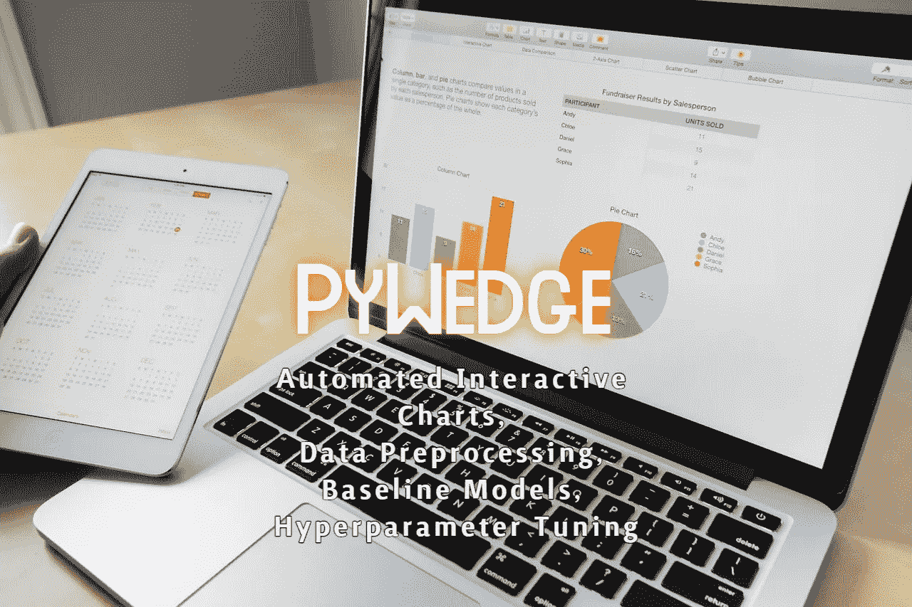
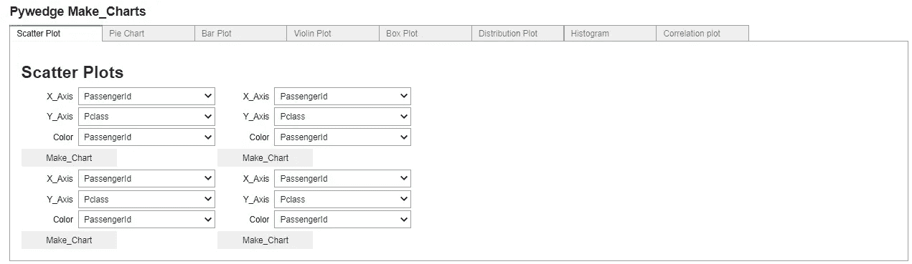
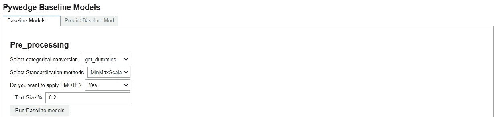
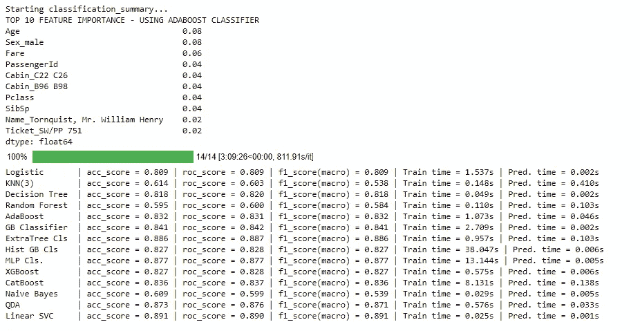
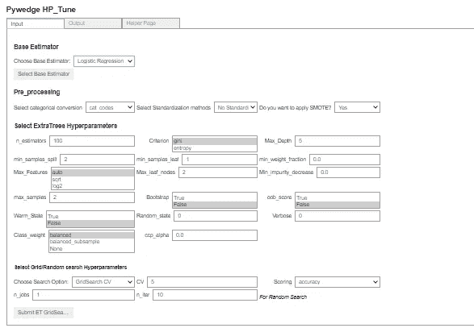

# 用几行 Python 代码实现 EDA、建模和超参数调整的自动化交互式软件包

> 原文：<https://towardsdatascience.com/automated-interactive-package-for-eda-modeling-and-hyperparameter-tuning-in-a-few-lines-of-228c561fa63c?source=collection_archive---------10----------------------->

## PyWedge —加快数据科学建模工作流程的交互式包



图片由 [StockSnap](https://pixabay.com/users/stocksnap-894430/?utm_source=link-attribution&amp;utm_medium=referral&amp;utm_campaign=image&amp;utm_content=925900) 来自 [Pixabay](https://pixabay.com/?utm_source=link-attribution&amp;utm_medium=referral&amp;utm_campaign=image&amp;utm_content=925900)

数据科学家将大部分时间花在执行探索性数据分析(EDA)上。数据科学建模管道有各种组件，包括 EDA、数据处理、超参数调整、基线建模和模型部署。

有各种开源 Python 库可以加速管道上的一些组件。阅读[这篇文章](/4-libraries-that-can-perform-eda-in-one-line-of-python-code-b13938a06ae)到 4 个这样的可以自动化 EDA 组件的库。当涉及到从 EDA、数据处理、基线建模和超参数调整模型开始的整个建模流程的自动化时，需要花费数据科学家大量的时间和精力。

在这里，PyWedge 开始发挥作用，它可以自动化整个建模工作流，包括 EDA、数据处理、基线建模和超参数调整。在本文中，我们将讨论 PyWedge 的实现和使用。

# PyWedge 是什么？

PyWedge 是一个开源 Python 库，可以自动化数据科学建模管道的几个组件。它可以被视为交互式 EDA、数据处理、基线建模和超参数调整的完整套件。

PyWedge 提供了几个特性，包括:

*   创建可视化的交互图，包括散点图、条形图、小提琴图、相关图等。
*   使用开发人员选择的输入处理技术进行数据处理。
*   训练数十种机器学习算法的各种基线模型训练，并返回每个模型的性能指标。
*   交互式执行超参数调整小部件样式选项卡。

## 安装:

PyWedge 可以从 PyPl 安装，使用:

```
**!pip install pywedge**
```

它可以通过以下方式导入 Python:

```
**import pywedge as pw**
```

# 用法:

> 本文使用的数据集是 Titanic dataset，从 Kaggle 下载。这是一个二进制分类数据，目标类是“幸存”。

首先，开发人员需要使用 Pandas 导入数据集:

```
**import pandas as pd
df = pd.read_csv("titanic.csv")**
```

## 探索性数据分析:

模型构建管道的第一个组件是 EDA。PyWedge 可以用一行 Python 代码执行 EDA。它生成 8 种类型的交互图，包括散点图、饼图、小提琴图、条形图、箱线图、分布图、直方图和相关图。

```
**mc = pw.Pywedge_Charts(df, c=None, y="Survived")
chart = mc.make_charts()**
```



(图片由作者提供)，使用 PyWedge 绘制图表的交互式选项卡

## 基线建模:

PyWedge 可以使用函数`**baseline_model**` 对各种分类和回归机器学习算法进行基线建模。建模从数据预处理开始，它依赖于开发人员使用各种数据处理技术。

输入参数:

*   分类列编码技术:熊猫猫代码，或得到假人。
*   色谱柱标准化:标准定标器、鲁棒定标器、最小-最大定标器。
*   选择是否使用 SMOTE 来平衡等级。
*   列车测试数据分割



(图片由作者提供)，使用 PyWedge 训练基线模型的交互式选项卡

`**baseline_model**` 函数训练训练数据，并使用若干机器学习算法使用测试数据预测性能，并返回模型摘要报告，该报告提供前 10 个重要特征及其重要性分数。



(图片由作者提供)，模型总结

## 超参数调谐:

Pywedge_HP 有两个函数`**HP_Tune_Classification**`、`**HP_Tune_Regression**`来执行超参数调谐。

```
**pph = pw.Pywedge_HP(train, test, c=None, y='Survived')
pph.HP_Tune_Classification()**
```



(图片由作者提供)，使用 PyWedge 调整基线模型的超参数交互式选项卡

# 结论:

在本文中，我们讨论了 PyWedge 库的实现和使用，它可以自动化 EDA、数据处理、建模、超参数调整，从而扩展数据科学家的工作流程。建议使用自定义 python 包执行 EDA，以便更好地理解数据。然而，基线建模和超参数调整可以使用 PyWedge 来完成，因为它加快了方法的速度。

> 阅读下面的文章，了解 4 个可以在一行代码中执行 EDA 的库。

[](/4-libraries-that-can-perform-eda-in-one-line-of-python-code-b13938a06ae) [## 4 个可以在一行 python 代码中执行 EDA 的库

### 使用 Pandas Profiling、Sweetviz、Autoviz 和 D-Tale 进行探索性数据分析

towardsdatascience.com](/4-libraries-that-can-perform-eda-in-one-line-of-python-code-b13938a06ae) 

# 参考资料:

[1] PyWedge 文档:[https://pypi.org/project/pywedge/](https://pypi.org/project/pywedge/)

> 感谢您的阅读