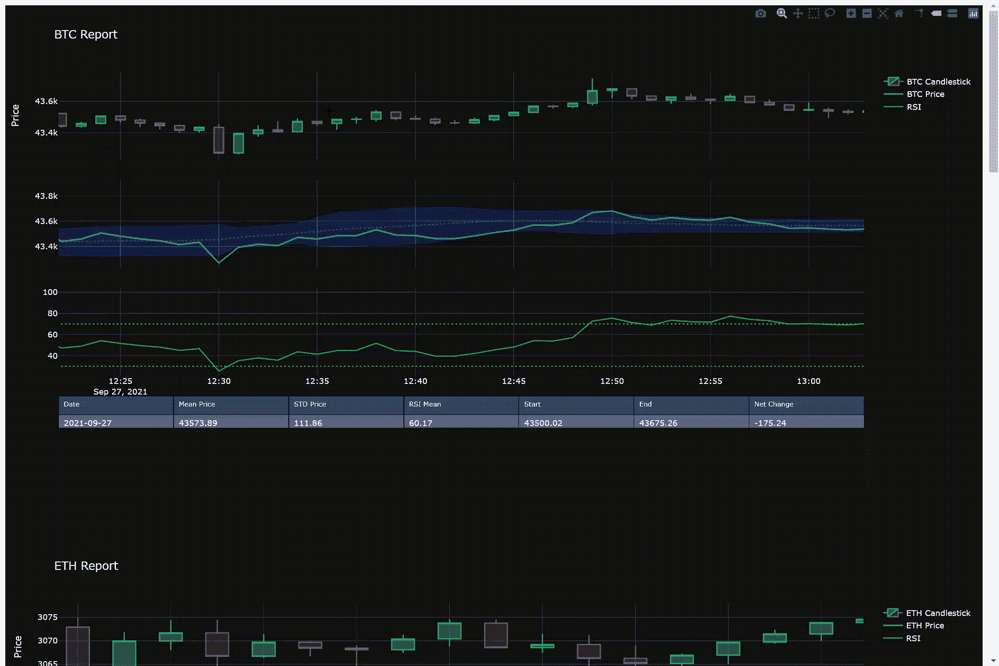
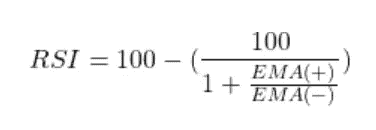

# 使用 Plotly 和 Python 自动生成交互式报告

> 原文：<https://towardsdatascience.com/automated-interactive-reports-with-plotly-and-python-88dbe3aae5?source=collection_archive---------9----------------------->

## 使用 Python 中的 Plotly 轻松生成交互式报告

Plotly 中的交互式加密货币报告(Gif 由作者提供)

生成报告是一项单调乏味的任务。相反，使用 Plotly 在 Python 中开发并创建自动化的交互式报告。

本文将讨论为不同的加密货币创建自动化交互报告所需的步骤。然后，最终报告被合并成一个单独的 HTML 文件，该文件在没有外部服务器的情况下保持 Plotly 的交互功能。

> 生成报告的完整代码在本文中。请随意收藏这篇文章以备将来使用。

生成报告的方法遵循 ETL 过程。

*   **首先是**，数据被提取出来，在这种情况下，不同加密货币的价格
*   **接下来**，信息被转换，生成有用的指标和互动的图形
*   **最后一个**，数据被加载到一个包含所有报告的 HTML 文件中。

# **提取数据和财务分析**

该报告使用了几种不同加密货币的价格数据。数据是使用免费的 Alpha Vantage API for python 提取的。

使用这个 API，您可以提取不同的股票、货币和加密价格。

用 Alpha Vantage 提取财务数据(作者代码)

## **烛台图表**

蜡烛图是市场数据的标准可视化工具。这些图显示了股票的开盘价、收盘价、最低价和最高价。

由于市场中的价格不断变化，这些值代表了一天中每分钟的交易模式。

## **布林线**

理解股票的波动性是理解风险的关键。布林线代表市场的波动。

使用移动平均线和滚动标准差计算波段。上带是用移动平均线加两个标准差确定的，下带是负两个标准差。

当市场波动越大，波段之间的差距越大。当波动性较小时，差距缩小。这些波段也有助于理解股票的价格范围。

## **相对强度指数**

RSI 是一个动量指标。该值的范围在 0 到 100 之间。因此，该指数表明股票是超买还是超卖。

指数移动平均线的相对强度指数(作者提供图片)

惯例是 RSI 在 70 以上时超买，30 以下超卖。

RSI 也可以揭示市场趋势。比如 RSI 在 50 以上时，有上升趋势，RSI 在 50 以下时有下降趋势。

计算熊猫的 RSI(作者代码)

# **编写报告**

我结合了 Plotly 的几种绘图类型，展示了开发报告的一些可用功能。这些图是使用 python 创建的。然而，从许多其他编程语言，包括 R 或 Julia，都有扩展。

这些报告旨在显示信息、一些指标和市场数据变化的高级表格摘要。

## **数据表**

尽管图表能够有效地表现数据的行为，但仍然需要汇总。数据表非常适合于具体的数据快照。

在 Plotly 中，数据表是一个内置函数，可以与其他绘图无缝集成。Plotly 中的交互功能有限，但默认情况下，您可以重新排列数据表中的列。

汇总财务数据(按作者编码)

## **填充区域系列**

构建布林线时，混乱的图表成为一个问题。数字太多会对图表的整体信息不利。

这里我使用了 Plotly 的填充区域功能。虽然每个时间序列都有一个填充选项，但要正确设置并不容易。

标准填充选项“至零”和“至下一层”会导致不规则的行为。所以取而代之的是使用单个散点图，它的长度是整个图表的两倍。

实际上，高频带和低频带作为列表附加在一起，形成两倍长的序列。接下来，使用填充选项“toself”。以这种方式设置系列可确保 Plotly 正确地仅填充带之间的空间。

## **恒纹**

RSI 是衡量市场趋势的常用指标。当这个指标超过一个阈值时，你就可以判断股票是超买还是超卖。

因此，在图表上用一条明显的线来表示这些阈值是有帮助的。这一细节是通过附加散点图和改变标记类型来实现的，以表明这些线不是主要系列。

# **合并成一份报告**

需要合并这些图表，以便将每个图合并成一个完整的报告。在 Plotly 中，函数“make_subplots”就是为这个目的而设计的。

此外，在组合图时，您可以指定在所有报告之间共享 x 轴。该属性非常适合时间序列图，因为当您与图形交互时，每个序列都会对齐。

## **创建 HTML 报告**

设计完完整的报告后，可以将其保存为 HTML 文件。虽然这不如 PDF 常见(尽管保存为 PDF 仍然是可能的)，但 HTML 文件包括 Plotly 的交互性，而不需要外部托管。

每个图形都可以单独保存为 HTML 文件。然后，像 python 中的任何其他文件一样，您可以重复地添加到 HTML 文件中，从而创建更广泛的报告。

您还可以向文件中添加任何想要的 HTML 元素，并进一步更新 Plotly 图表元素。对于那些精通 web 开发的人来说，这提供了更大的灵活性。

## **综合所有**

整个过程被组合成一个基本的 ETL 过程。考虑为那些需要定期报告的用户设置一个事件触发器，以便使用脚本定期运行报告。

但是，报告生成过程如下:

*   **使用 API 提取**数据(这里是 Alpha Vantage)
*   **将数据转换成汇总表、财务指标和图表。**
*   将数据加载到一个 HTML 文件中，发送给相关的利益相关者。

该报告还利用了 **Plotly-Dark** 模板。

自动化财务报告(作者代码)

单一报告示例(按作者分类)

# 结论

生成报告是一项相当简单的任务。然而，尽管提供了大量的信息，当信息不被理解时，报告就失去了价值。

在本文中，我展示了如何使用 Plotly 和 python 创建不同加密货币的财务报告。该过程遵循基本的 ETL 方法，并且可以完全自动化。

在您的报告中添加动态交互可以使审阅信息对您的受众更有吸引力。使用 Plotly，您可以生成人们想要监控、阅读和探索数据的报告。

*如果你有兴趣阅读关于新颖的数据科学工具和理解机器学习算法的文章，可以考虑在 medium 上关注我。*

如果你对我的写作感兴趣，并想直接支持我，请通过以下链接订阅。这个链接确保我会收到你的会员费的一部分。

 [## 通过我的推荐链接加入 Medium-Zachary Warnes

### 阅读扎卡里·沃恩斯(以及媒体上成千上万的其他作家)的每一个故事。您的会员费直接支持…

zjwarnes.medium.com](https://zjwarnes.medium.com/membership)