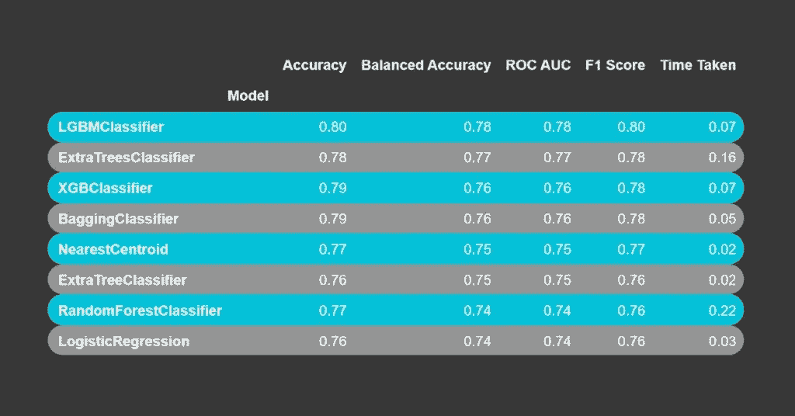
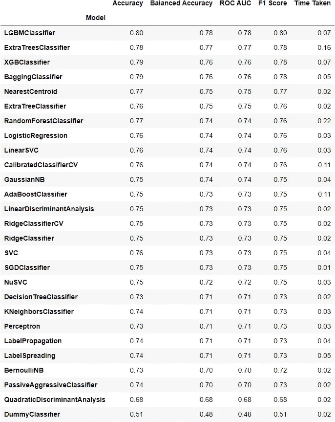

# 自动化机器学习模型测试

> 原文：<https://towardsdatascience.com/automated-machine-learning-model-testing-d0f49a36a6ac?source=collection_archive---------38----------------------->

## 使用 LazyPredict 只用几行代码就尝试了 20 多个机器学习模型



作者图片

我们都遇到过这种情况，我们不知道哪种模型最适合我们的 ML 项目，最有可能的是，我们正在尝试和评估许多 ML 模型，只是为了看看它们在我们的数据中的行为。然而，这不是一项简单的任务，需要时间和努力。

幸运的是，我们可以使用 [LazyPredict](https://lazypredict.readthedocs.io/) 只用几行代码就能做到这一点。它将运行 20 多个不同的 ML 模型，并返回它们的性能统计数据。

# 装置

```
pip install lazypredict
```

# 例子

让我们看一个使用来自 Kaggle 的[泰坦尼克号数据集的例子。](https://www.kaggle.com/c/titanic/data?select=train.csv)

```
import pandas as pd
import numpy as np
from lazypredict.Supervised import LazyClassifier, LazyRegressor
from sklearn.model_selection import train_test_split

data=pd.read_csv(‘train.csv’)

data.head()
```

在这里，我们将尝试预测是否有乘客在泰坦尼克号上幸存，因此我们有一个分类问题。

Lazypredict 还可以进行基本的数据预处理，如填充 NA 值、创建虚拟变量等。这意味着我们可以在读取数据后立即测试模型，而不会出现任何错误。然而，我们可以使用我们的预处理数据，这样模型测试将更加准确，因为它将更接近我们的最终模型。

对于这个例子，我们不做任何预处理，让 Lazypredict 做所有的工作。

```
#we are selecting the following columns as features for our models
X=data[['Pclass', 'Sex', 'Age', 'SibSp',
 'Parch', 'Fare', 'Embarked']]

y=data['Survived']X_train, X_test, y_train, y_test = train_test_split(X, y, test_size=0.2,random_state=7)# Fit LazyRegressorreg = LazyClassifier(ignore_warnings=True, random_state=7, verbose=False)#we have to pass the train and test dataset so it can evaluate the modelsmodels, predictions = reg.fit(X_train, X_test, y_train, y_test)
models
```



作者图片

如您所见，它将返回一个包含模型及其统计数据的数据框。我们可以看到基于树的模型比其他模型表现得更好。知道了这一点，我们可以在我们的方法中使用基于树的模型。

您可以从 Lazypredict 获得完整的管道和使用的模型参数，如下所示。

```
#we will get the pipeline of LGBMClassifier
reg.models['LGBMClassifier'] Pipeline(steps=[('preprocessor',
                 ColumnTransformer(transformers=[('numeric',
                                                  Pipeline(steps=[('imputer',
                                                                   SimpleImputer()),
                                                                  ('scaler',
                                                                   StandardScaler())]),
                                                  Index(['Pclass', 'Age', 'SibSp', 'Parch', 'Fare'], dtype='object')),
                                                 ('categorical_low',
                                                  Pipeline(steps=[('imputer',
                                                                   SimpleImputer(fill_value='missing',
                                                                                 strategy='constant')),
                                                                  ('encoding',
                                                                   OneHotEncoder(handle_unknown='ignore',
                                                                                 sparse=False))]),
                                                  Index(['Sex', 'Embarked'], dtype='object')),
                                                 ('categorical_high',
                                                  Pipeline(steps=[('imputer',
                                                                   SimpleImputer(fill_value='missing',
                                                                                 strategy='constant')),
                                                                  ('encoding',
                                                                   OrdinalEncoder())]),
                                                  Index([], dtype='object'))])),
                ('classifier', LGBMClassifier(random_state=7))])
```

此外，您可以使用完整的模型管道进行预测。

`reg.models['LGBMClassifier'].predict(X_test)`

```
array([0, 0, 1, 0, 1, 1, 0, 0, 0, 1, 1, 0, 1, 1, 0, 0, 1, 0, 0, 0, 0, 0,
       0, 0, 0, 1, 1, 0, 0, 1, 1, 1, 0, 0, 1, 0, 0, 0, 0, 0, 0, 1, 0, 0,
       0, 0, 0, 0, 0, 0, 0, 1, 1, 0, 0, 0, 0, 0, 0, 0, 1, 0, 1, 0, 1, 0,
       0, 1, 0, 1, 1, 0, 0, 1, 0, 0, 1, 0, 1, 0, 1, 0, 0, 0, 1, 0, 0, 0,
       0, 0, 1, 0, 1, 1, 0, 1, 0, 0, 0, 0, 1, 1, 0, 0, 0, 0, 0, 1, 0, 0,
       0, 0, 1, 1, 0, 0, 0, 1, 1, 0, 1, 0, 0, 0, 0, 0, 0, 0, 0, 1, 0, 0,
       1, 1, 0, 0, 1, 1, 0, 0, 0, 1, 1, 0, 0, 0, 0, 0, 0, 0, 0, 0, 1, 1,
       0, 1, 0, 0, 1, 0, 1, 0, 1, 1, 0, 0, 0, 0, 0, 0, 0, 0, 0, 1, 1, 1,
       0, 0, 1], dtype=int64)
```

和 LazyClassifier 一样，我们可以使用 LazyRegressor 来测试回归问题的模型。

# 总结一下

Lazypredict 可以帮助我们对哪种模型在我们的数据中表现更好有一个基本的了解。它几乎不需要任何数据预处理就可以运行，因此我们可以在读取数据后立即测试模型。

值得注意的是，有更多的方法来进行自动化机器学习模型测试，如使用 [auto-sklearn](https://automl.github.io/auto-sklearn/master/) 但安装它非常复杂，尤其是在 windows 中。