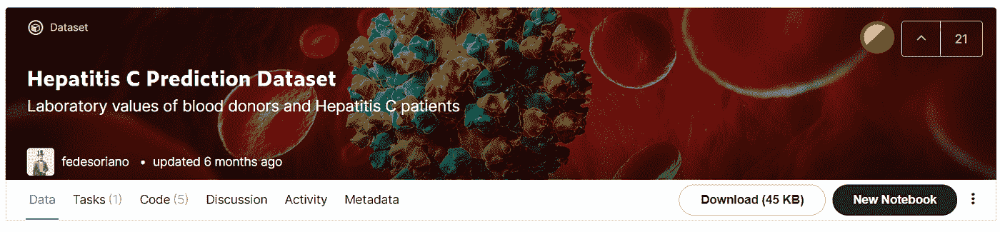

# 使用 PyCaret 的自动机器学习

> 原文：<https://towardsdatascience.com/automated-machine-learning-using-pycaret-4bb90ab3e2c7?source=collection_archive---------11----------------------->

## 用不到十行代码自动化您的机器学习工作流程

亨特·哈里特在 [Unsplash](https://unsplash.com/s/photos/data?utm_source=unsplash&utm_medium=referral&utm_content=creditCopyText) 上的照片

# 介绍

您是否希望为您的企业实施机器学习，但没有太多时间来构建它？PyCaret 可以帮助你！

PyCaret 是一个用于 Python 的开源机器学习库，可以减少您准备数据集来测试模型的时间。PyCaret 很容易使用，所以您不必花时间编写代码，直到过程结束。

更有趣的是，不到十行代码就可以拥有最好的机器学习模型！多酷啊。！

本文将向您介绍如何使用 PyCaret，从准备数据到部署模型。没有进一步，让我们开始吧！

# 实施

## 数据源

在这种情况下，我们将使用一个名为丙型肝炎预测数据集的数据集。这个数据集是 fedesoriano 在 Kaggle 上创建的。它由几个变量组成，从年龄和性别等人口统计学变量到类似生物标记的变量。您可以在这里 **访问数据集 [**。**](https://www.kaggle.com/fedesoriano/hepatitis-c-dataset)**

作者捕捉到的。

以下是加载数据集的代码，以及从中进行的预览:

从上面可以看到，有一个名为“未命名:0”的列。我们需要从数据集中丢弃该列，因为它是每一行的标识符。为了删除该列，我们运行如下代码:

## 准备数据

加载数据后，下一步是准备数据。使用 PyCaret，准备数据很简单。我们可以使用 pycaret.classification 库中的一个名为 setup 的函数。下面是实现这一点的代码:

以下是我们运行代码时的流程预览:

从上图可以看出，这说明 setup 函数只用一个函数就完成了所有的预处理步骤。我们可以填充缺失的值，转换数据集，删除异常值，等等。

如果我们想设置自定义预处理步骤，我们可以在设置功能上设置参数。对于这种情况，让我们填充数据集上缺失的值。我们可以给出一个称为 numeric _ attraction 的参数，用于填充数字列上的缺失值。我们将用该列的中值来填充缺失值。

下面是实现这一点的代码:

在我们设置参数之前，数值插补行看起来是这样的:

下面是我们设置数值插补行后的样子:

现在，我们已经将数值估算器设置为中值。除了数值插补参数，您还可以在设置功能中给出其他参数。更多详情，可以在这里 阅读 PyCaret 的文档 [**。**](https://pycaret.org/preprocessing/)

## 比较模型

PyCaret 库的一个主要特性是，你可以同时运行任何机器学习模型，从逻辑回归、决策树、XGBoost 等等！

要运行模型比较，我们可以使用 pycaret.classification 库中的 compare_model 函数。下面是代码及其结果:

从结果中，我们可以看到该模型及其度量性能。如上所述，梯度推进分类器模型在几乎所有指标上都有很好的性能。

仅在精度指标上，该模型并没有获得很好的性能。线性判别分析模型取得了较好的精度结果。

想象一下，只要一个函数，你就可以同时得到所有的模型结果！多酷啊。

因此，我们将在下一步使用梯度提升分类器。

## 再现最佳模式

现在让我们再现最佳模型，其中我们将使用梯度推进分类器作为模型。下面是代码及其结果:

## 超参数调谐

虽然该模型得到了最好的结果，但我们可以通过超参数调整来改进它。超参数调整是一个从所有超参数组合中挑选最佳超参数的过程。简单来说，超参数是一个我们可以在数据集上训练模型之前在模型上设置的参数。

在 PyCaret 中，我们可以使用 tune_model 函数来调整模型的超参数。代码及其结果如下所示:

## 模型评估

在我们得到最佳超参数组合的模型后，我们再通过看几个图表来评价模型。

在 PyCaret 中，我们可以通过使用一个函数来可视化许多图表。例如，让我们使用 plot_model 函数绘制 ROC 曲线，如下所示:

为了可视化混淆矩阵，您可以使用如下相同的函数:

在 PyCaret 中，我们还可以可视化我们的模型对数据的决策边界。代码如下所示:

除此之外，该函数还可以从数据中可视化特征的重要性。所以我们知道模型如何预测数据，哪些变量决定最终结果。下面是实现这一点的代码:

## 模型检验

现在我们知道我们的模型已经达到了很好的效果。现在让我们在看不见的数据上测试这个模型。我们可以使用名为 predict_model 的函数进行预测，并显示每个指标的性能。下面是代码及其结果:

从上面的结果可以看出，该模型的性能比我们在超参数调整阶段的性能要低。但是记住，这个数据之前没有训练过，所以结果是好的。现在让我们保存最终的模型。

## 保存模型

在保存模型之前，我们需要重新训练模型。在 PyCaret 中，我们可以使用 finalize_model 函数来做到这一点。训练过程将采用完整的数据集，包括测试数据。因此，我们可以在以后的实际测试数据上使用该模型。下面是实现这一点的代码:

现在让我们保存模型。在 PyCaret 中，我们可以使用 save_model 函数来做到这一点。下面是实现这一点的代码:

如果您想在另一个项目中加载模型，您可以像这样使用 load_model 函数:

# 结束语

干得好！现在你已经学会了如何使用 PyCaret 来自动化你的机器学习管道。希望能帮助你缩短开发机器学习模型的过程。通过这样做，你可以更专注于问题，而不是解决技术问题。

如果你对我的文章感兴趣，你可以关注我的媒体以获得更多类似的文章。如果你有任何问题或者想打个招呼，你可以在 [**LinkedIn**](https://www.linkedin.com/in/alghaniirfan/) 上联系我。

谢谢你看我的文章！