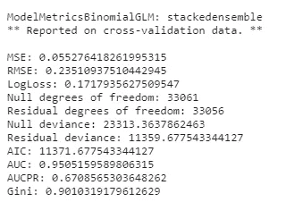

# H2O 的自动机器学习

> 原文：<https://towardsdatascience.com/automated-machine-learning-with-h2o-258a2f3a203f?source=collection_archive---------6----------------------->

## 加速您的机器学习开发周期


[拥有摄影](https://unsplash.com/@possessedphotography?utm_source=medium&utm_medium=referral)的照片在 [Unsplash](https://unsplash.com?utm_source=medium&utm_medium=referral) 上

# 什么是自动 ML？

自动机器学习(AutoML)是机器学习管道中自动化任务的过程，例如数据预处理、超参数调整、模型选择和评估。在本文中，我们将探讨如何利用 H2O 的开源自动化机器学习包来加速数据科学家的模型开发过程。

# 设置

```
pip install h2o
```

让我们导入必要的包

```
import h2o
from h2o.automl import H2OAutoML
```

初始化 H2O 集群。

```
h2o.init()
```

# 数据准备

我们将使用来自 UCI 的数据集，该数据集描述了一家银行向客户提供定期存款的营销活动。如果客户同意，目标变量为`yes`，如果客户决定不进行定期存款，目标变量为`no`。

将数据集作为`H2OFrame`加载

```
df = h2o.import_file(path='/kaggle/input/bank-marketing-campaigns-dataset/bank-additional-full.csv')
```

描述数据集。H2O 提供了 10 行样本数据以及数字列的基本汇总统计数据。

```
df.describe(chunk_summary=True)
```

将数据集分为训练集和测试集

```
train, test = df.split_frame(ratios=[0.8], seed = 1)
```

# 火车汽车模型

让我们配置 AutoML 训练参数。

*   `max_models`:训练模型的最大数量
*   `balance_classes`:设置为`True`，平衡数据不平衡任务的分类标签
*   `seed`:设定再现性

```
aml = H2OAutoML(max_models =25,
                balance_classes=True,
		seed =1)
```

我们可以通过限制以下各项来限制搜索最佳模型所花费的时间:

*   使用`max_models`的最大型号数量
*   使用`max_runtime_secs`花费的总时间
*   使用`max_runtime_secs_per_model`训练任何单一模型所花费的时间。

通过指定以下内容开始培训:

*   `training_frame`:包含训练数据的数据帧
*   `y`:包含目标变量的`training_frame`中的列

```
aml.train(training_frame = train, y = 'y')
```

此外，我们还可以指定`validation_frame`，这是一个 H2OFrame，模型在训练过程中根据它进行评估。如果未设置此参数，将使用 k 重交叉验证来评估模型。其他可选参数参考[文件](https://docs.h2o.ai/h2o/latest-stable/h2o-docs/automl.html#optional-data-parameters)。

那么引擎盖下发生了什么呢？

H2O 汽车公司按以下顺序训练和交叉验证以下模型:

1.  三个预先指定的 XGBoost GBM(梯度增压机)型号
2.  GLMs 的固定网格
3.  默认随机森林(DRF)
4.  五个预先指定的 H2O GBM
5.  一种近似默认的深度神经网络
6.  极度随机的森林(XRT)
7.  XGBoost GBMs 的随机网格
8.  H2O GBM 的随机网格
9.  深度神经网络的随机网格

此外，它还培训:

1.  上面训练的所有模型的堆叠集合
2.  包含每个算法类的最佳执行模型的“最佳系列”堆叠集成

# 估价

训练完模型后，我们可以使用排行榜来比较模型性能。H2O 汽车公司制作了一个排行榜，根据预定义的指标对训练好的模型进行排名。默认情况下，它按照 logloss 和 rmse 的升序对模型进行排序，分别用于分类和回归任务。

```
lb = aml.leaderboard
lb.head(rows=lb.nrows)
```

排行榜指标是根据交叉验证集计算的，除非在培训期间指定了`leaderboard_frame`。

```
aml.train(training_frame = train,
          y = 'y',
	  leaderboard_frame = my_leaderboard_frame)
```

在分类任务的典型机器学习评估中，我们将有兴趣了解最佳性能模型的性能，如 ROC AUC、精确度、召回率、F1、精确度、增益/提升和交叉验证数据集上的混淆度量。H2O 只用两行代码就提供了所有这些指标。

让我们得到性能最好的模型，并检查其结果。

```
best_model = aml.get_best_model()
print(best_model)
```



交叉验证数据中报告的通用指标


混淆矩阵和度量在各自的最大阈值


增益/提升图表

我们还可以使用上面显示的相同评估指标来评估维持测试集上的最佳模型。

```
best_model.model_performance(test)
```

# 保存、加载和预测

让我们保存一个二进制模型

```
model_path = h2o.save_model(model=best_model,path='/kaggle/working/model', force=True)print(model_path)>> /kaggle/working/model/StackedEnsemble_AllModels_AutoML_20210803_232409
```

保存的二进制模型可以加载到不同的笔记本中，并用于在测试集上进行预测。注意，用于训练保存的二进制模型的 H2O 版本必须与我们的推理环境中使用的版本相同。

```
import h2o #must be same version used during training of the modelh2o.init()loaded_model = h2o.load_model(path='/kaggle/working/model/StackedEnsemble_AllModels_AutoML_20210803_232409')
loaded_model.predict(test)
```

# 可解释性

H2O AutoML 还提供了模型的全局可解释性的见解，如变量重要性，部分依赖图，SHAP 值和模型相关性，只有一行代码

```
explain_model = aml.explain(frame = test, figsize = (8,6))
```

此外，它还为单个记录提供了本地可解释性。我们可以在`frame`参数中输入一个`H2OFrame`，并指出我们希望使用`row_index`参数来解释哪一行。在这种情况下，我们解释测试帧的第 15 行的结果。

```
aml.explain_row(frame = test, row_index = 15, figsize = (8,6))
```

# 结论

在本文中，我们研究了如何使用 H2O 汽车公司:

*   描述数据集
*   用最少的人工输入训练模型
*   根据训练好的模型进行预测
*   解释模型的预测

您可以在此处找到用于训练和推理的笔记本:

*   [训练](https://www.kaggle.com/edwintyh/automated-machine-learning-with-h2o)
*   [推论](https://www.kaggle.com/edwintyh/h2o-inference)