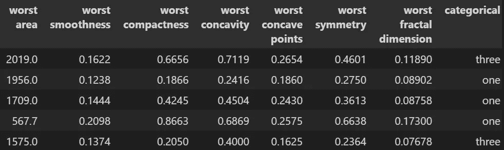

# 使用 Sklearn 管道的自动机器学习

> 原文：<https://towardsdatascience.com/automated-machine-learning-with-sklearn-pipelines-a2be2a0a6e1?source=collection_archive---------23----------------------->

## 一条管道来统治他们。


照片由 [JJ 英](https://unsplash.com/@jjying?utm_source=medium&utm_medium=referral)在 [Unsplash](https://unsplash.com?utm_source=medium&utm_medium=referral)

P ipelines 提供了自动化训练和测试模型的结构。它们可以包含列转换、缩放、插补、特征选择和超参数搜索。

通过将所有这些步骤组合成管道，可以抽象出单独的步骤。

> 这篇文章展示了如何创建一个包含 Sklearn 中每个函数的管道。
> 
> **请随意将此页面加入书签以供将来使用* *

使用这个管道，定义您的数据，根据需要更新超参数，然后点击 run。

将这些步骤中的每一步抽象成一个管道，使得构建有效模型的整个过程更具可伸缩性。

此外，根据构建和测试管道的方式，您可以快速迭代许多不同的估计器、特征选择方法和其他可能提高模型整体性能的方法。

当开始一个数据科学项目时，需要管理许多不同的任务。例如，如果不进行大量测试，就不可能知道哪种模型最适合您的问题。

一种常见的方法是从一个简单的模型开始，以提供一个基线性能。我在这篇文章中讨论了应该首先使用什么模型，以及为什么更简单的模型更好:

[](/how-to-select-an-initial-model-for-your-data-science-problem-77f7b811bd0) [## 如何为您的数据科学问题选择初始模型

### 为自己节省一些时间和麻烦，从简单开始。

towardsdatascience.com](/how-to-select-an-initial-model-for-your-data-science-problem-77f7b811bd0) 

# **设置**

在这篇文章中，我使用了乳腺癌数据集。但是，管道还将展示列转换功能。因此，数据集用一个用于转换的虚拟分类变量来扩展。

这种改变是通过添加一个随机分类列来完成的。

```
import pandas as pd
from scipy.stats import uniform, geom, loguniform, randint, expon
from sklearn import ensemble, neighbors, tree, linear_model, svm, naive_bayes, gaussian_process, feature_selection, preprocessing, impute, metrics, decomposition, compose
from sklearn.model_selection import train_test_split, RandomizedSearchCV
from sklearn.metrics import roc_auc_score
from sklearn.pipeline import make_pipeline, Pipeline as Pipeline
from sklearn.datasets import load_breast_cancer
import itertools
import random
import pickleTEST_SIZE = 0.1
RANDOM_STATE = 10
data = load_breast_cancer()
df = pd.DataFrame(data.data, columns=data.feature_names)
df['target'] = data.target
X = df.drop(['target'], axis=1)
X['categorical'] = random.choices(['one', 'two', 'three'], k=len(X))
y = df['target'].astype(float)
X_train, X_test, y_train, y_test = train_test_split(X, y, test_size=TEST_SIZE, random_state=RANDOM_STATE, stratify=y)
```

本文中生成的管道是为二进制分类问题而创建的。然而，管道也支持回归问题。

为了针对回归问题调整管道，更新输入的数据、测试中使用的模型和评分标准。然后，管道的其余部分可以保持不变。



带有随机分类变量的乳腺癌数据集(图片由作者提供)

# **管道设置**

本节旨在从头到尾建立一个完整的管道，涵盖 sklearn 必须为监督学习提供的每种类型的功能。

不幸的是，sklearn 中的一些函数本质上有无限的可能性。例如，以一个简单的逻辑回归函数为例。理论上，正则化参数是一个连续变量，它使得可能的流水线的数量是无限的。

因为 sklearn 函数本质上有无限的排列，最终的管道将展示监督学习管道中每种类型的至少一个函数。

此外，由于最终管道将测试多个模型、特征选择技术、插补方法、缩放器和变换，因此管道的设置与其他示例所示略有不同。

然而，这种设置被设计成易于遵循和根据需要改变组件。

# **元参数**

```
N_ITER = 1
N_JOBS = 1
K_FOLDS = 10
VERBOSE = 0
SCORING_METRIC = 'roc_auc'
SCORING_FUNCTION = metrics.roc_auc_score
MAX_ITER = 10000
LOGISTIC_REGRESSION_SOLVER = 'sag'
OPTIMAL_MODEL_FILENAME = 'optimal_model.pickle'
categorical_feature_names = ['categorical']
best_score = 0
```

与超参数相比，元参数控制如何设置问题、如何执行计算以及如何跟踪结果。

这里我提供几个选项。

*   要改变超参数优化中执行的迭代次数，调整 **N_ITER** 。
*   为了改变具有额外计算能力的模型的作业数量，调整 **N_JOBS** 。
*   要调整验证的折叠数，请调整 **K_FOLDS** 。
*   **SCORING_METRIC** 是被监督问题的评估指标
*   **计分函数**是计分指标的函数。由于管道设置，函数和名称都是必需的。
*   **最大 ITER** 和**逻辑回归求解器**支持逻辑回归和支持向量机模型的收敛。其他解算器和这些模型的收敛性存在一些问题。这些参数缓解了这些问题。
*   **OPTIMAL_MODEL_FILENAME** ，存储所有模型类型的最优模型的名称。基于评分标准的最佳分数
*   **分类特征名称**，转换为二元变量的分类特征列表。
*   **best_score** ，一个跟踪流水线优化的最佳分数的变量。

# **型号**

例如，要测试的模型定义如下。元组列表，其中元组的第一个元素是模型(回归或分类器)，第二个元素是超参数优化期间使用的参数网格。元组的第三个元素是超参数优化期间模型的迭代次数。

因为每个模型的超参数的数量不同，所以为每个模型指定迭代的次数。例如，对于一个随机森林分类，大约有一打不同的超参数。然而，对于逻辑回归，只有几个超参数。因此，寻找最佳模型需要较少的迭代。

```
models = [
    (ensemble.RandomForestClassifier(),{
    'model__n_estimators': randint(50,500),
    'model__max_depth': randint(3,10),
    'model__max_features': ['sqrt'],
    'model__min_samples_split': randint(2,20),
    'model__min_samples_leaf': randint(1,10),
    'model__criterion': ['gini', 'entropy'],
    'model__ccp_alpha': loguniform(0.1e-5, 0.1e-0)
    }, 1),

    (neighbors.KNeighborsClassifier(),{
    'model__n_neighbors': randint(3,20),
    'model__weights': ['uniform', 'distance'],
    'model__algorithm': ['auto', 'ball_tree', 'kd_tree', 'brute']
    }, 1),

    (svm.SVC(probability=True, max_iter=MAX_ITER),{
    'model__C': loguniform(3e-4, 3e-1),
    'model__kernel': ['linear', 'poly', 'rbf', 'sigmoid']
    }, 1), (linear_model.LogisticRegression(solver=LOGISTIC_REGRESSION_SOLVER,
    max_iter=MAX_ITER),{
    'model__C': loguniform(3e-4, 3e-1),
    'model__penalty': ['none', 'l2'],
    'model__class_weight': ['balanced', None]
    }, 1),

    (naive_bayes.GaussianNB(),{}, 1),
]feature_selectors = [
    (feature_selection.SelectFromModel(linear_model.LogisticRegression()),{
    'feature_selection__estimator__penalty': ['l2'],}),
    (decomposition.PCA(),{'feature_selection__n_components': randint(2, 5),}),
]scalers = [
    (preprocessing.MinMaxScaler(),{}),
    (preprocessing.RobustScaler(),{'scaler__quantile_range': [(25.0, 75.0),
    (10.0, 90.0)] })
]imputation = [
    (impute.SimpleImputer(),
    {'imputer__strategy': ['mean', 'median']})
]transformers = [
    (preprocessing.OneHotEncoder(),
    {'column_transformer__transformer__drop': ['first', 'if_binary', None]})
]hyparameters = list(
    itertools.product(
    transformers, imputation, scalers, feature_selectors, models
))
```

设置每组的参数以支持超参数优化中使用的随机网格搜索。对于连续变量，参数期望分布。这些是使用 scipy 库定义的，该库允许预先指定发行版。当超参数是分类的时，超参数可以简单地固定为一个列表。

使用 itertools 包建立完整的超参数网格。该包中的产品功能在每个参数网格之间创建所有可能的配置。

通过以这种方式设置超参数，迭代处于单个循环中。

这个相同的过程可以使用多个循环来完成。然而，为了便于阅读，itertools 将这些众多的列表压缩成一个列表。

注意每个超参数的命名。参数的前缀与管道中使用的名称相匹配。sklearn 知道什么参数去哪里的方式是基于参数的名称。

当管道中有链接的函数时，名称会稍有变化。例如，“feature_selection _ _ estimator _ _ penalty”对应于管道中的“feature _ selection”命名步骤，对于此选项，它是 SelectionFromModel 特征选择方法。“估计值”部分对应于 SelectionFromModel 中的估计值参数。最后，“惩罚”部分对应于 SelectionFromModel 中使用的估计量的惩罚参数，它是为逻辑回归而设置的。

双下划线“__”指定一个函数何时在另一个函数中使用，以控制哪个函数转到管道步骤中的不同函数。

# **迭代**

下面的循环遍历每个参数组合，并为每个配置优化一个模型。

```
for transformer_params, imputer_params, scaler_params, feature_selection_params, model_params in hyparameters:
    hyperparameter_dict = {
        **transformer_params[1],
        **imputer_params[1],
        **scaler_params[1],
        **feature_selection_params[1],
        **model_params[1]
    }
    column_transformer = compose.ColumnTransformer(
        [('transformer', transformer_params[0],categorical_feature_names)],
        remainder="passthrough"
    ) pipe = Pipeline(steps=[
        ('column_transformer', column_transformer),
        ('scaler', scaler_params[0]),
        ('imputer', imputer_params[0]),
        ('feature_selection', feature_selection_params[0]),
        ('model', model_params[0])
    ])
    optimal_model = RandomizedSearchCV(
        pipe, hyperparameter_dict,
        n_iter = model_params[2], cv=K_FOLDS,
        scoring=SCORING_METRIC, n_jobs = N_JOBS,
        return_train_score=True, verbose = VERBOSE
    )
    optimal_model.fit(X_train, y_train)

    y_pred = optimal_model.best_estimator_.predict(X_train)
    y_pred_prob = optimal_model.best_estimator_.predict_proba(X_train)[:,1]
    y_pred_test = optimal_model.best_estimator_.predict_proba(X_test)[:,1]
    score = SCORING_FUNCTION(y_test, y_pred_test) print(
        'Optimal Training Score: ', optimal_model.cv_results_['mean_train_score'][optimal_model.best_index_],
        '\Optimal Test Score: ', optimal_model.best_score_,
        '\nHold Out Test Score: ', score
    )
    if score > best_score:
        best_score = score
        pickle.dump(optimal_model, open(OPTIMAL_MODEL_FILENAME, 'wb'))
```

分解每个组件:

*   通过组合来自流水线中每个步骤的超参数来创建单个字典。
*   列转换器是在管道之前单独创建的。此转换器为特征转换启用了单独的路径。
*   管道“管道”已创建。步骤是一个元组列表，其中第一个元素是步骤的名称。(此名称匹配与步骤相关的超参数的前缀)。第二个要素是该步骤的函数，无论是缩放、插补还是预测。
*   使用随机超参数搜索来确定最佳模型。这种搜索从超参数空间采样，用于每个模型所需的几次迭代。
*   使用评分功能评估培训、测试和坚持测试的结果。
*   如果模型的得分比当前的最佳模型好，则使用 pickle 存储该模型。

注:这里使用随机搜索，因为它比网格搜索更有可能找到最佳模型。有关不同超参数搜索方法的详细信息以及随机搜索优于网格搜索的原因，请阅读以下帖子:

[](/hyperparameter-tuning-always-tune-your-models-7db7aeaf47e9) [## 超参数调整—始终调整您的模型

### 不要放弃免费的性能提升。

towardsdatascience.com](/hyperparameter-tuning-always-tune-your-models-7db7aeaf47e9) 

# **结论**

Sklearn 管道提供了很大的灵活性。然而，他们可能会面临挑战。

通常，在构建管道时，可用的示例仅显示了管道的特定部分。因此，将这些碎片放在一起并不总是简单的。

该代码允许 sklearn 中的大多数可用功能自动使用或稍加调整即可使用。希望这条管道能让你的发展流动起来。

*如果你有兴趣阅读关于新颖的数据科学工具和理解机器学习算法的文章，可以考虑在 Medium 上关注我。*

*如果你对我的写作感兴趣，想直接支持我，请通过以下链接订阅。这个链接确保我会收到你的会员费的一部分。*

[](https://zjwarnes.medium.com/membership) [## 通过我的推荐链接加入 Medium-Zachary Warnes

### 阅读扎卡里·沃恩斯(以及媒体上成千上万的其他作家)的每一个故事。您的会员费直接支持…

zjwarnes.medium.com](https://zjwarnes.medium.com/membership)