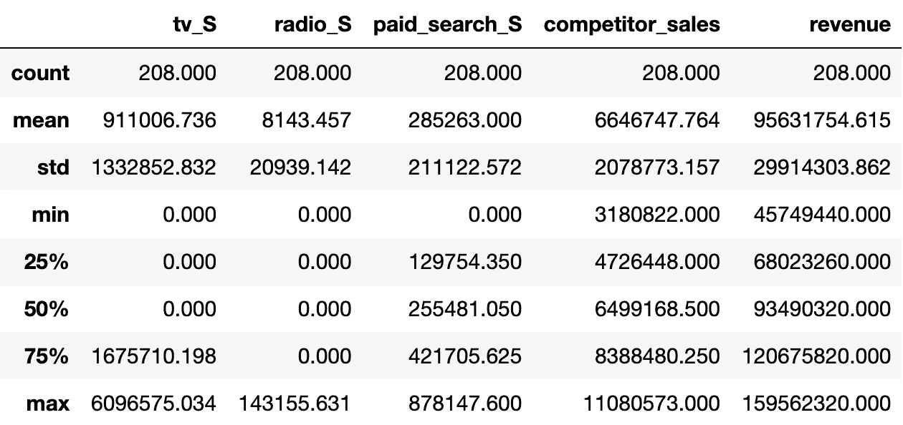
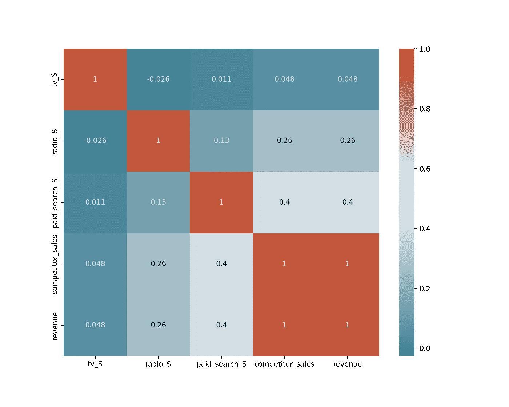
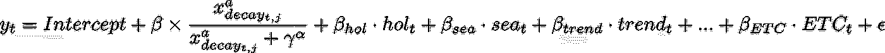
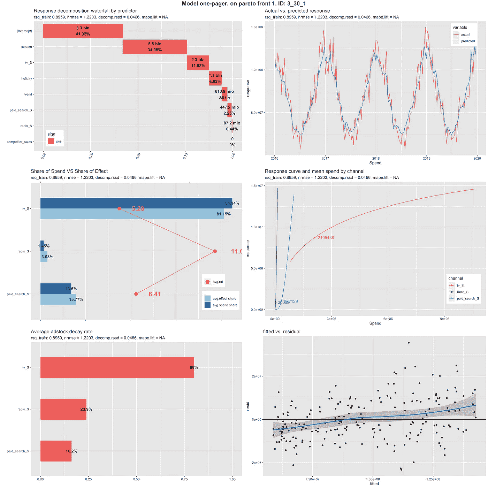
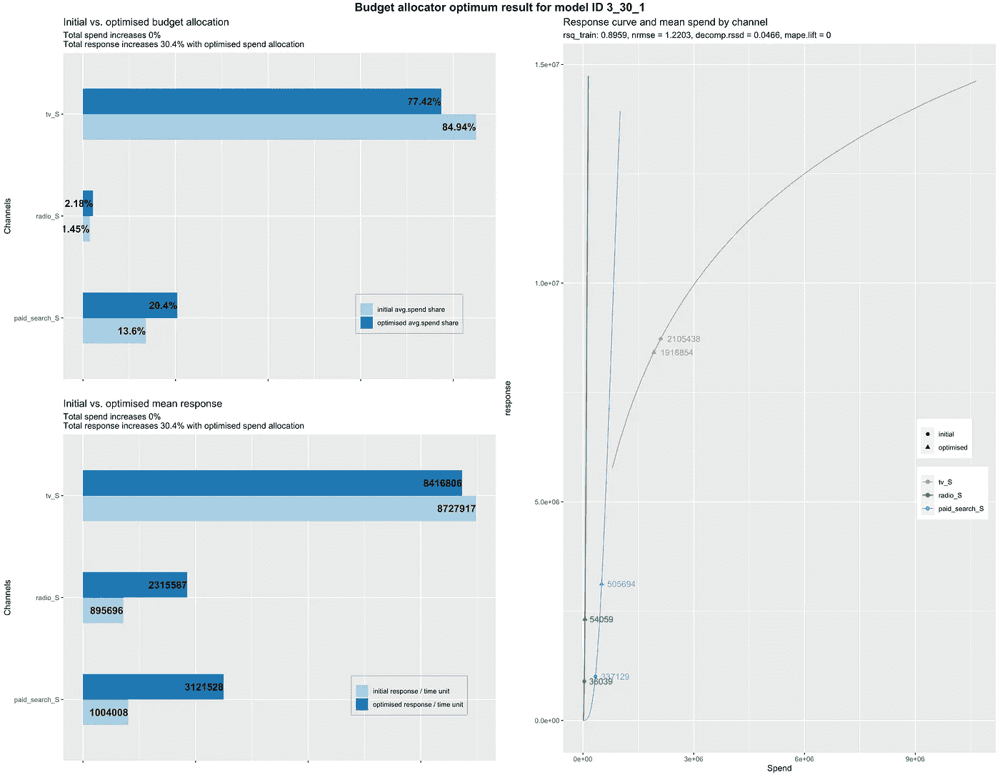

# 脸书实验公司的 Robyn 为自动化营销组合建模

> 原文：<https://towardsdatascience.com/automated-marketing-mix-modeling-with-facebooks-robyn-fd79e60b489d?source=collection_archive---------1----------------------->

## 营销组合建模的新工具概述


[斯科特·格雷厄姆](https://unsplash.com/@homajob)在 [Unsplash](https://unsplash.com/) 上拍照。

这篇文章为你提供了脸书实验的罗宾的第一个概述。由于脸书营销科学团队已经创建了一个很棒的[快速入门指南](https://facebookexperimental.github.io/Robyn/docs/quick-start)和[非常详细的页面](https://facebookexperimental.github.io/Robyn/docs/step-by-step-guide)，我尽量保持文章简短切题。详细解释可以在这里找到更多[信息。](https://facebookexperimental.github.io/)

## **TL；博士**

*   脸书实验公司的 Robyn 是一个自动营销组合建模(MMM)代码，目前处于测试版。
*   它为特征转换提供了两种 adstock(几何和威布尔)和一种 s 曲线转换(收益递减)技术。
*   为了考虑时间序列的特征，罗宾使用了脸书先知。
*   它利用脸书的 [Nevergrad 无梯度优化平台](https://facebookresearch.github.io/nevergrad/)生成一组 Pareto 最优模型解。
*   为了增加模型的准确性，它允许你包含随机控制实验的结果。

# 在我们开始之前…为什么 MMM 如此重要？

每个营销人员都有两个大问题:我当前的营销渠道有什么影响？和*我应该如何战略性地分配我的预算*以获得最佳营销组合？

这些问题并不新鲜。约翰·沃纳梅克(1838-1922)被一些人认为是市场营销的先驱，他也有同样的问题，并因其著名的经常被引用的名言而闻名:

> 我一半的广告支出都浪费了；问题是，我不知道是哪一半。

为了应对这些挑战，计量经济学家开发了被称为营销组合建模(MMM)的多元回归技术。这个领域的一个非常新的工具是脸书的 Robyn，目前它还处于测试阶段。脸书实验小组将罗宾描述为

> [……]自动化营销组合建模(MMM)代码。它旨在通过岭回归和进化算法减少人为偏差，通过提供预算分配器和收益递减曲线实现可操作的决策制定，并允许对因果关系进行地面实况校准。

在下文中，我会给你一个 Robyn 的功能和主要思想的快速概述。由于它仍处于测试版本，所使用的代码和概念可能会发生变化。你可以在这里找到它的最新版本。

# 使用的数据集

为这篇文章找到一个合适的开放数据集是相当棘手的，所以我使用谷歌的[aggregate 营销系统模拟器](https://github.com/google/amss) (AMSS)来生成一个简单的数据集。如果你对 AMSS 的更多细节感兴趣，你可以在这里找到他们的论文[，如果你想用我用过的数据集，你可以在这里](https://research.google/pubs/pub45996/)[找到](https://github.com/darinkist/medium_article_robyn/blob/main/simulated_marketing_data.csv)。

您将在下面找到营销数据的描述表和图表，以便更好地熟悉数据集。



表 1。数据集的描述性指标(图片由作者提供)。

使用的数据集基于每周数据，包含 208 个条目。所有数值均以欧元(€)为单位，不存在北美数值。我们的**目标变量**是**收入**，而其他列是可以用来解释它的特性。

以 **_S** 结尾的栏目是我们按渠道(电视、广播、付费搜索)划分的营销预算支出。我们的竞争对手销售额由自我解释栏**竞争对手 _ 销售额**给出。

描述表中没有显示的一列是**日期**列，以格式 *YYYY-MM-DD* 表示相应的周。

图 1 显示了一段时间内的收入、收入构成、竞争对手的销售和营销费用。


图一。收入、收入构成、销售和支出随时间变化的可视化(图片由作者提供)。

我们可以清楚地看到收入的季节性(A1)以及一点趋势(A2)。还可以看到，竞争对手的销售遵循与我们的收入非常相似的模式，我们在春季的广播费用和季节性以及付费搜索费用的趋势方面存在差距。

图 2 显示了我们的数据集的相关图，以初步了解变量之间的关系。



图二。我们数据集的相关图(图片由作者提供)。

我们可以看到竞争对手的销售额和我们的收入之间有很高的相关性，其次是我们的付费搜索费用和我们的收入以及竞争对手的销售额之间的相关性较低，为 0.4。

现在，您对数据集稍微熟悉了一些，让我们现在使用 Robyn。

# 建立我们的 MMM 项目

为了获得 Robyn 的最新版本，我们将它的存储库克隆到我们的机器上:

```
git clone https://github.com/facebookexperimental/Robyn
```

在我们克隆了存储库之后，我们创建了一个名为 **plots** 的**新文件夹**来存储后来结果的可视化。

您的文件夹结构现在应该如下所示:

```
Robyn/
├── *CHANGELOG.md*
├── *CODE_OF_CONDUCT.md*
├── *CONTRIBUTING.md*
├── *LICENSE.md*
├── *README.md*
├── **Robyn.Rproj** ├── **plots** ├── **source**
│   ├── *de_simulated_data.csv*
│   ├── **fb_robyn.exec.R**
│   ├── *fb_robyn.func.R*
│   ├── *fb_robyn.optm.R*
│   └── *holidays.csv*
├── *website*
```

我们感兴趣的主文件位于**源文件夹**中，名为 **fb_robyn.exec.R** 。这是我们必须设置配置和运行争论、建模、优化以及预算分配(如果需要)流程的文件。

但是在我们去那里之前，让我们简短地看一看 Robyn 使用了什么(建模)技术。

# 罗宾的技术

以下几点从较高的层面描述了罗宾的内心世界。有关更多详细信息和解释，请参见他们的[文档](https://facebookexperimental.github.io/Robyn/docs/)。

## **岭回归**

开发人员使用正则化方法的动机是解决许多回归变量之间的多重共线性，并防止模型过度拟合。图 3 显示了该模型的方程以及函数的主要组成部分。



图 3。通过[Facebook experiment](https://facebookexperimental.github.io/Robyn/docs/ridge-regression)建立模型方程。

其中 yₜ是我们的因变量**在时间 *t* 的收入**。自变量由**截距**定义，随后是 **ad-stock** 和 **s 曲线** **变换分量**用于每种媒体 *j* 。**节假日**、**季节性**和**趋势**效果分别用*节假日*、*节假日*和*趋势*来表示。**附加** **独立** **变量**由*等*定义，后跟误差项 *ε* 。

## 特征转换选项

MMM 中非常常见的转换技术是 ad-stock 和 s 曲线(收益递减)转换。

**广告股票转型** 广告股票转型背后的想法是，广告效应通常**不会立即**生效。它们有一个**半衰期**。顾客(通常)不会在看到你的广告后立即跑到商店购买你的产品。你的广告需要一些时间来适应。

罗宾在这里提供了两种方法，经典的几何方法和更灵活的 T2 威布尔生存函数。更深入的解释请见[文件](https://facebookexperimental.github.io/Robyn/docs/variable-transformations)。

S 曲线(收益递减)转变
这种转变背后的基本思想是，随着时间的推移，广告会失去其有效性，即使给它分配了更多的钱。

## 趋势、季节性和假日效应

为了在模型中包含趋势、季节性或假日等时间序列特征或成分，Robyn 使用了 Facebook[Prophet](https://facebook.github.io/prophet/)。

## 自动化超参数选择和优化

Robyn 使用[脸书的 Nevergrad 无梯度优化平台](https://facebookresearch.github.io/nevergrad/)执行多目标优化，通过提供一组帕累托最优模型解决方案来平衡支出份额和渠道系数分解份额之间的关系。

这些帕累托最优模型解是多次迭代(即，20，000 次迭代和可能的模型解)运行进化算法(自然选择)的结果

## 使用实验结果进行校准

Robyn 允许我们应用随机控制实验的结果来提高模型的准确性，其中这些结果被用作缩小媒体变量系数的先验。

这部分内容不在本文讨论范围内。如果你对更多细节感兴趣，你可以在这里找到他们的[文档](https://facebookexperimental.github.io/Robyn/docs/calibration)。

# MMM 配置

现在我们对 Robyn 的技术有了一个基本的概述，让我们继续我们的用例。您将在本文末尾找到完整的代码。

我们经营罗宾。使用 R-Studio 运行 Rproj，并打开位于源文件夹中的 fb_robyn.exec.R。

## **避免时间序列特征的错误**

如果您的操作系统不是英语，您应该做的第一件事是取消第 13 行的注释:

否则，您将在数据争论过程中出错(第 166 行)。

## **安装并加载库**

确保安装所有使用的库，创建一个名为 *r-reticulate 的 conda 环境，安装* nevergrad 并使用创建的 conda env。

## 加载数据

现在是时候加载我们的 csv 文件了。开发团队已经提供了一个名为 de_simulated_data.csv 的文件。

开发团队还提供了一个假日文件，其中包括几个国家(如美国、英国、印度、德国)的公共假日。

## 设置模型输入变量

在这一部分，我们将代码中的配置链接到数据集中的列。这一部分非常重要，因为在自动化数据争论过程中，打字错误会导致错误。

## 设置全局模型参数

Robyn 允许我们使用**几何**或**威布尔**股票技巧。在本文中，我们将继续使用几何方法，但是尝试一下威布尔技术绝对是值得的。

由于 Robyn 使用 Nevergrad，我们必须选择一种算法以及试验次数。这里我们也坚持默认的。

## 设置超参数界限

根据我们定义的变量和使用的 ad-stock 方法，我们必须设置它们的超参数界。

## 运行模型

现在我们已经设置了所有的参数，我们可以使用下面的代码来运行我们的模型。

Robyn 现在正在运行，并将在我们指定的**绘图文件夹**中自动生成绘图。

## 输出和诊断

建模过程完成后，您应该在 plots 文件夹中找到几个文件。

这些图(以模型 id 作为其名称)代表基于 Pareto 最优过程(pareto_front.png)的最优模型解决方案，并为我们提供关于超参数选择(hypersampling.png)的附加信息。

图 4。显示了其中一种型号(3_30_1)的单页型号。



图 4。单页纸模型(图片由作者提供)。

**响应分解瀑布通过预测器**
显示每个特性对响应变量(收入)影响的百分比。在本例中，34.08%的收入可归因于季节性，11.62%可归因于电视广告等。

**支出份额与效果份额** 该图描述了各渠道的支出份额和效果份额。除此之外，它还显示了每个渠道的投资回报率(ROI)。对于我们的例子，我们可以看到频道广播的投资回报率最高，其次是电视和付费搜索。这也表明，电视上的平均费用比他们的平均效果份额大一点。这可能意味着他们正遭遇一些收益递减。

**平均广告库存衰减率** 显示每个渠道的百分比衰减率。衰变率越高，衰变效应持续的时间越长。对于这个例子，频道 TV 具有最高的平均衰减率。

**实际响应与预测响应** 该图将实际响应与我们的预测进行比较。我们的目标是我们的模型能够解释数据中的大部分差异。因此，我们寻求高 R 平方(rsq)和低 NRMSE。

**响应曲线和渠道平均支出** 表明每个渠道的饱和程度，并可能建议潜在的预算再分配策略。观察这些曲线，它们到达拐点和平坡的速度越快，每增加一次€消耗，它们就越快饱和。对于我们的例子，广播和付费搜索的曲线没有显示任何平坦的斜率，可能需要进一步的调查。

**拟合与残差** 经典图表检查我们的回归模型是否有问题。

## 模拟预算分配

一旦我们决定了一个合理的(！！)模型，我们可以运行预算优化模拟来计算最佳媒体支出分配。我们有两种类型的模拟场景:

*   max _ historical _ response
*   最大响应预期花费

第一个将使用对模型有贡献的历史数据和花费来计算最佳媒体计划。

第二个是在给定预算和天数的情况下计算最佳媒体计划。

所有的模型都存储在*model _ output _ collect $ all solutions*变量中。假设我们想使用上面的模型(3_30_1 ),我们只需使用以下代码:

除了模型 id 和场景类型之外，我们还必须为我们使用的通道设置下限和上限。如果我们渠道的下限是 0.7，上限是 1.2，那么我们的花费变化将受到平均时间段花费的 0.7 倍和平均时间段花费的 1.2 倍的约束。

运行该代码后，Robyn 输出一个新的单页页面(图 5)。



图 5。预算分配器最佳结果单页纸(图片由作者提供)。

左图显示了如果我们遵循预算优化，预算分配和平均反应将如何变化。右侧的图表显示了每个渠道的响应曲线，以及初始平均支出水平与推荐平均支出水平的对比。

这篇文章的想法是向您提供脸书实验的 Robyn 的第一个概述，以及如何通过使用简化的数据集来使用它。对于更深入的解释，实验结果的使用，以及更多的细节，我强烈建议你查阅 [Robyn 的文档](https://facebookexperimental.github.io/Robyn/)。

与这个简短的介绍不同，在型号选择部分投入时间和精力也很重要。**只有使用合理的模型，与企业讨论结果并使用预算优化步骤才有意义。**

即使该项目仍处于测试阶段，但其背后的动机和想法及其功能非常巧妙，令人印象深刻！

如果我可以许三个愿望，我希望有一个选择，对横截面数据使用面板回归。其次，找到一种减少计算时间的方法也是很棒的。第三，类似于第一个愿望，不仅仅使用分类变量作为基线变量会很好。...如果我能做第四个 Python 的移植会很棒；)

完整文件的代码: