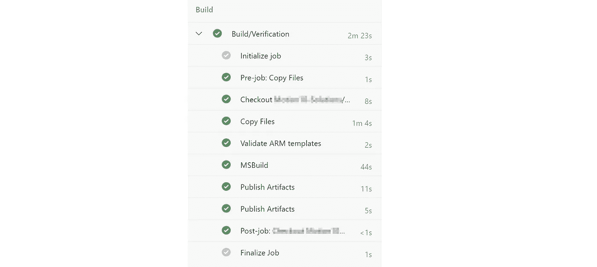
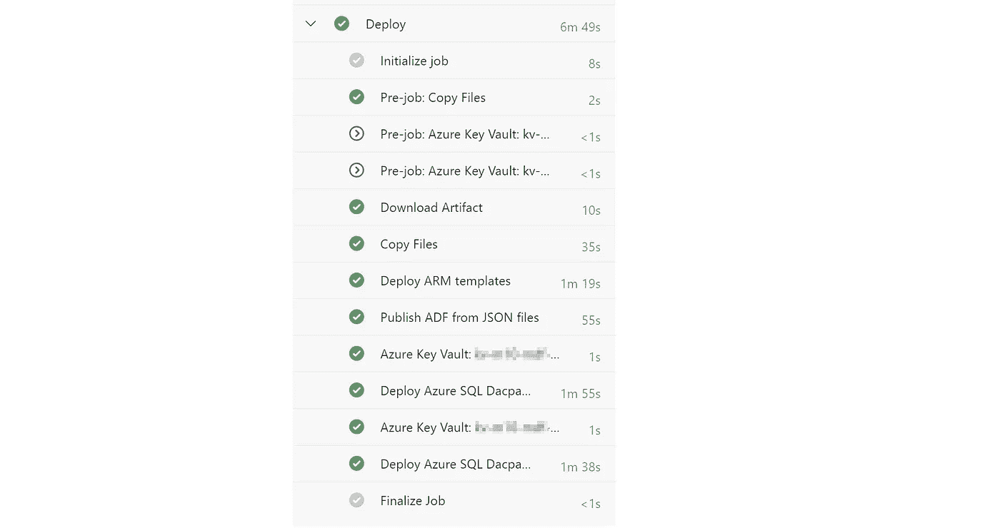
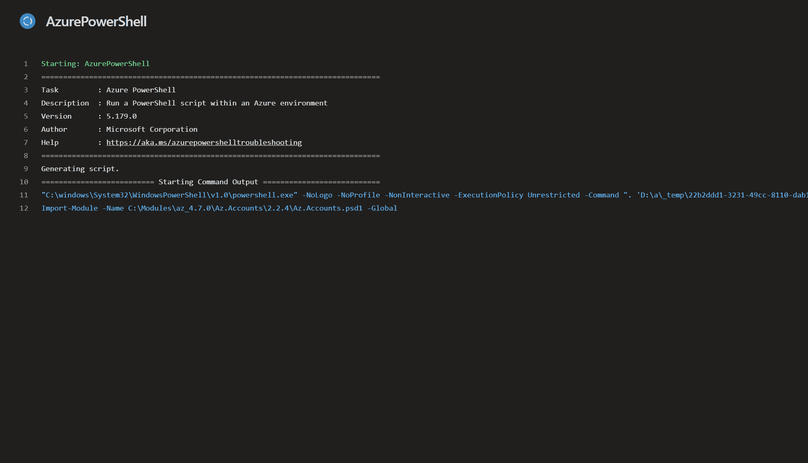

# Azure 数据工厂管道的自动化测试

> 原文：<https://towardsdatascience.com/automated-testing-of-azure-data-factory-pipelines-23f60d33ba5e?source=collection_archive---------14----------------------->

## 从 DevOps 的角度提高解决方案的质量


把你的脚抬起来——照片由 [Unsplash](https://unsplash.com/?utm_source=unsplash&utm_medium=referral&utm_content=creditCopyText) 上的 [Kewal](https://unsplash.com/@kewal?utm_source=unsplash&utm_medium=referral&utm_content=creditCopyText) 拍摄

在 DevOps 的帮助下，在更小或更大的团队中开发 ETL 或 ELT 解决方案从未如此简单。它使我们能够确定，在多个团队成员对解决方案的不同部分进行更改后，解决方案仍然有效。例如数据库存储过程、表、视图等的变化。结合 **Azure 数据工厂管道**和**部署管道(CI/CD)** 设置的变化。

DevOps 教导我们**尽可能多地自动化**，以创造过程的可重复性。使用源代码控制和频繁的代码签入。实施持续集成和持续开发(CI/CD)将有助于我们快速、可靠地交付产品，而无需人工依赖。

我们和一个小团队一起开发一个数据平台**“解决方案加速器”**。这个加速器使我们能够轻松地部署一个有效的端到端解决方案，包括 Azure SQL 数据库、Azure 数据工厂和 Azure Key Vault。

我们一直在改进我们的解决方案，并为其添加新功能。作为产品所有者，我想确保我的产品不会被这些添加的东西破坏。除了好的分支策略之外，尽可能多地自动化测试有助于我们实现这一点。

对我们的部署管道的最新改进是**从我们的部署管道**触发**一个 Azure 数据工厂(ADF)管道，并监控**结果。在这种情况下，结果决定了是否允许完成拉请求，因此减少了导致**“中断”主分支**的机会。

在本文中，我将对的**构建和发布管道**中的步骤进行**概述，并提供用于触发和监控**ADF 管道的**脚本。**

```
Please note the difference between pipelines. I'm talking about **Azure Data Factory pipelines** whose main task is the movement of data. And on the other hand **CI/CD or deployment pipelines**. These are used to deploy resources to our Azure subscription. And live in our Azure DevOps Project. Please note that there are many kinds of tests that you can perform. In this example we are merely checking if the ADF pipeline 'is **doing things right**'. In contradiction to 'is it **doing the** **right things**'!
```

# Azure DevOps 管道设置

除其他外，我们目前使用的设置具有以下要素:

GitHub 资源库:

*   Azure 资源管理模板(ARM 模板)
*   Visual Studio 数据库项目
*   JSON 格式的 Azure 数据工厂管道

Azure DevOps 项目:

*   YAML 的天蓝色管道:
*   构建和验证阶段
*   发布阶段

我强烈建议使用 YAML 语法来定义管道，而不是传统的编辑器。最大的优势是能够用代码的相应版本来控制管道的版本。请参见文档的参考资料。

# 管道设置—构建和验证阶段

管道有两种不同的阶段:一个“构建和验证”阶段和多个“发布”阶段。

“构建和验证”阶段有两个主要目标:

*   验证 ARM 模板
*   构建数据库项目

这些任务的结果作为工件发布，在发布阶段使用。



Azure DevOps 构建和验证步骤

# 管道设置—发布阶段

“发布”阶段的任务是按照以下顺序部署所有资源:

*   ARM 模板的部署
*   ADF 对象(管道、数据集等)的部署。)*
*   SQL 数据库项目的部署



Azure DevOps 发布步骤

```
*Tip Deploying Azure Data Factory: We had many discussions about the topic, but in the end chose to use an [extension build by Kamil Nowinski](https://sqlplayer.net/2021/01/two-methods-of-deployment-azure-data-factory/) in stead of the Microsoft approach. The are many quality of life improvements in this extension!
```

# 管道设置—发布阶段触发器

部署管道的发布阶段针对我们定义的**不同环境**重复进行。在我们的情况下，我们使用开发、测试和生产。这些环境的触发器是我们选择的 **git 分支策略**的结果。

正是在这个“测试”环境的发布阶段，我们实现了一个 **PowerShell 任务**，它触发并监控 ADF 管道的运行。当 GitHub 存储库中的 **pull-request** 被启动时，测试环境的发布被触发。

# 触发和监控 ADF 管道运行



除了 ADF 用户界面，还有多种方法可以触发管道。这里我们使用 PowerShell，因为它很容易被整合到部署管道中。下面是一个 Azure PowerShell 任务的示例，它从您的存储库中执行一个脚本。

Microsoft 文档为 PowerShell 脚本提供了一个很好的起点。在**合并了用于触发和监控的语句**后，我做了两个**重要的修改**:

1.  如果 ADF 管道获得“排队”状态，脚本将会中断
2.  如果结果不等于“成功”,我们抛出一个错误

在第 27 行抛出错误确保**发布阶段的任务失败**，因此整个流水线获得状态‘失败’。这很重要，因为这个**防止**拉请求**在这个错误在对存储库的另一个提交中被解决之前完成**。

就是这样！请分享更多改进的建议！

# 参考

Azure Pipelines |微软文档

[Azure Pipelines—Azure PowerShell 任务|微软文档](https://docs.microsoft.com/en-us/azure/devops/pipelines/tasks/deploy/azure-powershell?view=azure-devops)

[Azure 数据工厂— PowerShell |微软文档](https://docs.microsoft.com/en-us/azure/data-factory/quickstart-create-data-factory-powershell)

[Azure Data Factory](https://docs.microsoft.com/en-us/azure/data-factory/continuous-integration-deployment)—[Azure Data Factory 中的持续集成和交付|微软文档](https://docs.microsoft.com/en-us/azure/data-factory/continuous-integration-deployment)

[ADF 工具| SQL 播放器](https://sqlplayer.net/adftools/)