# 自动树状图切割

> 原文：<https://towardsdatascience.com/automatic-dendrogram-cut-e019202e59a7?source=collection_archive---------25----------------------->

## 实践中打包贝叶斯

由 [kazuend](https://unsplash.com/@kazuend?utm_source=medium&utm_medium=referral) 在 [Unsplash](https://unsplash.com?utm_source=medium&utm_medium=referral) 拍摄的照片

聚类分析是一种探索数据结构的有用技术。在众多算法中，凝聚聚类是一种简单而有用的方法，它通过逐步链接最相似的对，直到所有数据都链接在一起，从而自下而上地建立聚类层次。通过将层次结构表示为树状图，它有助于我们深入了解数据的分布和结构。尽管很有见地，但有时我们可能更希望在实际应用中使用扁平化的表示，结果却是一个关于如何切割树状图的问题。在本文中，我将向您展示我们如何在特定的标准下，最优地将树状图切割成小块，而不是沿着特定的阈值简单地直接切割。

# 切割树状图的最佳方式

简而言之，我们的目标是将树状图切割成 k 个不相交的子树，使得一些选择的损失达到最小。损失/选择标准是自由的，一个可能的选择是类内平方和(WCSS)，这是 k 均值聚类旨在最小化的目标函数。有了标准，下一个问题是，我们如何去做？列举所有的可能性肯定有用，但那样会太累。一个聪明的解决方法是探索最优子结构并执行动态规划。简而言之，为了最优地将整棵树切割成 k 个子树，这相当于找到最优的 kₗ和 kᵣ，我们需要从根的左右分支获得子树的数量，使得 kₗ + kᵣ = k。对于每个可能的(kₗ，kᵣ)对，我们需要将左右分支切割成 kₗ和 kᵣ子树，这与我们切割整棵树的问题完全相同。因此，我们可以递归地划分问题，直到树状图的叶子。要了解清楚的细节，这里有戈蒂埃·马蒂[的一个很棒的帖子](https://gmarti.gitlab.io/ml/2017/05/12/cut-a-dendrogram.html)。

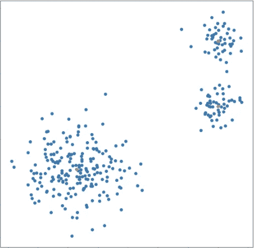

简单的三类数据集。

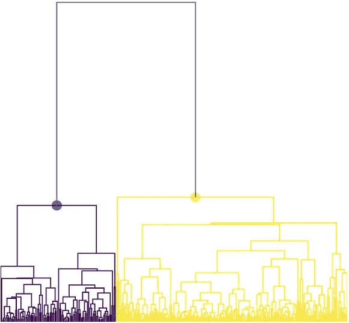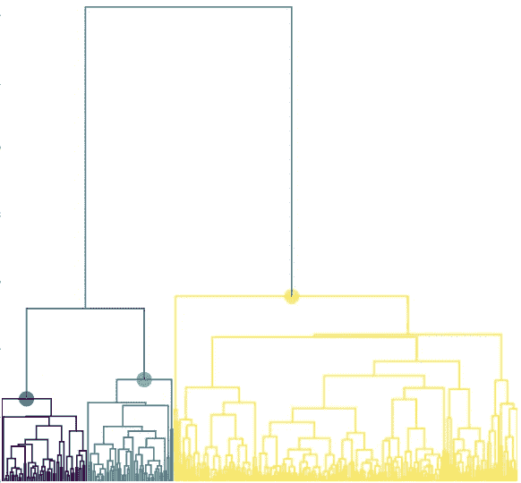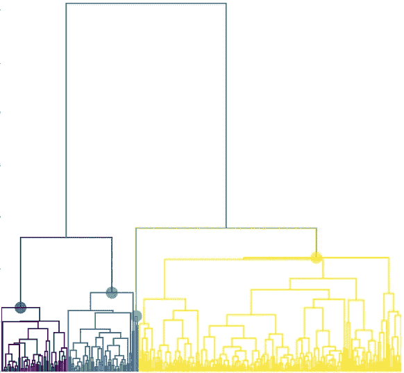

平均法树状图。这三种分别是最佳的 2 切、3 切和 4 切。

# 选择要切割树状图的聚类数

我们已经学习了如何最优地将一个树状图切割成 k 块，现在我们需要确定我们需要多少个聚类。确定 k 无疑是我们在进行聚类分析时面临的最困难的问题，特别是当我们希望以数据驱动的方式自动确定 k 时。在 rest 内容中，我将介绍一个强大但不太为人所知的框架，称为 PAC 贝叶斯学习，用于 k 选择问题。

## 什么是 PAC 贝叶斯？

可能近似正确，又名 PAC，是一个通过构建过度误差的上限来量化可学习性的框架，过度误差是样本内误差和样本外误差(泛化误差)之间的差异。PAC Bayesian 扩展了这个框架，它通过引入假设的先验分布来表达关于假设的某种信念，就像我们在 Bayesian 学习中所做的那样。

## 它是如何工作的？

关于 PAC 贝叶斯界的形式其实有很多种，下面我将介绍最基本的(我认为)形式。在贝叶斯设置中，人们通常使用模型证据作为度量来评估模型的性能，并从中选择最佳的一个。它被表述为

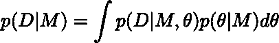

其中 D 是观测数据，M 是模型，θ是模型参数，p(θ|M)是θ的先验分布，p(D|M，θ)是在模型配置为θ的情况下观测到 D 的可能性。

为了评估证据，我们需要计算积分，这有时是棘手的。因此，我们求助于优化它的下界，证据下界(ELBO):

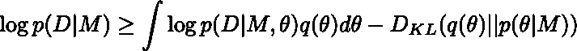

对于所有可能的 q，当 q 等于后验 p(θ|D，M)时，等式成立。因此，给定一组模型，我们可以尝试优化 ELBO，并选择最大的 ELBO 作为最终选择。这个框架是独立的，有很强的理论支持，但有很大的限制，因为我们需要给出有效的概率度量来量化可能性——它当然不适用于我们的树图切割问题。概括的一种方法是将对数似然替换为任意损失函数，得到

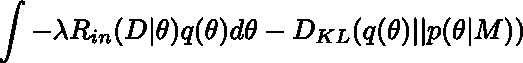

通过一些代数运算，它等价于求的最小值

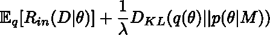

因为我们有一个单一的切割，而不是对每个 k 的所有可能性的分布，它进一步退化为

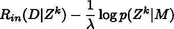

其中前一项是由最优切割产生的总 wcs，Zᵏ代表每个观察值的聚类标签。现在，我们只需要指定 Zᵏ的先验分布来完成最后一个谜题。一个合理的选择将是中国餐馆过程，一个众所周知的非参数贝叶斯文献中的分布，用于描述聚类标签的分布。它可以通过以下方式进行累积评估

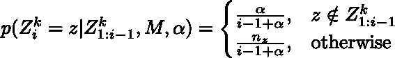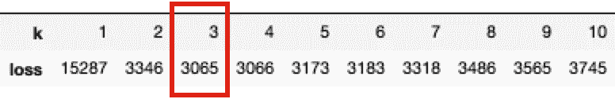

不同的 k 与 PAC 贝叶斯正则化项的损失，λ=0.2，α=1

## 地毯下的污垢

在玩机器学习的时候，我们都知道没有免费的午餐。一个适用于所有数据集的通用λ是不存在的，我们不可避免地要动手寻找最适合数据集的λ。尽管如此，我们至少在系统地解决问题。

# 最后的话

PAC Bayesian 是一个强大的、强有力的理论支持框架，用于研究模型的泛化能力，甚至用于过参数化的神经网络。在本文中，我简单地应用了基本形式来解决从一组最优树图切割中选择 k 的问题，这只是其威力的冰山一角。我希望它能对每个对此感兴趣的人有所帮助和启发。

模拟:[https://github.com/jerrylin0809/pac-bayesian-dendrogram-cut](https://github.com/jerrylin0809/pac-bayesian-dendrogram-cut)