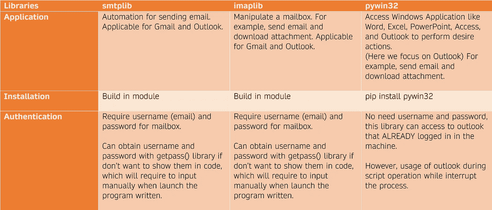

# 用 Python 自动下载电子邮件附件

> 原文：<https://towardsdatascience.com/automatic-download-email-attachment-with-python-4aa59bc66c25?source=collection_archive---------1----------------------->

## [使用 PyWin32 实现自动化](https://towardsdatascience.com/tagged/automation-with-pywin32)

## 简化繁琐的东西来解放我们的思想。


由[大卫·巴拉迪](https://unsplash.com/@davideibiza?utm_source=unsplash&utm_medium=referral&utm_content=creditCopyText)在 [Unsplash](/s/photos/email?utm_source=unsplash&utm_medium=referral&utm_content=creditCopyText) 上拍摄的照片

您是否曾经在邮箱中搜索过所有需要的附件？然后也许你离开了，回来的时候忘记了你停在哪里？也许你还需要把它们保存到不同的目录或文件夹中？

我以前也在那个位置。这就是为什么我想自动下载附件到正确的目录。之后，对电子邮件的附件进行相应的转换。

在本文中，我将比较解决方案的可能 Python 库，并分享我如何使用 Python 来自动化这个过程。

# 访问邮箱的 Python 库比较



作者创建的图像

> smtplib 不是我的选择之一，因为它只能发送电子邮件，而 imaplib 需要用户名和密码，这不太好。因此，我选择了 *pywin32* 。

# 使用 pywin32 从 Outlook 下载特定邮件

没有可用的 pywin32 官方文档。目前，我们只能参考*Visual Basic for Application(VBA)*中的 Outlook MailItem 的引用来了解可以用来操作邮箱和邮件的函数。然后，当您在 Python 中编写脚本时，不能直接使用该示例。在各种技术写作网站上也有一些很好的 pywin32 应用实例，但都不完整。

本文涵盖了使用 pywin32 访问 Outlook 邮箱所需的所有基本知识。

1.  **导入模块**

第一步。

```
# pip install pywin32  #if you not installed yet
import win32com.client
```

**2。建立与 Outlook 的连接**

```
# set up connection to outlook
outlook = win32com.client.Dispatch("Outlook.Application").GetNamespace("MAPI")
```

**3。MailItem 操作的一些基本方法/属性**

(1)访问收件箱。

```
inbox = outlook.GetDefaultFolder(6)# for sub folder, add <.folder("your folder name")>
inbox = outlook.GetDefaultFolder(6).folders("Testing")
```

6 是收件箱的索引。其他常见项目的索引如下。

```
3 Deleted Items
4 Outbox 
5 Sent Items
6 Inbox
16 Drafts
```

您可以使用下面的源代码来检查其他文件夹的索引。(参考 C2)

```
import win32com.client
outlook=win32com.client.Dispatch("Outlook.Application").GetNamespace("MAPI")
for i in range(50):
  try:
    box = outlook.GetDefaultFolder(i)
    name = box.Name
    print(i, name)
  except:
    pass
```

(2)阅读电子邮件

```
# Access to the email in the inbox
messages = inbox.Items# get the first email
message = messages.GetFirst()
# get the last email
#message = messages.GetLast()# to loop thru the email in the inbox 
while True:
  try:
    print(message.subject) # get the subject of the email
    # if you use messages.GetFirst() earlier
    message = messages.GetNext() 
    # if you use messages.GetPrevious() earlier 
    #message = messages.GetPrevious()
  except:
    # if you use messages.GetFirst() earlier
    message = messages.GetNext() 
    # if you use messages.GetPrevious() earlier 
    #message = messages.GetPrevious()
```

上面的例子显示了如何打印收件箱中所有邮件的主题。除了主题之外，我们还可以打印其他属性或将其用作定义条件语句的标准。下面显示了一些常见的属性。

```
message.subject
message.senton               # return the date & time email sent
message.senton.date()
message.senton.time()
message.sender
message.SenderEmailAddress
message.Attachments          # return all attachments in the email
```

注意，以一对括号结尾的`messages.GetFirst()`或`messages.GetNext()`指的是我们可以用来操作邮箱的方法，而`message.subject`或`message.senton`指的是电子邮件的属性，使用 Python 时不区分大小写。因此，对于完整的 MailItem 属性列表，你可以参考 VB 中的 MailItem 文档，它可以在底部的参考 C1 中找到。(我没有全部试过，但是大部分都可以适用。)

(3)下载邮件附件。

```
attachments = message.Attachments# return the first item in attachments
attachment = attachments.Item(1)
# the name of attachment file      
attachment_name = str(attachment).lower()
attachment.SaveASFile(path+ '\\' + attachment_name)
```

**4。完整示例**

```
# import libraries
import win32com.client
import re
# set up connection to outlook
outlook = win32com.client.Dispatch("Outlook.Application").GetNamespace("MAPI")inbox = outlook.GetDefaultFolder(6)
messages = inbox.Items
message = messages.GetFirst()
today_date = str(datetime.date.today())while True:
  try:
    current_sender = str(message.Sender).lower()
    current_subject = str(message.Subject).lower()
    # find the email from a specific sender with a specific subject
    # condition
    if re.search('Subject Title',current_subject) != None and    re.search(sender_name,current_sender) != None: print(current_subject) # verify the subject
      print(current_sender)  # verify the sender
      attachments = message.Attachments
      attachment = attachments.Item(1)
      attachment_name = str(attachment).lower()
      attachment.SaveASFile(path + '\\' + attachment_name)
    else:
      pass message = messages.GetNext() except:
    message = messages.GetNext()exit
```

上面是一个完整的例子，它将来自特定发件人的带有特定标题的电子邮件下载到特定的路径。您可以根据自己的情况更改条件，例如，您可以使用`message.senton.date()`获取在指定日期收到的电子邮件。此外，您可以使用嵌套的 if-else 语句将附件保存在不同的目录中，这在您要下载大量附件时非常方便。

# 保持联系

订阅 [YouTube](https://www.youtube.com/channel/UCiMtx0qbILP41Ot-pkk6eJw)

# 参考

## A.smtplib

[smtplib 的文档](https://docs.python.org/3/library/smtplib.html)

## B.imaplib

[imaplib 的文档](https://docs.python.org/3/library/imaplib.html)

## C.pywin32

1.  [MailItem 接口](https://docs.microsoft.com/en-us/office/vba/api/Outlook.MailItem)(所有 Outlook MailItem 对象属性、方法和事件的应用程序参考 Visual Basic)
2.  [清楚地记录了使用 python win32com outlook 阅读电子邮件的功能](https://stackoverflow.com/questions/22813814/clearly-documented-reading-of-emails-functionality-with-python-win32com-outlook?answertab=votes#tab-top)(包含了在 outlook 中访问邮件和附件所需的大部分基本属性)

## 一些旁注

如果你对如何使用`pywin32`实现 Microsoft Excel 报表自动化感兴趣，可以参考这篇文章《[用 Python 实现 Excel 自动化](/automate-excel-with-python-7c0e8c7c6256)》。

如果你有兴趣用 Python 创建一个图表或数据透视图，并将其作为电子邮件附件自动共享，那么[用 Python 自动化 Excel 图表](https://kahemchu.medium.com/automate-excel-chart-with-python-d7bec97df1e5#eb8b-f75b97c49234)。

祝贺并感谢你阅读到最后。希望你喜欢这篇文章。 ☺️


由[凯文·布茨](https://unsplash.com/@kevin_butz?utm_source=unsplash&utm_medium=referral&utm_content=creditCopyText)在 [Unsplash](/s/photos/thank-you?utm_source=unsplash&utm_medium=referral&utm_content=creditCopyText) 上拍摄的照片