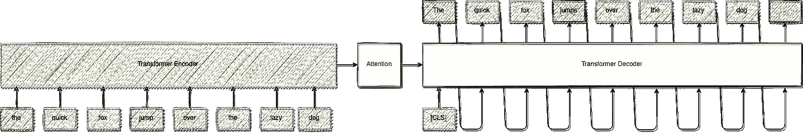

# PyTorch 自动语法和拼写纠正—第 1 部分:基线

> 原文：<https://towardsdatascience.com/automatic-grammar-and-spelling-correction-with-pytorch-part-1-a-baseline-d97b7202de74?source=collection_archive---------20----------------------->

## 建立一个深层的变压器网络，纠正英语句子

阿伦·普拉卡什在 [Unsplash](https://unsplash.com/s/photos/errors?utm_source=unsplash&utm_medium=referral&utm_content=creditCopyText) 上的照片

我是 Grammarly 或 Reverso 等服务的忠实粉丝，这些服务可以帮助纠正语法和拼写错误。这促使我建立了一个更简单的机器学习基线，可以自动纠正英语句子。

在本帖中，我们将介绍序列到序列转换器模型的实现和训练，该模型将输入一个有潜在错误的句子，然后在纠正所有错误后生成相同的句子。这类似于在[巴特](https://arxiv.org/abs/1910.13461)中所做的。

# 数据

对于这种基线方法，我们将仅使用合成数据来训练该模型。我们将使用维基百科中的句子。然后，对于每个句子，我们将生成一个“受干扰”的句子，其中有随机的人工拼写和语法错误。这给了我们一个 *(input，output)* 对，其中输入是有错误的句子，输出是原来的句子。

这里我们假设大部分原始维基百科句子不包含错误。

使用合成数据的好处是它们是免费的，我们可以免费生成我们想要的数据。缺点是它们可能不像人们犯的语法和拼写错误的真实例子那样真实或有用。

总之，我们实现了 11 种原始句子的随机变换。

## 随机扰动的例子:

## 小写:

原句:

*   ***这个*** *是一个例句*

转换句子:

*   ***这个*** *是一个例句*

## 删除随机单词:

原句:

*   ***这个*** *是一个例句*

转换句子:

*   *是一个例句*

## 改变动词形式:

原句:

*   *这个* ***是*** *的一个例句*

转换句子:

*   *这个* ***分别是*** *一个例句*

## 扰乱随机词:

原句:

*   *这是一个* ***例句*** *句子*

转换句子:

*   *这是一个* ***宠爱*** *的句子*

等等…

在将它们依次应用于原句之前，我们随机挑选了其中的 3 个。这些扰动中的每一个都与一个权重相关联，该权重决定了它们被选取的频率。

以下是使用此过程生成的*(输入，输出)*对的示例:

## **输入(或受干扰的句子):**

*   *地基* ***是*** *的河漂石；外墙* ***是*** *红砖加砂岩点缀。*

## 输出(或原句):

*   *地基* ***是河流巨砾的****；外墙* ***为*** *红砖加砂岩点缀。*

在这个例子中，我们可以看到，被打乱的句子中动词“to be”的形式和“is”的大小写都是错误的。

# 模型

我们将要使用的模型架构与论文[中介绍的相同](https://arxiv.org/abs/1706.03762)。这个模型有一个编码器变压器和一个解码器变压器，注意这两者之间。

编码器处理有潜在拼写或语法错误的句子，而解码器生成有所有更正的句子。

解码器是一个自回归模型，我们在训练中使用教师强制。

模型架构——作者图片

这个模型将学习复制输入的句子，同时纠正它的错误。

在解码器的每个时间步骤，模型可以“注意”输入句子的每个标记以及在解码句子中出现在它之前的每个标记。正是这种关注使得模型能够挑选信息，用于预测解码过程中的下一个令牌。

我们使用 RTX 3080 在大约 800 万个维基百科句子上训练这个模型大约两天。

# 示例预测

现在是时候看看训练有素的模型了:

## 示例 1:

## 有错误的句子:(an 而不是 a)

*   *这是爱尔兰***对 2010 年的总结。**

## *由模型更正的句子:*

*   **这是 2010 年爱尔兰***的总结。***

**该模型用“a”代替了“an”。**

## **示例 2:**

## **有错误的句子:(错误的大写+复数而不是单数)**

*   *****马蒂诺*** *是* *的一部分* ***音乐* ***项目*** ***埃斯佩里克*** ***炫目*** *。*****

## **由模型更正的句子:**

*   ****马蒂诺**是的**部分，音乐**投射** **埃斯佩里克** **眩光**。****

**在这里，模型能够纠正大写错误，但不能解决复数问题。**

## **示例 3:**

## **有错误的句子:(错误的动词形式+拼写错误)**

*   **何 ***被*** *选入*西*孟加拉* ***立法院****1962 年从巴拉萨特选区击败前进集团领袖奇塔巴苏。***

## **由模型更正的句子:**

*   ***何* ***曾于 1962 年从巴拉萨特选区击败前进集团领袖奇塔巴苏* ***当选西孟加拉邦【立法】*** *议员。*****

**这里的模型使用了动词“to be”的正确形式，并修复了拼写错误。**

**从这些例子中我们可以看出，模型学习了单词的正确拼写，以及动词的正确形式。它仍然有一些问题固定单词的单数/复数形式。有趣的是，该模型可以正确地复制像“Barasat”或“Basu”这样的罕见或不常见的单词，这正是我们想要的。**

# **结论**

**在这个项目中，我们实现了拼写和语法纠正的基线方法。这个模型在 PyTorch [(见代码)](https://github.com/CVxTz/xumi)中实现起来很简单，并且可以修复明显的错误，就像上面例子中看到的那样。下一步是更严格地评估模型，然后通过使用其他训练集来改进其性能。**

## **来源:**

*   **[http://norvig.com/ngrams/spell-errors.txt](http://norvig.com/ngrams/spell-errors.txt)**
*   **[https://py torch . org/tutorials/初学者/transformer_tutorial.html](https://pytorch.org/tutorials/beginner/transformer_tutorial.html)**
*   **[https://github.com/monolithpl/verb.forms.dictionary](https://github.com/monolithpl/verb.forms.dictionary)**