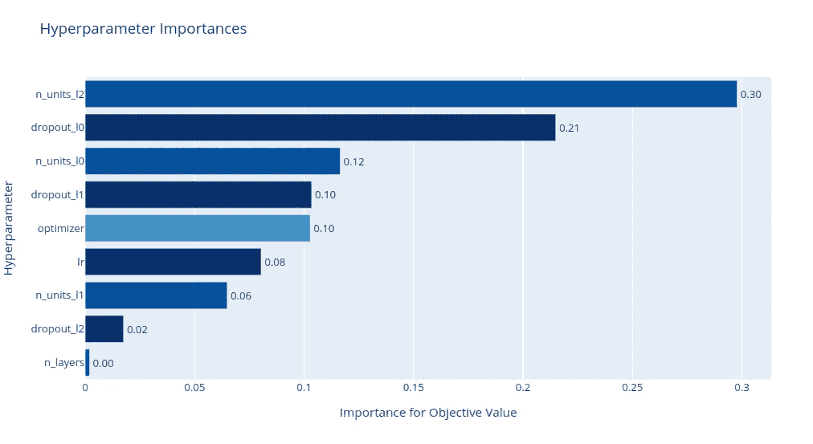
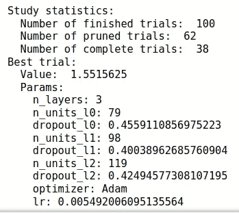

# 使用 Optuna 的自动超参数搜索和优化

> 原文：<https://towardsdatascience.com/automatic-hyperparameter-search-and-optimization-using-optuna-392d77917ede?source=collection_archive---------20----------------------->

## 如何简单高效地优化您的 AI/ML 模型的超参数

超参数调优是 AI/ML 模型开发中比较耗时的手工任务之一。有时候，您希望在处理其他事情的时候能够自动化它们，比如弄清楚如何部署您的模型，或者只是享受一个下午茶休息时间。现在你可以这么做了。奥普图纳来救援了！



作者图片

# 为什么是 Optuna？

有许多类似的超参数调节库，包括 Hyperopt。但是为什么特别是 Optuna？对我来说，有几个原因:

1.  它是轻量级的、通用的和平台无关的。有很少的依赖性，Optuna 可以集成到流行的 ML 框架中，包括 PyTorch、Tensorflow、scikit-learn、*等*。
2.  Optuna 是高效的，并且用优化的算法实现。它从一开始就通过删除没有前途的超参数搜索空间来执行修剪，从而使优化程序运行得更快。
3.  它为您跟踪优化过程的发展提供了简单而强大的可视化工具。
4.  而且对我个人来说，Optuna 有一个直观易懂的 API，让我可以专注于模型开发任务本身。

既然你已经对 Optuna 有些信服了，那就让我们进入正题吧。

# 设置

首先，我们需要安装一些依赖项。您可以选择使用 *pip* 或 *conda* 进行安装。

1.  使用画中画

```
pip install optuna
pip install plotly
```

2.使用 conda

```
conda install -c conda-forge optuna
conda install plotly
```

不要忘记安装 PyTorch！你可以在这里找到它的安装步骤[。](https://pytorch.org/get-started/locally/)

# 超参数优化

一切都准备好了！让我们从导入一些我们需要的依赖项开始，包括 PyTorch 和 Optuna。

## **获取数据集**

为了便于说明，我们将使用 TorchVision 库提供的时尚 MNIST 数据集。我们将如下定义`train_loader`和`test_loader`。

## **初始化常量**

既然我们已经有了加载时尚 MNIST 数据集的工作函数，下一步就是定义一些以后会有用的常量。

## **定义模型**

此后，我们需要建立一个简单的网络来训练和验证我们的时尚 MNIST 数据。该网络将是一个简单的线性多层感知器，我们将在其中执行我们的第一个超参数优化试验:

1.  `number of layers (n_layers)`
2.  `hidden units (hidden_units)`
3.  `dropout probability (dropout_p)`

请注意，在上面的代码片段中，有一个参数`trial`被传递到函数`define_model()`中。这是一个独特的*关键字*,每当您想要试验超参数的值时，Optuna 都会使用它。

`trial.suggest_int()`或`trial.suggest_float()`是您可以调用来执行试验的一些方法。第一个参数是试验的名称，随后的参数将指示试验可以采用的可能值的列表。

## **支持功能**

现在让我们定义我们的`train`函数，我们将枚举`train_loader`并使用`negative log-likelihood (nll)`损失函数来计算训练损失。

不要忘记我们将要计算测试`accuracy`的`test`函数！

## **定义目标函数**

这里，我们将向函数中传递另一个`trial`参数，以表明我们对执行超参数优化的兴趣。

我们将进行两次超参数试验:

1.  `optimizer_name`
2.  `lr`(学习率)

Optuna 的优点是能够尽早修剪超参数搜索空间(即移除没有显示出有希望的结果的候选者)。

如果结果不好且不需要进一步考虑，可在报告该纪元的试验后调用`raise optuna.exceptions.TrialPruned()`来完成。

7.把所有东西放在一起

最后，我们需要通过定义一个驱动程序来编译我们所有的函数。我们通过以下方式做到这一点:

1.  创建一个`study`,我们的超参数优化将放置在它的下面
2.  指定`optimize`到`maximize`我们的准确性(或者`minimize`,如果您报告损失是要注意的关键指标)
3.  初始化两种类型的试验研究:`pruned_trials`(由于结果不够好而跳过的试验)或`complete_trials`(潜在的好结果)
4.  打印出数值，以跟踪哪个超参数组合产生最佳结果

试验结束后，我们看到终端打印出以下结果。



结果(图片由作者提供)

我们观察到，在 100 次试验后，其中 38 次确实有潜力(即完成)而其中 62 个实际上是无用的(即修剪)。最佳试验包括以下一组超参数:

1.  **层数** : 3
2.  **优化器**:亚当
3.  **LR** : 0.05492006

干得好！

# 可视化结果

现在一切都完成了，我们可以进行一个快速的可视化来看看我们的试验进展如何。

例如，我们可以检查哪个超参数对模型的性能影响最大:

```
from optuna.visualization import plot_param_importancesplot_param_importances(study)
```


超参数重要性(图片由作者提供)

第二层中隐藏单元的数量似乎是影响模型性能的主要因素！

# 离别的思绪

现在，您可以相对轻松地自动化您的超参数优化过程。有了这些多余的时间，你肯定可以构建一个更好的 ML 模型，或者享受更多的下午茶休息时间…

***我定期通过我的电子邮件简讯，用简单的英语和漂亮的可视化总结人工智能研究论文，请在***[*【https://tinyurl.com/2npw2fnz】*](https://tinyurl.com/2npw2fnz)*订阅。*