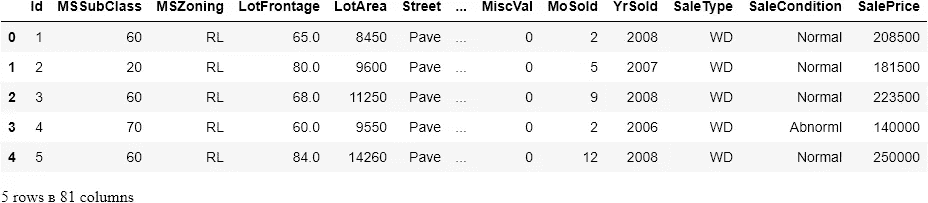

# 使用网格和随机搜索的 Sklearn 自动调整超参数

> 原文：<https://towardsdatascience.com/automatic-hyperparameter-tuning-with-sklearn-gridsearchcv-and-randomizedsearchcv-e94f53a518ee?source=collection_archive---------11----------------------->

## 深入探究 Scikit-learn 的 GridSearch 和 RandomSearch 类


**照片由**[海伦娜删剪](https://www.pexels.com/@wildlittlethingsphoto?utm_content=attributionCopyText&utm_medium=referral&utm_source=pexels) **上** [**像素**](https://www.pexels.com/photo/four-person-standing-on-cliff-in-front-of-sun-697243/?utm_content=attributionCopyText&utm_medium=referral&utm_source=pexels)

## 什么是超参数？

今天，隐藏在引擎盖下的数学世界的算法只需要几行代码就可以训练出来。他们的成功首先取决于训练的数据，然后取决于用户使用了什么超参数。那么，这些超参数是什么？

超参数是用户定义的值，如 kNN 中的 [*k* 和](/intro-to-scikit-learns-k-nearest-neighbors-classifier-and-regressor-4228d8d1cba6?source=your_stories_page-------------------------------------)[脊套回归](/intro-to-regularization-with-ridge-and-lasso-regression-with-sklearn-edcf4c117b7a?source=your_stories_page-------------------------------------)中的 *alpha* 。他们严格控制模型的拟合，这意味着，对于每个数据集，都有一组独特的最佳超参数。找到这个完美集合的最基本的方法是根据直觉随机尝试不同的值。然而，正如您可能猜到的那样，当有许多超参数需要优化时，这种方法很快就变得无用了。

相反，今天您将了解自动超参数调整的两种方法:随机搜索和网格搜索。给定模型的所有超参数的一组可能值，网格搜索使用这些超参数的每一个组合来拟合模型。此外，在每次拟合中，网格搜索使用交叉验证来解决过度拟合问题。尝试所有组合后，搜索会保留产生最佳分数的参数，以便您可以使用它们来构建最终模型。

随机搜索采用的方法与网格略有不同。它不是穷尽性地尝试超参数的每一个组合，这在计算上是昂贵和耗时的，而是随机地对超参数进行采样，并试图接近最佳集合。

幸运的是，Scikit-learn 提供了`GridSearchCV`和`RandomizedSearchCV`类，使得这个过程变得轻而易举。今天，你将了解他们的一切！

<https://ibexorigin.medium.com/membership>  

获得由强大的 AI-Alpha 信号选择和总结的最佳和最新的 ML 和 AI 论文:

<https://alphasignal.ai/?referrer=Bex>  

## 准备数据

我们将在爱荷华州住房数据集上调整一个 RandomForestRegressor 模型。我选择 Random Forests 是因为它有足够大的超参数，使本指南更加丰富，但是您将学习的过程可以应用于 Sklearn API 中的任何模型。那么，让我们开始吧:



目标是`SalePrice`。为简单起见，我将只选择数字特征:

首先，训练集和测试集都包含缺失值。我们将使用`SimpleImputer`来处理它们:

现在，让我们用默认参数来拟合一个基础`RandomForestRegressor`。因为我们将测试集仅用于最终评估，所以我将使用训练数据创建一个单独的验证集:

> 注意:本文的主要焦点是如何执行超参数调优。我们不会担心其他主题，如过度拟合或特征工程，而只是缩小如何使用随机和网格搜索，以便您可以在现实生活中应用自动超参数调整。

我们在测试集上给 R2 打了 0.83 分。我们仅使用以下默认参数来拟合回归变量:

这是很多超参数。我们不会调整所有的，但只关注最重要的。具体来说:

*   `n_esimators` -使用的树木数量
*   `max_feauters` -在每个节点分割处使用的特征数量
*   `max_depth`:每棵树的叶子数量
*   `min_samples_split`:分割内部节点所需的最小样本数
*   `min_samples_leaf`:每片叶子的最小样本数
*   `bootstrap`:取样方法——有或没有替换。

网格搜索和随机搜索都试图找到每个超参数的最优值。让我们先来看看随机搜索的实际应用。

## 使用 Sklearn RandomizedSearchCV 进行随机搜索

Scikit-learn 提供了`RandomizedSearchCV`类来实现随机搜索。它需要两个参数来设置:一个估计量和一组可能的超参数值，称为*参数网格*或*空间*。让我们为随机森林模型定义这个参数网格:

这个参数网格字典应该将超参数作为它们在模型文档中出现的语法中的键。可能的值可以以数组的形式给出。

现在，让我们最后从`sklearn.model_selection`导入`RandomizedSearchCV`并实例化它:

除了可接受的估计量和参数网格，它还有`n_iter`参数。它控制我们在搜索中允许随机选取超参数组合的迭代次数。我们将其设置为 100，因此它将随机抽取 100 个组合并返回最佳得分。我们还使用三重交叉验证，以决定系数作为默认的评分。您可以通过`sklearn.metrics.SCORERS.keys()`的任何其他评分功能。现在，让我们开始这个过程:

> 注意，由于随机搜索执行交叉验证，我们可以将其作为一个整体应用于训练数据。由于 CV 的工作方式，它将为训练和评估创建单独的集合。另外，我将`*n_jobs*`设置为-1 来使用我机器上的所有内核。

经过大约 17 分钟的训练后，可以使用`.best_params_`属性访问找到的最佳参数。我们还可以看到最好的分数:

```
>>> random_cv.best_score_0.8690868090696587
```

我们得到了大约 87%的决定系数，比基本模型提高了 4%。

## Sklearn GridSearchCV

你千万不要根据`RandomSearchCV`的结果来选择你的超参数。相反，仅使用它来缩小每个超参数的值范围，以便您可以向`GridSearchCV`提供更好的参数网格。

你会问，为什么不从一开始就使用`GridSearchCV`？好吧，看看初始参数网格:

有 13680 种可能的超参数组合，对于 3 重 CV，GridSearchCV 将不得不适应随机森林 41040 次。使用`RandomizedGridSearchCV`，我们仅用 100 * 3 = 300 次拟合就获得了相当好的分数。

现在，是时候在前一个基础上创建一个新的网格建筑，并将其输入到`GridSearchCV`:

这次我们有:

240 种组合，这仍然很多，但我们会继续下去。让我们导入`GridSearchCV`并实例化它:

我不必指定`scoring`和`cv`，因为我们使用的是默认设置，所以不必指定。让我们适应并等待:

35 分钟后，我们得到了上面的分数，这次是真正的最佳分数。让我们看看它们与`RandomizedSearchCV`有多大的不同:

```
>>> grid_cv.best_score_0.8696576413066612
```

你惊讶吗？我也是。结果的差异是微不足道的。然而，这可能只是给定数据集的一个特例。

当您在实践中有计算繁重的模型时，最好是获得随机搜索的结果，并在更严格的范围内在网格搜索中验证它们。

## 结论

在这一点上，你可能会认为这一切都很棒。你必须学习调优模型，甚至不需要再看一眼参数的实际作用，仍然可以找到它们的最佳值。但是这种自动化的代价很大:计算量大而且耗时。

你可以等几分钟让它结束，就像我们在这里做的那样。但是，我们的数据集只有 1500 个样本。尽管如此，如果你结合网格和随机搜索，找到最佳参数花了我们将近一个小时。想象一下，您需要等待多长时间才能获得大型数据集。

那么，网格搜索和随机搜索更小的数据集？毫无疑问是的。对于大型数据集，您需要采取不同的方法。幸运的是,“不同的方法”已经被 Scikit-learn…再次覆盖。这就是为什么我的下一篇文章会在`HalvingGridSearchCV`和`HalvingRandomizedSearchCV`发表。敬请期待！