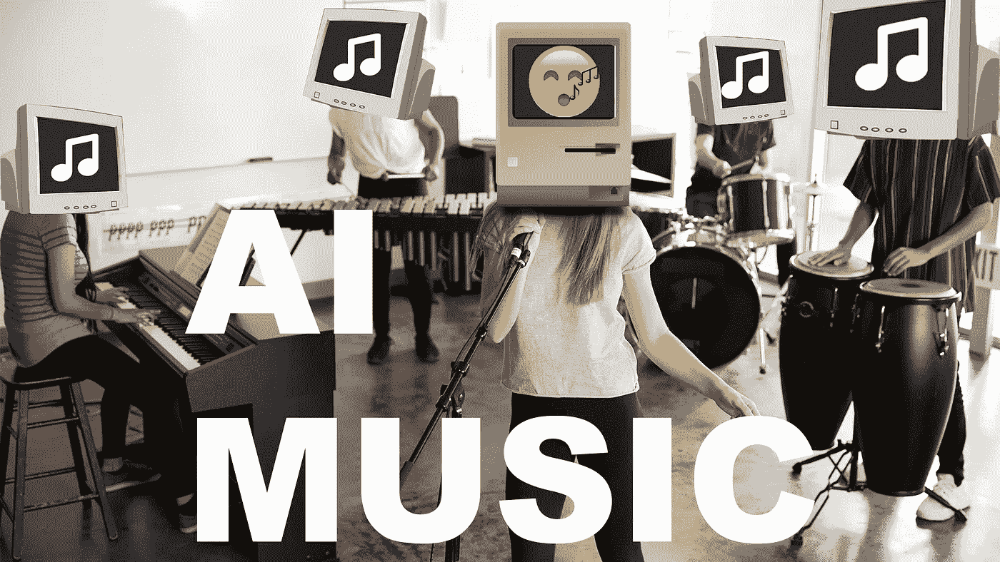
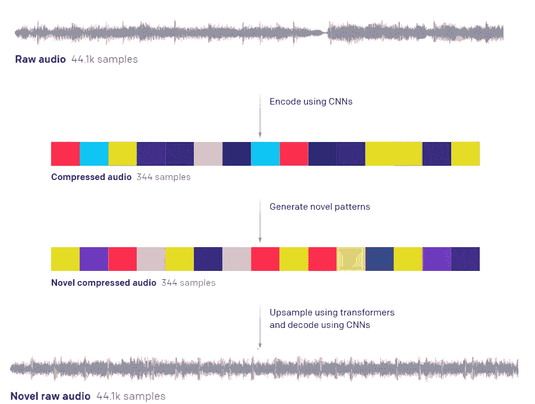
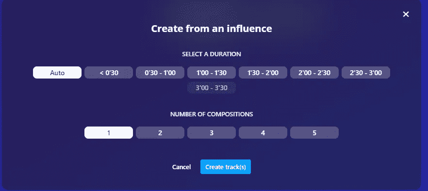
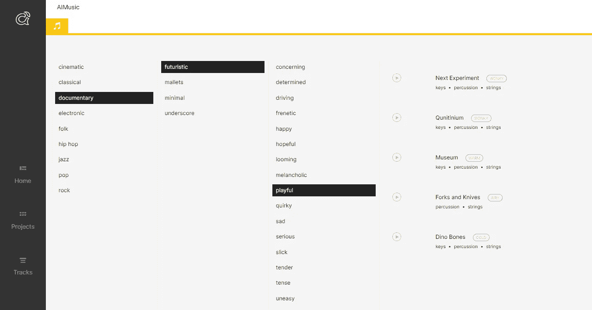
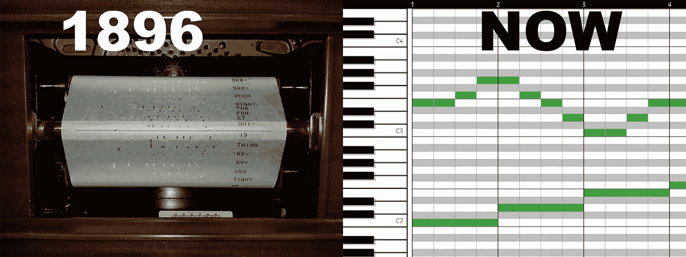

# 使用人工智能的自动音乐生成

> 原文：<https://towardsdatascience.com/automatic-music-generation-using-ai-64e3c1f0b488?source=collection_archive---------18----------------------->

## [意见](https://towardsdatascience.com/tagged/opinion)

## AI 会取代音乐人吗？



图片由作者提供，背景图片授权由作者通过 E [nvato](https://elements.envato.com/) 持有

随着 2021 年的开始，我们不得不谈论一些最近经常被提起的事情。随着越来越多的人把时间花在家里，在各种项目中创作、聆听和使用音乐成为许多生活中更重要的一部分。人工智能驱动的软件在音乐生成、制作和编辑方面取得的第一次成功令人震惊，并将进一步加速这一趋势。

现在我不想说 AI 会在 2021 年完全自动化音乐行业，但创作专业品质的音乐在不久的将来肯定会变得更容易、更便宜。

# 使用人工智能的自动音乐生成

出于多种原因，自动创作音乐尤其困难。最大的障碍是，一首简单的 3 分钟歌曲，一群人可以很容易地记住，对计算机来说有太多的变量。

此外，训练人工智能(又名损失函数)成为音乐家的理想方式还不为人知。对美国开发者来说，目标本身也远非显而易见。我们是试图凭空创造音乐，还是基于某种形式的输入？或者我们是在尝试生成一个可以在演奏时陪伴人类音乐家的系统？

虽然我认为目前对于音乐家来说，没有理由对他们的工作前景感到恐慌。我们将关注三家试图自动生成音乐的公司，看看第一个格莱美是否会很快授予一位数据科学家。

# OpenAI 的点唱机——面向未来主义者

OpenAI 是由热爱鹿、制造火箭汽车机械师埃隆·马斯克创立的公司之一。他们有几个艺术项目，最著名的是文学的 GPT-3，但作为一个音乐爱好者，Jukebox 在我心中有一个特殊的空间。

> 我们引入了 Jukebox，这是一个神经网络，可以生成音乐，包括基本的歌唱，作为各种流派和艺术家风格的原始音频——open ai

其基本思想是他们获取原始音频，并使用卷积神经网络(CNN)对其进行编码。可以把它想成一种把很多变量压缩成更少变量的方法。他们必须这样做，因为音频每秒有 44100 个变量，而一首歌有许多秒。然后，它们在这个较小的变量集上进行生成过程，并解压缩回 44'100 个变量。



来自 [OpenAI](https://openai.com/blog/jukebox/) 的简化图形

## 瑞克·阿斯特利风格的流行音乐——点唱机

这个例子是通过给 AI 10 秒钟的歌曲并生成剩余部分而生成的。

> 警告:在生成的零件启动后，至少要听 10 秒钟

虽然这首歌仍然有很多杂音，但它显然是朝着正确的方向迈出了一步。

## 未来方向 OpenAI，更有前途？

他们最近的发现来自于通过对 MIDI 文件进行调节来生成他们的音乐，你可以想象这就像一张给音乐家提供粗略指示的乐谱(我们将在最后解释细节)。

我觉得这种方法会取得更大的(近期)成功。目标基本上是，给定一张乐谱，为我生成 MP3 录音。

# AIVA——面向创作者

AIVA 很像 OpenAI 的点唱机，一种生成音乐的方法。然而，他们的方法在生成数据的底层数据结构上有分歧。AIVA 操作所谓的 MIDI 文件。继续把 MIDI 文件想象成一张乐谱。这里的不同之处在于，上一个例子中的 OpenAI 获取了 MIDI 文件并生成了一个音频记录。但是 AIVA 创造了，给定一个 MIDI 文件，一个相似但完全新的和不同的作品。

他们的方法是我们可以上传一首 MIDI 格式的歌曲。他们会用这首歌来调节他们的生育过程。换句话说，这首歌会影响生成的歌曲。


[AIVA](https://creators.aiva.ai/\) 截图

我尝试了两首歌，“永远不会放弃你”，另一首是“超级马里奥主题。”选择一首歌曲作为条件后，我们有一些选择。很遗憾，现在我们只能以一首歌为条件。



[AIVA](https://creators.aiva.ai/\) 截图

我选择用一小段<0:30 seconds. I found that it worked very well on the simple “Super Mario Theme” song and rather bad for the “Never Gonna Give you up” song.

It seems to ignore the more complex song “Never Gonna Give you up,” I assume this is due to the relative complexity. Judge the results of the “Super Mario Theme” yourself.

While I generally feel that this tool can be a great starting point for new compositions and composers, heavy human assistance is still necessary to generate a proper song at this stage.

# Amper Music — For Everyone

A completely different approach takes Amper Music. Instead of allowing us to control the generation process, Amper well generates the music. It does so by using so-called Descriptors.

> Descriptors are musical algorithms that play a specific style of music. One descriptor might be born to play punky New York rock, and another might excel at chilled out beachside folk — [Amper 音乐](https://ampermusic.zendesk.com/hc/en-us/articles/360023279774-Musical-Algorithms)为每种影响创作 3 首作品

我们可以在一代人的时间里选择两件事。一个是歌曲的长度。另一个是口头描述描述符的一组(给定的)形容词。例如，我选择了一部“有趣的未来主义纪录片”，结果非常可爱，而且可能有用。之后，系统还会提示您选择一组乐器作为基础。我带着刀叉去了。



截图琥珀音乐，[选择过程](https://score.ampermusic.com/N4GToVUpWJX6PDGgd9tKiEO7AFAM/workspace/)

结果非常好，我可以看到这是一个关于狗玩具的纪录片的伟大曲调。当重复相同的参数选择时，歌曲可能非常重复，但这是故意的。

## 钢琴卷帘窗——不同的方法

虽然 Ampers 解决方案可能是其他两种解决方案的混合，但我很难论证它到底是如何工作的。AIVA 和点唱机的区别主要在于数据结构(音乐存储的方式)的本质。要理解自动点唱机和 AIVA 的区别，我们首先要理解录音和 MIDI 标准的区别。在我们的例子中，MIDI 可以被理解为几个钢琴卷的集合。钢琴卷帘窗基本上是一种乐器。

钢琴卷帘窗可以说是最古老的专门数据结构之一。钢琴曲的基础创作于 1896 年。最初是为了让钢琴自动演奏而设计的，现在它们被用作音乐的画布。

钢琴曲的起源

在 X 轴上，我们有时间，在 y 轴上，有钢琴当前正在演奏的音高(可能包括几个同时演奏的音高)。



钢琴曲历史，图片来自[维基百科](https://en.wikipedia.org/wiki/Piano_roll)

正如你所想象的，这种方法产生的变量比一个完整的音频波少得多。对于钢琴曲，我们有

```
Amount of pitches * Amount Of Voices * Amount of Quantization steps
```

这是一个 1 分钟的片段，有 4 个声部和 64 个音高(这是机器学习的常见选择)。大概会导致

```
(400)*4*64 = 102'400 possibilities
```

> 假设:1/16 量化每分钟 100 拍所有声部都是单声道，简化计算

相比之下，数字化的音频波 44’100 的采样率将持续 60 秒导致

```
(44'100*60)*16 = 42'336'000 possibilites
```

> 假设:44100 采样率，16 位字长，声音是单声道的

这个简化的计算应该说明，在不涉及太多细节的情况下直接处理音频波更具挑战性。事实上，额外的因素使得在音频波上的工作更加不可原谅，这在自动点唱机示例中也作为“噪声”部分出现。当以 MIDI 格式生成时，这样的噪声不可能存在。

直接在 wave 上工作的主要优势是，AI 模型也可以创建不特定于音乐的声音，例如人类的语音。理论上，他们可以通过使用音频波作为基础来达到人类歌手的录音水平。

# 结论

我们已经看到，计算机确实可以创作出能够通过简化的旋转测试的音乐。提出的 3 个解决方案都在人工智能音乐生态系统中占有一席之地。AIVA 的目标是希望用人工智能创作并从中获得灵感的音乐家。Amper 是一个为视频创作者和广告专家提供的解决方案，他们希望找到简单而又实用的音频用于他们的创作。

OpenAI 的点唱机是一个研究项目，旨在彻底改变音乐创作和聆听的方式。虽然它的潜力很大，但他们能在人工智能和音乐之间推进多远还有待观察。

如果你喜欢这篇文章，我会很高兴在 Twitter 或 LinkedIn 上联系你。

一定要看看我的 [YouTube](https://www.youtube.com/channel/UCHD5o0P16usdF00-ZQVcFog?view_as=subscriber) 频道，我每周都会在那里发布新视频。