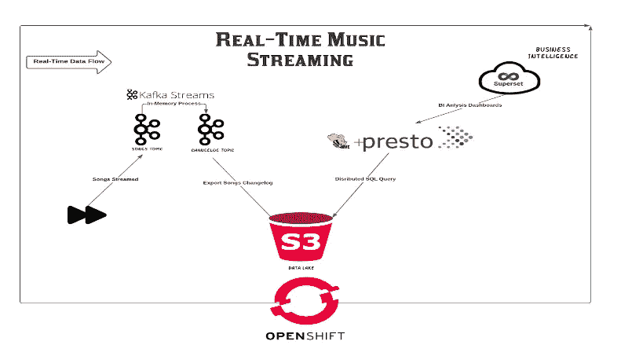
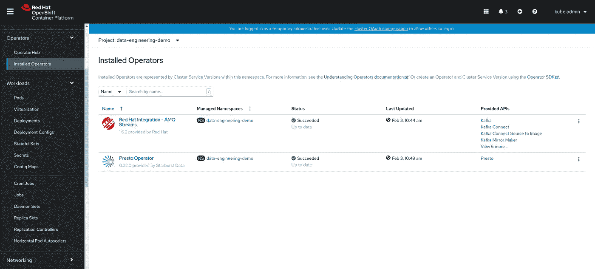
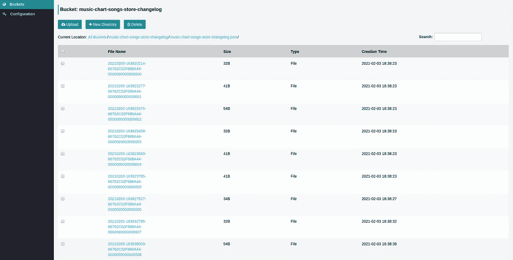
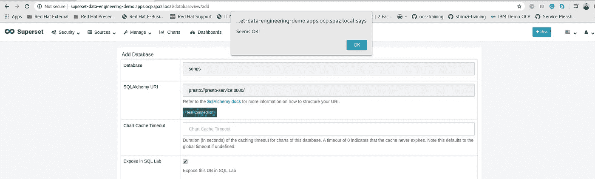
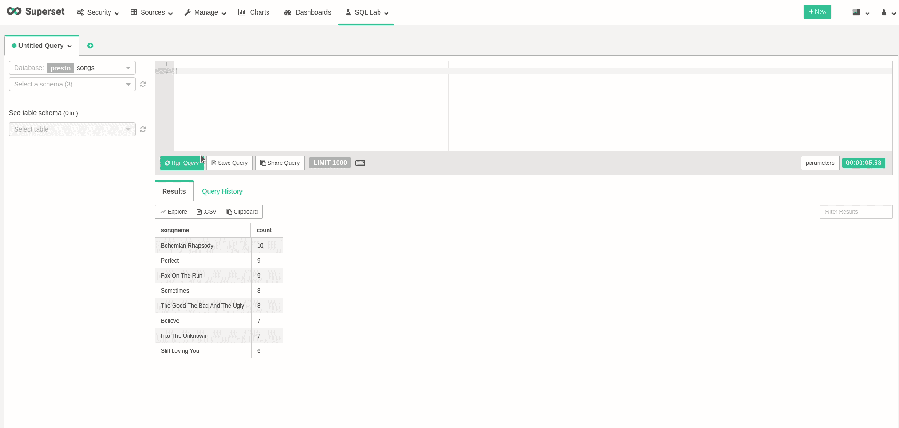
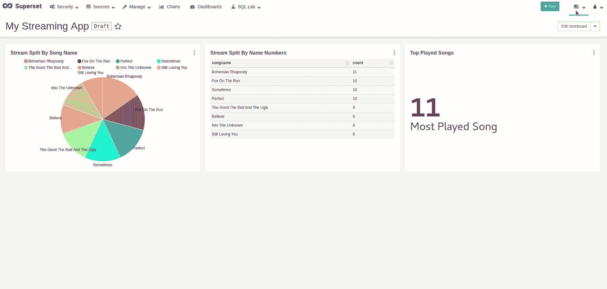

# 基于开源的自动数据管道？开始救援！

> 原文：<https://towardsdatascience.com/automatic-open-source-based-data-pipelines-openshift-to-the-rescue-b2e57d7e6e1d?source=collection_archive---------26----------------------->


斯蒂芬·道森在 [Unsplash](https://unsplash.com?utm_source=medium&utm_medium=referral) 上的照片

Kubernetes 是我们的新操作系统，没有人会怀疑这一点。为了开发一种微服务方法，并将工作负载迁移到 Kubernetes，已经做了很多工作，但是组织还是放弃了他们的数据服务。

由于新冠肺炎，我们都看到了数据的重要性，以及拥有适当的架构和数据结构的重要性。数据不会停止增长！更有甚者，它会一年又一年地打破消费记录。

这一挑战迫使我们通过将我们的数据服务转移到 Kubernetes，为我们的组织提供一个更加自动化和可扩展的解决方案，所有的奇迹都在这里发生。Kubernetes 提供的操作员将帮助您管理第 1 天和第 2 天的操作，使用健康检查、状态保存、自动驾驶等。

在这个演示中，我将向您展示如何通过`Operator Hub`使用每个 Openshift 安装中提供的操作符来运行您的自动数据管道。我选择将`Real-Time BI`作为一个用例，并围绕它构建这个演示。该演示利用了 Openshift 的机制，以创建可扩展的、基于 Kubernetes 的数据管道，并使用所有事实上的标准产品来满足这些要求。所有操作符都将部署在 Openshift 4 集群上，而 Openshift 容器存储将为对象和块存储协议提供底层存储解决方案。

这个演示部署了一个音乐流应用程序，它根据用户的行为生成事件(将进一步解释)。



演示架构

利用生成的数据，我们可以使用开源工具来创建我们的仪表盘和可视化，并为我们的利益相关者提供更可靠的方式来可视化重要数据。

这直接影响商业逻辑！

既然信息清楚了，那就开始玩吧！

# 先决条件

*   正在运行的 Ceph 集群(> RHCS4)
*   正在运行的 Openshift 4 集群(> 4.6.8)
*   外部模式下的 OCS 集群，提供对象和块存储

# 装置

在您的 Openshift 集群中创建一个新项目，所有资源都应该部署在这个集群中:

```
$ oc new-project data-engineering-demo
```

安装`AMQ Streams`和`Presto`操作符，因为我们需要它们来创建我们的相关资源。转到左侧面板上的`Operator Hub`部分进行安装:



已创建项目中已安装的运算符

克隆所需的 git 存储库，以便您能够部署演示:

```
$ git clone [https://github.com/shonpaz123/cephdemos.git](https://github.com/shonpaz123/cephdemos.git)
```

将您的目录更改为 demo 目录，所有清单都位于该目录中:

```
$ cd cephdemos/data-engineering-pipeline-demo-ocp
```

# 数据服务准备

## 准备我们的 S3 环境

现在我们已经准备好了所有的先决条件，让我们开始创建我们需要的 S3 资源。因为我们使用外部 Ceph 集群，所以我们应该创建所需的 S3 用户，以便与集群进行交互。此外，我们需要创建一个 S3 桶，以便 Kafka 可以将我们的事件导出到数据湖。让我们创建这些资源:

```
$ cd 01-ocs-external-ceph && ./run.sh && cd ..
```

预期产出:

```
{
    "user_id": "data-engineering-demo",
    "display_name": "data-engineering-demo",
    "email": "",
    "suspended": 0,
    "max_buckets": 1000,
    "subusers": [],
    "keys": [
        {
            "user": "data-engineering-demo",
            "access_key": "HC8V2PT7HX8ZFS8NQ37R",
            "secret_key": "Y6CENKXozDDikJHQgkbLFM38muKBnmWBsAA1DXyU"
        }
    .
    .
    .
}
make_bucket: music-chart-songs-store-changelog
```

该脚本使用`awscli`将我们的凭证导出为环境变量，这样我们就能够正确地创建 bucket。确保您可以通过所有打开的端口访问您的端点 URL，以便该脚本可以正常工作。

## 部署 Kafka new-ETL

现在我们已经准备好了 S3，我们需要部署所有需要的卡夫卡资源。在本节中，我们将使用`AMQ Streams`操作符部署一个 Kafka 集群，它是通过`Openshift Operator Hub`提供的。此外，我们还将部署 Kafka 主题和 Kafka Connect，以便将所有现有的主题事件导出到我们的 S3 bucket。重要！确保您更改端点 URL 以适合您的，否则 Kafka Connect 将尝试公开事件，但不会成功。

运行脚本以创建这些资源:

```
$ cd 02-kafka && ./run.sh && cd ..
```

现在，让我们验证是否已成功创建所有 pod:

```
$ oc get pods 
NAME                                                  READY   STATUS    RESTARTS   AGE
amq-streams-cluster-operator-v1.6.2-5b688f757-vhqcq   1/1     Running   0          7h35m
my-cluster-entity-operator-5dfbdc56bd-75bxj           3/3     Running   0          92s
my-cluster-kafka-0                                    1/1     Running   0          2m10s
my-cluster-kafka-1                                    1/1     Running   0          2m10s
my-cluster-kafka-2                                    1/1     Running   0          2m9s
my-cluster-zookeeper-0                                1/1     Running   0          2m42s
my-connect-cluster-connect-7bdc77f479-vwdbs           1/1     Running   0          71s
presto-operator-dbbc6b78f-m6p6l                       1/1     Running   0          7h30m
```

我们看到所有的 pod 都处于运行状态并通过了它们的探测，所以让我们验证一下我们是否有需要的主题:

```
$ oc get kt
NAME                                                          CLUSTER      PARTITIONS   REPLICATION FACTOR
connect-cluster-configs                                       my-cluster   1            3
connect-cluster-offsets                                       my-cluster   25           3
connect-cluster-status                                        my-cluster   5            3
consumer-offsets---84e7a678d08f4bd226872e5cdd4eb527fadc1c6a   my-cluster   50           3
music-chart-songs-store-changelog                             my-cluster   1            1
played-songs                                                  my-cluster   12           3
songs                                                         my-cluster   12           3
```

我们的流应用程序将使用这些主题来接收、转换这些事件，并以适当的格式将其导出到我们的 S3 存储桶中。最后，topic `music-chart-songs-store-changelog`将通过其最终结构保存所有信息，以便我们能够查询它。

## 为分布式查询运行 Presto

在这个演示中，我们将使用 Presto 查询 S3 存储桶前缀的能力(类似于关系数据库中的表)。Presto 需要创建一个模式，以便了解它需要查询的文件结构，在我们的示例中，所有导出到 S3 存储桶的事件如下所示:

```
{"count":7,"songName":"The Good The Bad And The Ugly"}
```

每个文件都将导出一个 JSON 结构，其中包含两个键值对。为了强调，你可以把它想象成一个表，有两列，第一列是`count`，第二列是`songName`，所有被写入桶的文件都是这个结构的行。

现在我们对数据结构有了更好的理解，我们可以部署我们的 Presto 集群了。这个集群将创建一个 hive 实例来存储模式元数据(用 Postgres 来存储模式信息)，以及一个包含协调器和工作单元的 Presto 集群。所有这些资源都将由 Presto Operator 自动创建，它也是 Openshift Operator Hub 的一部分。

让我们运行脚本来创建这些资源:

```
$ cd 04-presto && ./run.sh && cd ..
```

现在，让我们验证是否已成功创建所有 pod:

```
$ oc get pods | egrep -e "presto|postgres"
NAME                                                  READY   STATUS    RESTARTS   AGE
hive-metastore-presto-cluster-576b7bb848-7btlw        1/1     Running   0          15s
postgres-68d5445b7c-g9qkj                             1/1     Running   0          77s
presto-coordinator-presto-cluster-8f6cfd6dd-g9p4l     1/2     Running   0          15s
presto-operator-dbbc6b78f-m6p6l                       1/1     Running   0          7h33m
presto-worker-presto-cluster-5b87f7c988-cg9m6         1/1     Running   0          15s
```

## 用超集可视化实时数据

超集是一个可视化工具，它可以呈现来自许多 JDBC 资源的可视化和仪表板，如 Presto、Postgres 等。由于 Presto 没有真正的用户界面，让我们能够探索我们的数据，控制权限和 RBAC，我们将使用超集。

运行脚本以便在集群中部署超集:

```
$ cd 05-superset && ./run.sh && cd ..
```

现在，验证是否已成功创建所有单元:

```
$ oc get pods | grep superset
superset-1-deploy                                     0/1     Completed   0          72s
superset-1-g65xr                                      1/1     Running     0          67s
superset-db-init-6q75s                                0/1     Completed   0          71s
```

不错！一切顺利！

# 数据逻辑准备

准备好所有基础设施服务后，我们需要创建流应用程序背后的数据逻辑。当 Presto 从我们的 S3 桶中查询数据时，我们需要创建一个模式，这将允许 Presto 知道它应该如何查询我们的数据，以便作为一个表来提供结构知识。

登录到您的`Presto Coordinator`节点:

```
$ oc rsh $(oc get pods | grep coordinator | grep Running | awk '{print $1}')
```

更改上下文以使用配置单元目录:

```
$ presto-cli --catalog hive
```

创建一个模式，告诉 Presto 使用`s3a`连接器从我们的 S3 存储桶前缀查询数据:

```
$ CREATE SCHEMA hive.songs WITH (location='s3a://music-chart-songs-store-changelog/music-chart-songs-store-changelog.json/');
```

更改模式上下文，并创建一个表:

```
$ USE hive.songs;
$ CREATE TABLE songs (count int, songName varchar) WITH (format = 'json', external_location = 's3a://music-chart-songs-store-changelog/music-chart-songs-store-changelog.json/');
```

注意了！正如我们在上一节中所看到的，创建表提供了每个文件结构的实际知识。现在让我们尝试查询我们的 S3 存储桶:

```
$ select * from songs;
 count | songname 
-------+----------
(0 rows)Query 20210203_162730_00005_7hsqi, FINISHED, 1 node
Splits: 17 total, 17 done (100.00%)
1.01 [0 rows, 0B] [0 rows/s, 0B/s]
```

我们没有数据，也没关系！我们还没有开始传输任何数据，但是我们看到没有错误，这意味着 Presto 可以访问我们的 S3 服务。

# 流式实时事件

既然所有资源都已准备就绪，我们终于可以部署我们的流应用程序了！我们的流媒体应用程序实际上是一个模拟媒体播放器的 Kafka producer，它有一个由我们的媒体播放器随机“播放”的预定义歌曲列表。每当用户播放一首歌曲，事件就被发送到一个 Kafka 主题。

然后，我们使用 Kafka 流，以便将数据转换成我们想要的结构。Streams 将获取发送到 Kafka 的每个事件，对其进行转换，并将其写入另一个主题，在那里它将自动导出到我们的 S3 桶中。

让我们运行部署:

```
$ cd 03-music-chart-app && ./run.sh && cd ..
```

让我们验证所有 pod 都在运行，`player-app` pod 是我们的媒体播放器，而`music-chart` pod 实际上是包含所有 Kafka 流逻辑的 pod:

```
$ oc get pods | egrep -e "player|music"
music-chart-576857c7f8-7l65x                          1/1     Running     0          18s
player-app-79fb9cd54f-bhtl5                           1/1     Running     0          19s
```

让我们来看看`player-app`日志:

```
$ oc logs player-app-79fb9cd54f-bhtl52021-02-03 16:28:41,970 INFO  [org.acm.PlaySongsGenerator] (RxComputationThreadPool-1) song 1: The Good The Bad And The Ugly played.
2021-02-03 16:28:46,970 INFO  [org.acm.PlaySongsGenerator] (RxComputationThreadPool-1) song 1: The Good The Bad And The Ugly played.
2021-02-03 16:28:51,970 INFO  [org.acm.PlaySongsGenerator] (RxComputationThreadPool-1) song 2: Believe played.
2021-02-03 16:28:56,970 INFO  [org.acm.PlaySongsGenerator] (RxComputationThreadPool-1) song 3: Still Loving You played.
2021-02-03 16:29:01,972 INFO  [org.acm.PlaySongsGenerator] (RxComputationThreadPool-1) song 2: Believe played.
2021-02-03 16:29:06,970 INFO  [org.acm.PlaySongsGenerator] (RxComputationThreadPool-1) song 7: Fox On The Run played.
```

我们看到，我们的数据是随机写入的，每次播放一首歌曲时，都会有一个事件被发送到我们的 Kafka 主题。现在，让我们来看看我们的`music-chart`日志:

```
$ oc logs music-chart-576857c7f8-7l65x [KTABLE-TOSTREAM-0000000006]: 2, PlayedSong [count=1, songName=Believe]
[KTABLE-TOSTREAM-0000000006]: 8, PlayedSong [count=1, songName=Perfect]
[KTABLE-TOSTREAM-0000000006]: 3, PlayedSong [count=1, songName=Still Loving You]
[KTABLE-TOSTREAM-0000000006]: 1, PlayedSong [count=1, songName=The Good The Bad And The Ugly]
[KTABLE-TOSTREAM-0000000006]: 6, PlayedSong [count=1, songName=Into The Unknown]
[KTABLE-TOSTREAM-0000000006]: 3, PlayedSong [count=2, songName=Still Loving You]
[KTABLE-TOSTREAM-0000000006]: 5, PlayedSong [count=1, songName=Sometimes]
[KTABLE-TOSTREAM-0000000006]: 2, PlayedSong [count=2, songName=Believe]
[KTABLE-TOSTREAM-0000000006]: 1, PlayedSong [count=2, songName=The Good The Bad And The Ugly]
```

我们看到数据正在成功转换，并且随着用户播放更多的歌曲，计数会增加。

现在，我们需要确保我们的管道工作，所以让我们去我们的 S3 服务，以验证所有事件都被成功导出。出于这个目的，我使用了 [Sree](https://github.com/cannium/Sree.git) 作为 S3 浏览器。确保您使用正确的凭据和端点 URL:



我们创建的桶前缀的 S3 浏览器

让我们回到我们的 Presto coordinator pod，再次尝试查询我们的数据:

```
$ presto> presto-cli --catalog hive
$ presto:songs> USE hive.songs;
```

运行 SQL 查询以获取我们的数据:

```
$ select * from songs;
 count |           songname            
-------+-------------------------------
     1 | Bohemian Rhapsody             
     4 | Still Loving You              
     1 | The Good The Bad And The Ugly 
     3 | Believe                       
     1 | Perfect                       
     1 | Sometimes                     
     2 | The Good The Bad And The Ugly 
     2 | Bohemian Rhapsody             
     3 | Still Loving You              
     4 | Sometimes                     
     2 | Into The Unknown              
     4 | Believe                       
     4 | Into The Unknown              
     2 | Sometimes                     
     5 | Still Loving You              
     3 | The Good The Bad And The Ugly
```

太神奇了！我们看到我们的数据正在自动更新！试着多运行几次这个命令，您会看到行数增加了。现在，为了开始可视化我们的数据，寻找超集路径，在这里您将能够登录到控制台:

```
$ oc get routeNAME       HOST/PORT                                            PATH   SERVICES   PORT       TERMINATION   WILDCARD
superset   superset-data-engineering-demo.apps.ocp.spaz.local          superset   8088-tcp                 None
```

当我们到达我们的超集控制台(使用`admin:admin`登录)时，我们可以看到我们可以转到`Manage Databases`->-`Create Database`来创建我们的普雷托连接，确保您输入了 Presto 的 ClusterIP 服务名称，最后确保您测试了您的连接:



创建数据库时测试 Presto 的连接

既然我们可以有一个更方便的方法来查询我们的数据，让我们尝试探索一下我们的数据。去`SQL Lab`，看看你能不能执行我们之前的查询。为了强调，请看下面的查询，它将显示每首歌曲被播放了多少次:



创建可视化查询

很好！我们可以查询数据！随意创建你想要的可视化和仪表板。例如，我创建了一个实时变化的控制面板，每次刷新控制面板都会再次查询 Presto 中的所有数据:



实时数据仪表板

# 结论

在这个演示中，我们看到了如何利用开源产品来运行自动数据管道，所有这些都安排在 Openshift 上。随着 Kubernetes 打破采用记录，组织应该考虑将他们的工作负载转移到 Kubernetes，这样他们的数据服务就不会落后。利用 Red Hat 和合作伙伴运营商，Openshift 为您的数据服务提供第 1 天和第 2 天的管理。

感谢你阅读这篇博文，下次见:)