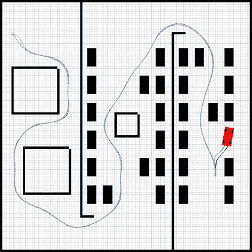
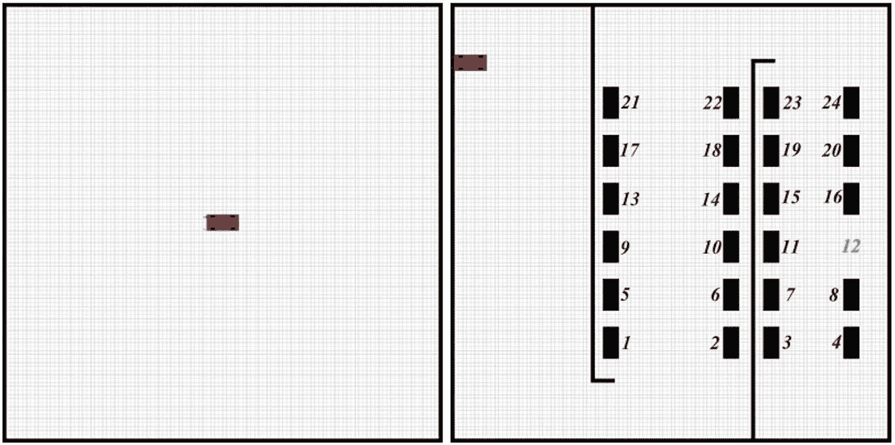
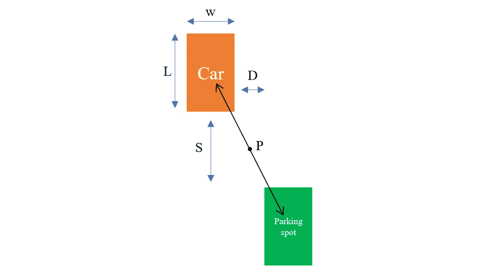
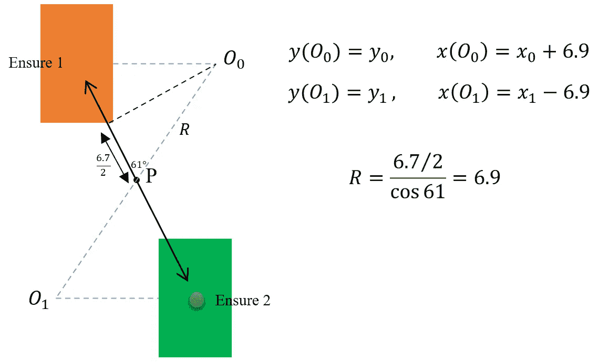
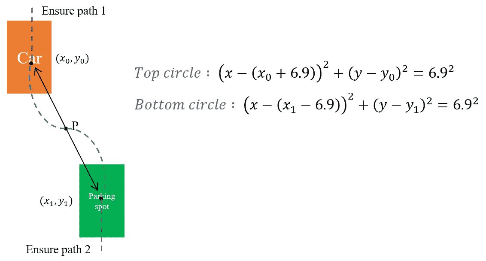
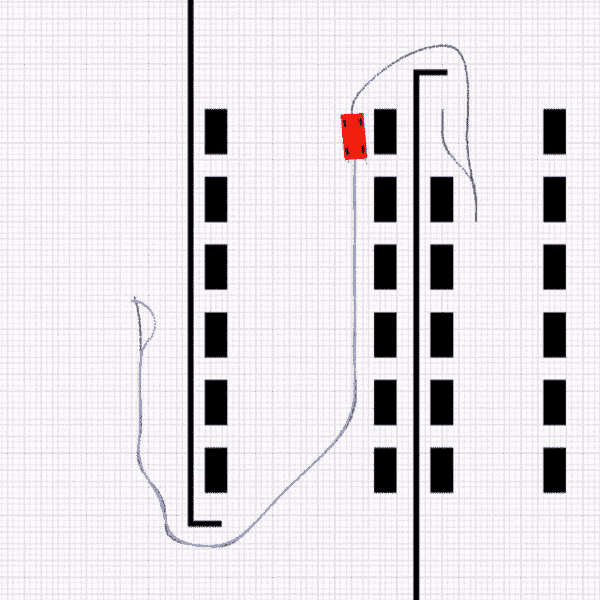

# 自动平行泊车:路径规划、路径跟踪和控制

> 原文：<https://towardsdatascience.com/automatic-parallel-parking-system-including-path-planning-path-tracking-and-parallel-parking-in-a-ece780b2e8e0?source=collection_archive---------18----------------------->

## 使用 A *算法、B 样条插值、车辆运动学和 MPC 控制器在 2D 环境中实现自动停车系统的 Python。



作者图片

本文包含虚拟环境中自动平行泊车系统的 python 实现，包括路径规划、路径跟踪和平行泊车。代理在环境中导航其路线，并被 MPC 控制器指引到指定的停车位置。你可以在这里找到完整的项目。

## 环境

开发自动停车场系统的第一步是设计和开发一个能够使用`OpenCV`库进行可视化渲染的环境。环境作为一个类在`environment.py`中实现，并在开始`env = Environment(obs)`时接收障碍。可以使用`env.render(x,y,angle)`放置代理。

下面显示了一个环境示例。你可以从 1 号到 24 号选择停车位。



作者图片

## 路径规划

**A*算法**

代理将使用*找到从起点到目标的路径。这个来自 [PythonRobotics](https://pythonrobotics.readthedocs.io/en/latest/modules/path_planning.html) 的 A*实现考虑了障碍物和机器人半径等参数。

**用 B 样条插值路径**

在离散的 100*100 空间中找到路径后，使用 b 样条将路径平滑并缩放到环境的 1000*1000 空间。结果是一组点来指导我们的代理！

## 路径跟踪

**小车的运动学模型**为:

```
x' = v . cos(ψ)
y' = v . sin(ψ)
v' = a
ψ' = v . tan(δ)/L
```

a:加速度，δ:转向角，ψ:偏航角，L:轴距，x: x 位置，y: y 位置，v:速度

**状态向量**为:

```
z=[x,y,v,ψ]
```

x: x 位置，y: y 位置，v:速度，ψ:偏航角

**输入向量**为:

```
u=[a,δ]
```

a:加速度，δ:转向角

**控制**

MPC 控制器基于模型控制车辆速度和转向，并引导车辆通过路径。MPC 有一个使用线性化模型的选项。在这种情况下，MPC 将工作点周围的运动学模型线性化，然后进行优化。

## 自动停车

这部分包括 4 条规则，代理人必须根据停车位置进行选择。这里我们来看看其中的一个。路径设计的规格如下图所示。



作者图片

首先，代理将找到一条路径来停放车辆，然后计算到达角度。基于到达角度，代理选择 2 个坐标作为确保 1 (x0，y0)和确保 2 (x1，y1)点。这是起点和终点。



作者图片

此后，使用如下所述的 2 个圆方程来规划从确保 1 (x0，y0)到确保 2 (x1，y1)的停车路径。2 条直线也被添加到路径上，以提供一个漂亮的停车路线。



作者图片

MPC 通过 ensure2 坐标中的路径和停车场控制代理。

## 结论

您可以从 [*G* ithub](https://github.com/Pandas-Team/Automatic-Parking) 下载整个项目，并使用以下命令运行代码:

```
$ python main_autopark.py --x_start 0 --y_start 90 --psi_start 0 --parking 7
```

可以看出，汽车由 MPC 控制器引导，沿着它的路径行驶，直到它到达环境的停车点。最后，该车与其他车辆平行并停在指定位置。



作者图片

> [*熊猫队*](https://github.com/Pandas-Team) *在 2020-2021 年全国自动驾驶汽车拉尼山竞赛中获得第一名。*
> 
> [阿米尔侯赛因·海达里安](https://medium.com/@amirhosseinh77)，艾达·穆罕默德·沙希[，米拉德·索尔塔尼](https://medium.com/@soltany.m.99)，[阿巴斯·奥米迪](https://medium.com/@abbasomidi77)，[阿米尔侯赛因·卡泽罗尼](https://medium.com/@amirhossein477)