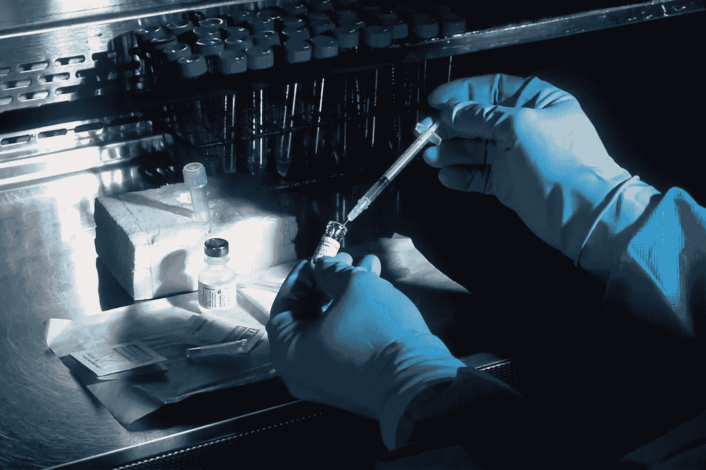

# 利用 1D RegNet 和 AdaCos 的深度度量学习进行自动光谱识别

> 原文：<https://towardsdatascience.com/automatic-spectral-identification-using-deep-metric-learning-with-1d-regnet-and-adacos-8b7fb36f2d5f?source=collection_archive---------14----------------------->

## 引入强大的深度度量学习，实现更加精确和稳定的自动光谱分析，从数据库中识别物质

[国家癌症研究所](https://unsplash.com/@nci)在 [Unsplash](https://unsplash.com) 上拍摄的照片

# 背景和动机

像《犯罪现场调查》、《法律与秩序》和《法医档案》这样的电视节目向大众观众介绍了法医学，并生动地展示了科学证据对破案的重要性。留在现场的一小块碎片可以推翻凶手的不在场证明，从而指认凶手。基于光谱分析的物质鉴定在法医学中起着至关重要的作用。同样，材料识别过程对于制造部门和材料研究中的故障推理至关重要。
光谱，如无机材料的 X 射线衍射(XRD)和有机材料的傅里叶变换红外光谱(FT-IR ),是鉴定成分的典型方法。独特的光谱特征，即所谓的**“光谱指纹”**，使我们能够通过将测得的光谱与数据库中的光谱进行比较来识别材料。识别准确度大致基于光谱数据库的搜索引擎算法以及从经过仔细检索的样品中获得的无噪声光谱数据的程度。然而，样品量不足或其他物质的污染可能会使光谱数据变得嘈杂，难以识别。具体来说，大多数数据库搜索算法利用输入光谱的峰值位置。然而，峰移通常发生在小样本的情况下，导致可识别性差。没有人类专家的帮助，搜索引擎结果不会成为值得信赖的分析。更鲁棒的识别算法可以使搜索结果本身成为更可靠的分析结果。因此，深度学习，一种更准确的识别机器学习模型，可能会使法医分析过程自动化。

> 下面会解释这段代码，GitHub 上也有！

  

# 机器学习策略

但是，我们如何利用深度学习来解决这个嘈杂的样本识别问题呢？我脑海中立即浮现的想法是**卷积神经网络**，表示为 CNN，这是一个非常成功的用于对象识别的深度学习分类器。但是等等，这里有**与平常图像分类任务的四个不同点**。

> 1.输入光谱不是 2D 张量，而是**一维**，不像图像。
> 2。任务的目标是**不是分类而是识别**。也就是要识别的类数超过一万，像人脸识别任务。
> 3。与图像噪声类型不同，独特噪声包含在原始光谱中。
> 4。光谱数据库由每种材料的单一光谱组成，没有任何变化或噪音样品。

让我们来研究一下每个问题。数字对应每个问题。

## 1.1D 有线电视新闻网

首先，维度的差异对迁移学习有影响。在图像分类任务中，我们可以使用 GitHub 上发布的预训练模型，使我们能够减少我们应该准备的数据数量。幸运的是，GitHub 上有几个 1D-CNN 模型，但没有针对 spectra 的预训练模型。在我尝试的这些模型中，**1D-雷格内特**效果最好。RegNet 是由脸书研究人员创建的源于神经架构搜索(NAS)的最先进的 CNN 模型([论文](https://arxiv.org/pdf/2003.13678.pdf))。RegNet 的原始版本仅用于 2D 图像。但是，多亏了佐治亚理工学院的研究人员，1D 版的 RegNet 可以在 GitHub 上找到。资源库的链接在这里:
[https://github.com/hsd1503/resnet1d](https://github.com/hsd1503/resnet1d)

## 2.深度度量学习

其次，我们应该把这个光谱识别问题看作**少拍度量学习**，人脸识别也是如此。一般来说，分类任务需要每个类别超过 100 个样本。在我们的设置中，每个类的可用光谱是 1 或 2，这意味着少量的学习。其次，分类任务一般对待 100 类以下；否则，精度会降低。超过 5000 个类，我们通常会将问题从学习区分每个类的标准转换为学习衡量样本相似性的评估度量。这就是所谓的度量学习。这在人脸识别上非常有效，更好的是，我们所要做的度量学习就是替换损失函数。 [CosFace](https://arxiv.org/abs/1801.09414) 、 [ArcFace](https://arxiv.org/abs/1801.07698) 是使用 CNN 进行深度度量学习的开创性损失函数。如今，这些损失函数发展到了 [AdaCos](https://arxiv.org/abs/1905.00292) ，自动识别 CosFace 的超参数，无需额外的调谐程序就能很好地工作。AdaCos 实现可在此处获得:
[https://github . com/4 uiiurz 1/py torch-AdaCos/blob/master/metrics . py](https://github.com/4uiiurz1/pytorch-adacos/blob/master/metrics.py)

## 3.贝叶斯去噪预处理

第三，要考虑光谱中独特噪声的去噪过程。频谱中的噪声类型可以大致分为两类:白噪声和背景噪声。背景噪音来自样品架、样品板或不充分结晶样品的信号。在[珠](https://www.sciencedirect.com/science/article/abs/pii/S0169743914002032?via%3Dihub)出现之前，移除一直由人工完成。由于贝叶斯稀疏分析的能力，我们可以用很少的超参数自动对这两种噪声类型进行去噪。资源库在这里:
[https://github.com/skotaro/pybeads](https://github.com/skotaro/pybeads)

## 4.基于物理学的数据增强

即使我们考虑少量的学习设置，每个类 1 或 2 个训练数据也是不够的。这是因为相同的材料有几种不同的光谱。变量及其原因如下:

> 1.**峰值缩放**；由于粉末样品中晶体取向的排列差异，导致峰值强度偏离数据库中的标准光谱
> 2。**巅峰淘汰**；由于实验仪器设置
> 3，从数据库中的标准光谱中删除一些峰。**模式转换**；由于样品中的应变或实验条件，当模式从数据库中的标准光谱向下或向上移动时。
> 4。**峰值分裂**；由于晶体结构紊乱，数据库中标准光谱出现新峰。

因此，1 或 2 个数据无法将这些光谱变化告诉深度学习模型。因此，我们应该应用数据扩充。感谢麻省理工学院的研究人员，这里提供了 1-3 的数据增强代码:
[https://github.com/PV-Lab/autoXRD](https://github.com/PV-Lab/autoXRD)

关于峰分裂，我们可以使用 pymatgen 库来创建无序晶体结构及其 X 射线衍射光谱。

# 问题设置

让我们设置一个具体的问题来理解上面的策略。假设我们想鉴定未知的结晶粉末样本。我们可以测量 X 射线衍射(XRD)作为指纹图谱。我们只知道这个样本中一定含有锂。
可通过晶体学开放数据库(COD)访问 XRD 光谱数据库，使用 pymatgen 将晶体信息文件(CIF)转换为 XRD 光谱。根据化学需氧量，迄今为止报告的锂化合物有 8172 种。检查 8172 个与目标样本相似的光谱对人类来说是不可行的，因此我们考虑将候选范围缩小到 5 个。最有可能的候选人的识别准确率不重要，但是指定的 5 个候选人必须包含真实材料。假设准确率应该在 95%以上。因此，我们可以将这个问题公式化如下:

> 使用光谱识别技术，我们如何从 8，172 个候选样本中识别出未知样本，并达到 95%以上的前 5 名准确度？

# 代码

Python 库要求:

*   pymatgen
*   pytorch
*   sci kit-学习

环境；Python 3.7.3，Pytorch 1.4.0，

# 数据集构建

## 从 COD 下载 CIF

我们将使用 [COD](http://www.crystallography.net/cod/index.php) 来构建数据集。首先点击左侧表格中的**访问 COD 数据>搜索**页面。之后，在“ **1 至 8 元素**搜索框中输入“李”，然后点击**发送**。跳转到搜索结果页面后，您将看到文本“**结果:选择**中有 8172 个条目”。点击“**CIF 网址列表**，即可下载“ **COD-selection.txt** ”。这样，您可以获得 8，172 个 cif URLs 的列表。
接下来，下面的 python 代码将从 COD 中集体下载所有的 cif 文件。

## 将 CIF 转换为 XRD 光谱

第一步，您需要检查 pymatgen 是否能够读取 cif 文件。不幸的是，有些 CIF 文件不能被 pymatgen 读取。下面的 **read_CIF** 模块可以将 CIF 解释为 pymatgen 可读的结构数据，保存为任意名称的 pickle 文件。

接下来，我们可以使用下面的 **XRDspectra** 模块将 pymatgen 结构数据转换为 XRD 光谱。

因此，在按顺序运行上述代码后，我们获得一个名为 **XRD_epoch5.pkl** 的 XRD 光谱数据库。LiTaO3 等晶体名称被转换成数字 int 标签。在 **material_labels.csv** 中总结了数字标签和人类可理解的晶体名称之间的对应关系。

# 深度度量学习模型(1D-RegNet + AdaCos)

首先，从[这个库](https://github.com/hsd1503/resnet1d)下载 **net1d.py** 。然后，执行以下代码来训练深度度量学习模型。

因此，您可以使用下面的代码可视化学习曲线( **learning_curve.csv** )。

作者创建的学习曲线

我们可以看到，在第 100 个历元时，**验证前 5 名的准确度达到了** **97.3** ，这意味着我们的目标已经达到。测试准确度是相同的(97.3)，因此与验证数据集的过度拟合无关。

这个代码在 GitHub 也有，链接[这里](https://github.com/ma921/XRDidentifier)。玩吧，就像你是法医一样！

> 如果你喜欢这篇文章，请在 Medium、GitHub 和 Twitter 上关注我！
> 
> 推特:[https://twitter.com/masaki_adachi](https://twitter.com/masaki_adachi)
> GitHub:[https://github.com/ma921](https://github.com/ma921)