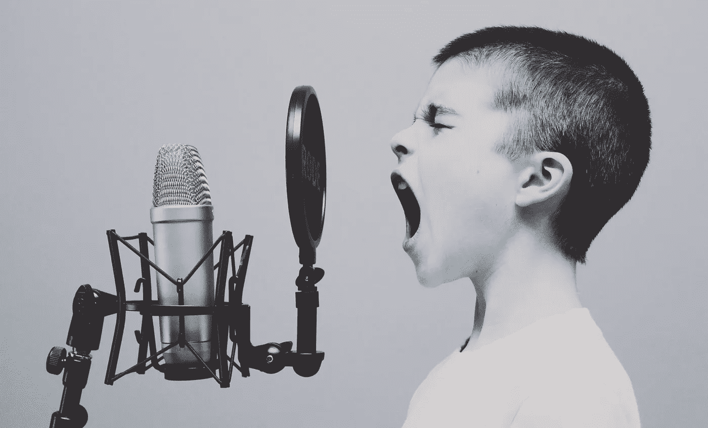
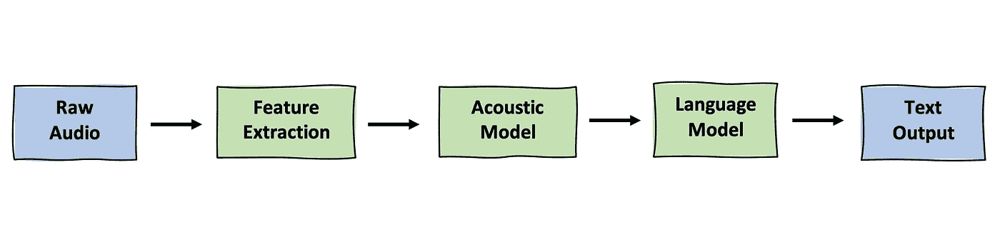
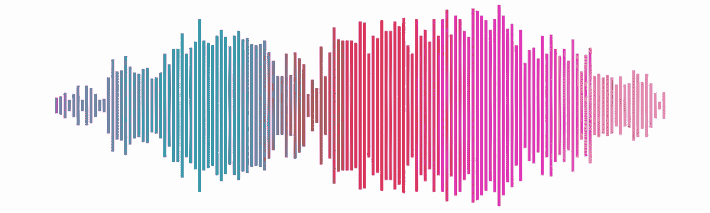
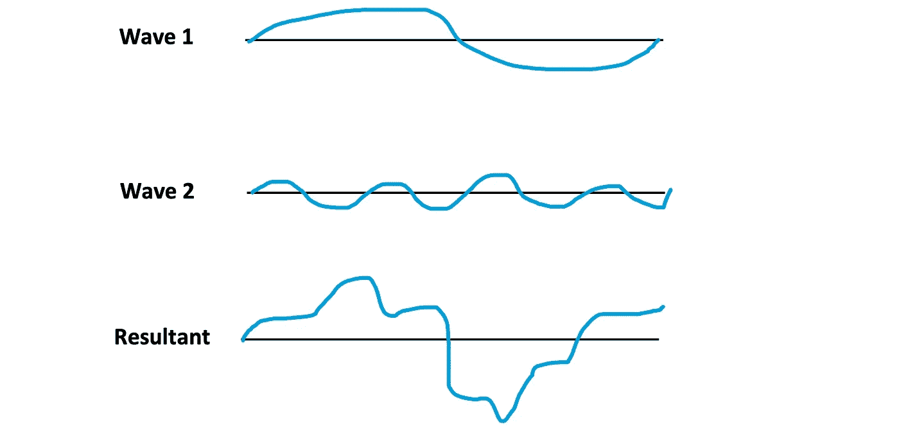
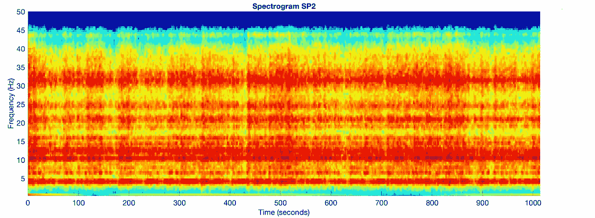
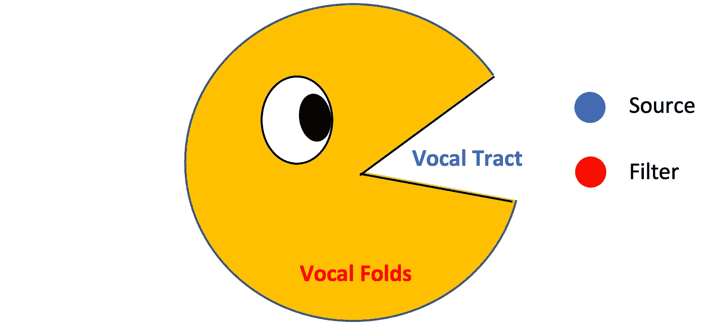

# 自动语音识别:分解语音成分

> 原文：<https://towardsdatascience.com/automatic-speech-recognition-breaking-down-components-of-speech-85d065061517?source=collection_archive---------26----------------------->

## [思想和理论](https://towardsdatascience.com/tagged/thoughts-and-theory)

## 理解语音的基本单位以训练声学模型



由[杰森·罗斯韦尔](https://unsplash.com/@jasonrosewell)在 [Unsplash](https://unsplash.com/photos/ASKeuOZqhYU) 上拍摄的照片

# 目录

1.  **概述**
2.  **ASR 中的困难** : *噪音、口齿不清、语言含糊不清、缺乏上下文*
3.  **语音的物理属性** : *音素、字素*
4.  **信号分析** : *音频信号、声音分量、傅立叶变换*
5.  **光谱图** : *快速傅立叶变换算法*
6.  **梅尔频率倒谱系数** : *梅尔标度、频率分析、倒谱分析、源-滤波器模型*

# 概观

自动语音识别(ASR)是将语音或音频波转换成单词的文本表示。一般是在[苹果 Siri](https://en.wikipedia.org/wiki/Siri) 、[亚马逊 Alexa](https://en.wikipedia.org/wiki/Amazon_Alexa) 等[语音用户界面](http://Voice User Interfaces) (VUIs)的第一步。

这种语言的许多特性使得它很难准确地执行 ASR。其中一些是噪音、雄辩、模糊的单词边界和缺乏上下文。这些困难在随后的章节中有更详细的描述。

## 语音识别管道

让我们简单地看一下通过 ASR 管道的转换过程。



作者图片

**特征提取**

在将语音或原始音频提供给模型之前，需要通过特征提取将其转换为模型可以理解的适当形式。这些表示由光谱图或 MFCCs 组成。

**声学模型**

在特征被提取之后，这些向量被传递给声学模型。[声学模型](https://en.wikipedia.org/wiki/Acoustic_model)试图将音频信号映射到语音的基本单元，例如音素或字素。这些模型的实现包括 hmm 和神经网络。这些语言单位将在下一节详细阐述。

**语言模型**

让我们假设声学模型正确地将音频映射到单词。有些词可能听起来一样(谐音:海 vs 见)或者听起来很像(单 vs 海)，但意思完全不同。语言模型允许算法学习句子或单词的上下文或含义。一个流行的打破记录的语言模型叫做 [BERT](https://en.wikipedia.org/wiki/BERT_(language_model)) 。

本文将包含管道中的第一步，即将原始音频的组件分解为声学模型可以学习的特征表示。

# ASR 中的困难

由于原始音频本身的各种因素、个体发音的独特性、模糊的单词边界以及缺乏上下文，自动语音识别是困难的。让我们来看看这些挑战。

**噪音**

噪声是指模糊或不包含有意义的数据或其他信息的随机波动。识别器应该能够从无用噪声区域中分离出音频信号区域。

*   这些声音包括背景对话、麦克风静电噪声、飞过的飞机、狗叫声等等。

**演讲**

口才是指一个人发音和发音的方式。不同的人有不同的发音，如音高的*可变性*、音量的*可变性*和语速的*可变性*，因此很难解释这些差异。

*   例如，视觉上和听觉上，我们可以看到和听到' *speed* '和'*speeechch*'是以不同的速度说的。很可能音高和音量也不同。这些差异需要对齐和匹配。

**模糊的单词边界**

与书面语言不同，语音没有清晰明确的单词边界。书面文本在单词之间有空格、逗号和其他形式的分隔。在演讲中，单词似乎一个接一个地重叠在一起。

*   ”*字的界限在哪里？*vs .*wherethewordlines*

**缺乏上下文**

一般来说，对话之所以流畅，是因为人们能够通过我们固有的上下文识别器来填补空白。没有上下文，很难区分两个完全不同但听起来很像的句子。

*   你能识别语音吗？你能毁掉一个美丽的海滩吗？”

# **言语的物理属性**

虽然语音识别存在困难，但语音的物理属性有助于语音识别。例如，我们可以将语音分解成基本单元，如*字素*和*音素*。

**音素**

音素是语言中不同的声音，用斜线表示，即/ah/。换句话说，它们是声音的最小单位。美国英语大约有 40 个音素，英国英语有 44 个音素。例如，我们可以把 SPEECH 分解成 S . P . IY CH。

**字形**

字素是语言中独特的字符，用尖括号表示，即。它们是书写系统的最小单位。在英语中，有 250 个字素，但最小的字素是一组字母(A-Z)加上一个空格字符。

***为什么不能只映射音素→字素或者反之？***

音素→字素或字素→音素之间不存在一对一的映射。多个音素映射到同一个字素，多个字素映射到同一个音素。

字母 c 根据单词映射成不同的音。

*   即 <c>→ /K/表示猫， <c>→ /CH/表示聊天， <c>→ /S/表示仪式。</c></c></c>

或者，诸如单词“SPEECH”中的“IY”音可以用不同的拼法形成。

*   即/IY/ → <ei>表示接收，/IY/ → <ie>表示相信，/IY/ → <ee>表示讲话。</ee></ie></ei>

***这些怎么有用？***

虽然音素不能直接映射到字素，但它们是语音处理的一个有用的中间步骤。这一步叫做*。如果我们可以成功地将声学模型的输出解码为音素，那么我们可以在后处理步骤中使用 ***词典*** (词典映射)将这些音素映射到它们的单词，以形成单词和句子。*

*此外，这个后处理步骤允许我们通过映射到一组常量值来降低复杂性。对于高维度问题，具有大量词汇的问题，音素可以用于显著减少单词之间的比较次数。但是，如果问题的词汇量很小，可以选择使用声学模型直接映射到单词，跳过这个中间步骤。*

*如果你想把音素合并到你的后处理步骤中，看看 [ARPHABET](https://en.wikipedia.org/wiki/ARPABET) 。这是一个众所周知的音素集，是为语音研究而创建的。*

# *信号分析*

*语音由声波组成，声波是在空气中传播的正弦振动。麦克风等音频输入设备从这些声波中捕获声能，并将其记录为音频信号。[更多关于声音](https://en.wikipedia.org/wiki/Sound)。*

**

*作者图片*

*以下是波属性的一些基本定义:*

****振幅****

*   *声波中的声能有多大，声音就有多大。*
*   *较大的声音振幅较高，而较小的声音振幅较小*

****频率****

*   *波重复自身的次数，以赫兹(Hz)或每秒周期数来度量*
*   *高频声音如汽笛的波长较短，而低频声音如低音的波长较长*

*现在，让我们来看一段录音。*

**

*作者图片*

*请注意，这个波形看起来不像之前显示的余弦或正弦函数。这是由于声音的复杂性。声波由多个重叠的波组成，当 ***通过相长干涉叠加*** (加在一起)时振幅增加，通过相消干涉振幅减小(抵消)。*

**

*作者图片*

*通过观察两个波，我们已经可以看到当波 1 和波 2 叠加时，一个更复杂和更嘈杂的波开始形成。从本质上讲，声波是由许多重叠的声波组成的，因此可以分解成单独的、更小的波成分。换句话说，对于 2 个波，合成波=波 1 +波 2。*

## *傅里叶分析*

*傅立叶分析是将数学函数分解成更简单的三角函数的研究。由于声音由振荡振动组成，我们可以使用傅立叶分析和傅立叶变换将音频信号分解为不同频率的正弦函数分量。*

## *傅里叶变换*

*傅立叶变换是一种数学变换，它将基于时间的模式分解成其组成部分。*

> *这里有一个简单的英语比喻:*
> 
> ***傅立叶变换有什么作用？给它一杯奶昔，它就能找到配方。***
> 
> ***如何？**将思慕雪过滤，提取每种成分。*
> 
> ***为什么？**食谱比奶昔本身更容易分析、比较和修改。*
> 
> ***我们怎么把奶昔拿回来？**将配料混合。— [来源](https://betterexplained.com/articles/an-interactive-guide-to-the-fourier-transform/)*

*使用傅立叶变换，我们可以将复杂的声波分解为更简单的成分，并在尝试将音频转录为文本或执行其他目标之前，将各个成分处理为有用的特征。*

*傅立叶变换是从语音中提取特征并转换成我们的模型可以使用的有意义形式的有用工具。我们可以使用快速傅立叶变换(FFT)算法，通过将声波分成 ***声谱图*** 来生成声波的频率表示。然后可以将频谱图提供给一个模型来直接预测，或者我们可以在预测阶段之前进一步从中提取特征。*

# *光谱图*

*频谱图是波在时间上的频域表示。我们将在下面看看这是什么意思。*

**

*[Nasa 着陆器记录的振动频谱图](https://mars.nasa.gov/resources/22198/vibrations-from-insights-first-20-minutes-on-mars/?site=insight)*

*垂直轴代表频率或波在时间 t 移动的速度，在水平轴中定义。颜色表示信号的幅度。我们能够相对于时间将声谱图输出与原始音频信号对齐。*

*   *[这里的](https://www.seas.upenn.edu/~cis391/Lectures/speech-rec.pdf)是解释频谱图中的声音如何被解读的资源。*

*使用一种称为[快速傅立叶变换](https://en.wikipedia.org/wiki/Fast_Fourier_transform) (FFT)算法的算法，我们可以以波的形式获取音频，将它们分解为更小的分量，并在声谱图中的每个时间间隔 t 可视化这些分量。*

1.  *将信号分成时间帧*
2.  *用 FFT 将每一帧分解成频率分量*

*   *每个时间帧现在被表示为每个频率的振幅向量*

*SciPy 允许您使用以下 import 语句轻松实现 FFT:*

```
*from spicy.fftpack import fft*
```

*[关于 SciPy FFT 函数的更多信息](https://docs.scipy.org/doc/scipy/reference/generated/scipy.fftpack.fft.html)*

***问题***

*虽然频谱图给出了声音数据的完整表示，但它仍然包含噪声和其他可变性(如上所述),这些可变性可能会使数据变得模糊，并且超出我们实际需要的量。识别和隔离音频信号中真正具有预测能力的部分至关重要。*

# ***梅尔频率倒谱系数***

*频谱图允许我们将原始音频映射成频率的表示。然而，我们需要一种方法来进一步过滤噪声音频信号。请注意，听觉语言受到我们的嘴(发出声音)和耳朵(捕捉声音)的限制。*

*这就是梅尔频率倒谱系数(MFCCs)的用武之地。梅尔频率倒谱系数从梅尔频率分析和倒谱分析中提取。*

## *梅尔频率分析*

*首先，让我们定义一个音高的相对音阶。*

***梅尔标度***

> ***梅尔音阶**(在[一词之后*旋律*](https://en.wikipedia.org/wiki/Melody))[【1】](https://en.wikipedia.org/wiki/Mel_scale#cite_note-stevens1937-1)是被听者判断为彼此距离相等的[音高](https://en.wikipedia.org/wiki/Pitch_(music))的感知[音阶](https://en.wikipedia.org/wiki/Scale_(music))。*

*Mel 标度是从音高感知的研究中发展出来的，它允许我们测量音高之间的距离。它告诉我们人们真正能辨别的音高。*

*   *例如，音高 100 Hz 和 200 Hz 可能被感知为比音高 1000 Hz 和 1100 Hz 听起来更远，即使这两对音高相差 100 Hz。这个结果可能是因为人们可以更好地区分低频的音高。*

***降维***

*因为不能辨别每一个频率，所以可以通过只保留实际上可以听到的频率来过滤声音。过滤掉人类听众范围之外的频率可以去除不相关的信息，同时保留预测信号。*

*此外，如果我们不能区分两个不同的频率，那么这些频率可以被标记为相同的频率。注意光谱图是连续的。通过转换到宁滨频率的离散标度，频率的总数将减少。*

*Mel 频率分析允许通过过滤噪声和离散化频率来整体降低数据维度。*

## ***倒谱分析***

*即使我们的解剖结构相同，人的声音也因人而异。人类产生声音是由“源”和“过滤器”结合而成的。我们将在下面看到这意味着什么。*

***源-过滤器模型***

*源-滤波器模型区分说话者无关和说话者相关的语音源。*

**

*作者图片*

*红色显示的*声源*代表每个人独有的发声部位，如声带或声带。蓝色显示的*过滤器*由声道组成，它影响所有人说话时使用的词语的清晰度，如鼻腔或口腔。目标是关注单词的发音(声带)，忽略与说话无关的部分(声道)。*

*倒谱分析允许我们分离源和过滤器。主要是它让我们可以放下声源，保持过滤器发出的声音的形状。源和滤波器激发了倒谱分析背后的思想。本质上，信号源与滤波器相乘形成信号，然后通过 FFT 等将信号转换到频域。*

*如果你想了解这个理论，请看下面的内容:*

*[语音理论的倒谱分析](https://vlab.amrita.edu/?sub=3&brch=164&sim=615&cnt=1)*

***结合特征***

*Mel 频率分析和倒谱分析产生大约 12 个 MCFF 特征。此外，MFCC 德尔塔(频率的变化)或 MFCC 德尔塔-德尔塔(频率变化的变化)可能是自动语音识别的有用特征。这些附加功能可以使 MFCC 功能的总数增加一倍或三倍。它们也显示出在 ASR 中给出更好的结果。*

*[关于 MFCC 实施和 MFCC 三角洲的教程](http://practicalcryptography.com/miscellaneous/machine-learning/guide-mel-frequency-cepstral-coefficients-mfccs/)*

*主要的好处是 MCFF 的特性导致频率数量大大减少。与声谱图不同，MCFFs 可以过滤噪声，并专注于具有更强预测能力的信号部分。*

# *结论*

*总之，自动语音识别带来了许多挑战，但通过理解语音的基本组成部分，我们可以简化问题。原始音频波可以被转换成特征表示，然后使用声波的知识和声音的物理人类约束的领域知识来进一步简化。这些技术可以产生更清晰、更强的信号，帮助我们更有效地训练声学模型。*