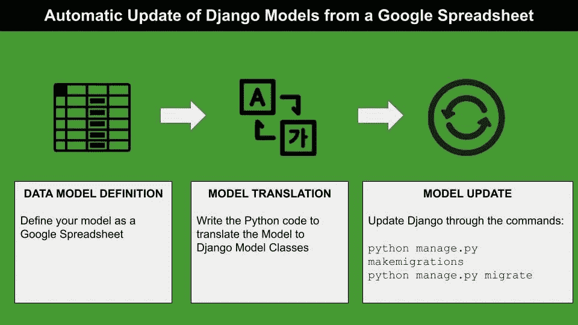
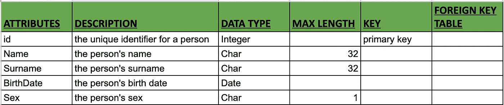
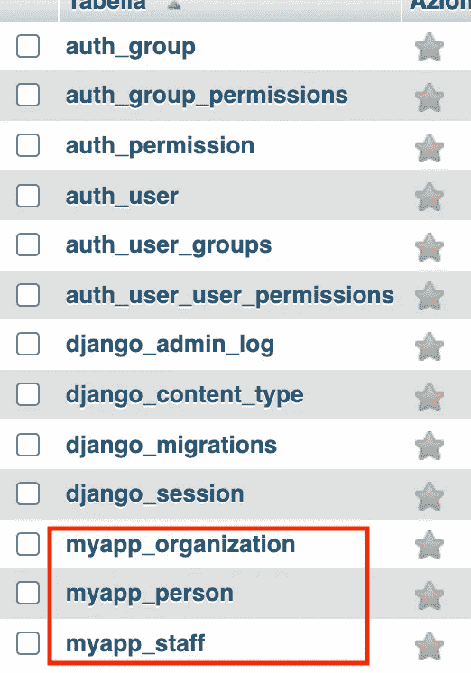
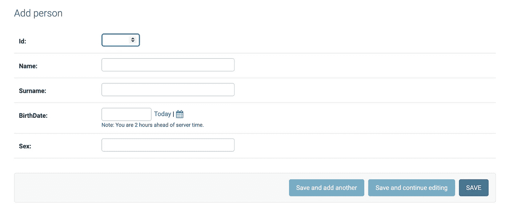

# 从 Google 电子表格自动更新 Django 模型

> 原文：<https://towardsdatascience.com/automatic-update-of-django-models-from-a-google-spreadsheet-7c6d4f30e3ca?source=collection_archive---------18----------------------->

## 数据输入

## 关于如何直接从 Google 电子表格创建和更新 Django 模型的现成 Python 教程



作者图片

通常，数据模型定义和数据模型实现是由不同的人执行的，数据模型定义中的一点点变化都应该尽快转换成实现的模型。

**模型变化转化为实现的速度取决于定义和实现之间的关系。**

在本教程中，我提出了一种机制，将模型中的变化直接转化为实现中的变化。我利用以下工具:

*   **数据模型定义的谷歌电子表格**
*   **Python** 将电子表格中的更改转化为 Django 的更改
*   Django 在 Web 界面中呈现模型。

通过 Google 电子表格自动更新 Django 中的数据模型需要三个步骤:

*   **谷歌电子表格中的数据模型定义**
*   **模型转换**从 Google 电子表格到 Django 模型
*   **Django 的车型更新**

# 1 数据模型定义

首先，我定义了一个基本的数据模型。例如，我可以考虑三个表:

*   `Person(**id**,name,surname,birthDate,sex)`
*   `Organization(**id**,name,address,website,locality)`
*   `Staff(person_id,organization_id)`

然后，我创建了一个新的 Google 电子表格，并为每个表格分配了一个工作表，如本例所示。对于每个表，我定义了以下列:

*   **属性—** 表格的属性列表
*   **描述** —属性代表什么
*   **数据类型** —属性数据类型
*   **最大长度** —字符型变量的最大长度。它仅对字符属性有效
*   **关键字** —指定属性是否为关键字(主关键字或外键)
*   **外键表** —如果属性是外键，指定相关的表

下图显示了 Person 表的构建表:



作者图片

**数据模型可由模型设计者动态更新，无需考虑任何实现。他们甚至可以通过添加或删除属性，向电子表格中添加其他表格或修改现有表格。**

模型设计者尊重表格的结构就足够了。

# 2 模型到 Django 模型的转换

下一步包括从 Google 电子表格到 Django 的模型转换。这可以通过用 Google 电子表格的内容动态构建 Django 模型来实现。实际上，**我可以编写一个 Python 代码，根据 Google 电子表格动态生成 Django** `**model.py**` **脚本。**

模型转换可以通过三个步骤实现:

*   阅读谷歌电子表格
*   创建表和 Django 模型类之间的映射
*   创建`model.py`脚本的内容

## 2.1 阅读谷歌电子表格

在我之前的文章中，我描述了如何用 Python 加载 Google 文档的内容。关于 Google 电子表格，认证的过程非常相似，不同之处在于 Google 电子表格 API 应该在 Google 控制台中启用，而不是在 Google 文档 API 中启用。

为了完整起见，我在这里报告了用于身份验证的 Python 代码:

```
from __future__ import print_function
import os.path
from googleapiclient.discovery import build
from google_auth_oauthlib.flow import InstalledAppFlow
from google.auth.transport.requests import Request
from google.oauth2.credentials import Credentials# If modifying these scopes, delete the file token.json.
SCOPES = ['[https://www.googleapis.com/auth/spreadsheets.readonly'](https://www.googleapis.com/auth/spreadsheets.readonly')]# The ID and range of a sample spreadsheet.
SPREADSHEET_ID = 'YOUR DOCUMENT ID' creds = None
# The file token.json stores the user's access and refresh tokens, and is created automatically when the authorization flow completes #for the first time.
if os.path.exists('token.json'):
    creds = Credentials.from_authorized_user_file('token.json', SCOPES)
# If there are no (valid) credentials available, let the user log in.
if not creds or not creds.valid:
    if creds and creds.expired and creds.refresh_token:
        creds.refresh(Request())
    else:
        flow = InstalledAppFlow.from_client_secrets_file(
            'credentials.json', SCOPES)
        creds = flow.run_local_server(port=0)
    # Save the credentials for the next run
    with open('token.json', 'w') as token:
        token.write(creds.to_json())
```

认证后，我可以加载 Google 电子表格的内容:

```
service = build('sheets', 'v4', credentials=creds)
sheet = service.spreadsheets()
sheet_metadata = service.spreadsheets().get(spreadsheetId=SPREADSHEET_ID).execute()
```

并把它转换成熊猫字典的数据框架。实际上，字典中的每一项都是 Google 电子表格的一个表，相关的键是表名:

```
df_dict = {}properties = sheet_metadata.get('sheets')for  item in properties:
    table = item.get('properties').get('title')
    df_dict[table] = pd.DataFrame()

    result = sheet.values().get(spreadsheetId=SPREADSHEET_ID,
                                range=table + '!A1:F').execute()
    header = result.get('values', [])[0]

    values = result.get('values', [])[1:] 
    if not values:
        print('No data found.')
    else:
        all_data = []
        for col_id, col_name in enumerate(header):
            column_data = []
            for row in values:
                if col_id < len(row):
                    column_data.append(row[col_id])
                else:
                    column_data.append('') ds = pd.Series(data=column_data, name=col_name)
            all_data.append(ds)
        df_dict[table] = pd.concat(all_data, axis=1)
```

## 2.2 创建表和 Django 模型类之间的映射

这一步可以通过构建一个表来轻松完成，该表将每个数据帧的列映射到 Django 模型类的属性:

```
tables = {}
for table,df in df_dict.items():
    tables[table] = {}
    for i in range(0, df.shape[0]):
        attr = {}
        attr['default'] = 'None'
        if df['MAX LENGTH'][i] != '':
            attr['max_length'] = df['MAX LENGTH'][i]
        if df['KEY'][i] == 'primary key':
            attr['primary_key'] = 'True'
        tables[table][df['ATTRIBUTES'][i]] = [df['DATA TYPE'][i], attr]
```

它产生以下输出:

```
{
'**PERSON**': {
  '**id**'    : ['Integer', {'default': 'None', 'primary_key': 'True'}],
  '**Name**'  : ['Char', {'default': 'None', 'max_length': '32'}],
  '**Surname**': ['Char', {'default': 'None', 'max_length': '32'}],
  '**BirthDate**': ['Date', {'default': 'None'}],
  '**Sex**'.  : ['Char', {'default': 'None', 'max_length': '1'}]}, '**ORGANIZATION**': {
  '**id**'  : ['Integer', {'default'  : 'None', 'primary_key': 'True'}],
  '**Name**'    : ['Char', {'default': 'None', 'max_length': '64'}],
  '**Address**' : ['Char', {'default': 'None', 'max_length': '128'}],
  '**WebSite**' : ['Char', {'default': 'None', 'max_length': '128'}],
  '**Locality**': ['Char', {'default': 'None', 'max_length': '64'}]}, '**STAFF**'.   : {
  '**person_id**': ['Integer', {'default': 'None'}],
  '**organization_id**': ['Integer', {'default': 'None'}]}
}
```

在实践中，为每个表构建属性列表，并为每个属性将表列转换为 Django 模型属性。

## 2.3 创建`model.py`脚本的内容

模型转换的最后一步包括动态生成`model.py`脚本。

我定义了一个函数来解析上一个表中的每一项，并为 Django 类中的每个属性构建代码:

```
def **get_type**(attr_type):
    if isinstance(attr_type, list):
        attr = attr_type[0] + 'Field('
        for k,v in attr_type[1].items():
            attr = attr + k + '=' + v + ','
        attr = attr[:-1]
        return attr + (')\n')
    else:
        return attr_type + 'Field()\n'
```

然后我构建一个字符串，它将包含`model.py`文件的所有内容。我用静态代码初始化它:

```
script = 'from django.db import models\n'
```

然后，我为表中的每一项构建一个 Django 模型类:

```
for model,attributes in tables.items():
    script = script + "class " + model + "(models.Model):\n"
    for attr_name,attr_type in attributes.items():
        script = script + '\t' + attr_name + ' = models.' + get_type(attr_type)
```

最后，我将结果保存到名为`model.py`的文件中:

```
root = 'mywebsite/myapp/'
file_name = root + 'models.py'
with open(file_name, "w") as py_file:
    py_file.write(script)
```

# 3 在 Django 更新模型

现在我准备对 Django 进行修改。我只需运行以下命令:

```
python3 manage.py makemigrations
```

这将给出以下输出:


作者图片

最后:

```
python3 manage.py migrate
```

该命令应该将三个表添加到数据库中:



作者图片

# 摘要

在本教程中，我展示了如何从 Google 电子表格中自动更新 Django 模型。这个过程允许同步数据模型和数据实现，尽管这两个过程由不同的人管理。

如果你已经走了这么远来阅读，对我来说今天已经很多了。谢谢！你可以在[这篇文章](https://alod83.medium.com/which-topics-would-you-like-to-read-c68314dc6813)中读到更多关于我的信息。

# 你愿意支持我的研究吗？

你可以每月订阅几美元，解锁无限的文章——[点击这里](https://alod83.medium.com/membership)。

# 额外奖金

我可以在 Django 中配置管理控制台，以便手动插入记录。这可以通过将每个创建的模型类注册到管理控制台来实现。我可以通过创建一个`admin.py`脚本来自动完成:

```
script = """from django.contrib import admin\nfrom .models import *
"""for model in tables.keys():
    script = script + "admin.site.register(" + model + ")\n"
```

然后，我可以保存文件:

```
file_name = root + 'admin.py'
with open(file_name, "w",encoding='utf-8') as py_file:
    py_file.write(script)
```

然后，我可以再次应用迁移并创建一个新的超级用户:

```
python3 manage.py makemigrations
python3 manage.py migrate
python3 manage.py createsuperuser
```

最后，我可以运行应用程序:

```
python3 manage.py runserver
```

并连接到管理控制台:

```
[http://127.0.0.1:8000/admin](http://127.0.0.1:8000/admin)
```

在这里我可以看到我的表并添加新记录:



作者图片

本教程的所有代码都可以从我的 [Github 库](https://github.com/alod83/data-science/tree/master/DataVisualization/Django)下载。

# 相关文章

</building-a-fast-web-interface-in-django-for-data-entry-62f24947ef23>  </how-to-manipulate-a-pandas-dataframe-in-sql-7d1a1503f47>  </how-to-scrape-html-tables-with-python-pandas-98d18d2129cb> 