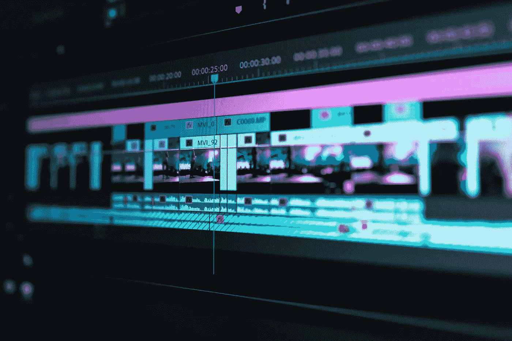
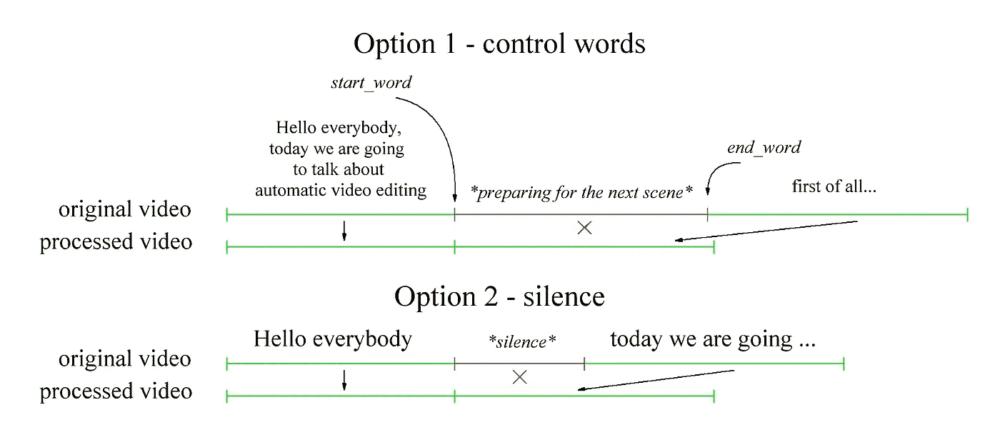
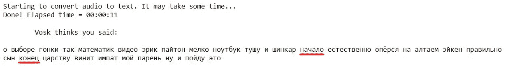
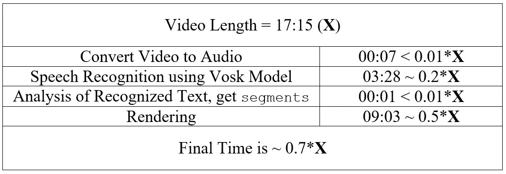
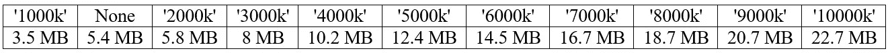
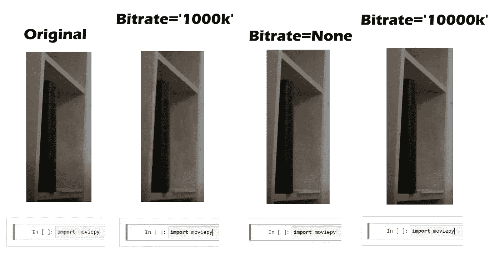

# 使用 Python 自动编辑视频

> 原文：<https://towardsdatascience.com/automatic-video-editing-using-python-324e5efd7eba?source=collection_archive---------11----------------------->

## 如何使用 Python 库 moviepy 和 vosk 实现语音控制或删除视频中的无声片段



由 [Peter Stumpf](https://unsplash.com/@peter_s?utm_source=unsplash&utm_medium=referral&utm_content=creditCopyText) 在 [Unsplash](https://unsplash.com/?utm_source=unsplash&utm_medium=referral&utm_content=creditCopyText) 上拍摄的照片

视频剪辑总是很繁琐。移除不必要的视频片段并不是一项困难的任务，而是一项漫长的任务。您需要完整地查看视频(可能不止一次！)，选择所有你需要的片段，加入它们然后渲染视频很长时间。简单剪辑一个小时的视频一般要三个多小时！所以我才有了这个想法。

当然，替代方案是存在的。比如 [wisecat](https://www.wisecat.video/) ，它能做的远不止“视频剪辑”。但是我想做一个快速、简单、免费的程序。Python 库 [moviepy](https://zulko.github.io/moviepy/) 和 [vosk](https://alphacephei.com/vosk/) 会帮我做这件事。

# 问题陈述

我想建立一个程序，它会自动剪切一些视频片段，然后将这些片段连接在一起。它必须以两种方式接收关于这些片段的数据:

*   自动(*部分自动*，有一些人工干预)——识别控制字，以及
*   自动(*全自动*，无需人工干预)——识别长时间的静默



解决视频自动编辑问题的两种方法。作者图片

该任务可分为以下子任务:

1.  了解如何使用 moviepy 编辑视频
2.  识别控制字/静音及其时间戳
3.  将这两个部件连接在一起

# 使用 Moviepy 编辑视频

首先，让我们尝试使用 *moviepy* 库裁剪并加入视频。

这非常简单——将源视频读入一个`VideoFileClip`对象后，我们可以用构建的方法做很多事情。我们将需要下列各项:

*   `video.subclip(start_seconds, end_seconds)`返回视频片段，从`start_seconds`的`video`切到`end_seconds`
*   和`concatenate_videoclips(clips)`，它们加入来自`clips`列表的所有视频片段。

将您需要的所有`(start_seconds, end_seconds)`对的列表放入`segments`变量中。现在，您可以使用下面的代码从片段中制作一个视频。

事实上，这个简单的程序已经非常有用了。它可以处理简单的任务(修剪视频的开头/结尾，剪切所需的片段)，比专业的视频编辑程序(索尼维加斯等)快得多。

现在我们所要做的就是从一个智能系统中得到这些配对(`segments`)。

# 带时间戳的语音识别概述

这项任务更加复杂。作为搜索和试验的结果，我决定使用 [vosk API](https://alphacephei.com/vosk/) 。在本文的[中，我描述了一个关于如何用时间戳实现语音识别的详细教程。但是我也将在这里简要地描述一下最重要的几点。](/speech-recognition-with-timestamps-934ede4234b2)

[](/speech-recognition-with-timestamps-934ede4234b2) [## 带有时间戳的语音识别

### 使用 Python 和 vosk API 进行离线和免费语音识别

towardsdatascience.com](/speech-recognition-with-timestamps-934ede4234b2) 

首先，我们需要从视频文件中识别语音。正如我在上面的文章中解释的，vosk 语音识别模型输出一个 JSON 字典列表，其中包含每个识别单词的四个参数— `confidence`、`start time`、`end time`和识别的`word`(文本)。我创建了一个自定义的`Word`类，按照这个格式描述单词。

下面的代码使用`model_path` vosk 模型识别`audio_filename`文件，并输出一个`Word`对象列表。

# 识别控制字

我们知道每个单词的发音时间。太好了！现在我们需要选择控制词——这里有发挥创造力的空间。

我们需要两个——剪切片段的开始和结束。不能只用*启动*和*停止*。其实当然可以，只是不能确定在平时的讲话中不会说这些话。如果你说，程序将无法正常运行。最初，我决定使用一些罕见的英语单词，如*睿智*和*过分*。但结果是生僻字识别更差，非常生僻的可能根本不在字典里。也是在这一刻，我意识到口音对语音识别质量的影响有多大。因为我的母语不是英语，所以我决定采用更简单的解决方案。

我决定只使用我的母语中的单词*开始*和*结束*。由于 vosk 有国外的模型，你可以用你的母语模型识别英语语音。文字会被认定为废话，但我们不需要，对吧？主要是*控制字将被正确识别*。在俄语中，它们分别被写成 **начало** 和 **конец** ，读作**纳哈罗**和 **konets** 。第一个字表示要剪切的片段的开始，第二个字表示其结束。



使用俄语模型的英语语音识别示例。作者图片

也可以将英文单词的*组合识别为控制命令。你甚至可以进一步识别声音——例如，手指点击或鼓掌。然而，它对我来说似乎不太方便。*

现在我们需要迭代`list_of_words`并检查识别的单词是否是控制单词之一。如果是，那么我们记住时间(开始时间为`start_word`，结束时间为`end_word`)。我还创建了`offset`变量来确保视频的裁剪不会太尖锐。

之后，剩下的就是将`segments`变量传递给**用 Moviepy** 编辑视频部分的代码片段！

# 识别沉默

另一种选择是删除静默持续时间超过某个阈值(例如 2 秒)的时刻。这里几乎所有的东西我们都已经很熟悉了。

> 这种方法是完全自动化的，在视频记录期间或之后不需要任何人工干预。你只要指定视频的路径，就能获得没有静默瞬间的视频。

# 最终计划

程序的两个主要部分已经准备好了，我们只需要把它们连接起来。唯一没有描述的是视频到单声道音频的转换。但是 moviepy 可以轻松应对这种情况。

## 项目结构

带有详细注释的完整程序可在[本 GitLab 报告](https://gitlab.com/Winston-90/automatic_video_editing/)中获得。

[](https://gitlab.com/Winston-90/automatic_video_editing/) [## Dmytro Nikolaiev /自动视频编辑

### 使用 Python、moviepy 和 vosk 进行自动视频编辑

gitlab.com](https://gitlab.com/Winston-90/automatic_video_editing/) 

该项目的结构如下:

```
automatic_video_editing
├───article
├───models
│   ├───vosk-model-en-us-0.21
│   └───vosk-model-ru-0.10
├───videos
│   .gitignore
│   
│   automatic_video_cutter.ipynb
│   automatic_video_cutter.py
│   Word.py
│
│   README.md
└── requirements.txt
```

它包含以下文件夹:

*   `article`文件夹包含本教程的数据。
*   `models`文件夹包含从[官方网站](https://alphacephei.com/vosk/models)下载的 vosk 模型。
*   `videos`文件夹包含要处理的视频。

和代码文件:

*   `Word.py`文件描述了`Word`类。
*   `automatic_video_cutter.ipynb`笔记本包含一个完整的程序。
*   `automatic_video_cutter.py`文件包含相同的完整程序，但以 python 脚本的形式。不用 [Jupyter 笔记本](https://jupyter.org/)也能用来运行程序。

参见`README.md`获取用户手册。

# 结果和结论

因此，程序的工作方式如下:

使用 Python 自动编辑视频 Youtube 上的控制词

使用 Python 自动编辑视频——消除 Youtube 上的静默时刻

我对结果很满意，但是还有很多时间需要讨论。

## 支持的视频格式

首先，关于**支持的格式**。该程序使用 *moviepy* ，并且 *moviepy* 支持 *ffmpeg* 支持的所有视频扩展。ogv，. mp4，.mpeg，。avi，。mov，。mkv 等。

## 执行时间

接下来，关于执行时间。我用不同长度的视频(从 1 分钟到 17 分钟)测试了这个程序几次。基于这些实验，我可以说**完整视频处理的时间小于原始视频文件**的长度。执行时间可能因硬件而异，但比例将保持不变。



17 分钟视频的程序执行时间。作者图片

首先，你需要阅读沃斯克模型。但是这个阶段是恒定的(不依赖于视频的长度)，大约需要 30 秒。该计划有四个主要阶段:

*   **将视频转换为音频** —不是在固定时间内执行，而是非常快速地执行(不到视频初始长度的 1%)
*   **使用 Vosk 型号的语音识别** —实验表明，你需要大约`0.2*X`秒来识别持续时间`X`秒的音频。
*   **分析识别出的文本，得到** `segments` —立即执行。在处理一分钟长的视频和 17 分钟长的视频时，我没有注意到区别。
*   **渲染** —最长的阶段。使用默认参数，它的执行需要大约`0.5*X`时间。

## 视频质量

探究执行时间后产生的问题是——质量呢？毕竟渲染越快，质量越差。这里的渲染速度非常快。

是的，它是。渲染是使用`write_videofile` *moviepy* 方法完成的，它有很多参数。我使用了它的默认值。

渲染我就不多说了，最重要的参数就是`bitrate`。比特率是单位时间内用于处理信息的位数**。使用的比特率越多，质量就越好。同时，你的文件也会变大。**

默认的`bitrate`值是`None`，大约是`'2000k'`(我在文档中找不到确切的值，通过实验找到了这个值)。使用这个值，视频被**压缩了一点** **，但是我没有注意到任何特别的质量损失**。

您可以设置更高的值来获得更好的质量。这也会降低渲染速度(但不会太慢)。我进行了一个实验，以从`'1000k'`到`'10000k'`的比特率渲染了一个视频——最小和最大值的渲染时间相差 50%。我就是这样算出大概的默认值的。



不同的比特率值和输出文件大小。作者图片

如果我们按比例计算文件大小(最初的视频持续 61 秒，为 11.6 MB，处理后的视频持续 24 秒)，我们得到的值为 4.5 MB。所以默认比特率就足够了。

这也可能与初始视频质量有关。我用我的网络摄像头录的视频，所以不是很好。下面可以看到质量对比。如果网络摄像头有所不同，那么对于屏幕捕捉，即使是最低的比特率也能显示出良好的效果。



不同比特率的质量比较。作者图片

如果你想深入了解这个，你可以从 [moviepy write_videofile 方法文档](https://zulko.github.io/moviepy/ref/VideoClip/VideoClip.html#moviepy.video.VideoClip.VideoClip.write_videofile)开始。

# 感谢您的阅读！

*   我希望这些材料对你有用。[在 Medium 上关注我](https://medium.com/@andimid)获取更多这样的文章。
*   如果您有任何问题或意见，我将很高兴得到任何反馈。在评论中问我，或者通过 [LinkedIn](https://www.linkedin.com/in/andimid/) 或 [Twitter](https://twitter.com/dimid_ml) 联系。
*   为了支持我作为一名作家，并获得数以千计的其他媒体文章，使用[我的推荐链接](https://medium.com/@andimid/membership)获得媒体会员资格(不收取额外费用)。