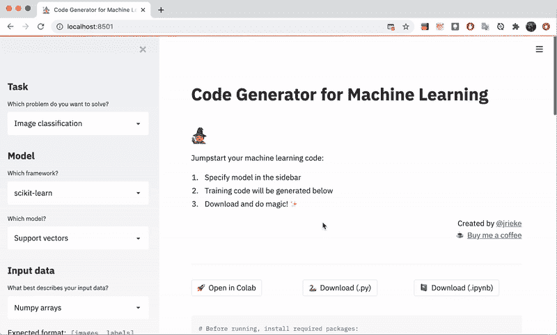
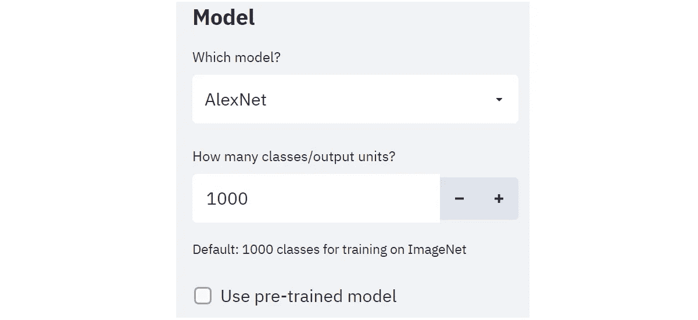
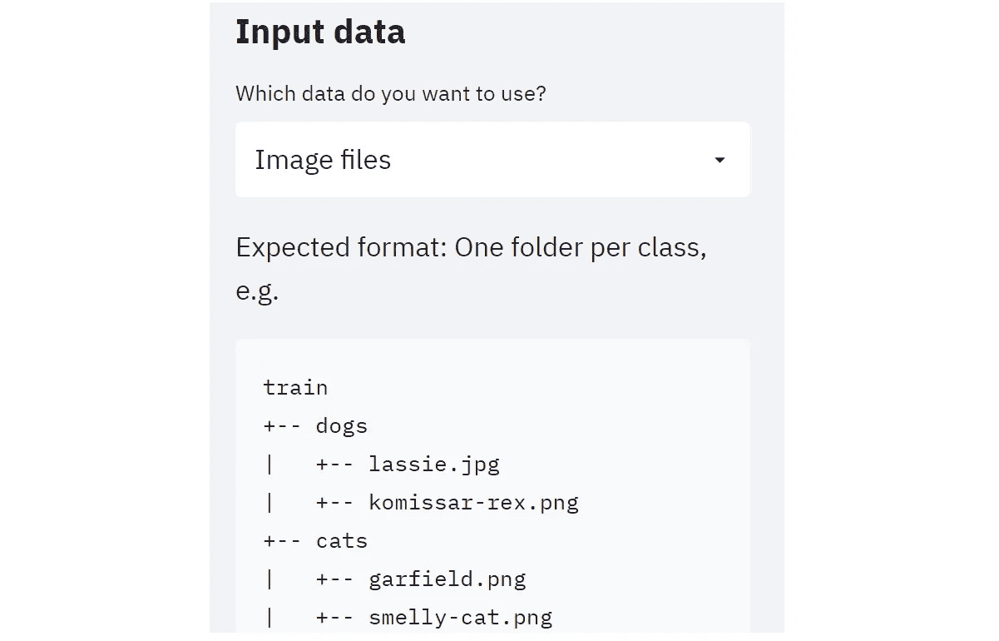
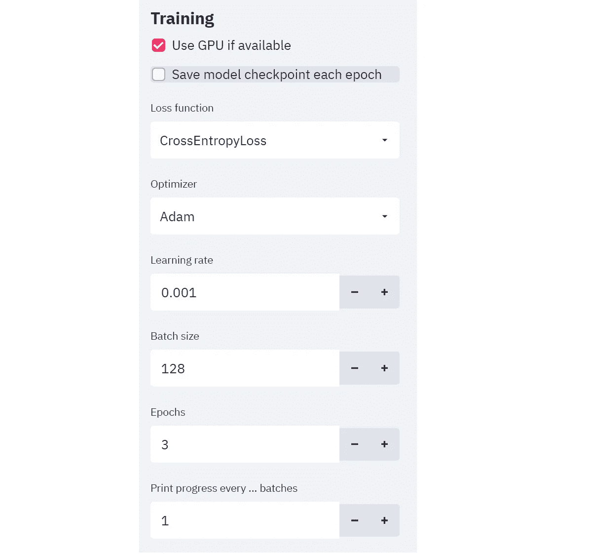
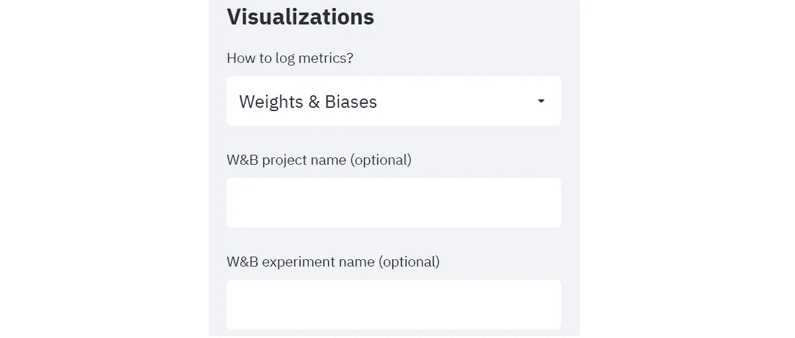

# 只需点击几下鼠标，即可自动生成机器学习代码

> 原文：<https://towardsdatascience.com/automatically-generate-machine-learning-code-with-just-a-few-clicks-7901b2334f97?source=collection_archive---------20----------------------->

## 使用 Traingenerator 轻松创建 PyTorch 和 scikit-learn 模板代码，用于机器学习模型培训


阿纳斯塔塞·马拉戈斯在 [Unsplash](https://unsplash.com?utm_source=medium&utm_medium=referral) 上拍摄的照片

重复编写模板代码来训练您的机器学习(ML)模型可能是一个巨大的痛苦。

虽然您可能有基础代码要处理(例如，过去的项目，其他队友的工作)，但是手动定制许多代码组件，如超参数和输入类型，仍然会引起不必要的麻烦。

本文介绍了 **Traingenerator** ，一个用于机器学习模型训练的简单代码生成器。

# 内容

> ***(1)****[*关于 train generator*](#7c3b)***(2)***[*如何使用*](#3b84)***(3)**[*结论*](#93dc)****

# **(1)关于列车发电机**

**[Traingenerator](https://traingenerator.jrieke.com/) 是一个简单的 web 应用程序(部署在 Streamlit 上)，允许你在 **PyTorch** 和 **scikit-learn** 这两个流行的框架中生成模板代码。**

**生成的代码覆盖了代码模板的各个部分，包括预处理、模型设置、训练和可视化。**

**可用的模板目前仅限于**图像分类**(正在进行物体检测)。尽管如此，我们可以很容易地修改这些样板代码以适应其他 ML 任务，甚至添加我们自己的模板。**

**这个应用程序的美妙之处在于，它简化了数据科学家的工作，同时降低了非技术用户探索 ML 代码的门槛。**

**💻*链接到 web app:*[*https://traingenerator.jrieke.com*](https://traingenerator.jrieke.com/)⌨️*链接到 github:*[*https://github.com/jrieke/traingenerator*](https://github.com/jrieke/traingenerator)🧑*创建人:* [*约翰内斯·里克*](https://github.com/jrieke)**

# **(2)如何使用**

**我们将使用 **PyTorch** 框架选项来执行**图像分类**任务，以演示[**train generator**](https://traingenerator.jrieke.com/)**web 应用程序是如何工作的。****

********

****GitHub 的演示 GIF 在[麻省理工学院许可](https://github.com/jrieke/traingenerator/blob/main/LICENSE)下使用****

## ****步骤 1 —定义模型****

********

****根据[麻省理工学院许可](https://github.com/jrieke/traingenerator/blob/main/LICENSE)使用图像****

****有四种神经网络架构可供选择，分别是 **AlexNet** 、 **ResNet** 、 **DenseNet、**和 **VGG** 。****

****对于后三种中的每一种，您可以根据**层数**选择具体的变体(例如，ResNet 18、ResNet 34、ResNet 50 等)。).****

****指明班级人数后，可以决定是否要使用 ImageNet **预训练**模型。如果是这样，生成的代码(例如，用于 ResNet 18)将如下所示:****

```
****model = models.resnet18(pretrained=**True**)****
```

## ****步骤 2 —选择输入数据****

********

****根据[麻省理工学院许可](https://github.com/jrieke/traingenerator/blob/main/LICENSE)使用的图像****

****有三个选项可用于输入数据选择:****

*   ******公共数据集:**从 MNIST 和 CIFAR10 等流行数据集中选择****
*   ******NumPy 数组**:以 NumPy 数组的形式直接输入数据(以适当的数组形状组织)****
*   ******图像文件**:为你的数据集提供目录(以正确的格式)****

## ****步骤 3 —默认预处理****

****预处理序列基于预定义的 [**旋转视觉**变换](https://pytorch.org/vision/stable/transforms.html)，如下所示:****

1.  ******将****图像调整为 256 x 256 像素******
2.  ********居中裁剪**图像至 224 x 224 像素******
3.  ********用特定于所选神经网络的平均值和标准偏差标准化**图像(转换为张量后)******

## ******第 4 步—设置培训******

************

******图片在[麻省理工学院许可下使用](https://github.com/jrieke/traingenerator/blob/main/LICENSE)******

******您可以在这里指定模型训练的详细信息:******

*   ********损失函数** (CrossEntropyLoss 或 BCEwithLogitsLoss)******
*   ********优化器**(如 Adam、Adagrad、SGD 等。)******
*   ********超参数**(学习率、批量、时期)******
*   ********记录**(每 *n* 批打印进度)******
*   ********设备**(是否使用 GPU)******

******您可以选择为每个历元保存模型**检查点**，但是请注意这可能会占用大量存储空间。******

## ******步骤 5 —指标可视化******

************

******根据[麻省理工学院许可](https://github.com/jrieke/traingenerator/blob/main/LICENSE)使用的图像******

******您可以选择自己喜欢的记录方法来跟踪您的模型训练跑步。可用的选项包括流行的工具，如 [Tensorboard](https://github.com/lanpa/tensorboardX) 、 [Aim](https://github.com/aimhubio/aim) 和[Weights&bias](https://github.com/wandb/client)。******

## ******步骤 6 —下载代码******

************

******根据[麻省理工学院许可](https://github.com/jrieke/traingenerator/blob/main/LICENSE)使用的图像******

******最后，您现在可以下载刚刚定制的培训代码了。******

******Traingenerator 提供了三种方法，即作为一个 **Jupyter 笔记本(。ipynb)** ， **Python 脚本(。py)、**或者**谷歌 Colab 笔记本**。******

# ******结论******

******在这篇文章中，我们探索了由[**train generator**](https://traingenerator.jrieke.com/)**web 应用提供的自动代码生成特性。我个人一直在我的 PyTorch 深度学习项目中使用它，所以我希望你会发现它很有帮助。********

********鉴于可用的模板有限，您还会很高兴地了解到，您可以添加和保存模板，而无需更改应用程序中的任何内容。只需遵循[自述文件](https://github.com/jrieke/traingenerator)中概述的简单步骤。********

# ********在你走之前********

********欢迎您**加入我的数据科学学习之旅！**点击此[媒体](https://kennethleungty.medium.com/)页面，查看我的 [GitHub](https://github.com/kennethleungty) ，了解更多精彩的数据科学内容。同时，祝你训练 ML 模型愉快！********

******</the-most-starred-forked-github-repos-for-python-and-data-science-f8bb3de47e96>  </free-resources-for-generating-realistic-fake-data-da63836be1a8> ******