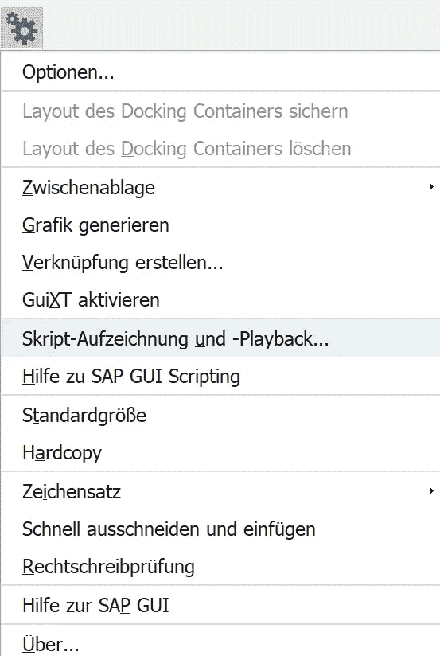
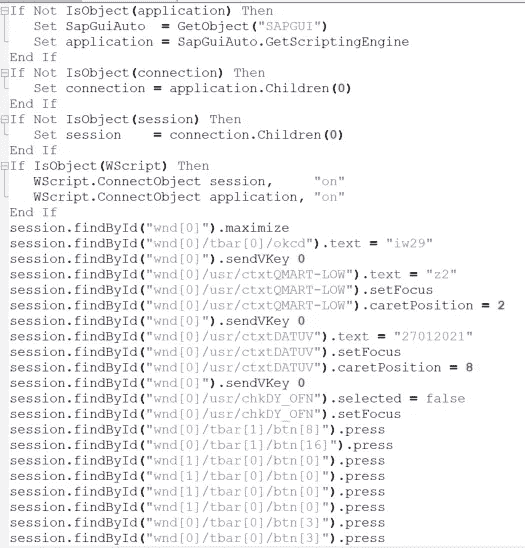
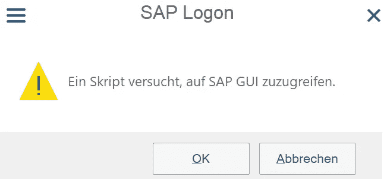
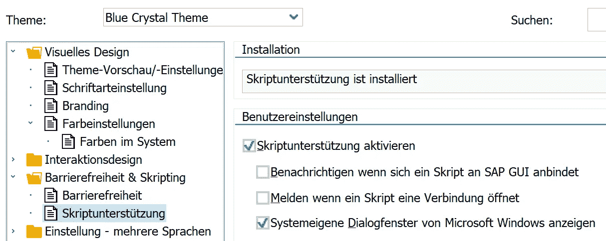
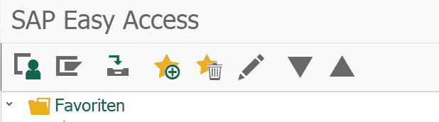

# 在 Excel 中自动运行 SAP 交易

> 原文：<https://towardsdatascience.com/automatically-run-and-export-sap-transactions-out-of-excel-using-vba-9c63a28ff566?source=collection_archive---------2----------------------->

## 使用 SAP 和 Excel GUI 自动化枯燥的工作。


向无聊大喊！(经我的朋友马蒂亚斯友好许可，马蒂亚斯·布勒的《蓝月亮》

## 动机

您是否经常需要使用特定的过滤参数执行 SAP 事务，并将结果导出为 Excel 文件？如果是这样，并且如果您想使用 Excel VBA 和 SAP 脚本来自动化这些步骤，这就是您的故事。在 Excel 文件中，我们将使用定义的过滤器/设置自动运行 SAP 交易，从 SAP 中导出结果，并将结果保存为 Excel 文件，无需进一步手动输入。当我们必须经常运行特定的 SAP 事务时，总是使用相同的过滤器/参数设置，这非常有用。现在，让我们开始自动完成构建 Excel-SAP GUI 这一枯燥重复的手工工作。

## 解决办法

在 SAP 中，您可以使用“脚本记录和回放”功能记录您的输入。这非常类似于例如 Excel 的宏记录器。要在 SAP 中执行此操作，您必须按 ALT+F12，然后单击“脚本录制和回放”:



虽然在德语中，序列顺序是一样的，不管你用的是什么 SAP 语言。


点击红色按钮记录您的 SAP 行动。

点击红色的“记录”按钮后，您在 SAP 中所做的一切都将被记录下来，直到您通过“停止”按钮停止记录。

在我们的示例中，我们将运行事务“IW29”，设置一些过滤器，并执行事务以查看结果。我们还会将 SAP 中的结果导出为 Excel 文件。之后，我们将停止记录并查看刚刚记录的 SAP 脚本文件。在我们的示例中，它看起来像这样:



我们现在简单地复制并粘贴这个脚本到我们的 Excel 文件的 VBA 模块。因此，我们打开 Excel 宏文件(例如 xlsm)并将以下代码(子例程)添加到我们的模块中:

```
Sub SapExport()
If Not IsObject(SAPapplication) Then
Set SapGuiAuto = GetObject(“SAPGUI”)
Set SAPapplication = SapGuiAuto.GetScriptingEngine
End If
If Not IsObject(SAPconnection) Then
Set SAPconnection = SAPapplication.Children(0)
End If
If Not IsObject(SAPsession) Then
Set SAPsession = SAPconnection.Children(0)
End If
If IsObject(WScript) Then
WScript.ConnectObject SAPsession, “on”
WScript.ConnectObject Application, “on”
End If
```

这段 VBA 代码将设置我们的 Excel 文件和 SAP 之间的连接。每次我们运行这段代码时，SAP 都会向我们显示这条消息，在脚本继续运行之前，需要首先确认这条消息:



SAP 消息弹出“一个脚本正试图访问 SAP GUI”

如果您想摆脱这条“一个脚本正试图附加到 SAP GUI，请通过 ok 按钮确认”的消息，您必须在 SAP 中定制您的本地布局，如下所示:

在 SAP 中按(ALT+F12)可以“自定义本地布局”。然后点击“选项”，点击“辅助功能&脚本”，最后选择“脚本”。现在取消勾选“当脚本连接到 SAP GUI 时通知”和“当脚本打开连接时通知”复选框。因此，最终 SAP 脚本设置应该是这样的:



回到您的 Excel VBA 模块，您现在可以粘贴已记录的会话任务(事务的过滤器)。您必须做的唯一修改是用 SAPsession 替换 session，因此最终它在您的 Excel 模块中看起来像这样:

```
SAPsession.findById(“wnd[0]”).maximize
SAPsession.findById(“wnd[0]/tbar[0]/okcd”).Text = “iw29”
SAPsession.findById(“wnd[0]”).sendVKey 0
SAPsession.findById(“wnd[0]/usr/chkDY_MAB”).Selected = False
SAPsession.findById(“wnd[0]/usr/ctxtQMART-LOW”).Text = “z2”
SAPsession.findById(“wnd[0]/usr/ctxtDATUV”).Text = “10012021”
SAPsession.findById(“wnd[0]/usr/ctxtDATUB”).Text = “26012021”
SAPsession.findById(“wnd[0]/usr/ctxtDATUB”).SetFocus
SAPsession.findById(“wnd[0]/usr/ctxtDATUB”).caretPosition = 8
SAPsession.findById(“wnd[0]”).sendVKey 0
SAPsession.findById(“wnd[1]/tbar[0]/btn[0]”).press
SAPsession.findById(“wnd[0]/tbar[1]/btn[16]”).press
SAPsession.findById(“wnd[1]/tbar[0]/btn[0]”).press
SAPsession.findById(“wnd[1]/tbar[0]/btn[0]”).press
SAPsession.findById(“wnd[1]/tbar[0]/btn[0]”).press
```

到目前为止，我们已经使用定义的过滤器运行了 SAP 事务，并将结果导出为 Excel 文件。最后，我们还想将这个文件保存到一个定义的路径中。下面你会找到一个简单的解决方案，这已经足够完成我们的任务了:

```
‘Disable the Application Alert before saving the fileApplication.DisplayAlerts = False
Windows(“FileName”).Activate
ActiveWorkbook.SaveAs FileName:=”C:\FileName.xlsx”, FileFormat _
:=xlOpenXMLWorkbook, CreateBackup:=False‘Enabling the Application Alerts after saving the file
Application.DisplayAlerts = True'to “clean up” SAP we return back to SAP’s Easy Access:
SAPsession.findById(“wnd[1]/tbar[0]/btn[0]”).press
SAPsession.findById(“wnd[0]/tbar[0]/btn[3]”).press
SAPsession.findById(“wnd[0]/tbar[0]/btn[3]”).press
End sub()
```

如果您将所有这些 VBA 代码添加到 Excel 的一个子例程中，就大功告成了。因此，将来您可以使用 Excel 中定义的过滤器来调用您的 SAP 事务。

注意:要使 VBA 代码正常工作，您必须打开一个 SAP 实例(换句话说，您必须已经登录)。请确保只有一个 SAP 模式处于活动状态，并且该实例必须处于启动模式:



在启动 VBA 之前，您必须打开 SAP Easy Access

现在，您可以使用 Excel 以自动化的方式从 SAP 中导出结果列表了！你可以在我的 [Github](https://github.com/DAR-DatenanalyseRehberg/SAPGui) 上找到完整的 Excel 宏。

非常感谢您的阅读！希望这篇文章对你有帮助。请随时在 [LinkedIn](https://de.linkedin.com/in/jesko-rehberg-40653883) 、 [Twitter](https://twitter.com/DAR_Analytics) 或[工作室](https://jesko-rehberg.medium.com/virtual-reality-vr-for-education-a532aa5b6272)与我联系。

<https://jesko-rehberg.medium.com/membership>  

最初发表在我的网站 [DAR-Analytics](https://www.dar-analytics.de/AboutUs.html) 。