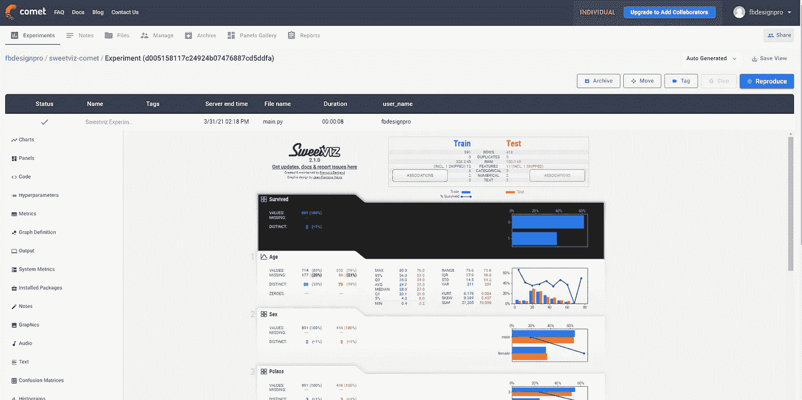
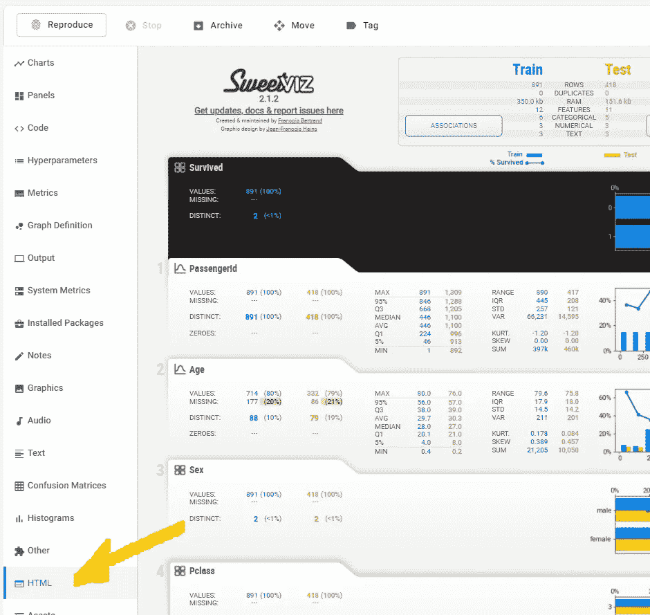
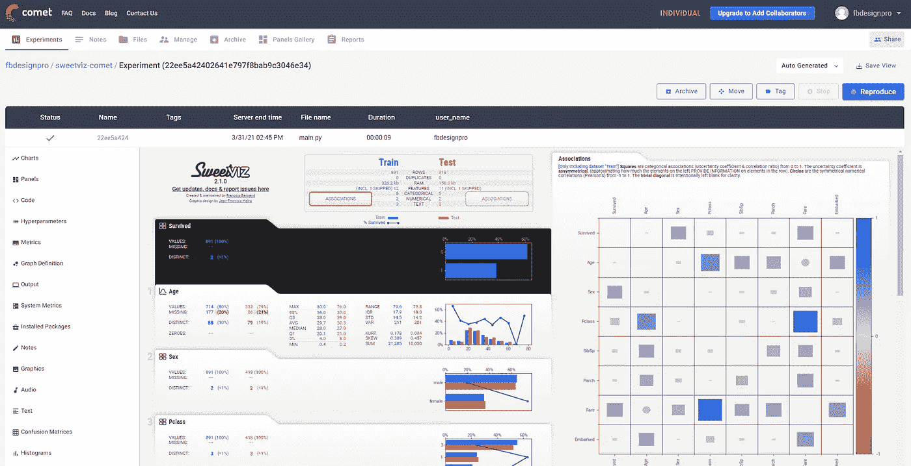

# 使用 Sweetviz 和 Comet.ml 自动跟踪您的所有 EDA

> 原文：<https://towardsdatascience.com/automatically-track-all-your-eda-using-sweetviz-and-comet-ml-9cb7545b0fab?source=collection_archive---------41----------------------->

## 即时归档和跟踪每一份 Sweetviz EDA 和分析报告



Comet.ml 工作区中的 Sweetviz 报告(图片由作者提供)

Sweetviz 是一个很棒的库，不仅可以在 EDA 阶段，而且可以在整个分析和模型开发过程中快速获得任何数据集的快照(上一篇文章中的[细节)。2.1 版引入了 comet.ml 平台的集成，可自动记录每份 Sweetviz 报告。](/powerful-eda-exploratory-data-analysis-in-just-two-lines-of-code-using-sweetviz-6c943d32f34)

# 😎自动跟踪是神奇的！

这种情况经常发生在我身上，也可能发生在你身上:你“处于最佳状态”，绘制一幅又一幅图表，随着你经历一连串的模式分析、填补缺失数据、剔除异常值、工程特性和调整模型，开始对数据集有越来越深刻的理解。唷！

当然，在进行过程中，您会尽最大努力做些笔记，到处保存最好的代码和图表。但是当你几天后重新开始的时候，你会意识到你并没有完全抓住*的全部*。什么是**确切地说，你在某个时候偶然发现的那个如此有洞察力的分布图？什么是**该功能的变体，它很有希望，但是你从来没有仔细检查过？这份清单还在继续…****

**自动跟踪系统提供的是一张大网，几乎可以捕捉到你做的每一件事，几乎不用写代码。你模型上的随机凌晨 2 点变化？检查。两周前图表上的第 12 个变化可能最终被证明是有见地的？检查。**

**这还不到一半。跟踪系统还可以**自动记录大量元数据**和与您的工作相关的一般分析，无需任何用户干预，支持实验之间的比较，跟踪各种元数据，当然，另一个巨大的优势是团队协作和团队内共享工作见解&。**

# **Sweetviz 和 Comet.ml**

**鉴于所有这些，以及我所说的 Sweetviz 在整个项目中的有用性，很容易理解为什么将其与 [Comet.ml](http://www.comet.ml) 完全集成会如此有用，Comet.ml 是一个领先的基于云的实验管理平台，可跟踪您的数据集、代码更改、实验历史和模型。在 2.1 版中，Sweetviz 报告现已成为广泛数据收集的一部分，确保不会因为每次都要花时间单独保存不同的报告而丢失或浪费任何工作。**

**没有更多的" *Report_3mo_test8.html* "！😁**

# **Comet.ml 集成**

## **自动记录**

**如前所述，自动跟踪包的优势之一是它们通常需要很少的持续努力。一旦正确设置了 comet_ml 环境(这超出了本文的范围，但通常包括`pip install comet_ml`然后设置几个环境变量，如`COMET_API_KEY`，使用 Sweetviz 命令显示的任何报告，如`show_html()`或`show_notebook()`将自动上传到您的 comet_ml 工作区。**

**这种自动记录的实验将记录到您的环境指定的项目中(如果没有设置项目，则记录到`Uncategorized Experiments`项目中)，在 **HTML** 选项卡下:**

****

**报告位于 HTML 选项卡中(按作者排列的图像)**

## **直接记录**

**彗星追踪是以“实验”为基础的。自动记录将为报告创建自己的实验，但有时在正在进行的实验中对报告进行分组会很有用。**

**要在正在进行的实验中直接添加 Sweetviz 报告，提供了一个直接的`log_comet(exp)`功能。该函数将一个“实验”对象作为参数，报告将被添加到该参数中。像现有的 Sweetviz 函数(如`show_html()`)一样，它将在所需的报告对象上被调用。**

```
report = sweetviz.analyze(dataframe)
report.log_comet(my_experiment)
```

**使用直接记录的优点是报告将直接出现在正在使用的项目/实验中，而不是更一般的“未分类实验”项目中。**

# **配置 Comet.ml 的 Sweetviz 报告**

****

**使用宽屏布局(图片由作者提供)**

**Sweetviz 报告可配置为使用**宽屏**(水平)或**垂直**布局，以及**缩放**。这有助于适应各种用户设置和硬件配置。**

**无论是通过自动记录还是`log_comet()`，Sweetviz 报告都将使用`[comet_ml_defaults]`标题下的 Sweetviz INI 配置，如下所示:**

```
[comet_ml_defaults]
html_layout = vertical
html_scale = 0.85
```

**要覆盖这些设置，只需创建一个自定义 INI 文件，并在使用以下命令生成报告之前加载它:**

```
sv.config_parser.read("MyOverride.ini")
```

# **结论**

**我希望你和我一样会发现自动跟踪很有用，如果你选择使用这些平台，那么这篇通过 Comet.ml 和 Sweetful 进行自动跟踪的指南会很有帮助！**