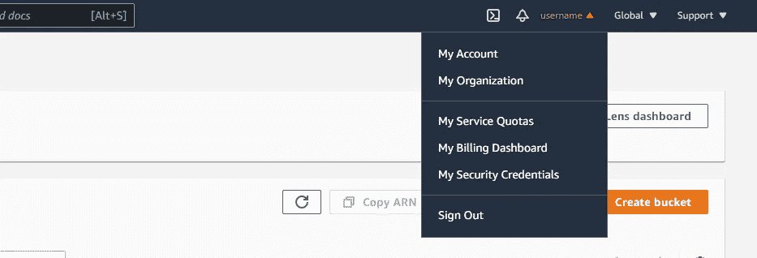

# 用 Python 自动化 AWS S3 文件管理

> 原文：<https://towardsdatascience.com/automating-aws-s3-file-management-with-python-6312e26dd771?source=collection_archive---------18----------------------->

## 如何利用可编程性和 Python 来自动化管理您的 AWS S3 文件。


图片来自 Unsplash。

亚马逊网络服务(AWS) S3 是全球使用最多的**云存储平台**之一。免费层包括 5 GB 的标准存储，20，000 个 get 请求和 2，000 个 put 请求，为期 12 个月，这使其适合于在相对较短的**时间**内运行的各种**中小型项目**。一些项目可能需要频繁收集需要存储在云中的数据，我们可以利用**可编程性**来自动管理这些文件，而不是手动管理这些文件。

在今天的文章中，我将展示一些介绍性的**代码示例**，介绍如何利用 [AWS S3 API](https://docs.aws.amazon.com/AmazonS3/latest/API/Welcome.html) 并使用 **Python 3.8** 和 [boto3](https://pypi.org/project/boto3/) 包自动化您的文件管理。

## 1 |收集 AWS S3 API 信息

首先，我们将定义几个 Python 变量，这些变量将保存我们的 AWS S3 帐户的 API 和访问信息。

登录您的 [AWS S3 管理控制台](https://s3.console.aws.amazon.com/s3/)，通过您右上角的用户名打开下拉菜单，点击 [*我的安全凭证*](https://console.aws.amazon.com/iam/home#/security_credentials) 。



来自 AWS S3 管理控制台的图像。

在*访问密钥*下，您需要点击 C *创建一个新的访问密钥*并复制您的访问密钥 ID 和您的秘密密钥。这两个变量将作为单独的变量添加到我们的 Python 代码中:

```
aws_access_key = "###############"
aws_secret_key = "###############"
```

然后，我们需要创建我们的 S3 文件桶，我们将通过我们的 API 访问。在 [S3 管理控制台](https://s3.console.aws.amazon.com/s3/)上，导航至*桶*并点击*创建桶。*

创建存储桶后，我们定义一个保存存储桶名称的变量:

```
aws_bucket = "bucket-name"
```

## 2 |将文件上传到 S3 存储桶

在我们收集了 AWS S3 帐户的 API 和访问信息之后，我们现在可以开始使用 Python 和 boto3 包对我们的 S3 bucket 进行 API 调用。 [boto3](https://pypi.org/project/boto3/) 包是 Python 的官方 AWS 软件开发包(SDK)。

我们首先导入必要的包，并定义包含 API 和 bucket 信息的变量。然后，我们可以编写一个函数，让我们将本地文件上传到我们的 bucket。

*local_filename* 参数保存了我们想要上传的本地文件的名称，而 *aws_filename* 参数定义了当本地文件上传到我们的 AWS S3 存储桶时应该如何对其进行重命名。然后我们通过 *boto3.client* 建立到 AWS S3 账户的连接，最后利用 boto3 函数 *upload_file* 上传我们的文件。

## **3 |从 S3 桶下载文件**

既然我们已经看到了如何将本地文件上传到我们的 S3 存储桶，我们还将定义一个函数来将文件下载到我们的本地机器。

## 4 |列出 S3 存储桶中的文件

除了上传和下载文件，我们还可以请求一个目前在我们的 S3 桶所有文件的列表。

输出将是我们的 bucket 中所有文件名的 Python 列表。

## 5 |获取 S3 桶中文件的公共 URL

此外，我们可以请求生成一个可公开访问的 URL，指向我们的 bucket 中的一个文件。如果我们想与外部人员自动共享文件，这将非常有用。

为了生成一个公共 URL，我们还需要定义 Python 变量，这些变量包含我们的 bucket 的签名版本和我们的 bucket 的数据中心所在的区域名称。请相应地调整变量值。

这个函数将返回一个我们文件的公共 URL 的 Python 字符串，这个字符串允许任何有链接的人访问它。

我希望这篇用 Python 自动管理 AWS S3 文件的介绍对你有所帮助。💡我将在未来更新和添加新的代码示例，所以请随时回来更新。

让我知道你的想法，或者如果你有任何问题，请联系我或在下面评论。