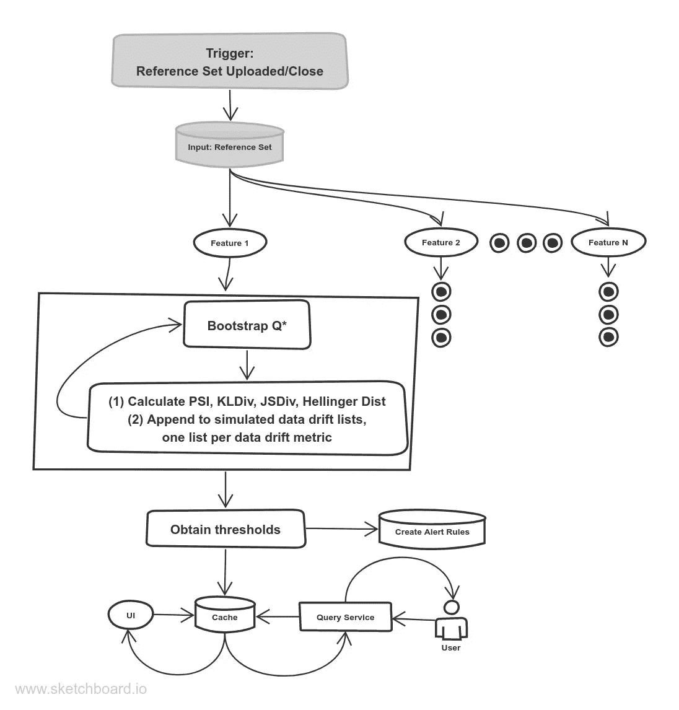
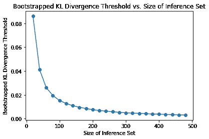
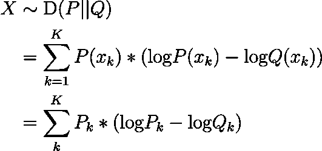
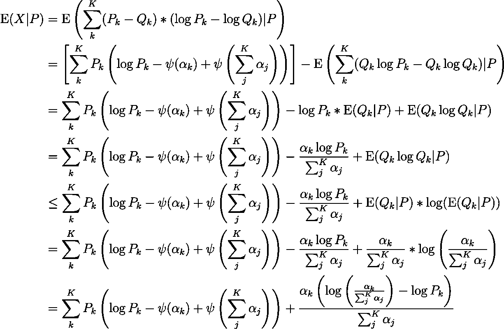

# 机器学习系统中数据漂移阈值的自动化

> 原文：<https://towardsdatascience.com/automating-data-drift-thresholding-in-machine-learning-systems-524e6259f59f?source=collection_archive---------18----------------------->

## 在缺乏真实数据的情况下，实际有效地监控生产 ML 模型输入

在 [Unsplash](https://unsplash.com?utm_source=medium&utm_medium=referral) 上由 [Carlos Muza](https://unsplash.com/@kmuza?utm_source=medium&utm_medium=referral) 拍摄的照片

**更新**:我有机会在 3 月 30 日的纽约 MLOps 世界大会上展示并记录这些原则。如果你喜欢对下面的材料进行口头处理，[下面是录音](https://drive.google.com/file/d/1j685xSzMnSYL5NqcAexmvpYi-xnjJSkC/view?usp=share_link)。

在实际的 ML 监控应用中，我们希望检测 ML 模型是运行良好还是出现故障。没有发现糟糕的模型性能可以转化为糟糕的甚至有偏见的预测，这可能导致收入损失甚至公关火灾，我们年复一年地从大型科技公司那里看到，从面部识别系统未能发现某些少数民族，到搜索引擎自动完成中的仇恨言论。

在本文中，我们将简要概述数据漂移阈值处理如何帮助捕捉较差的模型性能，本文的大部分内容将重点讨论在生产级 ML 监控系统中实现自动数据漂移检测的两个版本。

# 概观

## 为什么我们需要数据漂移？

监控模型的标准方法是基于性能指标，即某个时间段或批次之间的准确度/精确度/召回率/f 值。为了生成这些指标，我们需要数据点的预测和基础事实标签，例如，信用风险模型预测一个人将在 1 年内按时支付贷款，因此应该被批准使用信用卡，我们知道这个人是否在 1 年内按时支付了贷款。我们已经有一个问题，因为我们不知道地面真相，直到 1 年后。

在大多数生产应用中，预测时间和地面实况收集时间之间存在滞后，这极大地阻碍了快速修复模型问题的能力。利用标签团队或服务可以帮助消除这种滞后，但它不会完全消除它。因此，我们可以根据数据漂移指标来监控输入，而不是根据输出来监控指标。

## 什么是数据漂移？

数据漂移从根本上衡量两个分布之间的统计分布变化，通常是相同的特征，但在不同的时间点。例如，在我们查看一个输入特征的单变量情况下，我们应该合理地预期，如果特征的形状在训练时间和预测时间之间发生显著变化，模型输出的质量将会下降。

作为一个玩具示例，如果我们训练一个 ML 模型只解决代数问题，而突然在预测时将几何问题输入到模型中，我们会认为预测非常糟糕，因为该模型没有经过几何问题的训练。

本质上，数据漂移是在缺乏基础事实标签的情况下，我们的经典性能指标的代理。下一个自然问题是如何正式量化数据漂移。

# 数据漂移指标概述

我们可以使用许多不同种类的指标来量化数据漂移。这里，我们将关注两个流行的度量家族:f-散度和假设检验度量。对于前者，我们将研究 KL 散度和 PSI。对于后者，我们将查看卡方检验和 KS 检验统计。

对于任何漂移度量， *P* 是训练 ML 模型的训练数据(参考集),而 *Q* 是模型执行预测的数据(推理集),这可以在流动模型的滚动时间窗口上定义，或者在批量模型的批量基础上定义。

## KL 散度

如果你需要一个快速概览，我发现这篇介绍性的[文章](https://www.countbayesie.com/blog/2017/5/9/kullback-leibler-divergence-explained)非常有帮助。

从 *P* 到 *Q* 的 KL 散度被解释为我们在使用 *Q* 而不是 *P* 对数据 *X* 建模时预期丢失的信息的 nats，其在概率空间 *K* 上被离散化。KL 散度是不对称的，即如果交换 *P* 和 *Q* 的值是不同的，并且不应用作距离度量。

离散 KL 散度

## 人口稳定指数

虽然 KL 散度是众所周知的，但它通常被用作 VAEs 等生成模型中的正则化惩罚项。可以用作距离度量的更合适的度量是群体稳定性指数(PSI ),其测量从 *P* 到 *Q* 然后从 *Q* 返回到 *P.* 我们预期丢失的信息的往返损失

离散 PSI

## 假设检验

假设检验根据特征是分类的还是连续的使用不同的检验。

对于具有 *K* 类别的分类特征，即*K*——1 为自由度，其中 N_Pk 和 N_Qk 为特征出现的次数，为 *k* ，1≤ *k* ≤ *K* ，分别为 *P* 和 *Q* ，则卡方检验统计量为标准化方差的总和

具有 *K-1 个自由度的卡方统计*

对于连续特征，F_P 和 F_Q 分别是经验累积密度，对于 *P* 和 *Q* ，Kolmogorov-Smirnov (KS)检验是非参数的，即无分布的，检验比较经验累积密度函数 F_P 和 F_Q

Kolmogorov-Smirnov 检验统计量

# 为什么是自动漂移阈值？

斯科特·罗杰森在 [Unsplash](https://unsplash.com?utm_source=medium&utm_medium=referral) 上拍摄的照片

让人类手动查看模型随时间或批次产生的漂移度量显然是乏味且不理想的，漂移度量的直接用例将是基于某个阈值设置警报，例如，对于该批次，PSI 跳转超过 0 . 3，并且应该创建警报以供人员检查。补救措施可以是检查将该特性输入到模型中的管道是否损坏，最近是否有错误代码或计算变更，或者该特性是否确实漂移并建议模型需要重新训练。

但是那 0.3 是从哪里来的呢？设置任意选择的阈值不是一个好的解决方案。如果阈值太高，应该发出的警报现在会被忽略(更多的假阴性)。如果阈值太低，现在会出现不应出现的警报(更多误报)。

通用常数阈值是不鲁棒的，因为该阈值应该取决于训练数据 *P* 的形状。如果 *P* 是均匀的，并且我们看到单峰 *Q* ，那么漂移值将显著小于如果 *P* 是高度单峰的并且以远离相同的 *Q* 的某个平均值为中心的情况，因为如果 *Q* 不是来自于 *P* ，那么均匀的前 *P* 就不太确定。下面是一个例子。

为了设置对警报系统有意义的可靠阈值，我们将深入探讨如何自动计算此类阈值。也就是说，我们希望推荐数据漂移阈值来创建警报，以便用户(a)不必手动设置警报，并且(b)不必确定什么是好的阈值。

# 假设检验指标的自动漂移阈值

对于假设检验指标，简单的解决方案是使用传统的α= 0.05 为每个检验设置适当临界值的阈值，即 95%确信任何高于各自临界值的假设指标表明存在显著漂移，其中*Q*∽*P*可能为假。

然而，假设检验也有局限性，从影响卡方检验显著性的[样本量](https://www.mtholyoke.edu/courses/etownsle/qr/Chi%20square%20limitations.htm)到分布中心的[敏感性，而不是 KS 检验的尾部](https://www.itl.nist.gov/div898/handbook/eda/section3/eda35g.htm)。

出于这些原因，探索 f-散度指标等其他类别的漂移指标非常重要，现在我们将探索 f-散度漂移阈值自动化的方法。

# 自动漂移阈值 V1:自举

## 概观

自举自动漂移阈值系统(图片由作者提供)

(1)对于由 *i* 索引的大量模拟，对于给定的输入特征，从参考集 *P* 中引导采样 *m* 次，其中 *m* 足够大，并构建推理分布 *Q* ᵢ*，其代表如果我们的数据通过模拟真正来自 *P* 时我们所期望的。然后，我们计算并跟踪每次模拟的数据漂移 f( *P，Q* ᵢ*)。

(2)我们将数据漂移阈值设置为 max_i(f( *P，Q* ᵢ*))的保守值，其本质上是传统统计设置中α → 0 的临界值/截止值，即，我们 99.999%确信来自实际 *Q* ，即推断时间片或批次的数据漂移值高于阈值表示推断数据不是从与*p*相同的底层分布产生的如果导致假阳性的代价不高，那么我们可以在传统的α=.05 单侧设置中，将阈值设置为 f 的 95%百分位( *P，Q* ᵢ*)。**

## 自举的局限性

自举很有吸引力，因为它是基于模拟的，并且不需要分发，但是这种方法由于两个问题而不可扩展。

(1)对每个模型的每个特征进行模拟在计算上是昂贵的。具体来说，基于每个模型的运行时间将是`O(n_features*n_categories_per_feature*n_metrics*n_simulations)`。

(2)样本容量越小，抽样稳定性假设就越不成立。

作为一个玩具例子，假设我们在 *P* 中有红色、白色、蓝色和橙色的弹珠，均匀分布。现在让我们呈现尺寸为 3 的*Q*；因为我们没有办法代表所有四种颜色，所以没有办法判断 *Q* 是否来自 *P* 。即使我们对 6 颗弹珠进行了取样，我们也无法对这 6 颗弹珠中的每一类进行 1/4 的近似。

设 *m* 为每次模拟的模拟数据点数，以创建 *Q* ᵢ*.在相同的弹珠玩具示例中，当 *m* 为低时，采样不稳定性导致人为的高不确定性(并因此导致人为的高数据漂移阈值)，因为 *P* 没有被很好地采样并在 *Q* ᵢ*.中表示

KL 散度自助采样不稳定性(图片由作者提供)

解决问题(2)的方法是通过改变 *m* 为给定特性创建模拟阈值曲线，但现在我们通过将运行时间乘以 *m* 加剧了问题(1)。我们现在还有空间复杂性的问题，因为现在我们必须在查找(数据库或缓存)中存储阈值，以便在下游应用程序中使用，如创建警报规则的警报服务或查询服务缓存。放弃额外的存储并在查询时模拟阈值曲线也不是一个选项，因为对于大多数面向用户的应用程序来说，查询会花费太长时间。

简而言之，在考虑校正曲线时，使用灵活的模拟设置的权衡不值得计算费用，校正曲线要么(a)需要存储，这将花费大量存储费用或炸毁缓存，要么(b)在查询时模拟，这对于面向用户的应用程序来说太慢。

# 自动漂移阈值 V2:封闭形式的统计

照片由 [Edge2Edge 媒体](https://unsplash.com/@edge2edgemedia?utm_source=medium&utm_medium=referral)在 [Unsplash](https://unsplash.com?utm_source=medium&utm_medium=referral) 上拍摄

事实证明，我们可以使用概率论一次性设定数据漂移阈值的上限。我们将利用标准概率论、[狄利克雷分布](https://en.wikipedia.org/wiki/Dirichlet_distribution)和[一阶泰勒级数展开](https://en.wikipedia.org/wiki/Taylor_series)。请记住，我们仍然是在每个功能的基础上推导阈值。

## KL 散度

首先，让我们

参考集 *P* 已知，推理集 *Q* 未知。直观地说，这仅仅意味着我们已经观察了在创建我们的 ML 模型中使用的训练数据，并且我们正在问一个假设的问题，即对于一些假设的推理集 *Q* 来说，我们可以预期数据漂移是什么。形式上，

第二行:期望的线性和条件概率。

第三行:*Q*∞Dirchlet(**α**)，即 *Q* 对一个概率分布建模，是 beta 分布的多元推广。因此，在这种情况下，我们可以使用 digamma ψ函数。

**α** = (α_1，…，α_K)传统上对应于从 *Q，*偏移一个小常数的特征的 *K* 类别中的观测概率，即先验计数。然而， *Q* 是未知的，那么我们如何得到正确的计数呢？我们从 *P* 开始做。毕竟，这个期望陈述的整个要点是平均量化我们期望看到的漂移，如果*Q*∩*P*，并且在实际推理集中超过该值的数量表明我们可能有显著的漂移，即*Q*∩*P*为假。

回到 **α** ，我们可以使用贝叶斯均匀先验*Q*∞狄利克雷( **1** _K)并更新使得*Q*|*P*∞狄利克雷( **1** _K + N_q * **p** _K)，其中 N_q 是推理集合*Q*中的数据点数这是β-二项式共轭的多元推广。

因此我们有了，

## 人口稳定指数

PSI 变得有点棘手，我们需要设定期望值的上限。让

然后

以下是步骤:

第二行:期望值的线性，并用结果代替上面的 KL 散度。

第 3 行:期望和条件概率的线性。

第四行:对狄利克雷分布的期望。

第 5 行:德尔塔法近似值(见附录)。

第 6 行:对狄利克雷分布的期望。

第七行:简化。

# V1 问题解决了！

请注意，我们现在已经解决了引导中的两个问题。

(1)我们不必担心运行时间，因为这种形式是只涉及计数的一次性解决方案，并且我们可以使用对 digamma 函数的近似。

(2)我们通过在 *Q* 的参数上使用贝叶斯加伪计数设置来处理不同的样本大小。

# 履行

在生产中，我们如何实现这种动态阈值？虽然阈值是动态的，取决于指标和传入的推理集，但上面所有的预期，以 *P* 为条件，都可以表示为 SQL 查询或定制但简单的函数。

离散化所有连续特征，而不是平滑离散特征，将是一种合理的权衡:尽管我们可能无法捕捉到 *P* 和 *Q* 的完整连续性质，但我们将避免计算开销巨大的核密度估计，将 *P* 和 *Q* 表示为连续分布。

# 等等，方差呢？

我们也可以计算方差并应用 Delta 方法近似，因为我们会遇到使用标准概率理论无法解决的对数项的方差和协方差。这些工具在下面的附录中。然而，事实证明，大多数度量标准不会像 KL 散度那样清晰，所以大多数条件期望和方差都是通过柯西-施瓦兹上界的。当然，包含一个附加的上限方差项，或者甚至使用二阶近似都是可行的，但是额外的计算可能不值得用获得的时间来换取更严格的界限。

# 另一次…

我们还可以使用泰勒级数展开来上限其他指标，如 JS 散度和海灵格距离。

# 结论

今天到此为止！希望您获得了一些关于如何以计算上和概率上合理的方式实现自动阈值的见解！我们在 Arthur AI 实现了这些类型的系统，一些等式可以对客户体验有很大帮助。

快乐监控！

由 [Pablo Heimplatz](https://unsplash.com/@pabloheimplatz?utm_source=medium&utm_medium=referral) 在 [Unsplash](https://unsplash.com?utm_source=medium&utm_medium=referral) 上拍摄的照片

# 附录:增量法近似值

请注意，下面两个部分的一阶近似是上限，因为对数函数是凹的。

## 对数近似值

通过围绕平均值的一阶泰勒级数展开，

使用这个近似值，我们有

和

柯西-施瓦茨的不等式。

## Xlog(X)

通过围绕平均值的一阶泰勒级数展开，

使用这个近似值，我们有

并且让

我们有

柯西-施瓦茨的不等式。