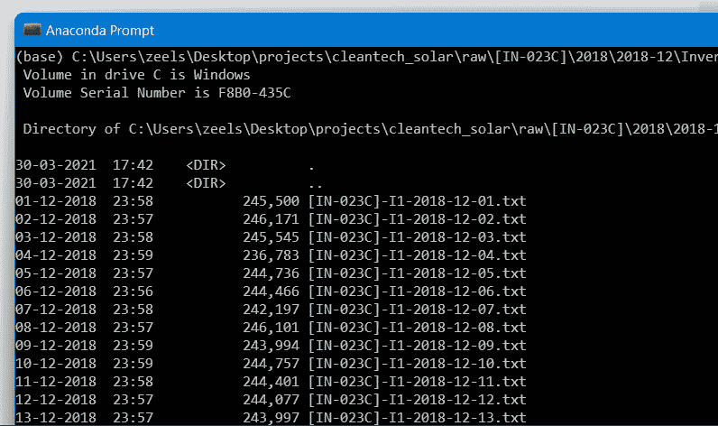
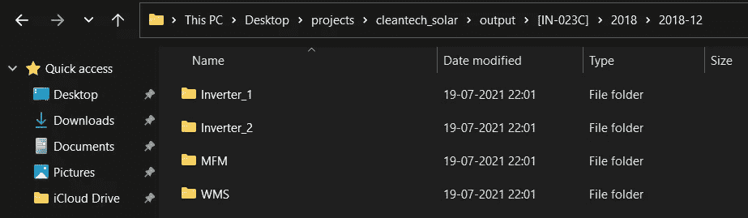
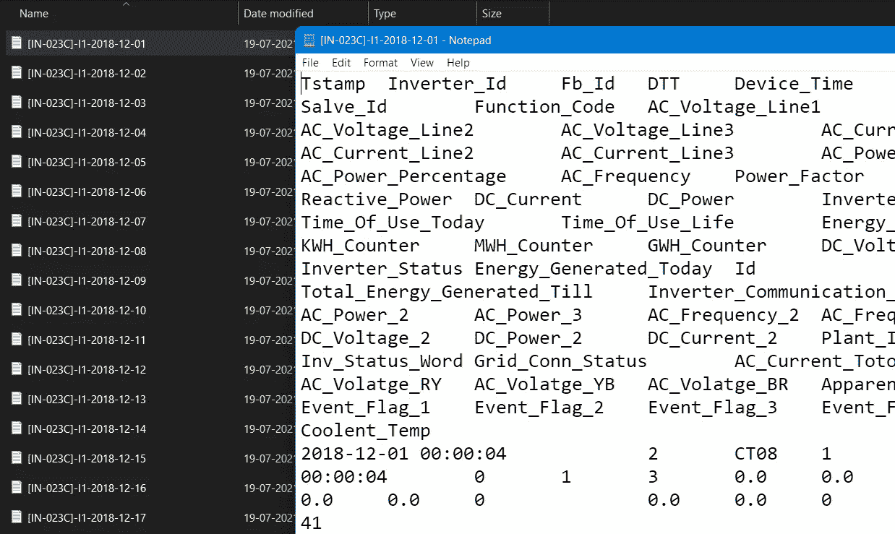
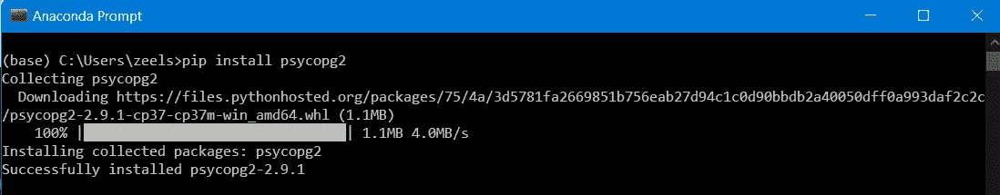

# 在 Python 上自动化数据科学任务以节省时间

> 原文：<https://towardsdatascience.com/automating-data-science-tasks-on-python-to-save-hours-2a1ad7a0311f?source=collection_archive---------11----------------------->

## 使用 Pandas、操作系统库和自定义数据库包装器(psycopg2)

卡尔·海尔达尔在 [Unsplash](https://unsplash.com?utm_source=medium&utm_medium=referral) 上的照片

连接到您的数据库，为您的数据创建一个表，查询它进行清理，然后输出您的数据作为一个自定义文件，然后基本上重复整个周期，直到最后的文件。在本文中，我们将创建一个 python 脚本来自动化上面提到的整个循环。

在将数据加载到模型中之前清理数据的过程是项目生命周期中不可或缺的一部分。如果你在一家公司工作，你可能和你的 QA 团队使用同一个数据库；所有这些都让事情变得有点复杂。在数据准确性对系统成功至关重要的环境中，[手动数据处理任务](https://www.unisoftdatatech.com/Advantages-Disadvantages-of-Manual-Data-Entry-Services-in-India)总是一个缺点，因为它们可能导致不可避免的错误。

为了避免错误、低速度和培训人员的成本，需要自动化您的[数据清理](https://www.tableau.com/learn/articles/what-is-data-cleaning#:~:text=Data%20cleaning%20is%20the%20process,to%20be%20duplicated%20or%20mislabeled.)/修改任务。在本文中，我们将学习数据集的一些复杂自动化，无论是在本地机器上，还是像`[postgres](https://www.postgresql.org/), [MySQL](https://www.mysql.com/)`或`[AWS](https://cloud4c.com/lp/aws-cloud-services/?utm_source=google_search&utm_medium=cpc&utm_campaign=MSP_Cloud_AWS_India_Exp_Srch&utm_term=%2Baws%20%2Bcloud&utm_content=528924743032&utm_device=c)`这样的云数据库上。

> 提示:如果你是新手，我建议你尝试一下 AWS，而不是把它实现为一个`localhost`。使用 [pgAdmin](https://www.pgadmin.org/) 和它一起从你的 IDE 本身访问你的数据库。

[](https://aws.amazon.com/free/?trk=ps_a134p0000078PqHAAU&trkCampaign=acq_paid_search_brand&sc_channel=ps&sc_campaign=acquisition_IN&sc_publisher=google&sc_category=core-main&sc_country=IN&sc_geo=APAC&sc_outcome=acq&sc_detail=aws&sc_content=Brand%20Core%20AWS_p&sc_matchtype=p&sc_segment=509606977839&sc_medium=ACQ-P|PS-GO|Brand|Desktop|SU|Core-Main|Core|IN|EN|Text|xx|PH&s_kwcid=AL!4422!3!509606977839!p!!g!!aws&ef_id=CjwKCAjwruSHBhAtEiwA_qCppmvfB1w0x10A5j14DMGEDdDrLgL0_SLT1F-cDG3qd_AVLsLpqrxodxoCFkIQAvD_BwE:G:s&s_kwcid=AL!4422!3!509606977839!p!!g!!aws&all-free-tier.sort-by=item.additionalFields.SortRank&all-free-tier.sort-order=asc&awsf.Free%20Tier%20Types=*all&awsf.Free%20Tier%20Categories=*all) [## AWS 自由层

### 免费体验 AWS 平台、产品和服务。探索 100 多种产品并开始…

aws.amazon.com](https://aws.amazon.com/free/?trk=ps_a134p0000078PqHAAU&trkCampaign=acq_paid_search_brand&sc_channel=ps&sc_campaign=acquisition_IN&sc_publisher=google&sc_category=core-main&sc_country=IN&sc_geo=APAC&sc_outcome=acq&sc_detail=aws&sc_content=Brand%20Core%20AWS_p&sc_matchtype=p&sc_segment=509606977839&sc_medium=ACQ-P|PS-GO|Brand|Desktop|SU|Core-Main|Core|IN|EN|Text|xx|PH&s_kwcid=AL!4422!3!509606977839!p!!g!!aws&ef_id=CjwKCAjwruSHBhAtEiwA_qCppmvfB1w0x10A5j14DMGEDdDrLgL0_SLT1F-cDG3qd_AVLsLpqrxodxoCFkIQAvD_BwE:G:s&s_kwcid=AL!4422!3!509606977839!p!!g!!aws&all-free-tier.sort-by=item.additionalFields.SortRank&all-free-tier.sort-order=asc&awsf.Free%20Tier%20Types=*all&awsf.Free%20Tier%20Categories=*all) 

[清洁技术太阳能](https://cleantechsolar.com/)数据集拥有过去几个月来自逆变器和电表的数据。这些数据在处理之前需要进一步处理，这是自动化解决问题的一个很好的例子。我们将把`Inverter-1, Inverter-2, MFM, and WMS`中的原始数据转换成我们需要的 Gen-1 文件。

你可以在这里**下载**数据集和**执行**源代码:[https://github.com/preetshah7/csv_automated_modifier](https://github.com/preetshah7/csv_automated_modifier)

以下是我们自动化的逐步概述:

1.  定义问题陈述
2.  使用 [bash](https://dev.to/awwsmm/101-bash-commands-and-tips-for-beginners-to-experts-30je) 命令和循环识别 CSV
3.  创建一个熊猫数据框架来执行您的清理任务
4.  使用操作系统库配置输出目录
5.  从数据帧创建所需的 Gen-1 文件
6.  将数据导入 Amazon Web Services (AWS)上的 Postgres 数据库

# 定义问题陈述

我们有两个逆变器、一个电能表(MFM)和一个气象变电站(WFM)的原始数据，分别位于两个月内。

我们需要执行的任务如下:

*   对于反相器，列 i32 表示行的时间戳。将此列作为 Gen1 文件中的第一列，并将列标题重命名为“Timestamp”)。
*   MFM:规则同上；唯一的区别是时间戳列是 m63。
*   WMS:规则同上；唯一的区别是时间戳列是 w23。上述每个示例的输出文件中都给出了列名。

预期输出格式:[站 ID]|-->[年]|-->[年-月]|-->[变电站 ID]|-->[Gen-1 data . txt]

# 使用 bash 命令和循环识别 CSV

一个月内输入的原始文件列表

对于这个实现，我们需要库 numpy、pandas 和 os。

可以使用`getcwd(),`获得月份目录，并将它们存储为一个列表。

创建一个函数，使用`os.listdir()`遍历目录中的所有文件，并识别将被添加到列表中的 CSV。

我们已经创建了一个函数，给定路径作为输入，将自动给出 CSV 文件列表。

# 创建一个熊猫数据框架来执行您的清理任务

首先，我们对单个文件执行任务，然后实现自动化

通过`df.columns`从各自的数据帧中提取样本列名

现在，实现`df.loc()`来重新定位列，并将列名分配给我们的数据帧。

现在我们已经获得了所需的输出，我们可以为每个仪表自动执行这项任务。

## 逆变器:

对于输入，我们取一个文件所在的`files`和`path`的列表。完成清理任务后，我们修改输出的输入路径。(*检查创建输出目录的下一步*)

## 能量计(MFM):

同样的功能也适用于 MFM，但是我们在这里替换了`'m63'`列。记得插入 MFM 示例输出中的列名。

## 气象分站(WMS):

这里带有时间戳值的列是`'w23'.`，注意在`'[df.to_csv()](https://pandas.pydata.org/docs/reference/api/pandas.DataFrame.to_csv.html)'`、`'\t'`中使用正确的分隔符。

我们已经成功地创建了稍后要实现的自动化任务。

# 使用操作系统库配置输出目录

 [## os -杂项操作系统接口- Python 3.9.6 文档

### 该模块提供了一种使用操作系统相关功能的可移植方式。如果你想阅读或…

docs.python.org](https://docs.python.org/3/library/os.html) 

将带有月份数据的仪表组合起来，以获得所有配置，然后执行`os.mkdir()`来自动创建所有目录。

[与其他语言相比，Python 中的异常处理](https://docs.python.org/3/tutorial/errors.html)更容易使用。我们将它用于目录配置，这样，如果目录已经存在，代码仍然可以运行而不会出错。

自动生成的目录

# 从数据帧创建所需的 Gen-1 文件

最后，为了实现我们的自动化，我们运行一个嵌套的 For 循环。它基于其输入路径的字符串有条件地将特定的修改任务应用于文件。在几秒钟内，我们的结果就可以在自动化创建的目录中看到。您可以向这种自动化添加任何数量的数据，它将始终高速运行。

我们已经从本地的角度完成了自动化，但是我们将继续它的云应用。

根据需要修改生成的输出文件

# 将数据导入 Amazon Web Services (AWS)上的 Postgres 数据库

对于本文，我们在 AWS 上使用了一个 [Postgres](https://www.postgresql.org/) 数据库。我们还需要在我们的机器上运行 pgAdmin 来建立与数据库的连接。在您的环境中安装所需的库([psycopg 2](https://www.psycopg.org/docs/install.html))；对于其他数据库，包装器库可能有所不同，但游标过程是相同的。

灵感来源:[内特在地层抓痕](https://www.youtube.com/channel/UCW8Ews7tdKKkBT6GdtQaXvQ)

这个脚本会自动将 CSV 文件导入您的 Postgres 数据库。只需将 CSV 文件放在与笔记本相同的目录中，然后运行笔记本。我们已经成功实现了数据科学任务自动化。

 [## 一种数据库系统

### PostgreSQL 是一个强大的开源对象关系数据库系统，经过 30 多年的积极开发…

www.postgresql.org](https://www.postgresql.org/) 

# 摘要

下面是我们在构建 CSV 自动修改器时遵循的逐步过程的总结:

1.  我们定义了问题陈述
2.  使用 [bash](https://dev.to/awwsmm/101-bash-commands-and-tips-for-beginners-to-experts-30je) 命令和循环识别 CSV
3.  创建了一个熊猫数据框架来执行我们的清洁任务
4.  使用操作系统库配置输出目录
5.  从数据帧创建了所需的 Gen-1 文件
6.  将数据导入 Amazon Web Services (AWS)上的 Postgres 数据库

# 未来的工作

以下是我们扩展项目的一些方法:

*   降低时间复杂度，这样可以快速处理大量数据；尽可能使用列表理解。
*   在实践中实现最常见的数据库，以便更多的人可以利用这项工作；常见的建议是 MongoDB 和 MySQL。
*   可以在自动化本身中实现无监督的机器学习，与特征的数量无关。数据清理在这里会相当困难。

# 参考

*   [堆栈溢出答案为。九和。iloc](https://stackoverflow.com/questions/31593201/how-are-iloc-and-loc-different)
*   清洁技术太阳能公司发布的自动化问题声明。
*   [https://www.geeksforgeeks.org/os-module-python-examples/](https://www.geeksforgeeks.org/os-module-python-examples/)
*   [https://www.psycopg.org/docs/](https://www.psycopg.org/docs/)