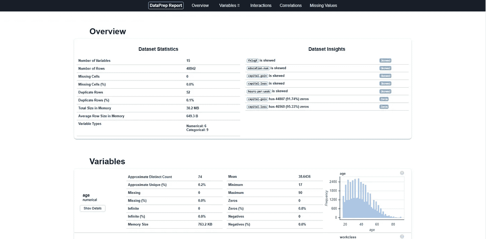
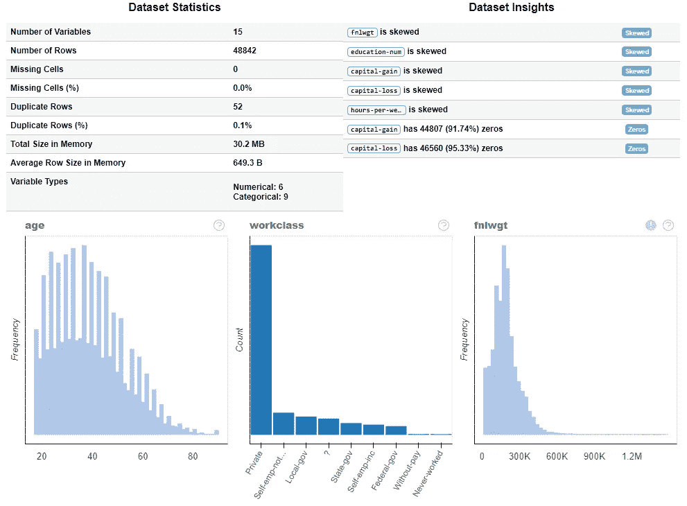
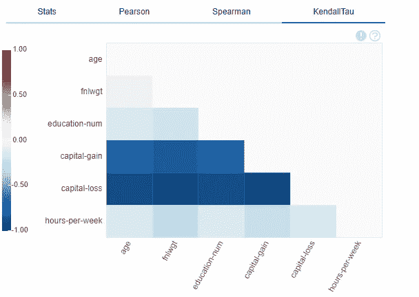
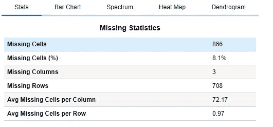

# 使用 DataPrep 实现 EDA 自动化

> 原文：<https://towardsdatascience.com/automating-eda-using-dataprep-2b541b6a3149?source=collection_archive---------25----------------------->

## 使用 Dataprep 自动化探索性数据分析



报告(来源:作者)

数据分析帮助我们识别数据集中的模式，分析不同变量之间的相关性和关联性。借助于不同的可视化效果，我们可以确定这些数据是否试图讲述某个特定的故事。有不同类型的图表和绘图可用于分析和可视化数据。

创建不同类型的绘图和图表会耗费大量时间，因为我们需要根据列的数据类型确定有用的图形类型，并且我们还需要编写大量代码来创建这些图形。但是，如果我告诉你，你可以在一行代码中完成所有这些，那会怎么样呢？

Dataprep 是一个开源 Python 库，有助于自动化探索性数据分析过程。它在创建数据分析报告时很有用，它还有 3 个功能，用于绘制图形、绘制缺失数字和数据的相关性。

在本文中，我们将探索 Dataprep 提供的一些功能。

让我们开始吧…

# 安装所需的库

我们将从使用 pip 安装 Dataprep 库开始。下面给出的命令可以做到这一点。

```
!pip install -U dataprep
```

# 导入所需的库

在这一步中，我们将导入加载数据集和执行 EDA 操作所需的库。

```
from dataprep.datasets import load_dataset
from dataprep.eda import create_report
from dataprep.eda import plot, plot_correlation, plot_missing
```

# 正在加载数据集

对于本文，我们将使用 Dataprep 中预定义的著名成人数据集。

```
df = load_dataset("adult")
```

# 创建 EDA 报告

现在，我们将创建一个 EDA 报告，其中包含所有的可视化、相关性、缺失图等，这有助于分析数据集。

```
create_report(df).show_browser()
```


报告(来源:作者)

这是报告的主页，在这里您可以看到我们正在使用的数据的概述。同样，让我们看看如何创造不同的情节。

# 创建地块

在这一步中，我们将创建由 Dataprep 提供的不同的图。

1.  **剧情**

该图为所有数据变量创建了可视化。

```
plot(df)
```



情节(来源:作者)

2.**剧情关联**

此图创建不同类型的相关图，显示不同数据变量之间的相关性。

```
plot_correlation(df)
```



相关性(来源:作者)

3.**剧情失踪**

这是最终的绘图，有助于创建显示缺失数据的表格和图表。

```
plot_missing(df)
```



缺失数据(来源:作者)

在这里，我们研究了 Dataprep 创建的报告，它对 EDA 非常有帮助，我们还创建了不同的图来理解数据并分析其属性。

继续尝试使用不同的数据集，并创建 EDA 报告和图来执行数据分析。如果您发现任何困难，请在回复部分告诉我。

本文是与 [Piyush Ingale](https://medium.com/u/40808d551f5a?source=post_page-----2b541b6a3149--------------------------------) 合作的。

# 在你走之前

***感谢*** *的阅读！如果你想与我取得联系，请随时通过 hmix13@gmail.com 联系我或我的* [***LinkedIn 个人资料***](http://www.linkedin.com/in/himanshusharmads) *。可以查看我的*[***Github***](https://github.com/hmix13)**简介针对不同的数据科学项目和包教程。还有，随意探索* [***我的简介***](https://medium.com/@hmix13) *，阅读我写过的与数据科学相关的不同文章。**