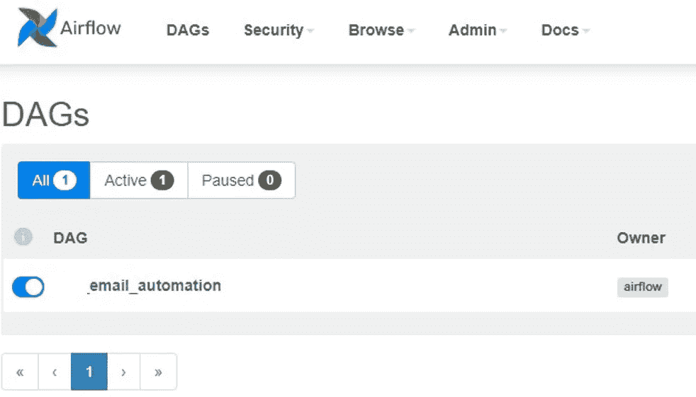

# Apache Airflow 中的电子邮件自动化:操作指南

> 原文：<https://towardsdatascience.com/automating-emails-in-apache-airflow-a-how-to-guide-1d2330a29d1e?source=collection_archive---------4----------------------->

## [实践教程](https://towardsdatascience.com/tagged/hands-on-tutorials)

## 编写一个单步 DAG 以使用 Python 的 SMTP 库、Gmail 和 Apache Airflow 自动化电子邮件的简单演练


由[布雷特·乔丹](https://unsplash.com/@brett_jordan?utm_source=unsplash&utm_medium=referral&utm_content=creditCopyText)在 [Unsplash](https://unsplash.com/s/photos/email-automation?utm_source=unsplash&utm_medium=referral&utm_content=creditCopyText) 上拍摄的照片

作为一名数据工程师，我做的一些工作包括定期从第三方来源为组织中的各个团队自动提取数据。尽管我倾向于认为员工总是能够意识到新的数据拉取何时发生(哈！)，我不能指望他们每次都记得。正因为如此， [Apache Airflow](https://airflow.apache.org/) 是一项出色的服务，可以在数据管道完成和新数据集处理完毕时，向相关方发送电子邮件提醒。

Airflow 不仅出色地协调了数据拉取本身，而且与 Python 库(如 SMTP)配合得很好，便于将电子邮件传输给适当的收件人。

**在下面的快速指南中，我将带您在 Apache Airflow 中建立您的第一个有向无环图(DAG ),它编排了这个电子邮件自动化流程！**

## 先决条件#1:对 Apache 气流有基本的了解

如果您不知道什么是 Apache Airflow，可以先通读下面的资源，以便更好地理解它的一些用例。

*   **气流官方文档:**[https://air flow . Apache . org/docs/Apache-air flow/stable/index . html](https://airflow.apache.org/docs/apache-airflow/stable/index.html)
*   **一篇关于气流的好中帖:**[https://Medium . com/swlh/Apache-air flow-in-5-minutes-c 005 B4 b 11 b 26](https://medium.com/swlh/apache-airflow-in-5-minutes-c005b4b11b26)

主要是，您需要对任务、操作符和 Airflow 的文件结构有一个基本的了解。

## 先决条件#2:配置您的 Gmail 帐户以使用 Python 的 SMTP 库

此外，使用 SMTP 的 Python 中的电子邮件自动化依赖于正确配置的发件人电子邮件地址。虽然可以使用许多不同的电子邮件提供商，但我发现 Gmail 让这变得非常容易。

为了让发件人的电子邮件正确地使用 SMTP 和 Python，您需要按照这里的说明[](https://realpython.com/python-send-email/)**(在选项 1:设置 Gmail 开发帐户下)。这应该是一个很快的步骤，你需要将其中一个安全设置更改为“ [*允许不太安全的应用程序*到](https://myaccount.google.com/lesssecureapps)*”。***

***当这两个先决条件都满足时，您将需要着手在本地机器上安装气流(如果您还没有这样做的话)。***

## *****气流安装*****

***如果/当你对气流感到舒适，你会想确保它安装在本地。如果您在这个过程中需要一些帮助，这里有一些本地安装的入门指南:***

*   *****在 Mac 上安装:**[https://arpitrana . medium . com/install-air flow-on-Mac OS-guide-fc 66399 b2a9e](https://arpitrana.medium.com/install-airflow-on-macos-guide-fc66399b2a9e)***
*   *****通过 Docker 安装:**[https://medium . com/@ itun predictable/Apache-air flow-on-Docker-for-complete-初学者-cf76cf7b2c9a](https://medium.com/@itunpredictable/apache-airflow-on-docker-for-complete-beginners-cf76cf7b2c9a)***
*   *****Windows 10 上的安装:**[https://medium . com/@ ryanroline/installing-Apache-air flow-on-Windows-10-5247 aa 1249 ef](https://medium.com/@ryanroline/installing-apache-airflow-on-windows-10-5247aa1249ef)***

***简单地说，如果你计划在 Windows 上安装 Airflow(没有 Docker)，你需要创建一个 Linux 子系统。以上指南中的说明应该会有所帮助，但是可能需要对您的本地设置进行一些配置才能使其工作。***

## *****运行气流*****

***一旦你安装了 Airflow，并且很好地掌握了软件本身，我们就可以开始了。***

***如果您还没有启动 web 服务器，请在终端窗口中运行以下命令:***

```
*airflow webserver*
```

***此外，您可以在单独的终端窗口中启动气流调度程序:***

```
*airflow scheduler*
```

***然后，您应该能够导航到 [http://localhost:8080](http://localhost:8080) (或者您为本地 web 服务器配置的任何端点)，并找到您的 UI。***

***为了避免与其他帖子重复，并减少文章的长度，我不会详细介绍上传 Dag。最后，当您启动 web 服务器时，如果您的目录和环境结构正确，您应该看到您的 Dag 加载到 UI 中。如果你第一次启动你的网络服务器，如果你在你的`airflow.cfg`文件中配置了这个选项，你可能会在用户界面中看到一些样例 Dag。***

***现在，随着 web 服务器在您的本地机器上运行，我们可以创建将发送电子邮件的 DAG。为了帮助指导你完成这个过程，我在 GitHub 上发布了我的 DAG 文件:***

***[【https://github.com/zachalexander/airflow-medium-post】T4](https://github.com/zachalexander/airflow-medium-post)***

***请随意克隆存储库并同时完成这项工作，或者通读下面的指南，然后使用代码将其集成到您的 Dag 中！***

*****重要提示:**对于那些已经经常使用 Airflow 的人来说，由于 DAG 文件只包含一些函数，所以您可以将这些函数集成到您已经设置好的任何管道中(并将其作为任务添加)。但是，出于本演练的目的，为了简单起见，我将把它创建为一个单独的单步 dag。***

## ***创建 DAG***

***要创建我们的电子邮件自动化 DAG，我们可以导航到您的 Airflow 项目中的 dags 文件夹，它的结构应该类似于我的 GitHub repo。您可以使用我现有的“email_automation.py”文件，也可以创建自己的空白 python 文件。目录结构的示例如下:***

```
*airflow
  dags/ **email_automation.py***
```

***在这个 python 文件中，您可以在顶部添加以下导入:***

```
*from airflow import DAG
from airflow.operators.python_operator import PythonOperator
from datetime import timedelta
import smtplib, ssl
from email.mime.text import MIMEText
from email.mime.multipart import MIMEMultipart*
```

***第一个导入允许在 Airflow 中使用 DAG 功能，第二个导入允许使用 [Airflow 的 Python 操作符](https://airflow.apache.org/docs/apache-airflow/stable/howto/operator/python.html)，稍后我们将使用它来启动电子邮件。导入`timedelta`将帮助我们在 DAG 运行时间过长时调整超时间隔(气流最佳实践)。然后，我们将导入一些电子邮件和 SMTP 库，它们对于将电子邮件发送给我们的收件人是必不可少的。***

***在这之后，我们可以添加我们的第一个函数声明，它被命名为`send_email_basic()`:***

```
*def send_email_basic(sender, receiver, email_subject):port = 465  # For SSL
smtp_server = "smtp.gmail.com"
sender_email = sender  # Enter your address
receiver_email = receiver  # Enter receiver address
password = 'env variable' # Enter your gmail passwordemail_html = """
<html>
  <body>
    <p>Hello!</p>
    <p>Add any text you'd like to the body of the e-mail here!</p>   <br>
  </body>
</html>
"""message = MIMEMultipart("multipart")# Turn these into plain/html MIMEText objectspart2 = MIMEText(email_html, "html")# Add HTML/plain-text parts to MIMEMultipart message
# The email client will try to render the last part firstmessage.attach(part2)
message["Subject"] = email_subject
message["From"] = sender_email## iterating through the receiver listfor i, val in enumerate(receiver):
message["To"] = val
context = ssl.create_default_context()with smtplib.SMTP_SSL(smtp_server, port, context=context) as server:
server.login(sender_email, password)
server.sendmail(sender_email, receiver_email, message.as_string())*
```

***在这项职能中，我们要做几件事:***

*   ***我们正在识别 SSL 端口***
*   ***识别 SMTP 服务器***
*   ***将发件人和收件人地址以及发件人的电子邮件密码存储在变量中。***
*   ***为电子邮件正文创建一个包含自定义 html 的文本字符串，并将其保存到一个变量中***
*   ***将电子邮件标识为“多部分”电子邮件，并将正文文本附加到我们的电子邮件中***
*   ***将“主题”和“发件人”参数附加到邮件中***
*   ***遍历我们的收件人列表(在电子邮件有多个收件人的情况下),以添加到消息的“to”参数中***
*   ***连接到我们的服务器，发送带有消息参数“收件人”、“发件人”、“主题”和“消息”的电子邮件。***

***虽然看起来有很多，但是函数调用非常简单。想了解更多关于上述电子邮件术语的信息，请点击这里阅读这个过程:[https://realpython.com/python-send-email/](https://realpython.com/python-send-email/)(和上面的文章一样，把你的 Gmail 账户设置成一个合适的发件人)。***

***接下来，我们可以声明我们的下一个函数:***

```
*def init_email():sender = "yourgmailaddress@gmail.com" # add the sender gmail address hererecipients = ["email address 1", "email address 2"] # add your e-mail recipients heresubject = "Subject Line" # add the subject of the e-mail you'd like heresend_email_basic(sender, recipients, subject)*
```

***我们的 Python 操作者将使用这个函数`init_email()`来触发我们的电子邮件。下面是对上述情况的分析:***

*   ***我们将我们的发件人地址(即您将用来发送电子邮件的 Gmail 地址)保存在发件人变量中***
*   ***我们将收件人地址作为列表保存在 recipients 变量中。在这里，因为我们已经在前面的函数中设置了一个遍历这个列表的方法，所以我们可以在这里的列表中列出我们的电子邮件地址。***
*   ***我们正在为主题行创建文本，并将其保存到主题变量中***
*   ***最后，我们将把这些变量作为参数添加到初始的`send_email_basic()`函数中***

***最后，我们可以设置我们的气流语法来初始化这个 DAG 并添加所需的参数:***

```
*default_args = {
  'owner': 'airflow',
  'depends_on_past': False,
  'start_date': 'trigger date',
  'email': ['your Airflow email'],
  'email_on_failure': True,
  'email_on_retry': True,
  'retries': 0
}dag = DAG('email_automation',
           default_args=default_args,
           dagrun_timeout=timedelta(minutes=5),
         # schedule_interval = '0 13 * * 1', # if you want to set up an automation schedule you can do that here
           catchup=False
)t1 = PythonOperator(
     task_id='send_email',
     python_callable=init_email,
     dag=dag
)t1*
```

***我们正在做以下工作:***

*   ***为 DAG 创建默认参数，类似于气流文档。***
*   ***创建我们的 DAG()，将其命名为`email_automation`。***
*   ***使用 PythonOperator()创建任务，调用我们的`init_email` python 函数。***
*   ***给我们的任务是`t1`。***

***一旦这一切准备就绪，你的 DAG 文件应该都设置好了！通过运行:***

```
*airflow init db*
```

***现在，您应该能够看到一个新的 dag 作为 **email_automation** 加载进来。***

******

***带有正确加载的 email _ automation DAG | Image by author 的气流用户界面***

## ***为您自己的使用情形定制此 DAG***

***如果你已经做到了这一步，那么恭喜你！有了这个 DAG 示例，您现在可以做许多不同的事情:***

*   ***如果您想真正实现自动化，可以每隔一段时间(例如每天、每周等)向收件人发送一封电子邮件。)，您可以在上面的 DAG 中取消注释“schedule_interval”语法。关于如何为这段代码创建语法的更多信息可以在 [**这里**](/airflow-schedule-interval-101-bbdda31cc463) 找到。***
*   ***此外，您可以通过调整“email_html”变量文本来编辑电子邮件正文。***
*   ***正如我在开篇中提到的，我已经将这个 DAG 中的这些函数作为一个更大的管道中的任务来使用。例如，我在数据拉取的末尾添加了一个电子邮件任务，向接收者发送通知，告知新数据已经加载，新文件已经创建，等等。假设您可以自定义电子邮件正文语言，您可以添加到最终数据源的链接，以及关于管道实例本身的任何其他重要信息。***

***最后，Apache Airflow 帮助数据工程师自动化了很多事情！我希望这个演练是一个有用的演示，展示了如何有效地使用 SMTP 库和 Python 来使电子邮件自动化成为一项简单的任务！***

***感谢阅读！如果您喜欢这篇文章，请随意访问我的其他文章，在那里我讨论了我从事的其他数据工程、数据科学和数据可视化项目。***

***此外，请查看我的投资组合:[**【zach-alexander.com】**](https://zach-alexander.com)。***