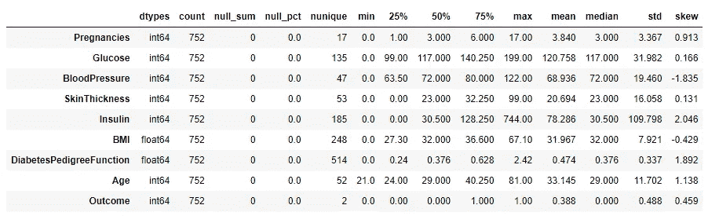

# 使用 QuickDA 自动化探索性数据分析

> 原文：<https://towardsdatascience.com/automating-exploratory-data-analysis-using-quickda-fd68ad8e3873?source=collection_archive---------26----------------------->

## 使用 QuickDA 预处理和操作数据


照片由[UX](https://unsplash.com/@uxindo?utm_source=medium&utm_medium=referral)在 [Unsplash](https://unsplash.com?utm_source=medium&utm_medium=referral) 上拍摄

探索性数据分析由不同的部分组成，如可视化数据模式、分析统计属性、预处理数据等。这个过程大约占项目总时间的 30%,但是这个问题可以通过自动化探索性数据分析来解决。

自动化探索性数据分析可以节省大量时间和精力，因为现在我们不必为每个可视化或统计分析编写代码。自动化过程还将生成所有可视化和数据分析的报告。类似地，对于其他预处理，我们可以使用单行代码。但是如何自动化这个过程呢？

QuickDA 就是这个问题的答案。它是一个开源的 python 库，用于探索性的数据分析和数据操作。它易于使用，只需一行代码就可以执行操作。

在本文中，我们将探索 QuickDA 提供的一些功能。

让我们开始吧…

# 安装所需的库

我们将从使用 pip 安装 QuickDA 开始。下面给出的命令可以做到这一点。

```
!pip install quickda
```

# 导入所需的库

在这一步中，我们将导入执行探索性数据分析所需的库。

```
from quickda.explore_data import *
from quickda.clean_data import *
from quickda.explore_numeric import *
from quickda.explore_categoric import *
from quickda.explore_numeric_categoric import *
from quickda.explore_time_series import *
import pandas as pd
```

# 加载数据集

我在这里使用的数据集是著名的糖尿病数据集，可以从网上下载，你也可以使用任何其他数据集。

```
df = pd.read_csv("Diabetes.csv")
df
```


来源:作者

# 探索统计属性

在这一步中，我们将使用 QuickDA 的 explore 功能来分析数据的统计属性。

```
explore(df)
```



统计属性(来源:作者)

# EDA 报告

在这里，我们将在后端使用 Pandas Profiling 生成一个 EDA 报告。

```
explore(df, method='profile', report_name='Report')
```


EDA 报告(来源:作者)

# 数据预处理

在这一步中，我们将对数据进行一些预处理。所有这些函数都是单行代码。

1.  **栏目名称标准化**

```
df = clean(df, method='standardize')
df
```


来源:作者

**2。删除列**

```
df = clean(df, method='dropcols', columns="skinthickness")
df
```


来源:作者

**3。移除重复行**

```
df = clean(df, method='duplicates')
```

**4。填写缺失数据**

```
df = clean(df, method='fillmissing')
```

继续尝试不同的数据集，并使用 QuickDA 执行上述所有操作。如果您发现任何困难，请在回复部分告诉我。

本文是与 [Piyush Ingale](https://medium.com/u/40808d551f5a?source=post_page-----fd68ad8e3873--------------------------------) 合作完成的。

# 在你走之前

***感谢*** *的阅读！如果你想与我取得联系，请随时通过 hmix13@gmail.com 联系我或我的* [***LinkedIn 个人资料***](http://www.linkedin.com/in/himanshusharmads) *。可以查看我的*[***Github***](https://github.com/hmix13)**简介针对不同的数据科学项目和包教程。还有，随意探索* [***我的简介***](https://medium.com/@hmix13) *，阅读我写过的与数据科学相关的不同文章。**