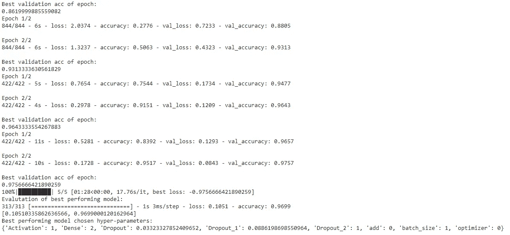

# 自动调整 Keras 模型的超参数

> 原文：<https://towardsdatascience.com/automating-hyperparameter-tuning-of-keras-model-4fe69b8dedee?source=collection_archive---------46----------------------->

## Hyperas 在 Keras 模型超参数调整中的应用


由[乌列尔 SC](https://unsplash.com/@urielsc26?utm_source=medium&utm_medium=referral) 在 [Unsplash](https://unsplash.com?utm_source=medium&utm_medium=referral) 上拍摄的照片

如果不能优化模型以获得良好的性能和更高的精度，那么构建模型是没有用的。一般来说，建模比优化模型需要的时间少，因为在优化或调整模型期间，您需要寻找最佳参数，这是一个耗时的过程。

我们可以自动执行这一过程，找出超参数的最佳值，并获得 Keras 模型的最高精度。在这篇文章中，我们将讨论 **Hyperas** ，这是一个开源的 python 包，用于自动化 Keras 模型超参数调整的过程。

让我们开始吧……

# 安装 Hyperas

像任何其他 python 库一样，我们将使用 pip 安装来安装 hyperas。在安装之前，我们需要运行一个命令，以避免在以后的阶段出现错误，确保这个命令是您在构建时运行的第一个代码。

```
from __future__ import print_function
!pip install hyperas
```

# 设置 Google Colab

为了运行 hyperas，我们需要更改某些设置，我们还将使用一个与我们的 collab 笔记本完全相同的文件名，即如果我的 collab 笔记本命名为 Hyperas.ipynb，那么在下面的代码中，我将使用 Hyperas.ipynb 作为文件名。

```
!pip install -U -q PyDrive
from pydrive.auth import GoogleAuth
from pydrive.drive import GoogleDrive
from google.colab import auth
from oauth2client.client import GoogleCredentials# Authenticate and create the PyDrive client.
auth.authenticate_user()
gauth = GoogleAuth()
gauth.credentials = GoogleCredentials.get_application_default()
drive = GoogleDrive(gauth)# Copy/download the file
fid = drive.ListFile({'q':"title='Hyperas.ipynb'"}).GetList()[0]['id']
f = drive.CreateFile({'id': fid})
f.GetContentFile('Hyperas.ipynb')
```

# 导入所需的库

接下来，我们将导入本文所需的所有依赖项。

```
import numpy as npfrom hyperopt import Trials, STATUS_OK, tpe
from keras.datasets import mnist
from keras.layers.core import Dense, Dropout, Activation
from keras.models import Sequential
from keras.utils import np_utilsfrom hyperas import optim
from hyperas.distributions import choice, uniform
```

# 为数据和模型创建函数

在这一步中，我们将创建两个函数，分别帮助我们加载数据和创建模型。

## 加载数据

```
def data():
    (x_train, y_train), (x_test, y_test) = mnist.load_data()
    x_train = x_train.reshape(60000, 784)
    x_test = x_test.reshape(10000, 784)
    x_train = x_train.astype('float32')
    x_test = x_test.astype('float32')
    x_train /= 255
    x_test /= 255
    nb_classes = 10
    y_train = np_utils.to_categorical(y_train, nb_classes)
    y_test = np_utils.to_categorical(y_test, nb_classes)
    return x_train, y_train, x_test, y_test
```

## 创建模型

```
def create_model(x_train, y_train, x_test, y_test):

    model = Sequential()
    model.add(Dense(512, input_shape=(784,)))
    model.add(Activation('relu'))
    model.add(Dropout({{uniform(0, 1)}}))
    model.add(Dense({{choice([256, 512, 1024])}}))
    model.add(Activation({{choice(['relu', 'sigmoid'])}}))
    model.add(Dropout({{uniform(0, 1)}})) if {{choice(['three', 'four'])}} == 'four':
        model.add(Dense(100))model.add({{choice([Dropout(0.5), Activation('linear')])}})
        model.add(Activation('relu'))model.add(Dense(10))
    model.add(Activation('softmax'))model.compile(loss='categorical_crossentropy', metrics=['accuracy'],
                  optimizer={{choice(['rmsprop', 'adam', 'sgd'])}})result = model.fit(x_train, y_train,
              batch_size={{choice([64, 128])}},
              epochs=2,
              verbose=2,
              validation_split=0.1)
    #get the highest validation accuracy of the training epochs
    validation_acc = np.amax(result.history['val_accuracy']) 
    print('Best validation acc of epoch:', validation_acc)
    return {'loss': -validation_acc, 'status': STATUS_OK, 'model': model}
```

# 找出最佳参数和精确度

这是我们将使用 hyperas 并找出最佳参数和最高精度的最后一步。

```
if __name__ == '__main__':
    best_run, best_model = optim.minimize(model=create_model,
                                      data=data,
                                      algo=tpe.suggest,
                                      max_evals=5,
                                      trials=Trials(),
                                      notebook_name='Hyperas')
    X_train, Y_train, X_test, Y_test = data()
    print("Evalutation of best performing model:")
    print(best_model.evaluate(X_test, Y_test))
    print("Best performing model chosen hyper-parameters:")
    print(best_run)
```



最佳模特(来源:作者)

在这里，您可以清楚地分析 hyperas 如何显示最佳性能的超参数以及模型的准确性。这很简单，可以节省时间和精力。

试试这个，让我知道你在回复部分的经历。

**本文与**[**Piyush Ingale**](https://medium.com/u/40808d551f5a?source=post_page-----4fe69b8dedee--------------------------------)合作

# 在你走之前

***感谢*** *的阅读！如果你想与我取得联系，请随时通过 hmix13@gmail.com 联系我或我的* [***LinkedIn 个人资料***](http://www.linkedin.com/in/himanshusharmads) *。可以查看我的*[***Github***](https://github.com/hmix13)**简介针对不同的数据科学项目和包教程。还有，随意探索* [***我的简介***](https://medium.com/@hmix13) *，阅读我写过的与数据科学相关的不同文章。**