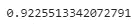

# 使用 Optunity 自动调整超参数

> 原文：<https://towardsdatascience.com/automating-hyperparameter-tuning-with-optunity-e5576807f41e?source=collection_archive---------40----------------------->

## 利用 Optunity 进行 ML 模型的超参数优化


沙哈达特·拉赫曼在 [Unsplash](https://unsplash.com?utm_source=medium&utm_medium=referral) 上拍摄的照片

超参数调整对于任何模型都是一项重要的任务，无论是机器学习还是深度学习，因为它不仅有助于优化模型，而且有助于获得更高的精度和更好的性能。

有不同的 [Python](https://medium.com/u/845dbbffa85e?source=post_page-----e5576807f41e--------------------------------) 库有助于超参数优化，但是大多数都很耗时或者效率不高。Optunity 是一个开源 Python 库，有助于自动化超参数调优过程。

在本文中，我们将探索 Optunity 提供的一些功能。

让我们开始吧…

# 安装所需的库

我们将从使用 pip 安装 Optunity 库开始。下面给出的命令可以做到这一点。

```
!pip install optunity
```

# 导入所需的库

在这一步中，我们将导入加载数据集、创建模型和查找最佳超参数所需的库。

```
import optunity
import optunity.metrics
import numpy as np
# importing machine learning models
from sklearn.neighbors import KNeighborsClassifier
from sklearn.svm import SVC
from sklearn.naive_bayes import GaussianNB
from sklearn.ensemble import RandomForestClassifier
from sklearn.datasets import load_digits
```

# 正在加载数据集

对于本文，我们将使用 Sklearn 中预定义的 Digits 数据集。

```
digits = load_digits()
n = digits.data.shape[0]positive_digit = 3
negative_digit = 9positive_idx = [i for i in range(n) if digits.target[i] == positive_digit]
negative_idx = [i for i in range(n) if digits.target[i] == negative_digit]
```

# 定义模型

在这一步中，我们将定义一个函数，它将包含我们将在本文中使用的所有模型。

```
def train_svm(data, labels, kernel, C, gamma, degree, coef0):
    """A generic SVM training function, with arguments based on the chosen kernel."""
    if kernel == 'linear':
        model = SVC(kernel=kernel, C=C)
    elif kernel == 'poly':
        model = SVC(kernel=kernel, C=C, degree=degree, coef0=coef0)
    elif kernel == 'rbf':
        model = SVC(kernel=kernel, C=C, gamma=gamma)
    else: 
        raise ArgumentError("Unknown kernel function: %s" % kernel)
    model.fit(data, labels)
    return model
```

定义模型后，我们将相应地定义超参数及其值。

```
search = {'algorithm': {'k-nn': {'n_neighbors': [1, 5]},
                        'SVM': {'kernel': {'linear': {'C': [0, 2]},
                                           'rbf': {'gamma': [0, 1], 'C': [0, 10]},
                                           'poly': {'degree': [2, 5], 'C': [0, 50], 'coef0': [0, 1]}
                                           }
                                },
                        'naive-bayes': None,
                        'random-forest': {'n_estimators': [10, 30],
                                          'max_features': [5, 20]}
                        }
         }
```

之后，我们将定义性能函数，该函数将相应地测量所有模型的性能。

```
@optunity.cross_validated(x=data, y=labels, num_folds=5)
def performance(x_train, y_train, x_test, y_test,
                algorithm, n_neighbors=None, n_estimators=None, max_features=None,
                kernel=None, C=None, gamma=None, degree=None, coef0=None):
    # fit the model
    if algorithm == 'k-nn':
        model = KNeighborsClassifier(n_neighbors=int(n_neighbors))
        model.fit(x_train, y_train)
    elif algorithm == 'SVM':
        model = train_svm(x_train, y_train, kernel, C, gamma, degree, coef0)
    elif algorithm == 'naive-bayes':
        model = GaussianNB()
        model.fit(x_train, y_train)
    elif algorithm == 'random-forest':
        model = RandomForestClassifier(n_estimators=int(n_estimators),
                                       max_features=int(max_features))
        model.fit(x_train, y_train)
    else:
        raise ArgumentError('Unknown algorithm: %s' % algorithm)# predict the test set
    if algorithm == 'SVM':
        predictions = model.decision_function(x_test)
    else:
        predictions = model.predict_proba(x_test)[:, 1]return optunity.metrics.roc_auc(y_test, predictions, positive=True)
```

# 寻找表演

现在，我们将使用性能函数来查找我们定义的不同模型的性能。

```
performance(algorithm='k-nn', n_neighbors=3)
```



`资料来源:作者

接下来，我们将找到最佳配置。

```
optimal_configuration, info, _ = optunity.maximize_structured(performance, 
                                                              search_space=search, 
                                                              num_evals=300)
print(optimal_configuration)
print(info.optimum)
```


来源:作者

# 寻找最佳解决方案

在这一步中，我们将找出具有最佳超参数的数据集的最佳解决方案。

```
solution = dict([(k, v) for k, v in optimal_configuration.items() if v is not None])
print('Solution\n========')
print("\n".join(map(lambda x: "%s \t %s" % (x[0], str(x[1])), solution.items())))
```


来源:作者

在这里，您可以清楚地看到，性能最好的算法是 SVM 算法，超参数的值也是由 optunity 提供的。

继续使用不同的数据集进行尝试，并找到该数据的最佳模型和最佳超参数。如果您发现任何困难，请在回复部分告诉我。

本文是与 [Piyush Ingale](https://medium.com/u/40808d551f5a?source=post_page-----e5576807f41e--------------------------------) 合作的。

# 在你走之前

***感谢*** *的阅读！如果你想与我取得联系，请随时通过 hmix13@gmail.com 联系我或我的* [***LinkedIn 个人资料***](http://www.linkedin.com/in/himanshusharmads) *。可以查看我的*[***Github***](https://github.com/hmix13)**简介针对不同的数据科学项目和包教程。还有，随意探索* [***我的简介***](https://medium.com/@hmix13) *，阅读我写过的与数据科学相关的不同文章。**